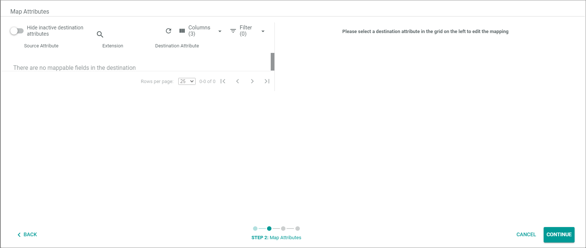
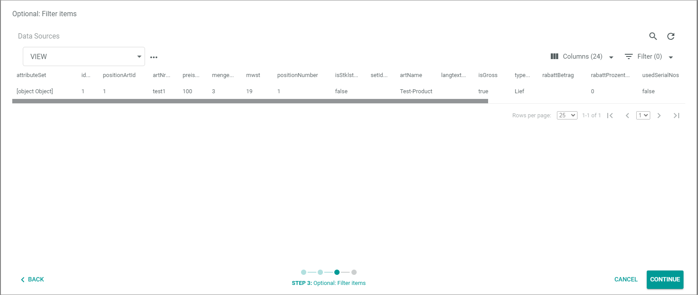
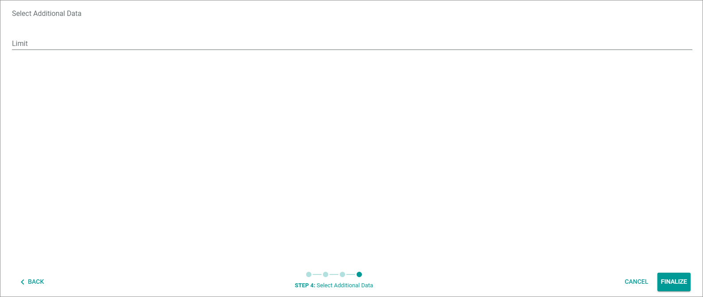
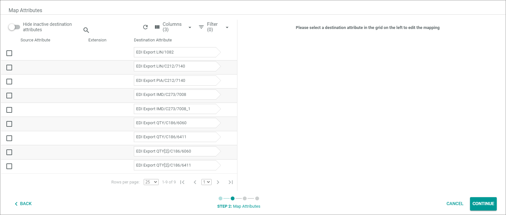

[!!Exports](../UserInterface/01_Exports.md)

# Manage data sources
Define the data sources from which you want to retrieve the string attribute data that you have defined both in the header file settings and the line items file settings.   
For example, you have defined a string attribute to determine the invoice document number. By specifying a data source here, you determine the data source from which the invoice document number is to be retrieved. 
If desired, you can create multiple data sources from which you may retrieve data from various sources, for example, invoice data, customer data, and product data. In the next step, you can map a data source field with the related data (source attribute) with the EDIFACT field (destination attribute). The EDIFACT fields are automatically provided after you have saved a string attribute allocation in the file settings.   
Tip: If you want to map the fields directly after you have specified an EDIFACT field in the file settings, it is recommended to create the data source before specifying the header &frasl; line items file segments.

## Create data source
Define the data source from which you want to retrieve the data with which you want to fill the EDIFACT message.

#### Prerequisites

At least one definition setting has been created, see [Create basic definition settings](#create-basic-definition-settings).
>[INFO] The *Data sources* tab is visible only if you have created and saved a basic definition setting. 

#### Procedure

*DataHub Exporter > Exports*

1. Click the exporter definition for which you want to define the data source.   
    The *Edit definition "Definition name"* view is displayed. The *Settings* tab is displayed by default.

2. Click the *Data sources* tab.   
    The *Data sources* tab is displayed. Since you have not yet created a data source, *No data source* is displayed in the list. 

    

3. Click the  (Add) button in the bottom right corner.     
    The *Select source* pop-up window is displayed.

    

4. Select the data source in the *Entity type* drop-down list.   
    - If desired, use the *RetailSuite Business document* entity type if you currently define the data source for a header file.    
    You typically use this entity type for the header data, if you want to transfer data with its origin from the *Actindo Core1 Platform*.
    - If desired, use the *Business document position* entity type if you currently define the data source for a line item definition.   
    You typically use this entity type for the line item data, if you want to transfer data with its origin from the *Actindo Core1 Platform*.  
    - If desired, use any other data source that provides you with data needed for the transfer.   
    For example, you want to send an EDIFACT message with invoice data from SAP. In this case select the related SAP data source with which you can access the data needed for the header &frasl; line item file.   
    
    The *Attribute set* drop-down list is automatically filled with the data source defined in the *Entity type* field.
    
5. Click the [CONTINUE] button in the bottom right corner.   
    The *Map attributes* pop-up window is displayed. If you have not yet defined string attributes in your file settings, the *There are no mappable fields in the destination* text is displayed.

    

6. Click the [CONTINUE] button in the bottom right corner.   
    The *Optional: Filter items* pop up window is displayed. You can ignore it for now.

     

7. Click the [CONTINUE] button in the bottom right corner.   
    The *Select additional data* pop up window is displayed. 

    

8. If desired, specify a limit. The limit defines the maximum number of line items which are to be added to a business document such as an invoice. <!---Julian, ist das richtig?-->

9. Click the [FINALIZE] button in the bottom right corner to save the data source.

10. Click the [SAVE] button in the top right corner.    
   The *Submitting data* screen is displayed. After that, the *Exporter definitions* view is displayed again. 

## Edit data source

Edit the data source by specifying the data mapping for your file settings definition.

#### Prerequisites

- In minimum one data source has been created, see [Create data source](#create-data-source).
- In the file settings, you have added in minimum one string attribute, an example see under [Specify document number &frasl; string attribute](./02_ManageHeaderFileSett.md#specify-document-number-⁄-string-attribute).

#### Procedure

*DataHub Exporter > Exports*

1. Click the exporter definition for which you want to define the data source.   
    The *Edit definition "Definition name"* view is displayed. The *Settings* tab is displayed by default.

2. Click the *Data sources* tab.   
    The *Data sources* tab is displayed.  

    

3. Click the data source, for which you want to map the attributes.   
    The *Map attributes* pop-up window is displayed. In the *Destination attribute* column, a list of all EDI segment rows is displayed for which you have defined a string attribute.

    

4. Map the source attributes and the destination attributes. For detailed information, see [Edit the ETL attribute mappings](../../DataHub/Operation/01_ManageETLMappings.md#delete-an-etl-attribute-mapping) in the *DataHub* documentation.

5. Click the [CONTINUE] button in the bottom right corner.   
    The *Optional: Filter items* pop up window is displayed. You can ignore it for now.

     

6. Click the [CONTINUE] button in the bottom right corner.   
    The *Select additional data* pop up window is displayed. 

    

7. If desired, change the limit. The limit defines the maximum number of line items which are to be added to a business document such as an invoice. <!---ist das richtig?-->

8. Click the [FINALIZE] button in the bottom right corner to save the data source.   
  You have saved the data source settings. The *Exporter definitions* view is displayed. 

## Delete data source

 Delete an exporter definition source if you no longer need it. Note that you will lose all attribute mappings by deleting a data source.

 #### Prerequisites

In minimum one data source has been created, see [Create data source](#create-data-source).

#### Procedure

*DataHub Exporter > Exports*

1. Click the exporter definition from which you want to delete the assigned data source.
  The *Edit definition "Definition name"* view is displayed. The *Settings* tab is displayed by default.

2. Click the *Data sources* tab.   
    The *Data sources* tab is displayed.  
    
    

3. Select the checkbox of the data source you want to delete.    
   The Editing toolbar is displayed.

4. Click the  (Delete) button.   
   The data source has been deleted.

5. Click the [SAVE] button.    
    You have saved the data source settings. The *Exporter definitions* view is displayed. 
     

