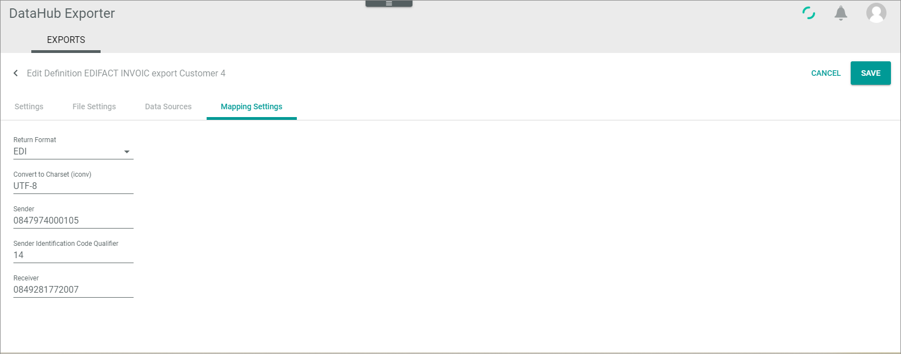

# Manage mapping settings

The mapping settings define some basic data that is needed to be able to map the *Actindo* data source attributes with the EDIFACT massage fields.

## Create mapping setting
 Create the mapping settings.

#### Prerequisites
At least one definition setting has been created, see [Create basic definition settings](#create-basic-definition-settings).
>[INFO] The *Mapping settings* tab is visible only if you have created and saved a basic definition setting. 

#### Procedure
*DataHub Exporter > Exports*

1. Click the exporter definition for which you want to define the mapping settings.   
    The *Edit definition "Definition name"* view is displayed. The *Settings* tab is displayed by default.

2. Click the *Mapping settings* tab.   
    The mapping settings are displayed.

    

3. Click the *Return format* dropdown and select **EDI**.

4. Ignore the default value in the *Convert to charset (iconv)* field.

5. If desired, enter your company name in the *Sender* field. <!--- stimmt das??-->

6. Enter **14** in the *Sender identification code qualifier* field. <!---oder unterscheidet sich das je nach Actindo Kunde???-->

7. If desired, enter receiver's company name in the *Receiver* field.

8. Click the [SAVE] button.   
   The *Exporter definitions* view is displayed. 

## Edit mapping setting

Edit the mapping settings.

#### Prerequisites
- At least one definition setting has been created, see [Create basic definition settings](#create-basic-definition-settings).
- The mapping setting for a definition has been created.

#### Procedure
*DataHub Exporter > Exports*

1. Click the exporter definition for which you want to define the mapping settings.   
    The *Edit definition "Definition name"* view is displayed. The *Settings* tab is displayed by default.

2. Click the *Mapping settings* tab.   
    The already defined mapping settings are displayed.

    

3. If desired, change your settings.

4. Click the [SAVE] button.   
   The *Exporter definitions* view is displayed. 
