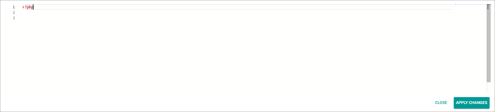
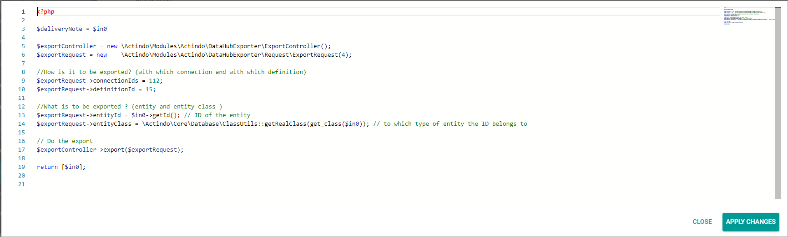

# Prepare workflow

Extend your workflows by adding an action to export the EDIFACT messages. To do this, use a workflow that processes the business document you want to transfer to your EDIFACT message receiver, for example an invoice or a delivery note. 

To integrate the export to the workflow, you need to insert an
*Execute PHP code* core action. For detailed information on this core action, see [Execute PHP code](../../ActindoWorkFlow/UserInterface/08_CoreActions.md#execute-php-code). You can insert this action at any position in the workflow in which you have access to the required business document data. Bear in mind that any errors that occur after the EDIFACT export and before posting for subsequent processes can lead to data inconsistencies that need to be cleaned up.

The following example shows how to export a delivery note via an export definition.


#### Prerequisites

- You are familiar with the configuration of workflows. For detailed information, see [Manage workflows](../../ActindoWorkFlow/Operation/01_ManageWorkflows.md) in the *Process Orchestration* documentation. 
- The export definition is activated, see [Activate definition](01_ManageDefinitions.md#activate-definition).
- Your workflow processes the business document (for example, the invoice) for which you have created the EDIFACT export definition. 


#### Procedure

*Workflow > Select workflow > Select version*


1. Select a place with which the entity is provided that you want to export with the EDIFACT message.

2. Add an *Execute PHP code* core action.

    

3. Click the *PHP code* field in the *Configuration* setting.   
    A pop-up window for editing the PHP code is displayed.

    

4. Enter a label in the *Label* field with which you can easily identify the purpose of this action, for example **Export to Customer 2**.

4. Insert the following lines of code (example).

    ```
    <?php
 
    $deliveryNote = $in0;
    $exportController = new \Actindo\Modules\Actindo\DataHubExporter\ExportController();
    $exportRequest = new  \Actindo\Modules\Actindo\DataHubExporter\Request\ExportRequest(4);   
    $exportRequest->entityId = $in0->getId();
    $exportRequest->connectionIds = []; 
    $exportRequest->definitionId = ; 
    $exportRequest->entityClass = /Actindo\Core\Database\ClassUtils::getRealClass(get_class($in0));  
    $exportController->export($exportRequest);
    return [$in0];
    ```
    **Explanation**
    |php code | Meaning |
    |--------|----|
    |<?php|PHP's opening tag     |
    |$deliveryNote = $in0;| Type of the entity that is to be exported (e.g. business document type that have been loaded at the start point and is input in *in0* input port), see the *Order Management* module for information on type <!---Stimmt das?-->|
    |$exportController = new \Actindo\Modules\Actindo\DataHubExporter\ExportController();| Get exporter|
    | $exportRequest = new \Actindo\Modules\Actindo\DataHubExporter\Request\ExportRequest(4);|Create new export request|
    |$exportRequest->definitionId = []; | ID of the export definition, for example, $exportRequest->definitionId = 112;|
    |$exportRequest->entityId = $in0->getId(); | Primary identifier of the entity that is to be exported (e.g. business document that have been loaded at the start point and is input in *in0* input port).|
    |$exportRequest->connectionIds = [];| List of connection IDs (comma-separated)|
    |$exportRequest->entityClass = \Actindo\Core\Database\ClassUtils::getRealClass(get_class($in0));| Type of the entity (class name) input in *in0* input port|
    |return [$in0];| end of input
     
    

5. Click the [Apply changes] button.   
    The pop-up window is closed.

6. Connect the *Execute PHP code* core action with the subsequent actions.

7. Click the  (Points) button in the upper left corner next to the workflow name.   
  The workflow context menu is displayed.


8. Click the *Deploy* menu entry in the context menu.   
  The workflow has been deployed and published. Your business partner can receive business document data now.
