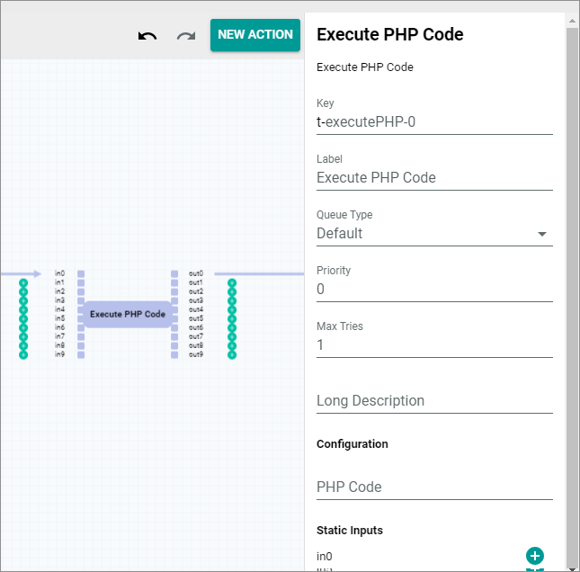

[!!Manage workflows](../../ActindoWorkFlow/Operation/01_ManageWorkflows.md)

# Prepare workflow

Extend your workflows by adding an action to export the EDIFACT messages. To do this, use a workflow that processes the business document you want to transfer to your EDIFACT message receiver, for example an invoice or a delivery note. 

To integrate the export to the workflow, you need to insert an
*Execute PHP code* core action. For detailed information on this core action, see [Execute PHP code](../../ActindoWorkFlow/UserInterface/08_CoreActions.md#execute-php-code) in the *Process Orchestration* documentation. You can insert this action at any position in the workflow in which you have access to the required business document data. Note that errors that occur in the workflow after the EDI export action and before the actions that post a business document to the *Accounting* module, for example, can cause data inconsistencies that need to be cleaned up.

The following example shows how to export a delivery note via an export definition.


#### Prerequisites

- You are familiar with the configuration of workflows. For detailed information, see [Manage the workflows](../../ActindoWorkFlow/Operation/01_ManageWorkflows.md) in the *Process Orchestration* documentation. 
- Your workflow processes the business document (for example, the delivery note) for which you have created the EDIFACT export definition. 


#### Procedure

*Workflow > Select workflow > Select version*


1. Select a place with which the entity is provided that you want to export with the EDIFACT message.

2. Add an *Execute PHP code* core action.

    

3. Enter a label in the *Label* field with which you can easily identify the purpose of this action, for example **Export to Customer 2**.

4. Click the *PHP code* field in the *Configuration* section of the action settings.   
    A window for editing the PHP code is displayed.

    

5. Insert the following lines of code (example).

    **Copy template**
    ```
    <?php
 
    $deliveryNote = $in0;
    $exportController = new \Actindo\Modules\Actindo\DataHubExporter\ExportController();
    $exportRequest = new  \Actindo\Modules\Actindo\DataHubExporter\Request\ExportRequest(4);   
    $exportRequest->connectionIds = []; 
    $exportRequest->definitionId = ;    
    $exportRequest->entityId = $in0->getId();
    $exportRequest->entityClass = /Actindo\Core\Database\ClassUtils::getRealClass(get_class($in0));  
    $exportController->export($exportRequest);
    return [$in0];
    ```
    

    **Explanation**
    |php code | Meaning |
    |--------|----|
    |<?php|PHP's opening tag     |
    |$deliveryNote = $in0;| Type of the entity that is to be exported (e.g. business document type that have been loaded at the start point and is input in *in0* input port), see the *Order Management* module for information on type <!---Stimmt das?-->|
    |$exportController = new \Actindo\Modules\Actindo\DataHubExporter\ExportController();| Get exporter|
    | $exportRequest = new \Actindo\Modules\Actindo\DataHubExporter\Request\ExportRequest(4);|Create new export request|  
    |$exportRequest->connectionIds = [];| List of connection ID(s) (comma-separated, if more than one)|
    |$exportRequest->definitionId = []; | ID of the export definition, for example, $exportRequest->definitionId = 112;|
    |$exportRequest->entityId = $in0->getId(); | Primary identifier of the entity that is to be exported (e.g. business document that has been loaded at the start point and is input in *in0* input port).|
    |$exportRequest->entityClass = \Actindo\Core\Database\ClassUtils::getRealClass(get_class($in0));| Type of the entity (class name) input in *in0* input port|
    |return [$in0];| end of input

    **The code is displayed as follows (with comments)**

    
     
5. Click the [APPLY CHANGES] button in the bottom right corner.   
    The window is closed.

6. Connect the *Execute PHP code* core action with the subsequent actions.

7. Click the  (Points) button in the upper left corner next to the workflow name.   
  The workflow context menu is displayed.

8. Click the *Deploy* menu entry in the context menu.   
  The workflow has been deployed. 
  
9. After you have activated the definitions, see [Activate definition](01_ManageDefinitions.md#activate-definition), publish the workflow version.
  Your business partner can receive business document data now.
