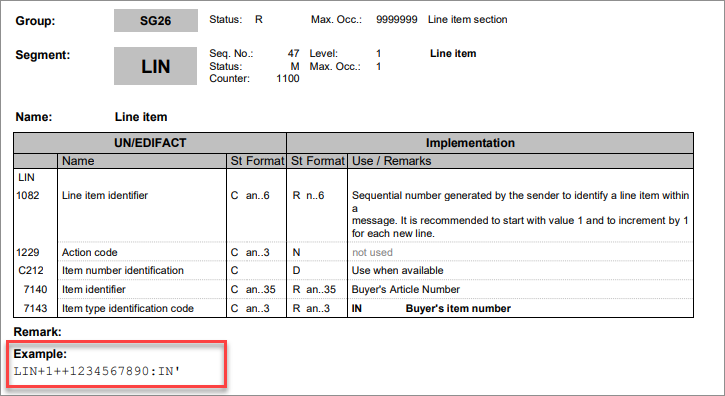

# Tips and tricks for preparation

## Introduction

UN/EDIFACT (in the following short EDIFACT) is a cross-industry international standard for the format of electronic data in business transactions. EDIFACT is one of several international EDI standards. A UN organization called CEFACT, which is affiliated to the UNECE, is responsible for the EDIFACT standard.
[^1]    

The EDIFACT standard defines a scheme according to which messages should be structured. It is used to exchange and transfer data, such as invoice or order data, between business partners. The standard defines a list of messages such as ORDERS, INVRPT, INVOIC, DELFOR, etc. which are used for specific purposes. For example, an INVRPT represents an inventory report.   

The EDIFACT standard is available in different versions. Every year one or two versions are released (often referred to as an a or b version). Your business partners, the receivers of the EDIFACT messages, define their specifications according to a specific version. Since the *XML/EDIFACT & UN/EDIFACT Exporter* plugin provides the structure for all versions, you can find the particular version specified by your business partner in the *DataHub Exporter* module.   

Note that the structure of the format is standardized, not the usage. As a result, each user/business partner defines individually the data to be provided for the message structure. This also applies to the classification of the segments and fields (mandatory, required, optional, and others), which may sometimes differ from the EDIFACT standard.   
>[Info] In the following, when we refer to a user or a business partner, we mean the company to which you need to send the messages to, such as your supplier, your customer, or your fulfillment partner.

## Tips for preparation in advance

- Many internet providers offer EDIFACT information. For a first impression, we can recommend the [TRUUGO](https://www.truugo.com/edifact/ "[TRUUGO]") website. It provides a well-structured presentation of the EDIFACT messages in their different versions.  

- Ask your business partner for the EDIFACT message specification. Sometimes it is also called message implementation guide. Specifications from some major vendors are also available for download on the Internet.

- Ask your business partner for the connection details that specify to which address and with which credentials the data is to be transferred. For example, get to know both the GLN (Global location number) of your business partner and the GLN of your company.

- Review this specification for the segments your business partner has defined as required and ensure that you have this data available.   

- Note the following: 
    - Some segments are mandatory (M) only in case the optional segment (O) above is to be filled. See the example:

      

    - There are deviations from the standard depending on the business partner:    
        - Some segments are required (R), even if it is not mandatory in the EDIFACT standard message definition.  These are then usually indicated with **R** (required) in contrast to **M** (mandatory) of the EDIFACT standard. 
        - The reverse situation is also possible. Sometimes the business partners do not want to have mandatory segments of the EDIFACT message filled.
        *Actindo* highlights a segment in red, if mandatory parts are not filled according to the EDIFACT standard. However, *Actindo* still sends the message, even if parts defined as mandatory by EDIFACT are missing.  

- *Actindo* enables you to preview each message structure as a string. For example:
    UNB+UNOC:3+:14+:14+230810:1443+76817314338981'UNH+67850136066306+ORDERS:D:07A:UN:EAN008'BGM+220+202300001'DTM+8::102'UNS+S'UNT+5+67850136066306'UNZ+1+76817314338981'   
    The specifications of the major vendors often also show parts of this string as examples, so that you can use the preview for checking the output of your current message definition. Check the specification of your business partner for these examples.

    

   This way, you can verify from time to time if you are on the right track. 

## Checklist for managing the EDIFACT export definitions

Use the following checklist to organize your work. Manage the definitions in the following sequence:  

|To do                                   | Done   
|-----|------- 
|1. Create the connection to your business partner, see [Manage connections](../Integration/01_ManageConnections.md).|   |     
|2. Create a basic definition setting for the header, see [Create basic definition settings](../Operation/01_ManageDefinitions.md#create-basic-definition-settings).|   |   
|3. Prepare the definition of file settings to make this task easier, see [Prepare definition of file settings](../Operation/01_ManageDefinitions.md#prepare-definition-of-file-settings).|   |   
|4. Define the file settings for the header, see [Manage header file settings](../Operation/02_ManageHeaderFileSett.md).|   |
|5. If desired, you can add an attribute mapping when you have finished the file setting for one section of the EDIFACT message, or you do it after finishing the whole message definition. |   |
|6. Prepare the line item export, see [Prepare line item export](../Operation/02_ManageHeaderFileSett.md#prepare-line-item-export).|     |   
|7. Create a basic definition setting for the line items, see [Create basic definition settings](../Operation/01_ManageDefinitions.md#create-basic-definition-settings). |   |   
|8. Prepare the data mapping for the line items, see [Prepare data mapping for the line items](../Operation/04_ManageLineItemsFileStt.md#prepare-data-mapping-for-the-line-items) |    |    |   
|9. Create file settings for the line items, see [Manage line item file settings](../Operation/04_ManageLineItemsFileStt.md).|  |
|10. Finalize the data mapping for both the definition of the header and the line items, see [Map data source](../Operation/05_ManageDataSources.md#map-data-source).
|11. After finishing the file settings, if desired, send the message preview to your business partner for verification, see [Preview definition](../Operation/01_ManageDefinitions.md#preview-definition).|   |   
|12. Activate the definitions, see [Activate definition](../Operation/01_ManageDefinitions.md#activate-definition).|   |    
|13. Extend your order management workflow, for example, or another by adding actions for exporting EDIFACT messages, see [Prepare workflow](../Operation/07_PrepareWorkflow.md). |    |

 
 
 
 
[^1] **Source**: Wikipedia

