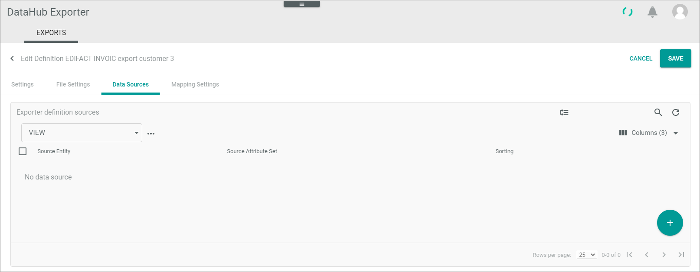
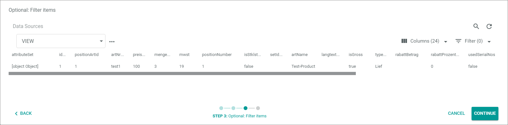
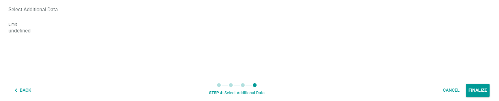

[!!Manage definitions](../Operation/01_ManageDefinitions.md)

# EXPORTS

*DataHub Exporter > Exports*

**Exporter definitions**

The *Exporter definitions* view contains a list view of all available exporter definitions.
The following functions are available in the list header of the *Exporter definitions* view:

-  (Refresh)   
    Click this button to update the list of connections.

- *VIEW*   
    Click the drop-down list to select the view. All created views are displayed in the drop-down list. For a detailed description of how to create and edit a list view, see [LIST views](../../Core1Platform/UserInterface/03_ViewsLIST.md).  

- [x]     
    Select the checkbox to display the editing toolbar. If you click the checkbox in the header, all exporter definitions in the list are selected.

- [DELETE]  
    Click this button to delete the selected exporter definition. This button is only displayed if a single checkbox in the list of exporter definitions is selected.
   
-  (Edit)  
    Click this button to edit the selected exporter definition. This button is only displayed if a single checkbox in the list of connections is selected. Alternatively, you can click directly a row in the list to edit an exporter definition. The *Edit exporter definition* view is displayed, see [Edit exporter definition](#edit-exporter-definition).

The list displays all available exporter definitions. Depending on the settings, the displayed columns may vary. All fields are read-only.

- *Definition name*  
    Exporter definition name.

- *Status*  
    Exporter definition status. The following statuses are available:
    -  **Active**   
        The exporter definition is active and can be used to send messages. 
    -  **Inactive**   
        The exporter definition is inactive and cannot be used to send messages.   

- *Attribute set*  
    Attribute set of the exporter definition that contains the attributes of the EDIFACT message.

- *Access key*  
    Access key of the exporter definition
    
- *Download link*
   Preview of the message fields. IF you click on this link a Browser window is opened which contains the defined message fields in a string, see [Preview definition](../Operation/01_ManageDefinitions.md#preview-definition).
   
-  (Add)  
    Click this button to add an exporter definition. The *Edit definition* view is displayed, see [Edit exporter definition](#edit-exporter-definition).

## Create exporter definition

*Exports > Tab EXPORTS > Button Add*

**Create definition**

- (Back)   
  Click this button to close the *Create definition* view and return to the exporter definition's list. All changes are rejected.

- *Label*   
   Enter the name of the exporter definition.

-  (Active)   
   Enable this toggle to activate the exporter definition after you have finished configuring it. Disable this toggle if you no longer want to use the exporter definition.

- *Template engine*   
   Use this drop-down list to select the engine with which *Actindo* shall process the message. For EDIFACT messages, the **XmlExportTemplateEngine** is used.

- Default connection
  Enter the connection that you have created for the receiver of the message
  
- Access key  
   ???
  
- [CANCEL]   
   Click this button to finish the exporter definition creation without saving it. The *Create definition* view is closed.

- [SAVE]   
   Click this button to save the exporter definition. The *Create definition* view is closed.
  
## Edit exporter definition

*DataHub Exporter > Exports > Select export definition*

- (Back)   
  Click this button to close the *Create definition* view and return to the exporter definition's list. All changes are rejected.

- [CANCEL]   
   Click this button to finish the exporter definition creation without saving it. The *Create definition* view is closed.

- [SAVE]   
   Click this button to save the exporter definition. The *Create definition* view is closed.

### Settings tab   
You use the *Settings* tab to edit the basic settings of the exporter definition.

- *Label*   
   Edit the name of the exporter definition.

-  (Active)   
   Enable this toggle to activate the exporter definition after you have finished configuring it. Disable this toggle if you no longer want to use the exporter definition.

- *Template engine*   
   Use this drop-down list to select the engine with which *Actindo* shall process the message. For EDIFACT messages, the **XmlExportTemplateEngine** is used.

- *Default connection*
  Edit the connection that you have created for the receiver of the message, see [Create connection](../Integration/01_ManageConnections.md#create-connection).
  
- *Access key*  
   ???

### File settings tab  

Use the *File settings* tab to specify the EDIFACT message fields and segments that you business partner require for the selected message type.

- *Release*   
   Edit this drop-down list to select the release of the EDIFACT message type that your business partner require.

- *Message type*       
   Edit this drop-down list to select the EDIFACT message type that your business partner require.

- *Reference node path*    
   Edit this drop-down list to select the EDIFACT message type that your business partner require.

-    
   Click this button to load the specified EDIFACT message structure.

 
### Data sources tab   
Use the *Data sources* tab both to define the attribute set that you want to use for the attribute set mapping of the EDIFACT message and to do the mapping.

**LIST Exporter definition sources**   

The *Exporter definition sources* view contain a LIST view in which all exporter definition sources are listed that you can use to do the attribute mapping. 

-  (Refresh)   
    Click this button to update the list of connections.

- *VIEW*   
    Click the drop-down list to select the view. All created views are displayed in the drop-down list. For a detailed description of how to create and edit a list view, see [LIST views](../../Core1Platform/UserInterface/03_ViewsLIST.md).  

-  Columns (x)   
    Click this button to display the columns bar and customize the displayed columns and the order of columns in the list. The *x* indicates the number of columns that are currently displayed in the list.

- [x]     
    Select the checkbox to display the editing toolbar. If you click the checkbox in the header, all connections in the list are selected.

-  (Edit)  
    Click this button to edit the selected data source. This button is only displayed if a single checkbox in the list of data sources entities is selected. Alternatively, you can click directly a row in the list to edit a data source directly. The *Map attributes* wizard is displayed.

-  (Delete)    
    Click this button to remove the selected data source from the list of data sources available for your exporter definition. This button is only displayed if a single checkbox in the list of data sources is selected.
   
-  (Change sorting)   
   Click this button change the sorting of the data sources. The *Data sources (Sorting mode)* view is displayed.

-   (Add)  
    Click this button to add a *Source entity* on which you can map the EDIFACT definition fields. The *Map attributes* wizard is displayed.

- *Source entity*   
   Entity that defines the source you want to map to the destination fields of the EDIFACT message, for example the *Retail suite business document* entity. 

- *Source attribute set*   
   Attribute set that represents the source entity you want to map to the destination fields of the EDIFACT message, for example the *Retail suite business document* attribute set. 

- *Sorting*
   ???

   
**Data sources (Sorting mode)**

The *Data sources (Sorting mode)* view enables you to change the sorting of the source entities.

]")

- *Source entity*   
   Entity that defines the source you want to map to the destination fields of the EDIFACT message, for example the *Retail suite business document* entity. 

- *Source attribute set*   
   Attribute set that represents the source entity you want to map to the destination fields of the EDIFACT message, for example the *Retail suite business document* attribute set. 

- *Sorting*   
   ???

-  (Sort)   
   Click this button and drag and drop the source entity to the position you prefer.

- [CANCEL]    
   Click this button to finish the sorting without saving it. The *Data sources (Sorting mode)* view is closed.

- [SAVE]   
   Click this button to save the sorting. The *Data sources (Sorting mode)* view is closed.

**Wizard for creating source entities and doing the mappings**  

The wizard window for creating source entities and doing the mappings is displayed if you add a new data source.

Step 1: Select source

]")

- *Entity type*    
  Click the drop-down list and select the entity type that you want to use for a later data mapping with the EDIFACT fields and segments.

- *Attribute set*    
   Attribute set that is assigned the entity type. The Attribute set drop-down list is automatically filled after you have selected an *Entity type*.

- [CANCEL]    
   Click this button to finish the wizard without saving it. The *Select source* wizard window is closed.

- [CONTINUE]   
   Click this button to save your settings. The *Map attributes* wizard window is displayed (see below). 

Step 2: Map attributes

This step is also displayed, when you select a data source for editing.

]")

For detailed information on the mapping functions, see [Mapping](../../DataHub/UserInterface/02d_ETL.md#mapping) in the *DataHub* documentation.

>[Info] Note that the wizard does not provide the whole functional scope that the *DataHub* mapping provides, because the wizard contains only those functions that are relevant for mappings to export messages.

- [CANCEL]    
   Click this button to finish the wizard without saving it. The wizard window is closed.

- [CONTINUE]   
   Click this button to save your settings. The *Optional: Filter items* wizard step is displayed (see below). 
 
- [< BACK]   
  Click this button to return to the previous step.

Step 3: Optional: Filter items

- [CANCEL]    
   Click this button to finish the wizard without saving it. The wizard window is closed.

- [CONTINUE]   
   Click this button to save your settings. The *Select additional data* wizard step is displayed (see below). 
 
- [< BACK]   
  Click this button to return to the previous step.

Step 4: Select additional data

- *Limit*    
   If you currently specify the header definition settings: Enter the maximum number of positions that you want to output per message.

- [CANCEL]    
   Click this button to finish the wizard without saving it. The wizard window is closed.

- [FINALIZE]   
   Click this button to finalize your settings. The wizard is closed.  The *Exporter definitions* view is displayed. Do not forget to save your settings. 
 
- [< BACK]   
  Click this button to return to the previous step.

### Mapping settings tab

Use the *Mapping settings* tab to specify some basic data that is needed to be able to map the *Actindo* data source attributes with the EDIFACT massage fields.

- *Return format*   
   Edit this drop-down list to select the return format. Use *EDI* for EDIFACT massages. 

 - *Convert to charset (Iconv)*
   Edit

 - *Sender*   
   Edit

- *Sender identification code qualifier*   
   Edit

- *Receiver*   
   Edit

- [CANCEL]    
   Click this button to finish mappings settings without saving it. The *Exporter definitions* view is displayed.

- [SAVE]   
   Click this button to save the sorting. The *Exporter definitions* view is displayed.

