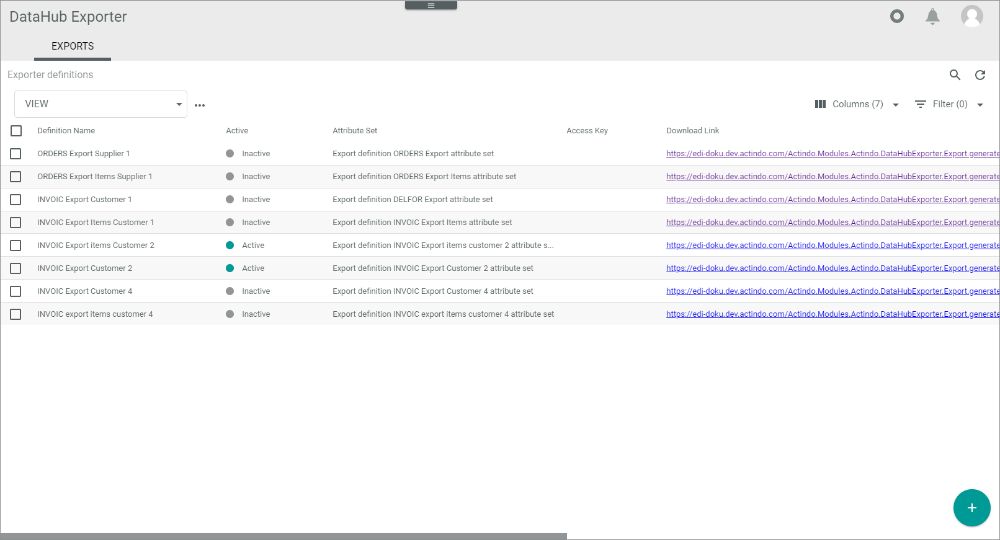
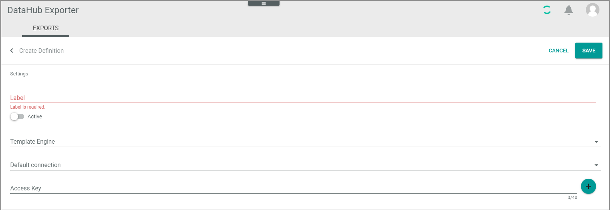
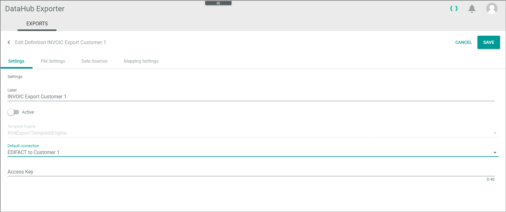
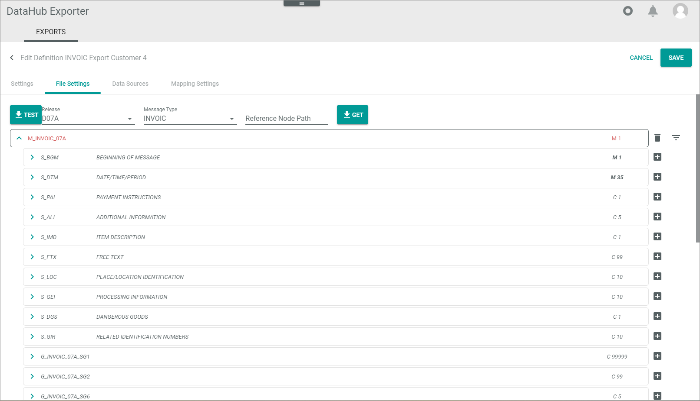
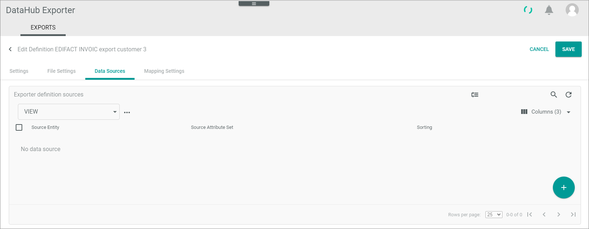
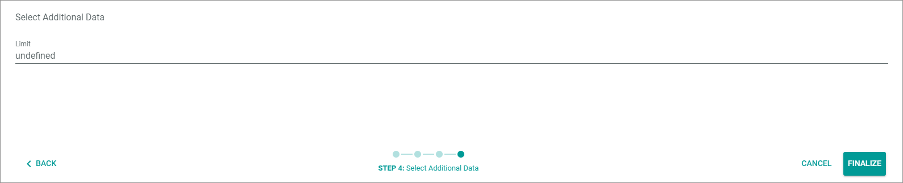
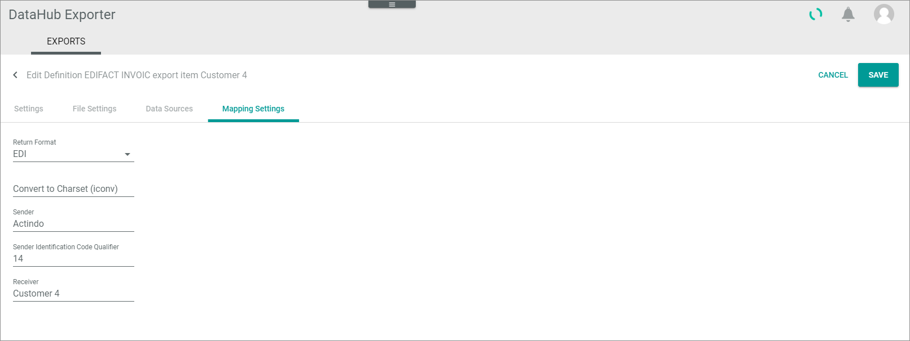

[!!Manage definitions](../Operation/01_ManageDefinitions.md)
[!!Manage header file settings](../Operation/02_ManageHeaderFileSett.md)
[!!Manage line item file settings](../Operation/04_ManageLineItemsFileStt.md)

# EXPORTS

*DataHub Exporter > Exports*

**Exporter definitions**

The *Exporter definitions* view contains a list view of all available exporter definitions. Depending on the settings, the displayed columns may vary. All fields are read-only.

The following functions are available for the editing toolbar:

- [x]     
    Select the checkbox to display the editing toolbar. If you click the checkbox in the header, all exporter definitions in the list are selected.

- [PREVIEW]   
   Click this button to create a preview of an exporter definition. For detailed information, see [Preview definition](../Operation/01_ManageDefinitions.md#preview-definition). 

-  (Edit)  
    Click this button to edit the selected exporter definition. This button is only displayed if a single checkbox in the list of exporter definitions is selected. Alternatively, you can directly click a row in the list to edit an exporter definition. The *Edit exporter definition* view is displayed, see [Edit exporter definition](#edit-exporter-definition).

-  (Delete)   
    Click this button to delete the selected exporter definition. This button is only displayed if a single checkbox in the list of exporter definitions is selected.
   

The following functions and fields are available in this view:

- *Definition name*  
    Name of the exporter definition.

- *Status*  
    Exporter definition status. The following statuses are available:
    -  **Active**   
        The exporter definition is active and can be used to send messages. 
    -  **Inactive**   
        The exporter definition is inactive and cannot be used to send messages.   

- *Attribute set*  
    Attribute set of the exporter definition that contains the attributes of the EDIFACT message.

- *Access key*  
    Access key of the exporter definition. It is a key that you can give to your business partner to access your *Actindo* tenant without logging in. You can freely specify any string.
    
- *Download link*   
   Preview of the message fields. When you click on this link, a Browser window is opened which contains the already defined message fields in a string, see [Preview definition](../Operation/01_ManageDefinitions.md#preview-definition).

- *Export link*   
<!---wofür wird der Export link benötigt?-->
   
-  (Add)  
    Click this button to add an exporter definition. The *Create definition* view is displayed, see [Create exporter definition](#create-exporter-definition).

## Create definition

*Exports > Tab EXPORTS > Button Add*

**Create definition**

The *Create definition* view includes the *Settings* tab which contains the fields and function needed to define a basic definition, see [Settings](#settings-tab).

- *Label*   
   Enter the name of the exporter definition.

-  (Active)   
   Enable this toggle to activate the exporter definition after you have finished configuring it. Disable this toggle if you no longer want to use the exporter definition.

- *Template engine*   
   Use this drop-down list to select the engine with which *Actindo* shall process the message. For EDIFACT messages, the **XmlExportTemplateEngine** is used. This field is read-only after you have saved a newly created definition.

- *Default connection*    
  Edit the connection that you have created for the receiver of the message, see [Create connection](../Integration/01_ManageConnections.md#create-connection).
  
- *Access key*  
   Use the access key to give your business partner a key so that s/he can access your *Actindo* tenant without having to log in to request specific data. You are free to specify any string.
  
- [CANCEL]   
   Click this button to finish the exporter definition creation without saving it. The *Create definition* view is closed.

- [SAVE]   
   Click this button to save the exporter definition. The *Create definition* view is closed.
  
## Edit exporter definition

*DataHub Exporter > Exports > Select export definition*

**Edit definition "definition name"**

The *Edit definition* view contains several tabs that you use to configure the definition. Some tabs are not displayed until you have saved some configuration. In general, the following tabs are available:

- [Settings tab](#settings-tab)
- [File settings tab](#file-settings-tab)
- [Data sources tab](#data-sources-tab)
- [Mapping settings tab](#mapping-settings-tab)

## Settings tab   

*DataHub Exporter > Exports > Select export definition > Tab Settings*

The *Settings* tab is used to edit the basic settings of the exporter definition.

- [CANCEL]   
   Click this button to finish the exporter definition creation without saving it. The *Create definition* view is closed.

- [SAVE]   
   Click this button to save the exporter definition. The *Create definition* view is closed.

For all other fields and functions, see [Create exporter definition](#create-exporter-definition).

## File settings tab  

*DataHub Exporter > Exports > Select export definition > Tab File settings*

The*File settings* tab is used to specify the EDIFACT message fields and segments that your business partner require for the selected message type.

- *Release*   
   Edit this drop-down list to select the release of the EDIFACT message type your business partner require.

- *Message type*       
   Edit this drop-down list to select the EDIFACT message type your business partner require.

- *Reference node path*    
   In case you define the definition for the line items, enter the *Reference node path* manually. For detailed information, see [Get line item segments](../Operation/04_ManageLineItemsFileStt.md#get-line-item-segments). If you define the definition for the message header, you can ignore this field. 

-    
   Click this button to load the specified EDIFACT message structure.

 
## Data sources tab   

*DataHub Exporter > Exports > Select export definition > Tab Data sources*

The *Data sources* tab is used both to define the attribute set that you want to use for the attribute set mapping of the EDIFACT message and to do the mapping. This tab is only visible if you have successfully saved both the settings and the file settings in the corresponding tabs.

**Exporter definition sources**   

The *Exporter definition sources* view contains a LIST view that contains all exporter definition sources you want to use to perform the attribute mapping. 

-  (Change sorting)   
   Click this button change the sorting of the data sources. The button is only available if the list contains more than one entry. The *Data sources (Sorting mode)* view is displayed.

The following functions are available for the editing toolbar:

- [x]     
    Select the checkbox to display the editing toolbar. If you click the checkbox in the header, all exporter definitions are selected.

-  (Edit)  
    Click this button to edit the selected data source. This button is only displayed if a single checkbox in the list of data sources entities is selected. Alternatively, you can directly click a row in the list to edit a data source directly. The *Map attributes* wizard is displayed.

-  (Delete)    
    Click this button to remove the selected data source from the list of data sources available for your exporter definition. This button is only displayed if a single checkbox in the list of data sources is selected.
   
The following fields and functions are available in this list.

-   (Add)  
    Click this button to add a *Source entity* with which you can map the EDIFACT definition fields. The *Select source* wizard is displayed.

- *Source entity*   
   Entity that defines the source you want to map to the destination fields of the EDIFACT message, for example the *Retail suite business document* entity. 

- *Source attribute set*   
   Attribute set that represents the source entity you want to map to the destination fields of the EDIFACT message, for example the *Retail suite business document* attribute set. 

- *Sorting*   
   This field is relevant for mass exports only.

   
## Data sources &ndash; Sorting mode

*DataHub Exporter > Exports > Select export definition > Tab Data sources > Click the Change sorting button*

]")

The *Data sources (Sorting mode)* view enables you to change the sorting of the source entities. This is relevant for mass exports only and defines the sequence in which the source entities are processed.

- *Source entity*   
   Entity that defines the source you want to map to the destination fields of the EDIFACT message, for example the *Retail suite business document* entity. 

- *Source attribute set*   
   Attribute set that represents the source entity you want to map to the destination fields of the EDIFACT message, for example the *Retail suite business document* attribute set. 

- *Sorting*   
   Number that represents the sequence in which the source entities are processed.

-  (Sort)   
   Click this button and drag and drop the source entity to the position you prefer.

- [CANCEL]    
   Click this button to finish the sorting without saving it. The *Data sources (Sorting mode)* view is closed.

- [SAVE]   
   Click this button to save the sorting. The *Data sources (Sorting mode)* view is closed.

## Data sources &ndash; Wizard for creating source entities and doing the mappings  

The wizard window for creating source entities and doing the mappings is displayed when you add a new data source.

### Step 1: Select source

*DataHub Exporter > Exports > Select export definition > Tab Data sources > Click the Add button*

]")

- *Entity type*    
  Click the drop-down list and select the entity type you want to use for a later data mapping with the EDIFACT fields and segments.

- *Attribute set*    
   Attribute set that is assigned the entity type. The attribute set drop-down list is automatically filled after you have selected an *Entity type*.

- [CANCEL]    
   Click this button to finish the wizard without saving it. The *Select source* wizard window is closed.

- [CONTINUE]   
   Click this button to go one step forward. The *Map attributes* wizard window is displayed (see below). 

### Step 2: Map attributes

*DataHub Exporter > Exports > Select export definition > Tab Data sources > Click an exporter definition*

*DataHub Exporter > Exports > Select export definition > Tab Data sources > Click the Add button > Click the CONTINUE button*

]")

This step is displayed when you assign a data source. It is also displayed when you select a data source for doing the mapping. For detailed information on the mapping functions, see [Mapping](../../DataHub/UserInterface/02d_ETL.md#mapping) in the *DataHub* documentation.

>[Info] Note that the wizard does not provide the whole functional scope that the *DataHub* mapping provides. The wizard contains only those functions that are relevant to export message mappings.

- [CANCEL]    
   Click this button to finish the wizard without saving it. The wizard window is closed.

- [CONTINUE]   
   Click this button to go one step forward. The *Optional: Filter items* wizard step is displayed (see below). 
 
- [< BACK]   
  Click this button to return to the previous step.

### Step 3: Optional: Filter items

*DataHub Exporter > Exports > Select export definition > Tab Data sources > Click an exporter definition > Click the CONTINUE button to step 3*

*DataHub Exporter > Exports > Select export definition > Tab Data sources > Click the CONTINUE button to step 3*

This step is currently not in use. In general, it is only relevant for mass exports.

- [CANCEL]    
   Click this button to finish the wizard without saving it. The wizard window is closed.

- [CONTINUE]   
   Click this button to go one step forward. The *Select additional data* wizard step is displayed (see below). 
 
- [< BACK]   
  Click this button to return to the previous step.

### Step 4: Select additional data

*DataHub Exporter > Exports > Select export definition > Tab Data sources > Click an exporter definition > Click the CONTINUE button to step 4*

*DataHub Exporter > Exports > Select export definition > Tab Data sources > Click the CONTINUE button to step 4*

Use this step to enter additional data such as the limit of line items to be output.

- *Limit*    
   When you currently specify the header definition settings: Enter the maximum number of line items that you want to output per message.

- [CANCEL]    
   Click this button to finish the wizard without saving it. The wizard window is closed.

- [FINALIZE]   
   Click this button to finalize your settings. The wizard is closed. The *Edit definition* view is displayed. Do not forget to save your settings in this view. 
 
- [< BACK]   
  Click this button to return to the previous step.

## Mapping settings tab

*DataHub Exporter > Exports > Select export definition > Tab Mapping settings*

The *Mapping settings* tab is used to specify some basic data that is needed to be able to send the EDIFACT message. This tab is only visible if you have successfully saved both the settings and the file settings in the corresponding tabs.

- *Return format*   
   Edit this drop-down list to select the return format. Use *EDI* for EDIFACT messages. 

 - *Convert to charset (Iconv)*   
   Edit the standard encoding your business partner require, for example UTF-8. The *DataHub Exporter* needs this information to convert the message correctly.

 - *Sender*   
   Edit your company's GLN (Global location number).

- *Sender identification code qualifier*   
   Edit your company's identification code qualifier, if desired.

- *Receiver*   
   Edit the GLN number of the message receiver.

- [CANCEL]    
   Click this button to finish the mappings settings without saving it. The *Exporter definitions* view is displayed.

- [SAVE]   
   Click this button to save the mapping settings. The *Exporter definitions* view is displayed.

