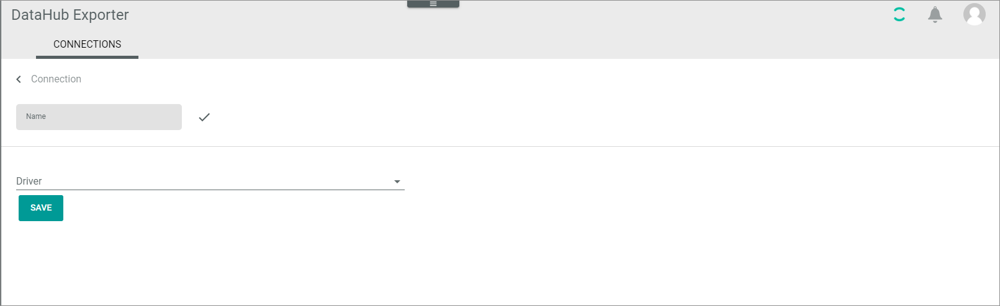
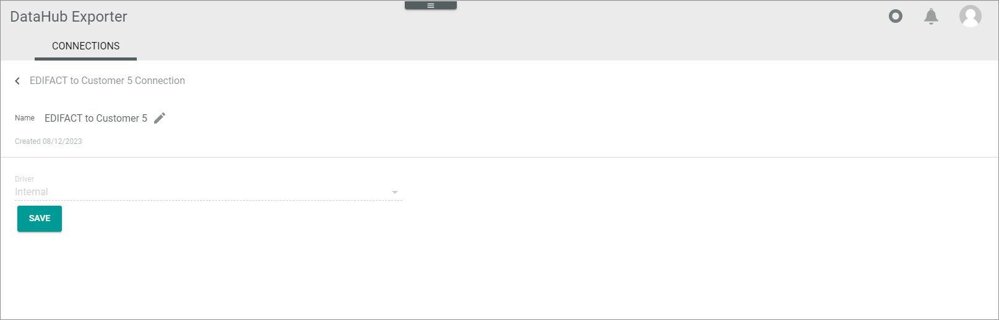
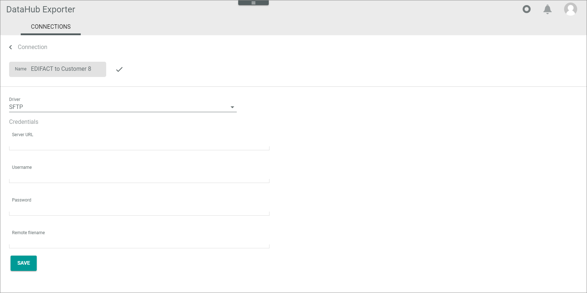

[!!Manage Connections](../UserInterface/02a_Connections.md)

# CONNECTIONS (Settings)

*DataHub Exporter > Settings > Tab CONNECTIONS*

**Connections**

The *CONNECTIONS* tab contains a list view of all available connections.
The following functions are available in the list header of the *CONNECTIONS* tab:

-  (Refresh)   
    Click this button to update the list of connections.

- *VIEW*   
    Click the drop-down list to select the view. All created views are displayed in the drop-down list. For a detailed description of how to create and edit a list view, see [LIST views](../../Core1Platform/UserInterface/03_ViewsLIST.md).  

-  Columns (x)   
    Click this button to display the columns bar and customize the displayed columns and the order of columns in the list. The *x* indicates the number of columns that are currently displayed in the list.

- [x]     
    Select the checkbox to display the editing toolbar. If you click the checkbox in the header, all connections in the list are selected.

- [SYNCHRONIZE]  
    Click this button to synchronize the selected connection. This button is only displayed if a single checkbox in the list of connections is selected. The *Sync triggered* pop-up window is displayed.

    

- [DISABLE]  
    Click this button to disable the selected connection(s). This button is only displayed if the checkbox of at least one active connection is selected.

- [ENABLE]  
    Click this button to enable the selected connection(s). This button is only displayed if the checkbox of at least one inactive connection is selected. 

-  (Edit)  
    Click this button to edit the selected *DataHub Exporter* connection. This button is only displayed if a single checkbox in the list of connections is selected. Alternatively, you can click directly a row in the list to edit a connection. The *Edit connection* view is displayed, see [Edit DataHub Exporter connection](#edit-datahub-exporter-connection).

The list displays all available connections. Depending on the settings, the displayed columns may vary. All fields are read-only.

- *Name*  
    Connection name.

- *Status*  
    Connection status. The following statuses are available:
    -  **Active**   
        The connection is enabled and data is being synchronized via the connection.
    -  **Inactive**   
        The connection is disabled and no data is being synchronized via the connection.   

- *Driver*  
    Driver name.

-  (Add)  
    Click this button to add a *BigCommerce* connection. The *Create connection* view is displayed, see below.

## Create DataHub Exporter connection

*DataHub Exporter > Settings > Tab CONNECTIONS > Button Add*

-  (Back)   
    Click this button to close the *Create connection* view and return to the connection list. All changes are rejected.

- *Name*   
    Enter a connection name.

-  (Apply)  
    Click this button to apply the entered connection name. This button is only displayed if the connection name has not yet been confirmed. 

-   (Edit)  
    Click this button to edit the connection name. This button is only displayed if the connection name has been confirmed. 

- *Driver*  
    Click the drop-down list and select the *DataHub Exporter* driver. All installed drivers are displayed.  
    > [Info] Drivers are licensed and must be acquired via the app store or the corresponding e-commerce partner platform. The applicable driver credentials to establish the connection are obtained when acquiring the corresponding license.

- [SAVE]
   Click this button to save the connection. 

**Credentials**

This section is only displayed for drivers with further credentials. The fields displayed in the *Credentials* section vary depending on the selected driver.

- [SAVE]   
   Click this button to save the connection.

## Edit DataHub Exporter connection

*DataHub Exporter > Settings > Tab CONNECTIONS > Select a connection*

-  (Back)   
    Click this button to close the *Create connection* view and return to the connection list. All changes are rejected.

- *Name*   
    Connection name. Click the  (Edit) button to the right of the name to edit it.

-   (Edit)  
    Click this button to edit the connection name. This button is only displayed if the connection name has been confirmed.

-  (Apply)  
    Click this button to apply the entered connection name. This button is only displayed if the connection name has not yet been confirmed. 

- *Created DD/MM/YYYY*    
   Creation date of the connection. This field is read-only.

- *Driver*  
    Driver name. This drop-down list is read-only.

- [SAVE]
   Click this button to save any changes made.   

### Edit connection - Credentials

*DataHubExporter > Settings > Tab CONNECTIONS > Select a connection > Tab Credentials*

This tab is only displayed for drivers with further credentials.

**Credentials**

- [SAVE]   
   Click this button to save any changes made.   