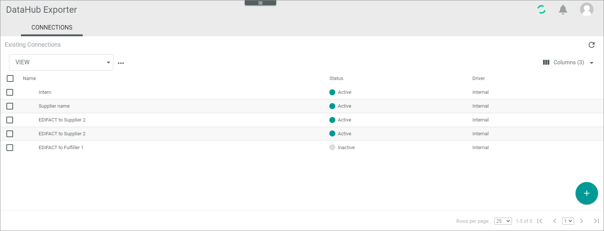

[!!Manage Connections](../UserInterface/02a_Connections.md)

# CONNECTIONS (Settings)

*DataHub Exporter > Settings > Tab CONNECTIONS*

**Connections**

The *Connections* list contains a list view of all available connections. Depending on the settings, the displayed columns may vary. All fields are read-only.

The following functions are available for the editing toolbar:

- [x]     
    Select the checkbox to display the editing toolbar. If you click the checkbox in the header, all connections in the list are selected.

- [SYNCHRONIZE]  
    Click this button to synchronize the selected connection. This button is only displayed if a single checkbox in the list of connections is selected. A confirmation message is displayed.

- [DISABLE]  
    Click this button to disable the selected connection(s). This button is only displayed if the checkbox of at least one active connection is selected.

- [ENABLE]  
    Click this button to enable the selected connection(s). This button is only displayed if the checkbox of at least one inactive connection is selected. 

-  (Edit)  
    Click this button to edit the selected *DataHub Exporter* connection. This button is only displayed if a single checkbox in the list of connections is selected. Alternatively, you can directly click a row in the list to edit a connection. The *Edit connection* view is displayed, see [Edit DataHub exporter connection](#edit-datahub-exporter-connection).

The following functions and fields are available in this view:

- *Name*  
    Connection name.

- *Status*  
    Connection status. The following statuses are available:
    -  **Active**   
        The connection is enabled, and data is being synchronized via the connection.
    -  **Inactive**   
        The connection is disabled, and no data is being synchronized via the connection.   

- *Driver*  
    Driver name.

-  (Add)  
    Click this button to add a *DataHub Exporter* connection. The *Create connection* view is displayed.

## Create DataHub Exporter connection

*DataHub Exporter > Settings > Tab CONNECTIONS > Button Add*

**Create connection**   
The *Create connection* view contains the fields required to define a connection. 

- *Name*   
    Enter a connection name.

-  (Apply)  
    Click this button to apply the entered connection name. This button is only displayed if the connection name has not yet been confirmed. 

-   (Edit)  
    Click this button to edit the connection name. This button is only displayed if the connection name has been confirmed. 

- *Driver*  
    Click the drop-down list and select the *DataHub Exporter* driver. All installed drivers are displayed.  
    
- [SAVE]     
   Click this button to save the connection. 

**Credentials**

This section is only displayed for drivers with further credentials. The fields displayed in the *Credentials* section vary depending on the selected driver.

- [SAVE]   
   Click this button to save the connection.

## Edit DataHub Exporter connection

*DataHub Exporter > Settings > Tab CONNECTIONS > Select a connection*

- *Name*   
    Connection name. Click the  (Edit) button to the right of the name to edit it.

-   (Edit)  
    Click this button to edit the connection name. This button is only displayed if the connection name has been confirmed.

-  (Apply)  
    Click this button to apply the entered connection name. This button is only displayed if the connection name has not yet been confirmed. 

- *Created DD/MM/YYYY*    
   Creation date of the connection. This field is read-only.

- *Driver*  
    Driver name. This drop-down list is read-only.

- [SAVE]
   Click this button to save any changes made.   

### Edit connection - Credentials

*DataHub Exporter > Settings > Tab CONNECTIONS > Select a connection > Tab Credentials*

**Credentials**

This section is only displayed for drivers with further credentials.

- [SAVE]   
   Click this button to save any changes made.   