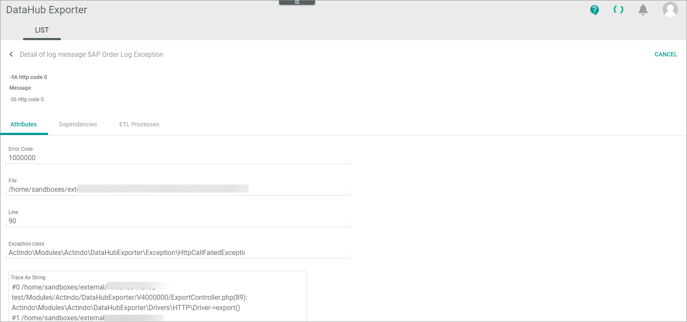

# LIST (Log)

*DataHub Exporter > Log > Tab LIST*

**List of intents**   
The list of intents contains all intents that are a summary of log entries generated by one system action. It provides you with the following UI functions:

-  (Search)   
    Click this button to display the search bar and search for an intent.

-  (Refresh)   
    Click this button to update the list of intents.

- *VIEW*  
    Click the drop-down list to select the view. All created views are displayed in the drop-down list. For a detailed description of how to create and edit a list view, see [LIST views](../../Core1Platform/UserInterface/03_ViewsLIST.md).  

-  Columns (x)   
    Click this button to display the columns bar and customize the displayed columns and the order of columns in the list. The *x* indicates the number of columns that are currently displayed in the list.

-  Filter (x)   
    Click this button to display the filter bar and customize the active filters. The *x* indicates the number of filters that are currently active.

 The list displays all intents. Depending on the settings, the displayed columns may vary. All fields are read-only.

- *Name*  
    Description of the intent, name of the driver.

- *Number of messages*  
    Number of messages contained in the intent.

- *Created at*  
    Date and time of the creation.

- *Created by*  
    Name and username of the user that initiated the action leading to the intent. If the intent was created automatically by the system, this field is empty. 

- *Max log level of message*  
    Maximum log level type of the message(s) contained in the intent. The following levels are available:   
    - **Debug**   
    - **Info**
    - **Notice**
    - **Warning**
    - **Error**
    - **Critical**
    - **Alert**
    - **Emergency**  
        
- *ID*  
    Intent identification number. The ID number is automatically assigned by the system.

- *Short preview*  
    First 30 characters of the log message.

- *Preview*  
    Complete log message.

## List of messages

*Payments > Logging > Tab LIST > Select an intent*

**List of messages**   

The list displays all log messages of the selected intent. Depending on the settings, the displayed columns may vary. All fields are read-only.

-  (Back)   
    Click this button to close the *List of messages* view and return to the list of intents. All changes are rejected.

- *Title*  
    Title of the log message.

- *Log level*  
    Log level type. The following levels are available:   
    - **Debug**
    - **Info**
    - **Notice**
    - **Warning** 
    - **Error**
    - **Critical**
    - **Alert**
    - **Emergency**
   
- *Created at*  
    Date and time of the creation.

- *Created by*  
    Name and username of the user who has initiated the action leading to the log message. If the log message was created automatically by the system, this field is empty. 

- *Message*  
    Detailed log message to the intent.

- *ID*  
    Log message identification number. The ID number is automatically assigned by the system.

### Detail of log message

*DataHub Exporter > Log > Tab LIST > Select an intent > Select a log message*

-  (Back)   
    Click this button to close the *Detail of log message "Log message title"* view and return to the list of messages. All changes are rejected.

- [CANCEL]  
    Click this button to close the *Detail of log message "Log message title"* view.

- *Message*    
    Description of the log message.

### Detail of log message &ndash; Attributes

*DataHub Exporter > Log > Tab LIST > Select an intent > Select a log message > Select Attributes tab*   

-  (Back)   
    Click this button to close the *Detail of log message "Log message title"* view and return to the list of messages.    
- [CANCEL]  
    Click this button to close the *Detail of log message "Log message title"* view.

- *Message*    
    Description of the log message.

- *Error code*  
    Error code number.

- *File*  
    Path of the file where the error has occurred.

- *Line*  
    Line in the file where the error has occurred.

- *Exception class*   
    Class name of the error. The error class describes the type of error that has occurred.

- *Trace as string*   
    Stack trace until the error has occurred. The stack trace lists the code until the error has occurred and is used to track the error.

- *Exception*   
    Detailed description of the error.

### Detail of log message &ndash; Dependencies

*DataHub Exporter > Log > Tab LIST > Select an intent > Select a log message > Select Dependencies tab* 

**Dependencies**

The list displays all dependencies of the selected log message. Depending on the settings, the displayed columns may vary. All fields are read-only. If no dependent entities exist, the *No other entities depend on this entity* notice is displayed. 

-  (Refresh)   
    Click this button to update the list of the log message dependencies.

-  Columns (x)   
    Click this button to display the columns bar and customize the displayed columns and the order of columns in the list. The *x* indicates the number of columns that are currently displayed in the list.

- [x]     
    Select the checkbox to display the editing toolbar. If you click the checkbox in the header, all dependent entities in the list are selected. 
 
 The list contains the following fields and functions:

- *Dependent entity ID*   
    Identification number of the dependent entity. The ID number is automatically assigned by the system. 

- *Dependent entity type*   
    Type of the dependent entity. 

- *Change tracking*   
    Change tracking mode (ETL mode) of the dependent entity. The following options are available:
    - **Manual**
    - **Semiautomatic**
    - **Semiautomatic, changes must be confirmed by another user**   
    - **Automatic**

- *Dependent entity friendly identifier*   
    Further, more descriptive identifier of the dependent entity, for instance a reference number or an SKU.

- [RERUN MAPPING]   
    Click this button to rerun the mapping of the selected entity. This button is only displayed if the checkbox of at least one dependency is selected.

### Detail of log message &ndash; ETL processes	

*DataHub Exporter > Log > Tab LIST > Select an intent > Select a log message > Select ETL processes tab* 

The list displays all ETL processes where an error has occurred and is described in the selected log message. Depending on the settings, the displayed columns may vary. All fields are read-only.   
If no ETL processes are involved, the *No ETL processes exist* notice is displayed.

-  (Refresh)   
    Click this button to update the list of the log message dependencies.

-  Columns (x)   
    Click this button to display the columns bar and customize the displayed columns and the order of columns in the list. The *x* indicates the number of columns that are currently displayed in the list.

For detailed information on the fields displayed in the list, see [ETL Processes](../../DataHub/UserInterface/02h_ETLProcesses.md) in the *DataHub* documentation.
