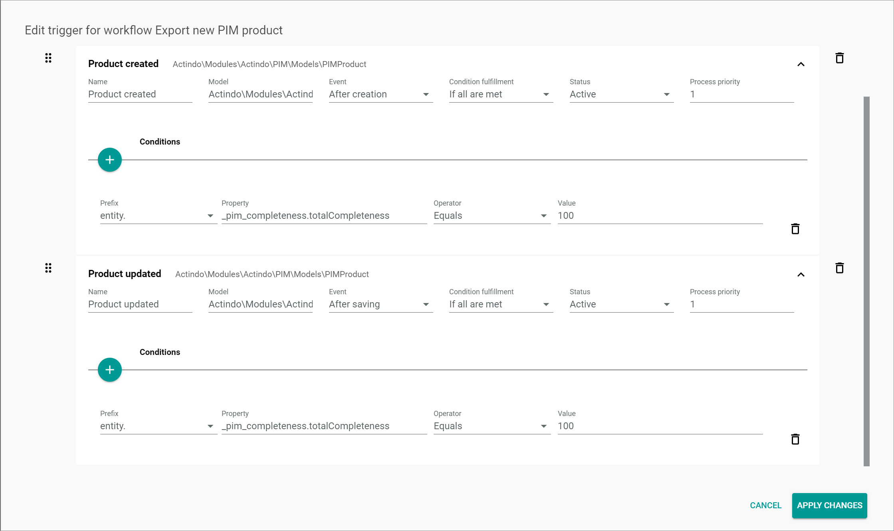

# Export item

[comment]: <> (add screenshot)

**Short description**

The *Export item* workflow is used to export a SAP item to SAP. 
This workflow is the second part of a two-step process to export a new PIM product to SAP. The first part of the process is described in the [Export new PIM product](../ExportNewPIMProduct/ExportNewPIMProduct.md) workflow.

**Summary**

|    |    |  
|----|----|
|**Purpose** | Export an item to SAP. |
|**Affected entities** | |
|**Included plugins** | Workflows   PIM   DataHub | 
|**Included third party software** | SAP Business One |   
|**Trigger** | The process is triggered by the update of a SAP item. Optionally, further conditions can be added for the triggers. | 
|    |     |

**Included steps**

Export of the SAP item to SAP.

## How to set up an export PIM product workflow

After a SAP item has been created from a PIM product, the export of the item to SAP can be further processed in Actindo.
In the following, it is described how to build a workflow template that is covering the export process to SAP.

#### Prerequisites

- The *SAP Business One Integration* has been installed.
- A SAP item has been created or updated.

[comment]: <> (add prerequisites)

#### Procedure

*Workflows > Workflows > Tab OVERVIEW*

1. Click the  (Add) button in the bottom right corner.   
    The *New workflow* window is displayed.

    

2. Enter **Export item** in the *Select a name for your new workflow* field.

3. Enter **sap_export_item** in the *Select a unique key for your new workflow* field. The key is required for API access and must be unique within the workflow version.

4. Select the **___WorkflowAutogen___\Actindo\Modules\SapB1Integration\Models\Item** option as start place type in the *Choose the data type of your start place* field.

    > [Info] Enter a keyword in the field, for example **SAP**, to limit the data types displayed in the list. The list of data types is filtered for your keyword as you type.

5. Select the ***___WorkflowAutogen___\Actindo\Modules\SapB1INtegration\Models\Item** option as end place type in the *Choose the data type of your end place* field.

    > [Info] Enter a keyword in the field, for example **SAP**, to limit the data types displayed in the list. The list of data types is filtered for your keyword as you type.

  6. Click the [CREATE] button in the bottom right corner.   
    The new workflow has been created. The *New workflow* window is closed. The workflow editor with the defined start and end places is displayed.  

    

7. In a new window, open the JSON library for workflows and copy the JSON code for the *Export item* workflow to your clipboard, see [JSON Export item](./ExportItem.json).

8. In the workflow editor, click the  (Points) button in the upper left corner next to the workflow name.   
    The workflow context menu is displayed.

    

9. Click the *Import JSON ..* menu entry in the context menu.   
    The *Import JSON* window with the JSON code for the current workflow is displayed.

    

10. Select the complete JSON code in the window, replace it by the JSON code in your clipboard and click the [IMPORT JSON] button in the bottom right corner.
    The *Import JSON* window is closed. The copied workflow is displayed in the workflow editor.

    

    > [Info] You can edit the workflow as desired before deploying it.

11. Click the  (Points) button in the upper left corner next to the workflow name.   
    The workflow context menu is displayed.

    

12. Click the *Deploy* menu entry in the context menu.   
    The copied workflow has been deployed and published.

    > [Info] For detailed information about the single actions, see [Description of the *Export item* process](#description-of-the-export-item-process).

## Description of the *Export item* process

Within a workflow, several actions are performed. 
In the following, all actions within the process are described in detail, specifying their function and their functional settings.

### Trigger for the *Export item* workflow

The following recommended trigger is configured so that the process starts if a SAP item is updated. Further, the conditions specify that the process only starts if an item code for the SAP item is set. 

> [Info] If desired, the triggers for the *Export item* workflow and their subordinate conditions can be adjusted according to the custom requirements, see [Manage the triggers](../ActindoWorkFlow/Operation/03_ManageTriggers.md). 

#### Item updated trigger

Configure the following settings for the *Product updated* trigger:

|    |    |
|----|----|
|**Name** | Product updated |
|**Model** | Actindo\Modules\Actindo\SapB1Integration\Models\Item |
|**Event** | After saving | 
|**Condition fulfillment** | If all are met |   
|**Status** | Active |
|**Process priority** | 1 | 
|    |    |

**Conditions**

|    |    |
|----|----|
|**Prefix** | entity. | 
|**Property** | ItemCode | 
|**Operator** | Is set | 
|**Toggle** | Enabled | 

### Export item

[comment]: <> (add screenshot)

The *Export item* action is used to export the item to SAP.

#### Settings

The *Description*, *Key*, *Label*, *Queue type*, *Priority*, *Max tries* and *Long Description* fields have no functional meaning for the action.    
