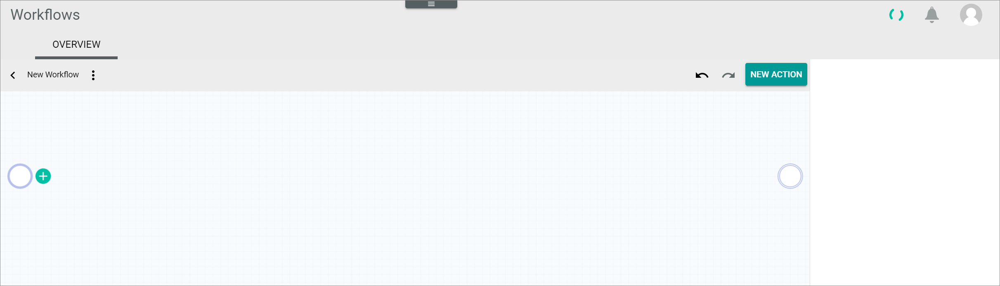
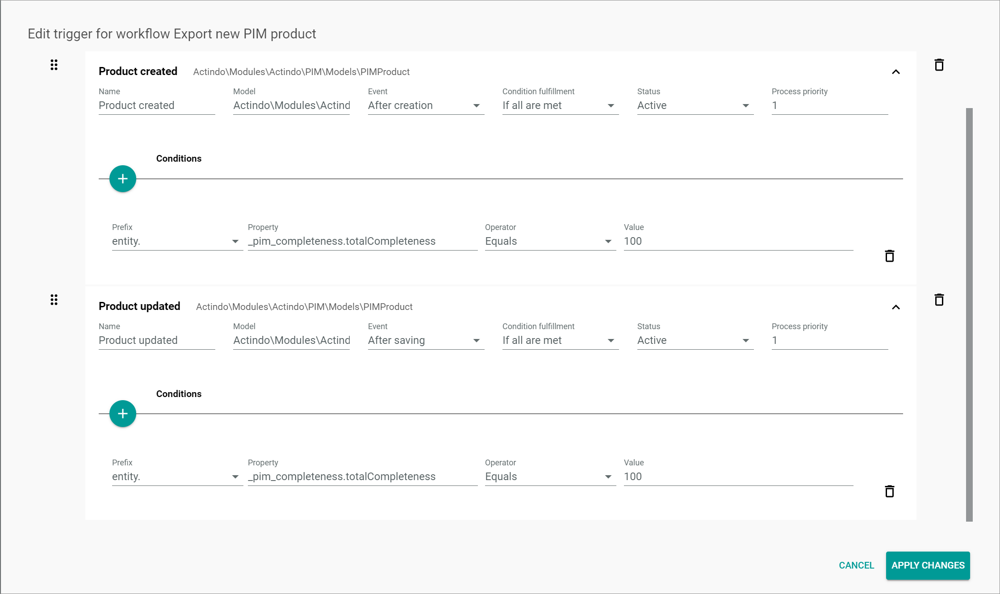

# Export new PIM product

[comment]: <> (add screenshot)

**Short description**

The *Export new PIM product* workflow is used to check if a PIM product already exists in SAP and if not, create a SAP item for the PIM product. 
This workflow is the first part of a two-step process to export a new PIM product to SAP. The second part of the process is described in the [Export item](../ExportItem/ExportItem.md) workflow.

**Summary**

|    |    |  
|----|----|
|**Purpose** | Create a SAP item from a PIM product. |
|**Affected entities** | |
|**Included plugins** | Workflows   PIM   DataHub | 
|**Included third party software** | SAP Business One |   
|**Trigger** | The process is triggered by either the creation of a new PIM product or a change on a PIM product. Optionally, further conditions can be added for the triggers. | 
|    |     |

**Included steps**

- Verification if a PIM product already exists in the SAP 
- Creation of a SAP item from the PIM product

## How to set up an export PIM product workflow

After a PIM product has been created or a PIM product has been changed, the creation of a SAP item from the PIM product can be further processed in Actindo.
In the following, it is described how to build a workflow template that is covering the processes below:
- Verification if a PIM product already exists in the SAP 
- Creation of a SAP item from the PIM product

#### Prerequisites

- The *SAP Business One Integration* has been installed.

[comment]: <> (add prerequisites)

#### Procedure

*Workflows > Workflows > Tab OVERVIEW*

1. Click the  (Add) button in the bottom right corner.   
    The *New workflow* window is displayed.

    

2. Enter **Export new PIM product** in the *Select a name for your new workflow* field.

3. Enter **export_pim_product** in the *Select a unique key for your new workflow* field. The key is required for API access and must be unique within the workflow version.

4. Select the **___WorkflowAutogen___\Actindo\Modules\Actindo\PIM\Models\PIMProduct** option as start place type in the *Choose the data type of your start place* field.

    > [Info] Enter a keyword in the field, for example **PIM**, to limit the data types displayed in the list. The list of data types is filtered for your keyword as you type.

5. Select the **___WorkflowAutogen___\Actindo\Modules\Actindo\PIM\Models\PIMProduct** option as end place type in the *Choose the data type of your end place* field.

    > [Info] Enter a keyword in the field, for example **PIM**, to limit the data types displayed in the list. The list of data types is filtered for your keyword as you type.

  6. Click the [CREATE] button in the bottom right corner.   
    The new workflow has been created. The *New workflow* window is closed. The workflow editor with the defined start and end places is displayed.  

    

7. In a new window, open the JSON library for workflows and copy the JSON code for the *Export new PIM product* workflow to your clipboard, see [JSON Export new PIM product](./ExportNewPIMProduct.json).

8. In the workflow editor, click the  (Points) button in the upper left corner next to the workflow name.   
    The workflow context menu is displayed.

    

9. Click the *Import JSON ..* menu entry in the context menu.   
    The *Import JSON* window with the JSON code for the current workflow is displayed.

    

10. Select the complete JSON code in the window, replace it by the JSON code in your clipboard and click the [IMPORT JSON] button in the bottom right corner.
    The *Import JSON* window is closed. The copied workflow is displayed in the workflow editor.

    

    > [Info] You can edit the workflow as desired before deploying it.

11. Click the  (Points) button in the upper left corner next to the workflow name.   
    The workflow context menu is displayed.

    

12. Click the *Deploy* menu entry in the context menu.   
    The copied workflow has been deployed and published.

    > [Info] For detailed information about the single actions, see [Description of the *Export new PIM product* process](#description-of-the-export-new-pim-product-process).

## Description of the *Export new PIM product* process

Within a workflow, several actions are performed. 
In the following, all actions within the process are described in detail, specifying their function and their functional settings.

> [Info] All actions described below are SAP specific actions and only available if the *SAP* module has been installed in your account.

### Trigger for the *Export new PIM product* workflow

The following recommended triggers are configured so that the process starts if either a new PIM product is created or a PIM product is changed. Further, the conditions specify that the process only starts if the completeness of the new or the changed PIM product equals 100%. 

> [Info] If desired, the triggers for the *Export new PIM product* workflow and their subordinate conditions can be adjusted according to the custom requirements, see [Manage the triggers](../ActindoWorkFlow/Operation/03_ManageTriggers.md). 

#### Product created trigger

Configure the following settings for the *Product created* trigger:

|    |    |
|----|----|
|**Name** | Product created |
|**Model** | Actindo\Modules\Actindo\PIM\Models\PIMProduct |
|**Event** | After creation | 
|**Condition fulfillment** | If all are met |   
|**Status** | Active |
|**Process priority** | 1 | 
|    |    |

**Conditions**

|    |    |
|----|----|
|**Prefix** | entity. | 
|**Property** | _pim_completeness.totalCompleteness | 
|**Operator** | Equals | 
|**Value** | 100 | 

#### Product updated trigger

Configure the following settings for the *Product updated* trigger:

|    |    |
|----|----|
|**Name** | Product updated |
|**Model** | Actindo\Modules\Actindo\PIM\Models\PIMProduct |
|**Event** | After saving | 
|**Condition fulfillment** | If all are met |   
|**Status** | Active |
|**Process priority** | 1 | 
|    |    |

**Conditions**

|    |    |
|----|----|
|**Prefix** | entity. | 
|**Property** | _pim_completeness.totalCompleteness | 
|**Operator** | Equals | 
|**Value** | 100 | 

### Check if item exists

[comment]: <> (add screenshot)

The *Check if item exists* action is used to check if the PIM product already exists as item in SAP.

#### Settings

The *Description*, *Key*, *Label*, *Queue type*, *Priority*, *Max tries* and *Long Description* fields have no functional meaning for the action.    

**Static inputs**

- *Connection*    
    Enter the applicable ID as value for the *Connection* variable to check if the PIM product exist for the corresponding SAP connection in the *Check if item exists* action. All database objects can be configured by a static JSON input in the *Static inputs* section of the action settings. The SAP connection ID must be specified as an object, for instance **{"id":12}**.

    > [Info]  The value must be valid JSON and is type strict, for example a string must be specified as a string (**\"example\"**), an integer as an integer (**123**), and so on.

### Create item

[comment]: <> (add screenshot)

The *Create item* action is used to create a SAP item for the PIM product. The item must be created from the PIM product to be exported to SAP.

#### Settings

The *Description* field contains the API endpoint that is addressed in this action. The *Key*, *Label*, *Queue type*, *Priority*, *Max tries* and *Long Description* fields have no functional meaning for the action. 

- *Description*   
    .createFromPimProduct | Create item from given PIM-Product (/Actindo.Modules.Actindo.SapB1Integration.Items.createFromPimProduct)

**Static inputs**

- *Connection*    
    Enter the applicable ID as value for the *Connection* variable to create the SAP item for the corresponding SAP connection in the *Create item* action. All database objects can be configured by a static JSON input in the *Static inputs* section of the action settings. The SAP connection ID must be specified as an object, for instance **{"id":12}**.

    > [Info]  The value must be valid JSON and is type strict, for example a string must be specified as a string (**\"example\"**), an integer as an integer (**123**), and so on.

- *ETL change tracking mode*   
    Enter **"2"** for the *ETL change tracking mode* variable to set the change tracking mode to **automatic** and thus transfer any changes on the PIM product to the SAP item. This means that an item will change whenever a relevant attribute in the PIM product is changed. 

    > [Info] A relevant attribute refers to any attribute that is mapped in the corresponding attribute set mapping.