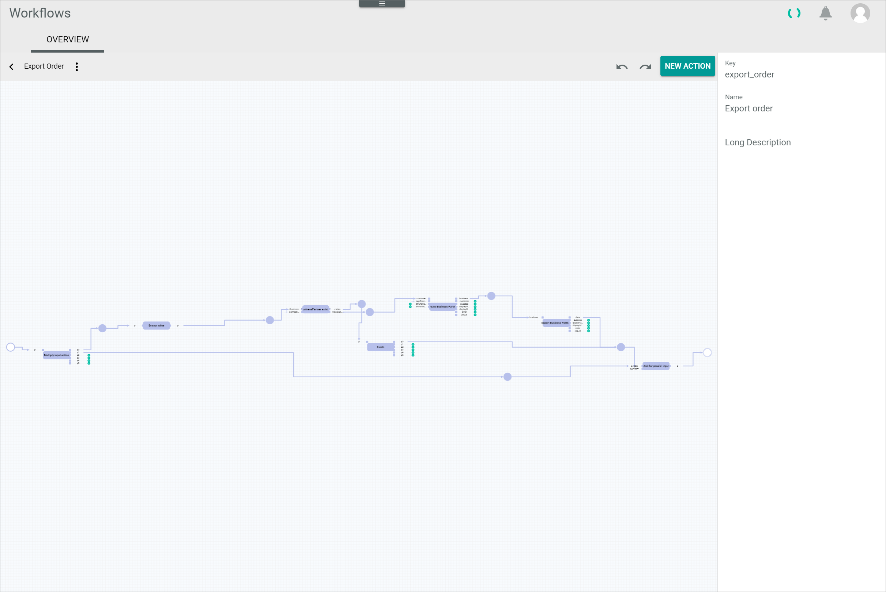
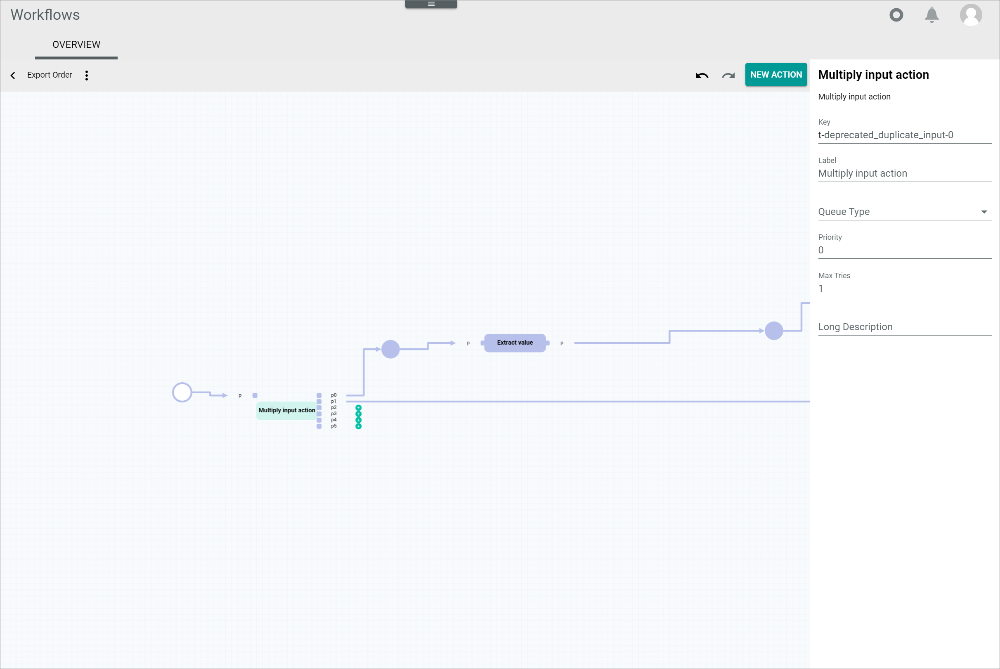
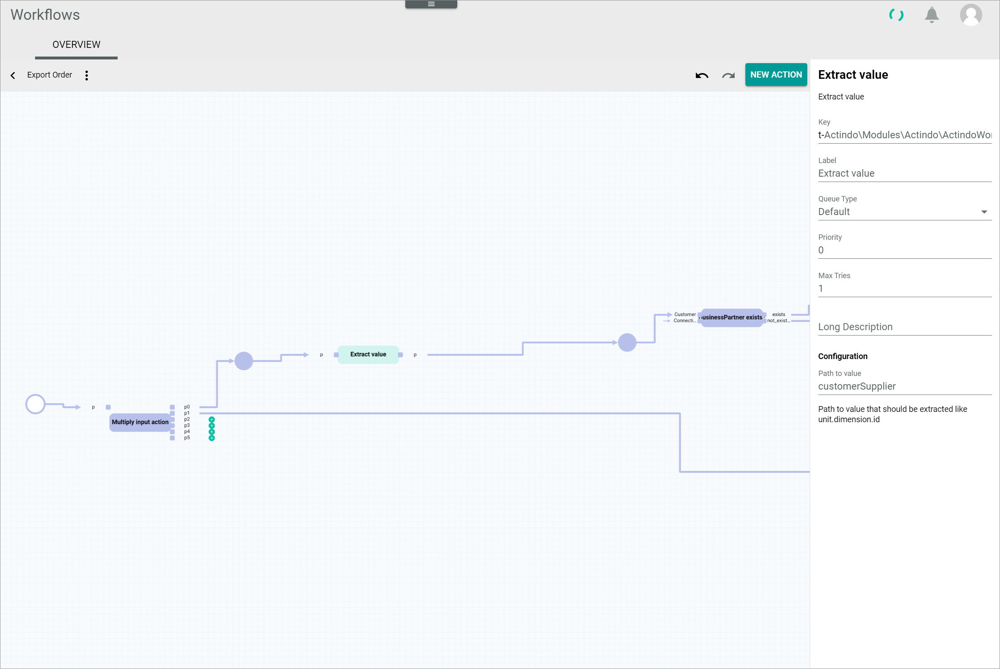
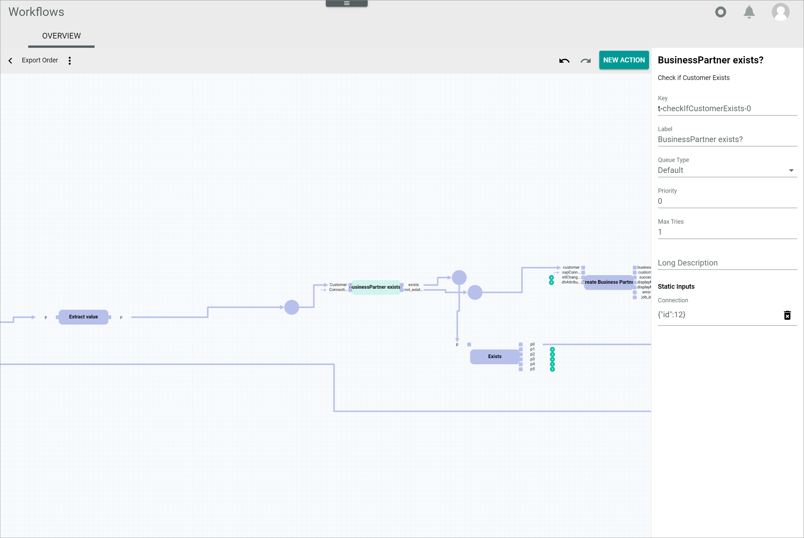
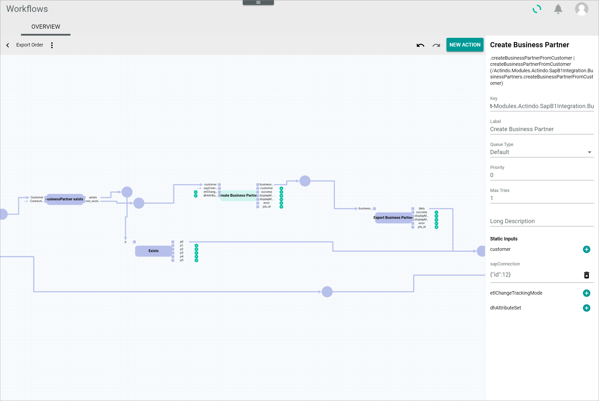
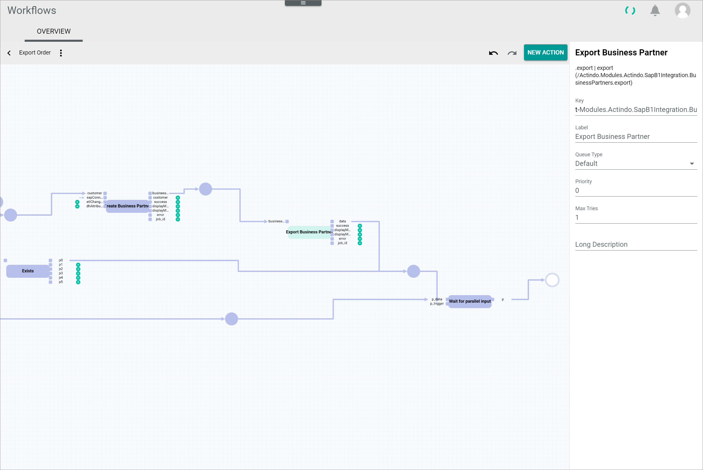

# Export order

[comment]: <> (add screenshot)

**Short description**

The *Export order* workflow is used to export an order to SAP. To do so, it is checked in advance whether the customer who placed the order already exists in SAP and, if not, the customer is added to SAP and then the order is exported to SAP.

**Summary**

|    |    |  
|----|----|
|**Purpose** | Export an order to SAP and add non-existing customers to SAP. |
|**Affected entities** | |
|**Included plugins** | Workflows   PIM   DataHub   Order management | 
|**Included third party software** | SAP Business One |   
|**Trigger** |  The process is triggered as soon as a business document for the order has been created. | 
|    |     |

**Included steps**

- Check if customer already exists in SAP
- Creation of new business from customer
- Export of business partner to SAP
- Export of the order to SAP

## How to set up an export order to SAP workflow

After a business document for an order has been created, the order export to SAP can be further processed in Actindo. 
You can automate this process by using the *Workflows* module and building a workflow that is handling all processes after the business document creation up to the order export to SAP. As each workflow can be customized, it is possible to include or exclude different processes depending on the customers needs.
In the following, it is described how to build a workflow template that is covering the processes below:
- Business partner creation from customer 
- Business partner export to SAP
- Order export to SAP

#### Prerequisites

- The *SAP Business One Integration* has been installed.

[comment]: <> (add prerequisites)

#### Procedure

*Workflows > Workflows > Tab OVERVIEW*

1. Click the  (Add) button in the bottom right corner.   
    The *New workflow* window is displayed.

    

2. Enter **Export order** in the *Select a name for your new workflow* field.

3. Enter **export_order** in the *Select a unique key for your new workflow* field. The key is required for API access and must be unique within the workflow version.

4. Select the **___WorkflowAutogen___\Actindo\Modules\RetailSuite\RetailSuiteFaktBase\Models\BusinessDocument** option as start place type in the *Choose the data type of your start place* field.

    > [Info] Enter a keyword in the field, for example **business**, to limit the data types displayed in the list. The list of data types is filtered for your keyword as you type.

5. Select the **___WorkflowAutogen___\Actindo\Modules\RetailSuite\RetailSuiteFaktBase\Models\BusinessDocument** option as end place type in the *Choose the data type of your end place* field.

    > [Info] Enter a keyword in the field, for example **business**, to limit the data types displayed in the list. The list of data types is filtered for your keyword as you type.

6. Click the [CREATE] button in the bottom right corner.   
    The new workflow has been created. The *New workflow* window is closed. The workflow editor with the defined start and end places is displayed.

    

7. In a new window, open the JSON library for workflows and copy the JSON code for the *Export item* workflow to your clipboard, see [JSON Export item](./ExportItem.json).

8. In the workflow editor, click the  (Points) button in the upper left corner next to the workflow name.   
    The workflow context menu is displayed.

    

9. Click the *Import JSON ..* menu entry in the context menu.   
    The *Import JSON* window with the JSON code for the current workflow is displayed.

    

10. Select the complete JSON code in the window, replace it by the JSON code in your clipboard and click the [IMPORT JSON] button in the bottom right corner.
    The *Import JSON* window is closed. The copied workflow is displayed in the workflow editor.

    

    > [Info] You can edit the workflow as desired before deploying it.

11. Click the  (Points) button in the upper left corner next to the workflow name.   
    The workflow context menu is displayed.

    

12. Click the *Deploy* menu entry in the context menu.   
    The copied workflow has been deployed and published.

    > [Info] For detailed information about the single actions, see [Description of the *Export order* process](#description-of-the-export-order-process).

## Description of the *Export order* process

Within a workflow, several actions are performed. If a certain number of actions are executed in a specific order with a common objective that can only be achieved by executing all of these actions, we speak of a so-called *snippet*. 
In the following, all snippets and single actions within the process are described in detail, specifying their function and functional settings.

### Multiply input action

The *Multiply input action* action is used to duplicate the business document and output it via the *p0* and the *p1* port. The business document which is output via the *p0* port is used to extract the customer data and check if the customer already exists as a business partner in SAP. The business document which is output via the *p1* port is needed for the further order export to SAP and therefore transferred to the *Wait for parallel input* action. 

#### Settings   

The *Description*, *Key*, *Label*, *Queue type*, *Priority*, *Max tries* and *Long Description* fields have no functional meaning for the action.    

### Extract value

The *Extract value* action is used to extract a certain value from the object in the input port and provide it for the further process.
The path to the value which should be extracted must be configured in the *Configuration* section of the action setting. In this template case, the customer is extracted from the business document and passed on to the following *Business partner exists* action. 

#### Settings

The *Description*, *Key*, *Label*, *Queue type*, *Priority*, *Max tries* and *Long Description* fields have no functional meaning for the action.    

**Configuration**

- *Path to value*    
    Enter **customer_id** as path to the value that should be extracted from the input object.

[comment]: <> (check value)

### Business partner exists

The *Business partner exists* action is used to check if the customer from the business document already exists as a business partner in SAP. Therefore, the customer ID which has been extracted in the previous *Extract value* action is input in the *Customer* input port and the SAP connection ID is input in the *Connection* input port which must be specified in the static inputs. The connection ID is needed to identify if the business partner exists for this particular SAP connection.  
Depending on whether the business partner exists in SAP or not, the data is output via different ports. If the business partner exists, the data is output via the *exists* output port and passed on to the *Exists* action. If the business partner is not yet registered in SAP, the data is output via the *not_exist* port and a business partner is created from the customer and exported to SAP before the order export to SAP can be started.

#### Settings 

The *Description*, *Key*, *Label*, *Queue type*, *Priority*, *Max tries* and *Long Description* fields have no functional meaning for the action.    

**Static inputs**

- *Connection*    
    Enter the applicable ID as value for the *Connection* variable to check if the business partner exists for the corresponding SAP connection in the *Business partner exists* action. All database objects can be configured by a static JSON input in the *Static inputs* section of the action settings. The SAP connection ID must be specified as an object, for instance **{"id":12}**. The corresponding SAP connection ID is displayed in the *SAP* module: *SAP > Settings > Tab CONNECTIONS*

    > [Info]  The value must be valid JSON and is type strict, for example a string must be specified as a string (**\"example\"**), an integer as an integer (**123**), and so on.

### Create business partner

The *Create business partner* action is used to create a business partner entity for SAP from the customer. The entity is created by an ETL mapping from the customer to the business partner. Therefore, the customer ID which has been extracted in the *Extract value* action is input in the *Customer* input port and the SAP connection ID is input in the *Connection* input port which must be specified in the static inputs. The connection ID is needed to create the business partner for this particular SAP connection. The business partner entity is output via the *business_partner* port and passed on to the *Export business partner* action for the export to SAP.  
 
#### Settings 

The *Description* field contains the API endpoint that is addressed in this action. The *Key*, *Label*, *Queue type*, *Priority*, *Max tries* and *Long Description* fields have no functional meaning for the action. 

- *Description*   
    .createBusinessPartnerFromCustomer | createBusinessPartnerFromCustomer (/Actindo.Modules.Actindo.SapB1Integration.BusinessPartners.createBusinessPartnerFromCustomer)

**Static inputs**

- *SAP connection*    
    Enter the applicable ID as value for the *Connection* variable to create the business partner entity for the corresponding SAP connection in the *Create business partner* action. All database objects can be configured by a static JSON input in the *Static inputs* section of the action settings. The SAP connection ID must be specified as an object, for instance **{"id":12}**.

    > [Info]  The value must be valid JSON and is type strict, for example a string must be specified as a string (**\"example\"**), an integer as an integer (**123**), and so on.

### Export business partner

The *Export business partner* action is used to export the business partner to SAP. The business partner, which has been created in the *Create business partner* action is input in the *business partner* input port. When the business partner has been exported to SAP the data is output via the *data* port and passed on to the *Wait for parallel input* action, where the further order export to SAP is triggered. 

#### Settings 

The *Description* field contains the API endpoint that is addressed in this action. The *Key*, *Label*, *Queue type*, *Priority*, *Max tries* and *Long Description* fields have no functional meaning for the action. 

- *Description*   
    .export | export (/Actindo.Modules.Actindo.SapB1Integration.BusinessPartners.export)

### Exists

The *Exists* action is used to transfer the data from the *Business partner exists* action to the *Wait for parallel input* action, where the order export to SAP is triggered.

#### Settings   

The *Description*, *Key*, *Label*, *Queue type*, *Priority*, *Max tries* and *Long Description* fields have no functional meaning for the action.  

### Wait for parallel input

The *Wait for parallel input* action is used to wait for two inputs to be received by the action before executing the action. In this template case, the action awaits the business document from the *Multiply input action* action and the business partner data from either the *Exists* or the *Export business partner* action. As soon as both data is input, the action is executed and outputs business document for the further order export to SAP.

#### Settings

The *Description*, *Key*, *Label*, *Queue type*, *Priority*, *Max tries* and *Long Description* fields have no functional meaning for the action.     
