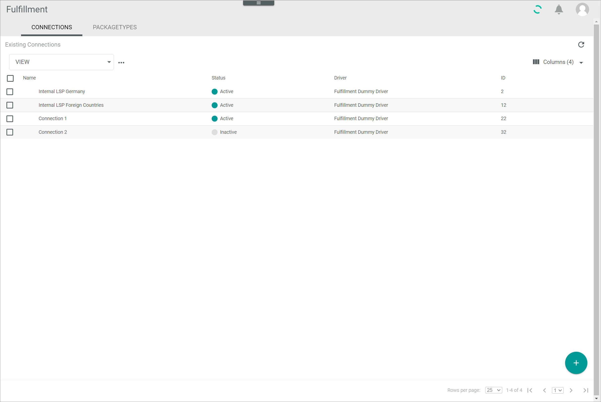
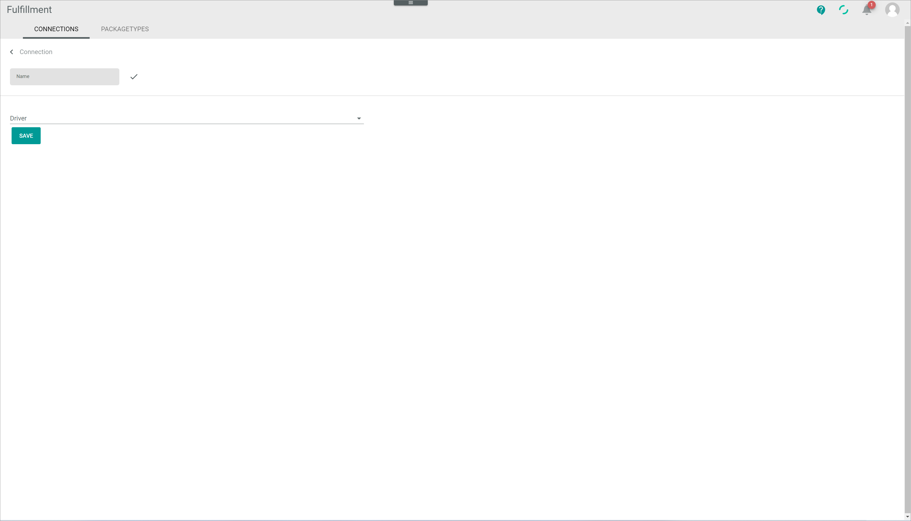
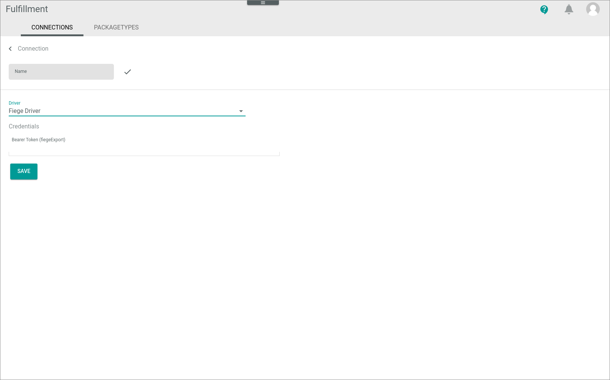
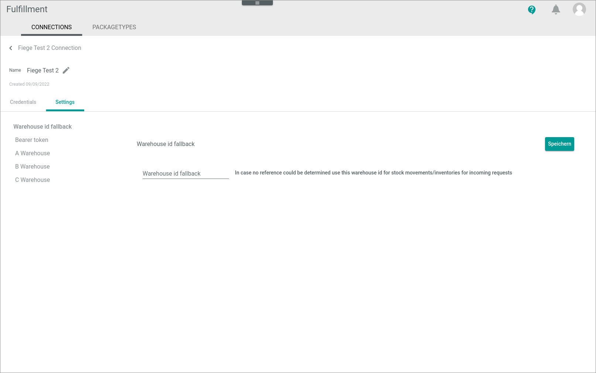
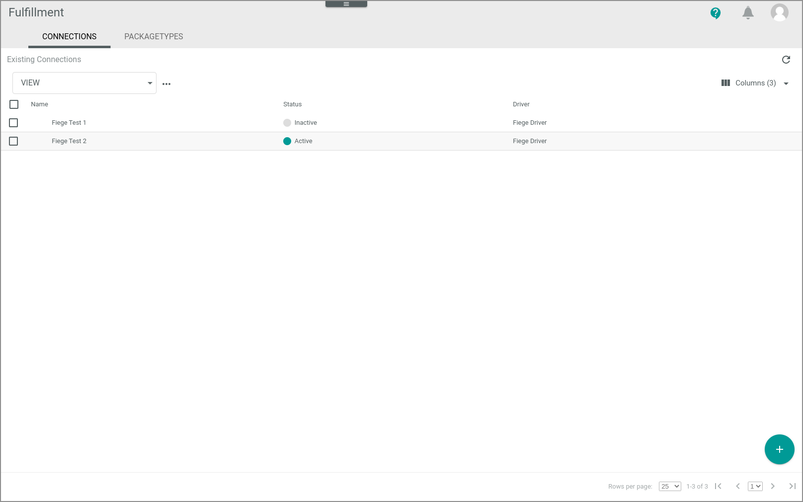
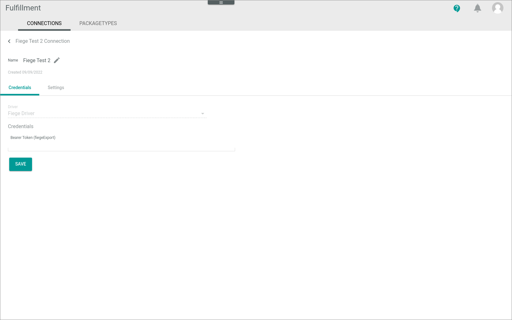
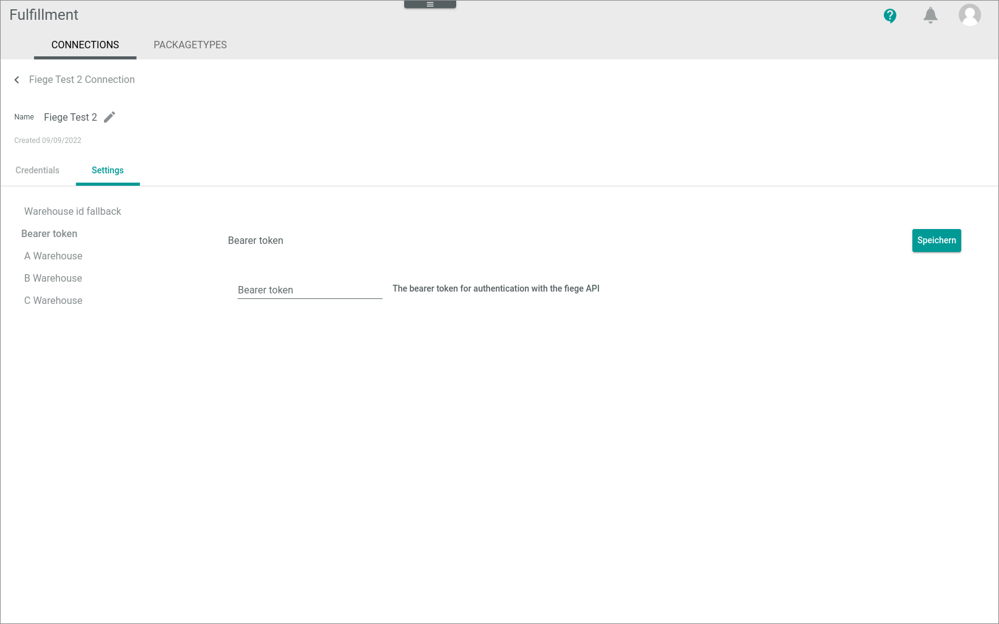
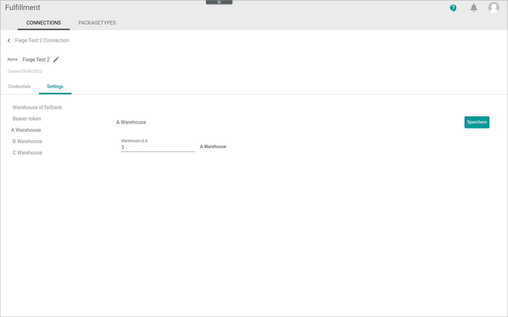
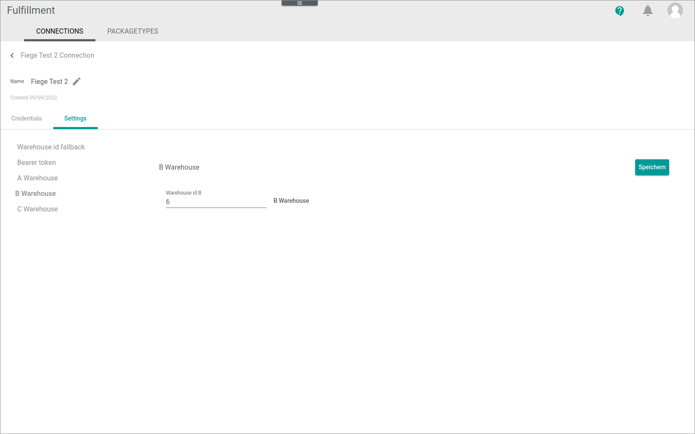
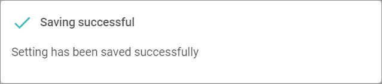

[!!Manage the connections](../../Fulfillment/Integration/01_ManageConnections.md)
[!!User interface Connections](../UserInterface/01_Connections.md)

# Manage the Fiege connection

To establish a connection to Fiege fulfillment system, there are several particularities to consider. Therefore, the creation and the configuration of the Fiege connection are described in detail below.

## Create a Fiege connection

Create the connection to Fiege fulfillment system using the Fiege driver. Further settings can only be configured after the connection has been established.

All necessary credentials and information to establish the connection are provided by Fiege.

#### Prerequisites

The *Fiege* driver has been installed in the Core1 account.

> [Info] The current driver version is custom-designed by Fiege and can only be installed in the Core1 with the collaboration of the Actindo IT department.

[comment]: <> (Stand: 23.02.2023)

#### Procedure

*Fulfillment > Settings > Tab CONNECTIONS*

1. Click the  (Add) button in the bottom right corner.    
    The *Create connection* view is displayed.

    

2. Enter a name for the connection in the *Name* field.

3. Click the *Driver* drop-down list and select *Fiege Driver*.  
    The *Credentials* section is displayed below the drop-down list.

    

4. Enter the bearer token as provided by Fiege in the *Bearer token (fiegeExport)* field.  

5. Click the [SAVE] button.  
    The connection will be established. The *Checking credentials...* notice is displayed. After a few seconds, the *Loading data...* notice is displayed.

    

    The *Create connection* view is automatically closed when the connection has been established. The *Edit connection* view of the newly created connection is displayed. The *Settings* tab is selected.

    

    > [Info] By default, all connections that have been established are first inactive and therefore must be enabled after the connection configuration.  

6. Continue to configure the connection, see [Configure the Fiege connection](#configure-the-fiege-connection).

## Configure the Fiege connection

After the Fiege connection has been established, further settings can be configured.

#### Prerequisites

- A Fiege connection has been established, see [Create a Fiege connection](#create-a-fiege-connection).
- The warehouses to be managed by Fiege have been configured in the *Warehouse* module. 

#### Procedure

*Fulfillment > Settings > Tab CONNECTIONS*

1. Click the Fiege connection to be configured in the list of connections.  
The *Edit connection* view is displayed. By default, the *Credentials* tab is selected.

    

2. Click the *Settings* tab.   
    The *Settings* tab is displayed. By default, the *Warehouse ID fallback* menu entry is selected.

    

3. Enter the number of the warehouse to be used as fallback warehouse for stock movements if no other reference is found. 

    > [Info] The warehouse numbers configured in the Core1 can be found in the *Warehouse* module: *Warehouse > Settings > Warehouse master data > Select a warehouse > Basic data*

4. Click the *Bearer token* menu entry in the left side bar.  
    The bearer token settings are displayed on the right side.  

    

5. Enter the bearer token for authentication with the Fiege API as provided by Fiege in the *Bearer token* field.

[comment]: <> (Feedback von Developers: Bearer token wird aus den Settings rausfallen und nur noch in den Credentials angezeigt werden. Daher muss der auch nur dort gepflegt werden. Wann wird es implementiert? Schritt komplett rauslassen hier? Dann neue Screenshots notwendig. Oder evtl. Info dazu: The bearer token has already been entered in the Credentials section and therefore this field can be left blank...)

6. Click the *A Warehouse* menu entry in the left side bar.  
    The A warehouse settings are displayed on the right side.  

    

7. Enter the number of the warehouse to be used as A warehouse in the *Warehouse ID A* field.  

8. Click the *B Warehouse* menu entry in the left side bar.  
    The B warehouse settings are displayed on the right side.  

    

9. Enter the number of the warehouse to be used as B warehouse in the *Warehouse ID B* field.

10. Click the *C Warehouse* menu entry in the left side bar.  
    The C warehouse settings are displayed on the right side.  

    

11.  Enter the number of the warehouse to be used as C warehouse in the *Warehouse ID C* field.

12. Click the [SAVE] button.  
    All changes have been saved. The *Saving successful* pop-up window is displayed.  

    
  
13. When necessary, continue to enable the connection, see [Enable a connection](./01_ManageConnections.md#enable-a-connection).