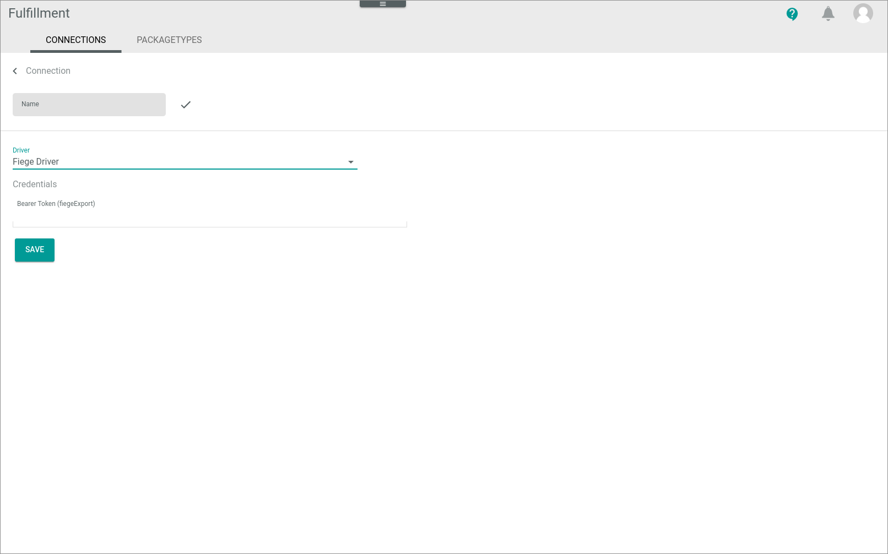
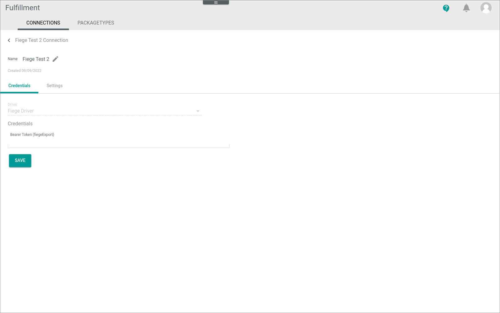
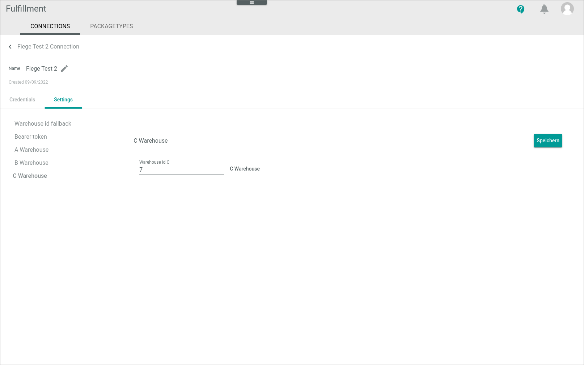

[!!Manage the Fiege connection](../Integration/01_ManageFiegeConnection.md)

# Connections

*Fulfillment > Settings > Tab CONNECTIONS*

**Connections**

-  (Refresh)   
    Click this button to update the list of connections.

- *VIEW*  
    Click the drop-down list to select the view. All created views are displayed in the drop-down list. Click the  (Points) button to the right of the *VIEW* drop-down list to display the context menu and create a view.   

    -  (Points)      
        Click this button to the right of the *View* drop-down list to display the context menu. The following menu entries are available:

        -  create  
            Click this entry to create a view. The *Create view* window is displayed, see [Create view](#create-view).

        -  rename  
            Click this entry to rename the selected view. The *Rename view* window is displayed, see [Rename view](#rename-view). This menu entry is only displayed if a view has been selected.

        -  reset  
            Click this entry to reset all unsaved changes to the settings of the selected view. This menu entry is only displayed if a view has been selected and any changes have been made to the view settings.

        -  publish  
            Click this entry to publish the view. This menu entry is only displayed if a view has been selected and unpublished.

        -  unpublish  
            Click this entry to unpublish the view. This menu entry is only displayed if a view has been selected and published.

        -  save  
            Click this entry to save the current view settings in the selected view. This menu entry is only displayed if a view has been selected.

            > [Info] When the settings of a view have been changed, an asterisk is displayed next to the view name. The asterisk is hidden as soon as the changes have been saved.

        -  delete  
            Click this entry to delete the selected view. A confirmation window to confirm the deletion is displayed. This menu entry is only displayed if a view has been selected.

-  Columns (x)   
    Click this button to display the columns bar and customize the displayed columns and the order of columns in the list. The *x* indicates the number of columns that are currently displayed in the list.

- [x]     
    Select the checkbox to display the editing toolbar. If you click the checkbox in the header, all connections in the list are selected.

- [DISABLE]  
    Click this button to disable the selected connection(s). This button is displayed if the checkbox of at least one active connection is selected. 

- [ENABLE]  
    Click this button to enable the selected connection(s). This button is displayed if the checkbox of at least one inactive connection is selected. 

-  (Edit)  
    Click this button to edit the selected Fiege connection. This button is only displayed if a single checkbox in the list of connections is selected. Alternatively, you can click directly a row in the list to edit a connection. The *Edit connection* view is displayed, see [Edit Fiege connection](#edit-Fiege-connection). 

The list displays all available connections. Depending on the settings, the displayed columns may vary. All fields are read-only.

- *Name*  
    Connection name.

- *Status*  
    Connection status. The following statuses are available:
    -  **Active**  
    The connection is enabled and data is being synchronized via the connection.
    -  **Inactive**   
    The connection is disabled and no data is being synchronized via the connection.

- *Driver*  
    Driver name.

- *ID*  
    Connection identification number. The ID number is automatically assigned by the system.

-  (Add)  
  Click this button to add a Fiege connection. The *Create connection* view is displayed, see [Create Fiege connection](#create-Fiege-connection).

## Create view

*Fulfillment > Settings > Tab CONNECTIONS > Button Points > Menu entry create*

- *Name*   
    Enter a name for the view.

- [CANCEL]   
    Click this button to cancel creating a view. The *Create view* window is closed.

- [SAVE]   
    Click this button to save the new view and display it in the *VIEW* drop-down list. The *Create view* window is closed.

## Rename view

*Fulfillment > Settings > Tab CONNECTIONS > Button Points > Menu entry rename*

- *Name*   
    Click this field to edit the view name.

- [CANCEL]   
    Click this button to cancel renaming the view. The *Rename view* window is closed.

- [SAVE]   
    Click this button to save the changes and display it in the *VIEW* drop-down list. The *Rename view* window is closed.

## Create Fiege connection

*Fulfillment > Settings > Tab CONNECTIONS > Button Add*

-  (Back)   
    Click this button to close the *Create connection* view and return to the connection list. All changes are rejected.

- *Name*   
    Enter a connection name.

-  (Apply)  
    Click this button to apply the entered connection name. This button is only displayed if the connection name has not yet been confirmed.

-  (Edit)  
    Click this button to edit the connection name. This button is only displayed if the connection name has been confirmed.

- *Driver*  
    Click the drop-down list and select the *Fiege Driver* option. All installed drivers are displayed. The *Credentials* section is displayed below the drop-down list.

    > [Info] Drivers are licensed and must be acquired via the app store or the corresponding fulfillment partner. The applicable driver credentials to establish the connection are obtained when acquiring the corresponding license. 

**Credentials**

- *Bearer token (fiegeExport)*  
    Enter the bearer token as provided by Fiege.

- [SAVE]  
    Click this button to save the connection. 

## Edit Fiege connection

*Fulfillment > Settings > Tab CONNECTIONS > Select Fiege connection*

-  (Back)   
    Click this button to close the *Edit connection* view and return to the connection list. All changes are rejected.

- *Name*   
    Connection name. Click the button  (Edit) to the right of the name to edit it.

-  (Edit)  
    Click this button to edit the connection name. 

-  (Apply)  
    Click this button to apply the changes to the connection name. This button is only displayed if you are editing the connection name.

- *Created DD/MM/YYYY*  
Creation date of the connection. This field is read-only.

## Edit Fiege connection &ndash; Credentials

*Fulfillment > Settings > Tab CONNECTIONS > Select Fiege connection > Tab Credentials*

- *Driver*  
    Driver name. For Fiege, the *Fiege Driver* option is displayed. This drop-down list is read-only.

**Credentials** 

 - *Bearer token (fiegeExport)*  
    Click the field to edit the bearer token.

- [SAVE]  
  Click this button to save any changes made.

## Edit Fiege connection &ndash; Settings

*Fulfillment > Settings > Tab CONNECTIONS > Select Fiege connection > Tab Settings*

[comment]: <> (NoE Beispiel mit Settings genommen und anomymisiert. Evtl. ein anderes Screenshot?)

The *Settings* tab is composed of the following setting entries: 

- [Warehouse ID fallback](#warehouse-id-fallback)
- [Bearer token](#bearer-token)
- [A Warehouse](#a-warehouse)
- [B Warehouse](#b-warehouse)
- [C Warehouse](#c-warehouse)

[comment]: <> (Evtl. fliegt der Bearer token aus den Settings raus. Wenn soweit, neue Screenshots für die Settings hinzufügen und Menüpunkt hier löschen.)

### Warehouse ID fallback

*Fulfillment > Settings > Tab CONNECTIONS > Select Fiege connection > Tab Settings > Menu entry Warehouse ID fallback*

**Warehouse ID fallback**

- [Save]  
    Click this button to save any changes made.

- *Warehouse ID fallback*  
    Enter the ID of the warehouse to be used as fallback warehouse for stock movements if no other reference is found.

### Bearer token

*Fulfillment > Settings > Tab CONNECTIONS > Select Fiege connection > Tab Settings > Menu entry Bearer token*

[comment]: <> (Evtl. fliegt der Bearer token aus den Settings raus. Wenn soweit, neue Screenshots für die Settings hinzufügen und Menüpunkt hier löschen.)

**Bearer token**

- [Save]  
    Click this button to save any changes made.

- *Bearer token*  
    Enter the bearer token for authentication with the Fiege API.

### A Warehouse

*Fulfillment > Settings > Tab CONNECTIONS > Select Fiege connection > Tab Settings > Menu entry A Warehouse*

**A Warehouse**  

- [Save]  
    Click this button to save any changes made.

- *Warehouse ID A*  
    Enter the ID of the warehouse to be used as warehouse A.

### B Warehouse

*Fulfillment > Settings > Tab CONNECTIONS > Select Fiege connection > Tab Settings > Menu entry B Warehouse*

**B Warehouse**

- [Save]  
    Click this button to save any changes made.

- *Warehouse ID B*  
    Enter the ID of the warehouse to be used as warehouse B.

### C Warehouse

*Fulfillment > Settings > Tab CONNECTIONS > Select Fiege connection > Tab Settings > Menu entry C Warehouse*

**C Warehouse**

- [Save]  
    Click this button to save any changes made.

- *Warehouse ID C*  
    Enter the ID of the warehouse to be used as warehouse C.

