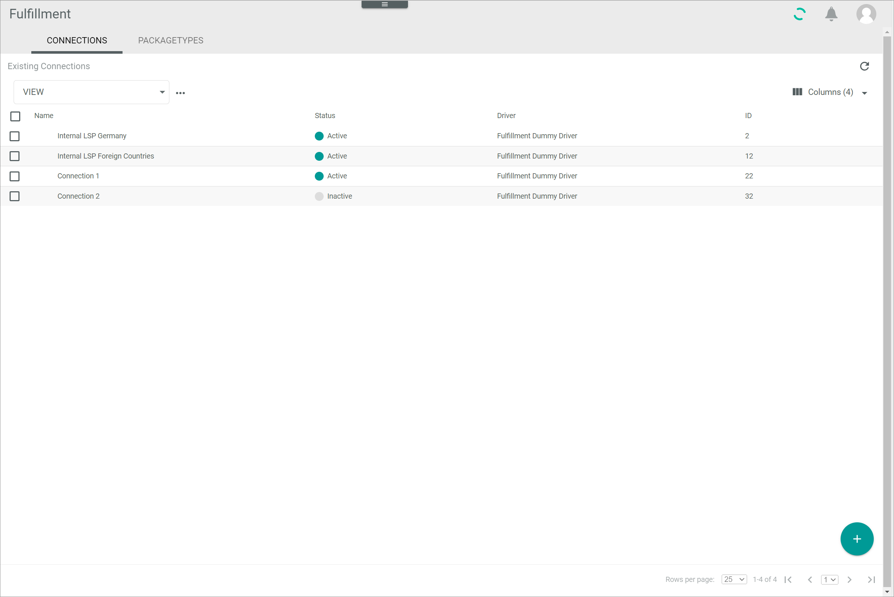
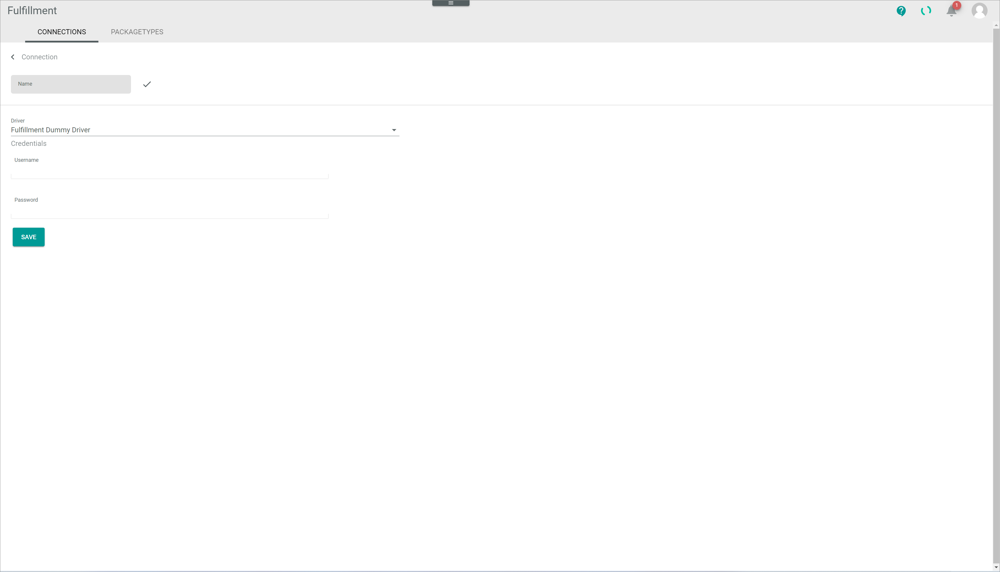

[!!User interface Connections](../UserInterface/03a_Connections.md)

# Manage the connections

Establish connections via drivers to connect your fulfillers' system with the *Actindo Core1 Platform*. 

In the following, the general settings to create, edit, enable and disable connections are described. For certain connection drivers, you have to setup special configurations. Therefore, the *Fiege* connection is described separately, see [Fiege connection](../../FiegeIntegration/Overview/01_General.md).

## Create a connection

Create a connection to a certain fulfiller. As soon as a connection has been established, an initial synchronization will be triggered, which will transfer the entire data model of the connected fulfiller mirrored to Actindo. This means that all attributes and attribute sets from the fulfiller are also transferred to Actindo and can be accessed in the *DataHub* module. Depending on the fulfiller to be connected, special configurations may be necessary.

#### Prerequisites

At least one driver has been installed.

#### Procedure

*Fulfillment > Settings > Tab CONNECTIONS*

1. Click the  (Add) button in the bottom right corner.   
    The *Create connection* view is displayed.

    

2. Enter a name for the connection in the *Name* field.

3. Click the *Driver* drop-down list and select the desired driver. All available drivers are displayed in the list.   

    > [Info] Drivers must be purchased from the main account and then be installed separately in each sandbox or account where you want to use it.   

    The *Credentials* section is displayed below the drop-down list.

    

    > [Info] Depending on the selected driver, the fields in the *Credentials* section differ.

4. Enter the required data in the fields in the *Credentials* section.

5. Click the [SAVE] button.   
    The connection will be established. The *Checking credentials...* notice is displayed. After a few seconds, the *Loading data...* notice is displayed.

    

    The *Create connection* view is automatically closed when the connection has been established. The *Edit connection* view of the newly created connection is displayed. The *Settings* tab is selected.

    

    > [Info] By default, all connections that have been established are inactive and therefore must be enabled after the connection configuration, see [Enable a connection](#enable-a-connection).

## Edit a connection

Edit a connection to adjust any changed credentials, the connection name or further settings. The driver selection is read-only and cannot be edited.

#### Prerequisites

At least one connection has been created, see [Create a connection](#create-a-connection).

#### Procedure

*Fulfillment > Settings > Tab CONNECTIONS*

1. Click the connection you want to edit in the list of connections.   
    The *Edit connection* view is displayed.

    > [Info] Depending on the driver of the connection, the *Credentials* and the *Settings* tab are displayed in the *Edit connection* view.

    

2. Edit the desired data of the connection in the corresponding fields in the *Credentials* tab.

3. If necessary, click the *Settings* tab and edit the desired settings of the connection in the corresponding fields.

4. Click the [SAVE] button.   
    The *Checking credentials...* notice is displayed.

    

    The *Edit connection* view is automatically closed when the changes have been saved. The *Connections* view is displayed again.

## Enable a connection

A connection can only be used if it is active. Otherwise, no data is being synchronized via the connection. By default, all connections that have been established are inactive and therefore must be enabled. If a connection has been disabled, it can be enabled again. It is possible to enable several connections at a time.

#### Prerequisites

- At least one connection has been established, see [Create a connection](#create-a-connection).
- At least one connection is inactive, see [Disable a connection](#disable-a-connection).

#### Procedure

*Fulfillment > Settings > Tab CONNECTIONS*

1. Select the checkbox of the connection you want to enable in the list of connections.   
    The editing toolbar is displayed above the list of connections.

2. Click the [ENABLE] button in the editing toolbar.   
    The connection has been activated.

3. If necessary, click the  (Refresh) button to update the list of connections.   
    The status of the enabled connection in the *Status* column has switched to **Active**.

## Disable a connection

Once a connection has been established, it cannot be deleted because of active dispatch notes and potential dependencies, such as warehouse associations. Nevertheless, the connection can be disabled if it is no longer used. It is possible to disable several active connections at a time.

#### Prerequisites

- At least one connection has been established, see [Create a connection](#create-a-connection).
- At least one connection is active, see [Enable a connection](#enable-a-connection).

#### Procedure

*Fulfillment > Settings > Tab CONNECTIONS*

1. Select the checkbox of the connection you want to disable in the list of connections.   
    The editing toolbar is displayed above the list of connections.

2. Click the [DISABLE] button in the editing toolbar.   
    The connection has been deactivated.

3. Click the  (Refresh) button to update the list of connections.   
    The status of the disabled connection in the *Status* column has switched to **Inactive**.

