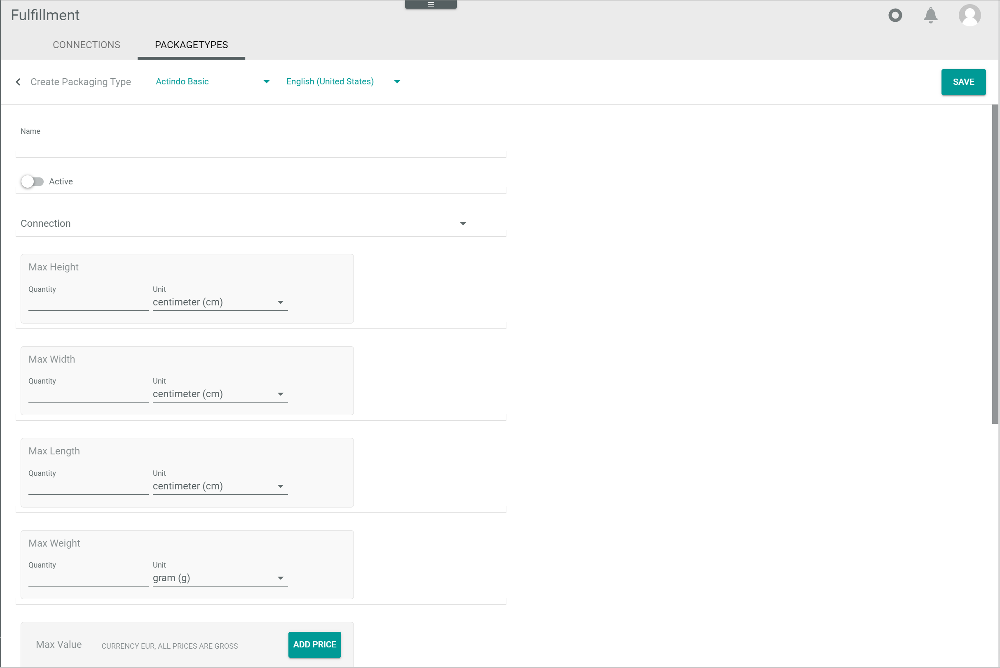
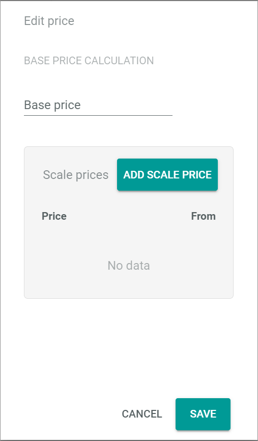

[!!User Interface Package types](../UserInterface/03b_PackageTypes.md)

# Manage the package types

Package types serve as a suggestion for the fulfiller on the type of packaging and the preferred carrier that may apply for a shipment. Package types can be defined using many different criteria. All relevant fields (attributes) used are mapped via ETL from the relevant business document.  

The package types suggested may not be applicable for all users, for instance, in the case of non-physical shipments or if the fulfiller has defined his own package types.

## Create a package type

Create a package type to define the criteria applicable to a shipment.

#### Prerequisites

No prerequisite to fulfill. 

#### Procedure

*Fulfillment > Settings > Tab PACKAGE TYPES*

1. Click the  (Add) button in the bottom right corner.   
  The *Create package type* view is displayed.

    > [Info] The fields displayed depend on the mapping selected and therefore there may be differences to the ones described below.

    

2. Enter a name for the connection in the *Name* field.  
    
3. Enter the maximal dimensions allowed for the package type:
    - In the *Max height* box, enter the maximal value in the *Quantity* field and click the *Unit* drop-down list to select the applicable unit.  
    - In the *Max width* box, enter the maximal value in the *Quantity* field and click the *Unit* drop-down list to select the applicable unit.  
    - In the *Max length* box, enter the maximal value in the *Quantity* field and click the *Unit* drop-down list to select the applicable unit.  
    - In the *Max weight* box, enter the maximal value in the *Quantity* field and click the *Unit* drop-down list to select the applicable unit.  
   
4. Enter the maximal monetary value for the items contained in the package type in the *Max value* box. To do so, follow the instructions below:
    - Click the [ADD PRICE] button.  
        The *Edit price* window is displayed. 

        

    - Enter the item price in the *Base price* field.

    - If desired, scale prices can be added. Click the [ADD SCALE PRICE] button.  
        The *Edit scale price* window is displayed.  

        

    - Enter the scale price in the *Price* field and applicable number of units in the *From* field. Repeat this step to add further scale prices.

    - Click the [SAVE] button at the bottom of the window.  
        The *Edit scale price* window is closed. The scale prices are displayed in the *Scale prices* box in the *Edit price* window. 

    - Click the [SAVE] button at the bottom of the window.  
        The *Edit price* window is closed. The entered prices are displayed in the *Max value* box.

[comment]: <> (Check ob alles default, also ob Beschreibung nötig; evtl. Verweis auf Attributes in DataHub?)

5. Enter the carrier identifier in the *Carrier* field. Both letters and numbers can be entered.

6. Enable the *Express* toggle if express delivery applies for the shipment.  

7. Enter the applicable package type identifier in the *Package type identifier* field.

8. Click the *Ship-to country* drop-down list and select the country where the shipment is to be sent to.

9. Enter the applicable priority value in the *Priority* field.  
    > [Info] The priority value is used by the system to determine the package type to be used for a shipment when two or more package types have the same criteria. The priority value becomes then the decisive criterion. In the priority scale, the lower the number the higher the priority, that is, priority 1 is higher than priority 4.

10. Enter the applicable number in the *Additional services (shipping method)* field.

11. Click the *Connection* drop-down list and select the applicable connection for the shipment.

[comment]: <> (Info fehlt zu Carrier, Package type identifier and Additional services, s. Questions in One Note)

12. Click the [SAVE] button in the upper right corner.  
    The *Submitting data...* notice is displayed while saving and then the *Creation successful* pop-up window. 

     

     The *Create package type* view is closed and the *List of package types* is displayed again.

13. If necessary, click the  (Refresh) button in the upper right corner to display the changes in the list.   
  

### Edit a package type

Edit a package type to update any set criteria.

#### Prerequisites

A package type has been created, see [Create a package type](#create-a-package-type).

#### Procedure

*Fulfillment > Settings > Tab PACKAGE TYPES*

1. Click the package type to be edited. Alternatively, click the checkbox of the package type to be edited and the [EDIT] button in the editing toolbar.  
    The *Edit package type* view is displayed.

2. Edit the desired criteria of the package type in the corresponding fields.

3. Click the [SAVE] button.   
  The *Submitting data...* notice is displayed while saving and then the *Update successful* pop-up window. 

    

    The *Edit package type* view is closed and the *List of package types* is displayed again.

4. If necessary, click the  (Refresh) button in the upper right corner to display the changes in the list.   
  

### Delete a package type

Delete a package type that is no longer applicable. It is also possible to deactivate a package type temporarily, see [Deactivate a package type](#deactivate-a-package-type).

#### Prerequisites

A package type has been created, see [Create a package type](#create-a-package-type).

#### Procedure

*Fulfillment > Settings > Tab PACKAGE TYPES*

1. Click the checkbox of the package type to be deleted.  
    The editing toolbar is displayed.

2. Click the [DELETE] button.  
    The selected package type is deleted and removed from the list of package types.

[comment]: <> (Keine Notice displayed? Alte Version 1.1.X)

### Activate a package type

Delete a package type that is no longer applicable.

#### Prerequisites

A package type has been created, see [Create a package type](#create-a-package-type).

#### Procedure

*Fulfillment > Settings > Tab PACKAGE TYPES*

.

#### Procedure

*Fulfillment > Settings > Tab PACKAGE TYPES*

![Package types](../../Assets/Screenshots/Fulfillment/Settings/PackageTypes/ListPackageTypes.png "[Package types]

