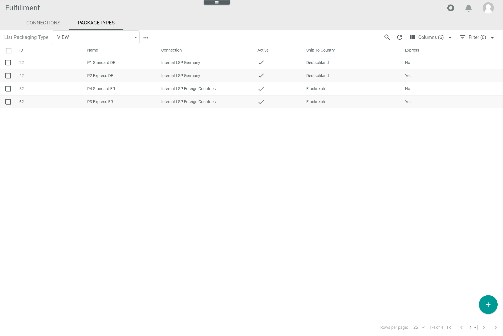
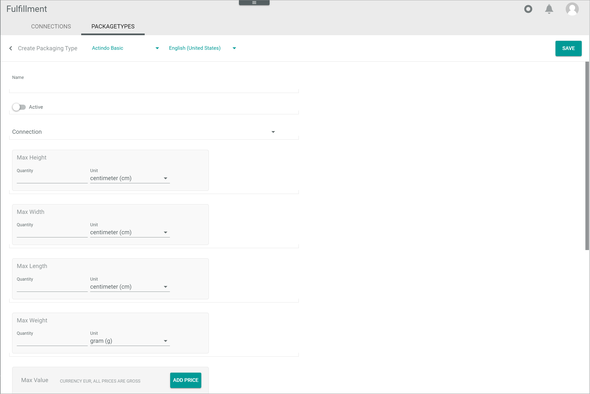
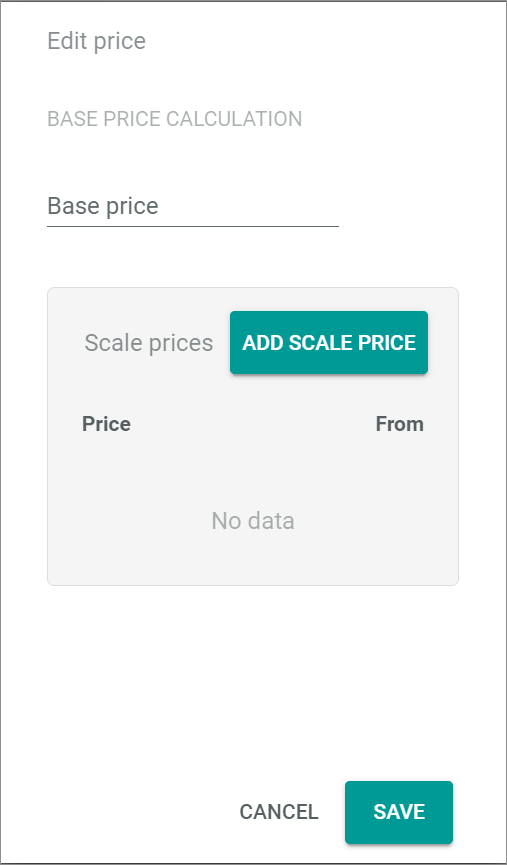
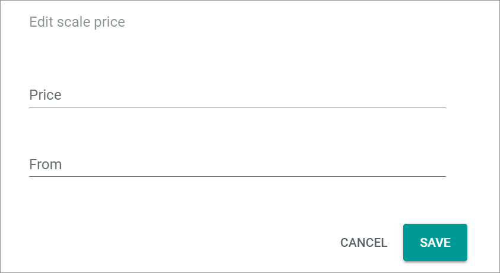
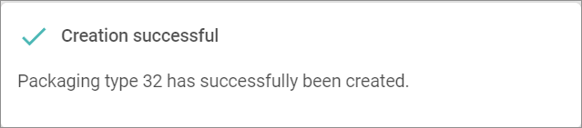
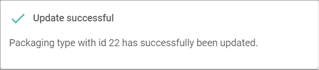

[!!User Interface Packaging types](../UserInterface/03b_PackagingTypes.md)
[!!Manage connections](./01_ManageConnections.md)

# Manage the packaging types

Packaging types serve as a suggestion for the fulfiller on the type of packaging and the preferred carrier that may apply for a shipment. Packaging types can be defined using many different criteria. All relevant fields (attributes) used are mapped via ETL from the relevant business document depending on the fulfiller's driver.  

## Create a packaging type

Create a packaging type to define the criteria applicable to a shipment.

#### Prerequisites

A connection has been established, see [Create a connection](./01_ManageConnections.md#create-a-connection).

#### Procedure

*Fulfillment > Settings > Tab PACKAGING TYPES*

1. Click the  (Add) button in the bottom right corner.   
  The *Create packaging type* view is displayed.

    > [Info] The fields (attributes) displayed depend on fulfiller's driver and, therefore, there may be differences to the ones described below.

    

[comment]: <> (Actindo Basic Channel soll rausfliegen, da von Fulfillment nicht verwendet. Neues Screenshot notwendig.)

2. Enter a name for the connection in the *Name* field. 

3. If necessary, click the *Language* drop-down list and select a different language. By default, the language selected in the platform settings (user interface language) is preselected.
  
    > [Info] Additional languages can be added in the *DataHub* module, see [Create a language](../../DataHub/Integration/05_ManageLanguages.md#create-a-language).

4. Enable the *Active* toggle to set the packaging type directly after creation to active. By default, this toggle is disabled.  
    > [Info] The packaging type must be activated to be automatically selected by the system.

5. Click the *Connection* drop-down list and select the applicable connection. All available connections are displayed in the list.
    
6. Enter the maximal dimensions allowed for the packaging type:
    - In the *Max height* box, enter the maximal value in the *Quantity* field and click the *Unit* drop-down list to select the applicable unit.  
    - In the *Max width* box, enter the maximal value in the *Quantity* field and click the *Unit* drop-down list to select the applicable unit.  
    - In the *Max length* box, enter the maximal value in the *Quantity* field and click the *Unit* drop-down list to select the applicable unit.  
    - In the *Max weight* box, enter the maximal value in the *Quantity* field and click the *Unit* drop-down list to select the applicable unit.  
   
7. Enter the maximal monetary value for the items contained in the packaging type in the *Max value* box. To do so, follow the instructions below:
    - Click the [ADD PRICE] button.  
        The *Edit price* window is displayed. 

        

    - Enter the item price in the *Base price* field.

    - If desired, click the [ADD SCALE PRICE] button to add scale prices.  
        The *Edit scale price* window is displayed.  

        

    - Enter the scale price in the *Price* field and the applicable number of units in the *From* field. 

    - Click the [SAVE] button at the bottom of the *Edit scale price* window.  
        The *Edit scale price* window is closed. The scale prices are displayed in the *Scale prices* box in the *Edit price* window. Repeat this process to add further scale prices.

    - Click the [SAVE] button at the bottom of the *Edit price* window.  
        The *Edit price* window is closed. The entered prices are displayed in the *Max value* box.

8. Enter the carrier identifier in the *Carrier* field. Both letters and numbers can be entered.

9. Enable the *Express* toggle if express delivery applies for the shipment. For standard delivery, leave the toggle disabled. By default, this toggle is disabled.

10. Enter the applicable packaging type identifier in the *Packaging type identifier* field. Both letters and numbers can be entered.

11. Click the *Ship-to country* drop-down list and select the country where the shipment is to be sent to.

12. Enter the applicable priority value in the *Priority* field. This field is mandatory.
    > [Info] The priority value is used by the system to determine the packaging type to be used for a shipment when the criteria of two or more packaging types match. The priority value becomes then the decisive criterion. In the priority scale, the lower the number, the higher the priority, that is, priority 1 is higher than priority 4.

13. Enter the applicable information in the *Additional services (shipping method)* field. Both letters and numbers can be entered.

14. Click the [SAVE] button in the upper right corner.  
    The *Submitting data...* notice is displayed while saving and then the *Creation successful* pop-up window. 

     

     The *Create packaging type* view is closed and the *List of packaging types* is displayed again.

15. If necessary, click the  (Refresh) button in the upper right corner to display the new packaging type in the list.   
  

## Edit a packaging type

Edit a packaging type to update any set criteria.

#### Prerequisites

A packaging type has been created, see [Create a packaging type](#create-a-packaging-type).

#### Procedure

*Fulfillment > Settings > Tab PACKAGING TYPES*

1. Click the packaging type to be edited. Alternatively, click the checkbox of the packaging type to be edited and the [EDIT] button in the editing toolbar.  
    The *Edit packaging type* view is displayed.

2. Edit the desired criteria of the packaging type in the corresponding fields.

3. Click the [SAVE] button.   
  The *Submitting data...* notice is displayed while saving and then the *Update successful* pop-up window. 

    

    The *Edit packaging type* view is closed and the *List of packaging types* is displayed again.

4. If necessary, click the  (Refresh) button in the upper right corner to display the changes in the list.   
  

## Delete a packaging type

Delete a packaging type that is no longer applicable. To avoid potential issues with existing shipments, it is highly recommended to deactivate a packaging type temporarily instead of deleting it permanently, see [Deactivate a packaging type](#deactivate-a-packaging-type).

#### Prerequisites

A packaging type has been created, see [Create a packaging type](#create-a-packaging-type).

#### Procedure

*Fulfillment > Settings > Tab PACKAGING TYPES*

1. Click the checkbox of the packaging type to be deleted.  
    The editing toolbar is displayed.

    > [Caution] Deleting will permanently remove the selected data. The deletion cannot be undone and the deleted data cannot be restored. Problems may occur due to unresolved dependencies. 

2. Click the [DELETE] button.  
    The selected packaging type is deleted and removed from the list of packaging types.
 

## Deactivate a packaging type

Under certain circumstances, it may be necessary to deactivate a packaging type temporarily, so that it can not be selected automatically by the system. 

#### Prerequisites

A packaging type has been created, see [Create a packaging type](#create-a-packaging-type).

#### Procedure

*Fulfillment > Settings > Tab PACKAGING TYPES*

1. Click the packaging type to be deactivated. Alternatively, click the checkbox of the packaging type to be deactivated and the [EDIT] button in the editing toolbar.  
    The *Edit packaging type* view is displayed.

2. Disable the *Active* toggle.

3. Click the [SAVE] button.   
  The *Submitting data...* notice is displayed while saving and then the *Update successful* pop-up window. 

    

    The *Edit packaging type* view is closed and the *List of packaging types* is displayed again.

4. If necessary, click the  (Refresh) button in the upper right corner to display the changes in the list.   

[comment]: <> (Stand 13.02.23: Inaktive Packaging types werden nicht angezeigt. Bug gemeldet)

  
## Activate a packaging type

A packaging type that has been temporarily deactivated may be easily reactivated when it is needed again.

#### Prerequisites

A packaging type has been deactivated, see [Deactivate a packaging type](#deactivate-a-packaging-type).

#### Procedure

*Fulfillment > Settings > Tab PACKAGING TYPES*

1. Click the packaging type to be activated. Alternatively, click the checkbox of the packaging type to be edited and the [EDIT] button in the editing toolbar.  
    The *Edit packaging type* view is displayed.

2. Enable the *Active* toggle.

3. Click the [SAVE] button.   
  The *Submitting data...* notice is displayed while saving and then the *Update successful* pop-up window. 

    

    The *Edit packaging type* view is closed and the *List of packaging types* is displayed again.

4. If necessary, click the  (Refresh) button in the upper right corner to display the changes in the list.   

[comment]: <> (Status 13.02.23: Bug beim Erstellen a packaging type. Es muss immer auf Active gesetzt werden, sonst wird es in der Liste nicht angezeigt. Das Problem liegt am Filter. Wenn nach Inactive gefiltert, sieht man die inaktive packaging types. Man kann aber nicht gleichzeitig beide sehen.)