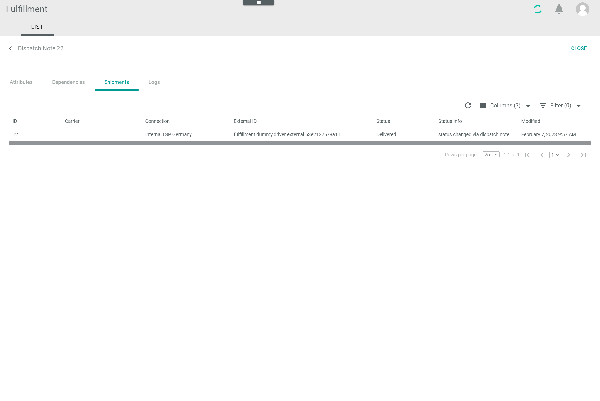
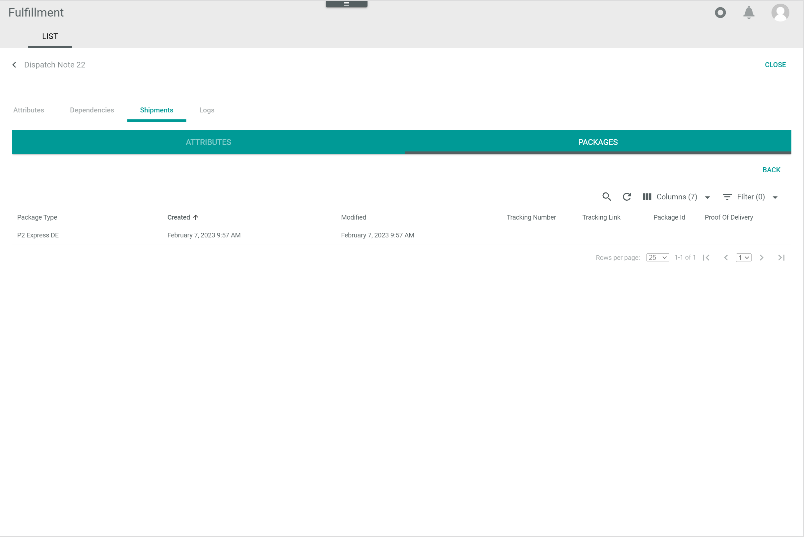

[!!User Interface Dispatch notes](../UserInterface/01a_List.md)

# Manage the dispatch notes

Dispatch notes are shipment requests generated by the system when a delivery note has been issued in the *Order management* module. The dispatch note is than sent to the order fulfiller, who will in turn arrange the shipment.

The communication between the *Actindo Core1 Platform* and the fulfiller's internal system takes place via a connection driver. The *Actindo Core1 Platform* sends the fulfiller the information they need based on the information provided in the delivery note, which has been previously mapped via the ETL function in the *DataHub* module. The fulfiller, on the other hand, sends back a confirmation message to update the shipment status accordingly during all stages of the fulfillment process.   

## Check a dispatch note

The dispatch note provides numerous data about the order, which may vary depending on the connection settings. Some of the details that can be checked are explained in detail below:

  - Dispatch note status, see [Check dispatch note status](#check-dispatch-note-status)
  - Shipment status, see [Check shipment status](#check-shipment-status)
  - Shipment details, see [Check shipment details](#check-shipment-details)

Besides, the following general details can be checked in the Dispatch notes list:
- Document number, which equals the delivery note number in the *Order management* module
- Shipping type
- Carrier
- Receiver details (name and zip code)

#### Prerequisites

- A connection has been created, see [Create a connection](01_ManageConnections.md#create-a-connection).
- A delivery note has been issued in the *Order management* module and, therefore, a dispatch note has been generated.

#### Procedure

*Fulfillment > Dispatch notes > Tab LIST*

1. Check the Document number -> Order management module -> necessary/useful?

2. Dispatch note status: The dispatch note status displays the current stage in the fufillment process.
  - EXPORT -> if it has not been received, it is possible to click on EXPORT button to resend it to the fulfiller, e.g. (Dispatch note) Status **Error** - Shipment status x (dispatch note has not shipments yet)
  - FORCE COMPLETION -> if shipment status has not been updated by fulfiller, it is possible to click on FORCE COMPLETION to confirm dispatch note as complete, so that no subsequent processes remain waiting/stuck

3. Shipment status: the shipment status is displayed with an icon. Meanings:

4. Receiver details (name and zip code) - necessary/useful?

### Check dispatch note status

#### Prerequisites

#### Procedure

-> Link auf Force completion

-> Link auf Export

### Check shipment status

#### Prerequisites

#### Procedure

### Check the shipment details

Once the shipment has been arranged by the fulfiller, the shipment status is updated. The information provided by the fulfiller, such as tracking number or tracking link, can be checked.  

#### Prerequisites

- The dispatch note status is *Partner confirmed receival* or *Dispatch note completed*.

#### Procedure

*Fulfillment > Dispatch notes > Tab LIST*

1. Click the dispatch note related to the shipment you want to check. Alternatively, you can click the checkbox of the dispatch note to be checked and click the [VIEW] button in the editing toolbar.  
  The *Dispatch note ID* view is displayed. The *ATTRIBUTES* tab is by default preselected.

  

2. Select the *Shipments* tab.  
  All shipments included in the dispatch note are displayed.

  

3. Click the shipment to be checked.  
   The *Shipment ID* view is displayed. The *ATTRIBUTES* sub-tab is per default preselected.

   

4. Select the *PACKAGES* sub-tab.
  The package(s) included in the shipment, together with any additional information provided by the fulfiller, such as tracking number or tracking link, is displayed.

  

## Complete a dispatch note

Occasionally, the message sent by the fulfiller to confirm delivery may fail or may not be received. In this case, the dispatch note status will stay as **Partner confirmed receival**. To prevent subsequent processes from staying stuck/waiting for the complete status, the dispatch note status can be updated manually if necessary.

[comment]: <> (Unsicher von Ausgangssituation. Macht das so Sinn? Vielleicht Fehler festgestellt in Workflows? Wie weiß ich sonst, welche Dispatch note status nicht aktualisiert worden ist? Ich muss erst in Shipments prüfen...)

#### Prerequisites

- The shipment has been delivered.
- The dispatch note status is **Partner confirmed receival**.

#### Procedure

*Fulfillment > Dispatch notes > Tab LIST*

1. Click the dispatch note whose status has not been updated.
  The *Dispatch note ID* view is displayed.

2. Click the *Shipments* tab.  
  All shipments included in the dispatch note are displayed.

3. Check the shipment status (?)
  - If delivered, ...
  - If other than delivered, ...

[comment]: <> (Ist es überhaupt möglich/nötig? Wäre der Shipment status in der Dispatch notes nicht aktualisiert? Wie kann das passieren? Kommt ein Fehler von Workflows o.ä.?)

4. Click the checkbox of the dispatch note to be completed.
  The editing toolbar is displayed.

5. Click the [FORCE COMPLETION] button.  
  The message ... is displayed.

6.

## Cancel a dispatch note

[comment]: <> (Check, ob überhaupt verfügbar in neuer Version. Wenn ja, testen bzw. Stefan nach Funktion fragen)

#### Prerequisites

#### Procedure

*Fulfillment > Dispatch notes > Tab LIST*

## Export a dispatch note

You can resend a dispatch note to the fulfiller if it has not been received for some reason.

#### Prerequisites

- A dispatch note has been generated.
- The dispatch note status is **Transferred to partner**.
- The shipment status is  (Cross), that is, no shipment has been arranged yet.

[comment]: <> (Stimmt das so?)

#### Procedure

*Fulfillment > Dispatch notes > Tab LIST*

1.
