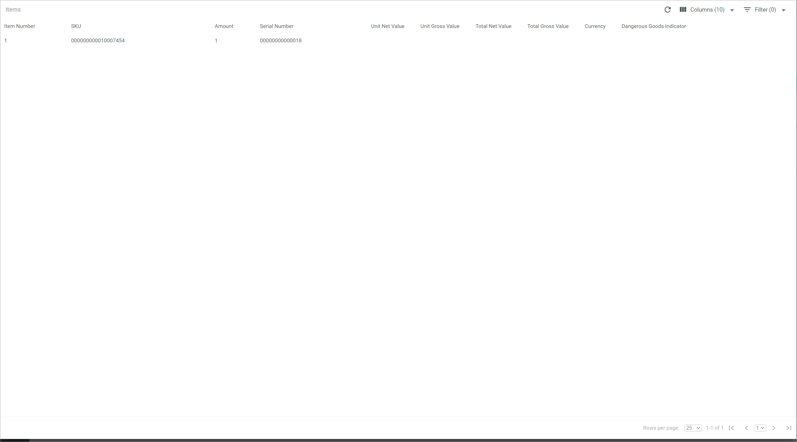

[!!Manage the dispatch notes](../Operation/01_ManageDispatchNotes.md)
[!!User interface List](../UserInterface/01a_List.md)

# Check a shipment

Once a dispatch note has been received, the fulfiller sends back a notification at every stage of the fulfillment process. The shipment status is updated accordingly in the *Actindo Core1 Platform*. All shipment-related details provided by the fulfiller, such as tracking number or tracking link, can be checked in the *Actindo Core1 Platform*.  

## Check the shipment status

The shipment status can be checked in the list of dispatch notes. Even though the dispatch note status and the shipment status are related, they are updated independently from each other.

#### Prerequisites

A dispatch note has been created. 

#### Procedure

*Fulfillment > Dispatch notes > Tab LIST*

Check the shipment status in the *Shipment status* column. The following options are available:
-  (No shipment)   
    No shipment has been arranged yet.  
-  (In progress)   
    The shipment is in progress. For more information on the specific stage of the shipment process, see [Check the shipment details](#check-the-shipment-details). 
-  (Delivered)    
    The shipment has been delivered.
-  (Error)    
    The shipment has failed. A shipment is faulty only if the fulfiller reports an error due to a number of reasons. For detailed information, see [Handle an error status](../Troubleshooting/01_HandleErrorStatus.md). 
- Empty  
    No information on the shipment status has been received from the fulfiller.

## Check the shipment details

The shipment details provided by the fulfiller can be accessed from the list of dispatch notes. 

#### Prerequisites

The shipment status is at least  (In progress) in the list of dispatch notes, see [Check the shipment status](#check-the-shipment-status).

#### Procedure

*Fulfillment > Dispatch notes > Tab LIST*

1. Click the dispatch note that contains the shipment you want to check.   
    The *Dispatch note "Dispatch note ID"* view is displayed. The *Attributes* tab is preselected by default.

    

2. Select the *Shipments* tab.  
    All shipments included in the dispatch note are displayed.

    

3. Click the shipment to be checked.  
    The *Shipment "Shipment ID"* view is displayed. The *ATTRIBUTES* sub-tab is preselected by default.

    

4. Select the *PACKAGES* sub-tab.  
    The package(s) included in the shipment are displayed. 

    

5. If desired, check the following shipment-related details:   
    + Check the shipment tracking number in the *Tracking number* column.

    + Check the URL for tracking in the *Tracking link* column.  

    > [Info] The fields displayed vary depending on the fulfiller's driver.  
    
6. Click a package to display the individual items contained.  
    The *Items* window is displayed.  
  
   

7. If desired, check the following item-related details: 
    + Check the item SKU number in the *SKU* column.  The SKU can be useful to locate a product in the *PIM* module and check its inventory in the *Warehousing* module.

    + Check the amount of an item contained in the package in the *Amount* column.

    + Check the item serial number in the *Serial number* column if available.

    > [Info] The fields displayed vary depending on the fulfiller's driver.  

8. Press the **Esc** key.  
  The *Item* window is closed and the *PACKAGES* tab is displayed again.

[comment]: <> (Kein CLOSE oder CANCEL button in Items Fenster. Bug gemeldet -> BUG-58)

9.  Click the [BACK] button in the upper right corner of the *PACKAGES* sub-tab.   
    The *Shipments* tab is displayed again.

    > [Info] If necessary, repeat the steps **4** to **7** to check other packages contained in the shipment. 

10. Click the [CLOSE] button in the upper right corner of the *Dispatch note "Dispatch note ID"* view.  
    The *Dispatch note "Dispatch note ID"* view is closed. The list of dispatch notes is displayed again.
