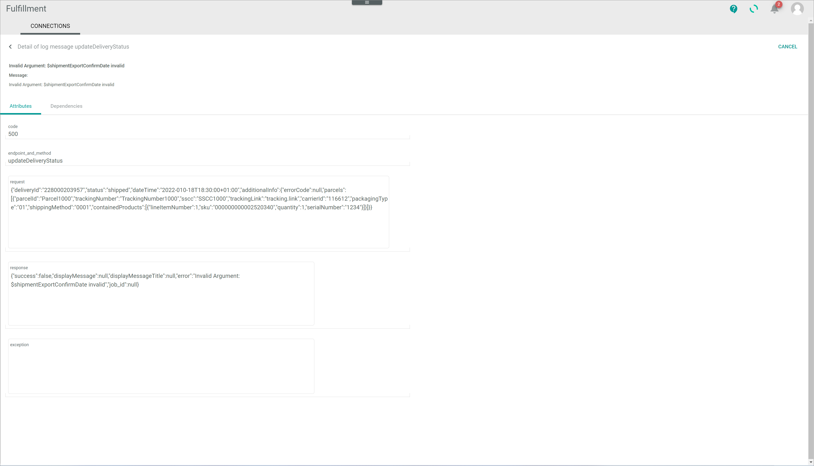

[!!Manage the dispatch notes](../Operation/01_ManageDispatchNotes.md)  

# Check an error status

The *Fulfillment* module manages the communication between the *Actindo Core1 Platform* and the fulfillment partner(s). In the course of this communication, an error may occur. When this happens, a dispatch note or its related shipment(s) may display an error status.

An error status may be set for many different reasons and strongly depends on the connection and the fulfiller's own internal processes. A dispatch note usually displays an error status if the data export from the *Actindo Core1 Platform* to the partner's system has failed. A shipment, on the other hand, may display an error status if the fulfiller has reported an error, for instance because the shipment could not be arranged, but also if no feedback from fulfiller has been received.

You can check the dispatch note log information to find out the error cause and take any necessary further action.

#### Prerequisites

At least one dispatch note displays an error.

#### Procedure

*Fulfillment > Dispatch notes > Tab LIST*

1. Click the dispatch note displaying an error in the *Status* or the *Shipment status* column.  
    The *Dispatch note "Dispatch note ID"* view is displayed. 

2. Click the *Logs* sub-tab.   
    The *List of intents* view is displayed in the *Logs* sub-tab.

    

3. Click the desired intent from the list to access further information.  
    The *List of messages* view is displayed in the *Logs* sub-tab.  

    

4. Click the desired message for further information.    
    The *Detail of log message "Log message title"* is displayed. By default, the *Attributes* tab is preselected.

    

[comment]: <> (Aus Logging genommen, passt nicht genau mit dem Fehler oben; ich kann den auch nicht reproduzieren. Screenshot hier weglassen?)

5. Check the details of the log message in the *Attributes* tab. 

    > [Info] Depending on the error cause, it may be necessary to take action in one or more additional modules or even to contact the fulfillment partner.

