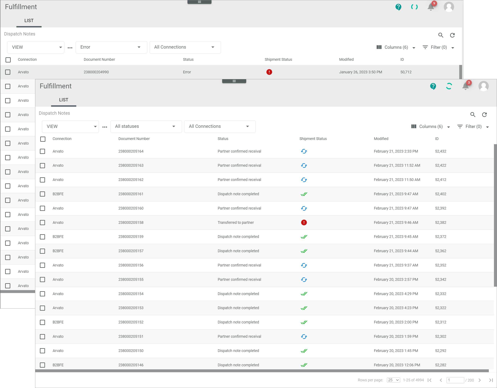
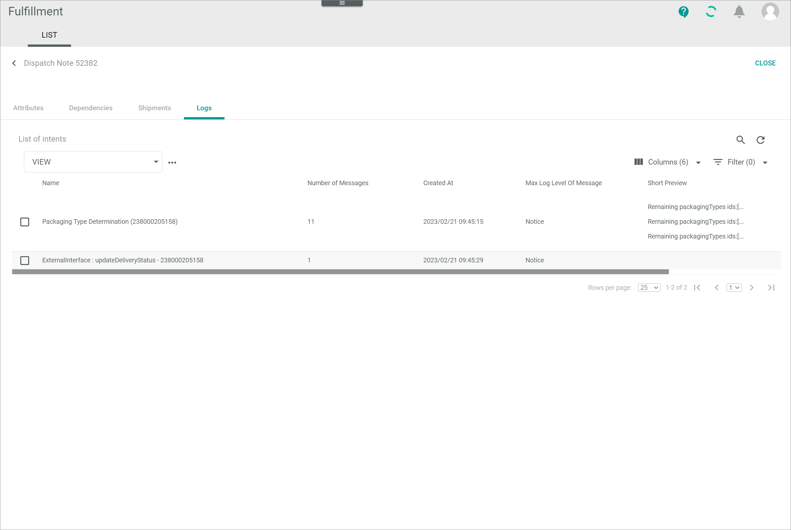
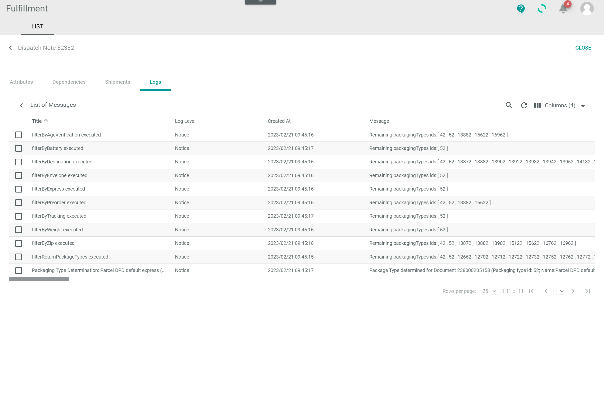
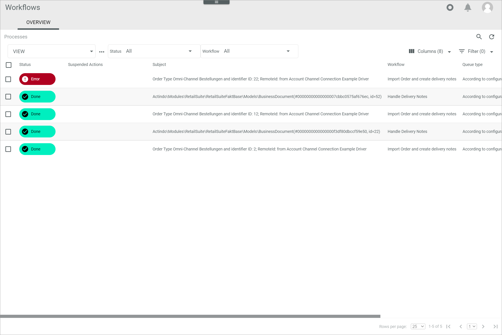
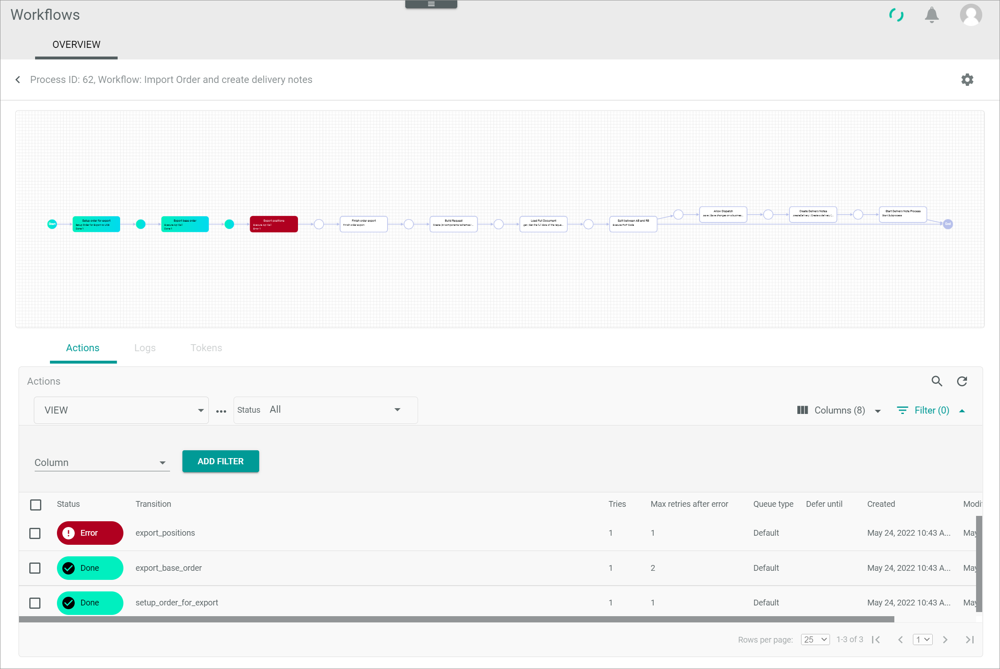

[!!Manage the dispatch notes](../Operation/01_ManageDispatchNotes.md) 
[!!Retry a process action in Workflows](../../ActindoWorkFlow/Troubleshooting/01_RetryProcessAction.md) 

# Handle an error status

The *Fulfillment* module manages the communication between the *Actindo Core1 Platform* and the fulfillment partner(s). In the course of this communication, an error may occur. When this happens, a dispatch note or its related shipment may display an error status.

An error status may be set for many different reasons and strongly depends on the connection and the fulfiller's own internal processes. A dispatch note usually displays an error status if the data export from the *Actindo Core1 Platform* to the partner's system has failed. A shipment, on the other hand, may display an error status if the fulfiller has reported an error, for instance because the shipment could not be arranged, but also if no feedback from fulfiller has been received.

The errors are notified via the  (Notifications) button in the upper right corner as they occur. 

#### Error Description

The *Status* or the *Shipment status* column in the list of dispatch notes displays an error.

Follow the instructions below to identify the cause of the error and proceed accordingly.

## Check the dispatch note log

Check the dispatch note log for further information about the error.

#### Prerequisites

A dispatch note displays an error.

#### Procedure

*Fulfillment > Dispatch notes > Tab LIST*

1. Click the dispatch note displaying an error in the *Status* or the *Shipment status* column.  
    The *Dispatch note "Dispatch note ID"* view is displayed. 

2. Click the *Logs* sub-tab.   
    The *List of intents* view is displayed in the *Logs* sub-tab.

    

3. Click the desired intent from the list to access further information.  
    The *List of messages* view is displayed in the *Logs* sub-tab.  

    

4. Click the desired message for further information.    
    The *Detail of log message "Log message title"* is displayed.

5. If no further information is detailed or the information displayed is not conclusive, click the [CLOSE] button in the upper right corner to close the current view.  
    The list of dispatch notes is displayed again. 

6. Proceed to check the dispatch note workflow for further information on the error cause, see [Check the workflow](#check-the-workflow). 

### Check the workflow

When a dispatch note displays an error, the corresponding workflow stops at the point where the error has occurred. The Actindo *Workflow* module provides further information on any error, which allows to identify the cause and implement the appropriate solution.

#### Prerequisites

The dispatch note log information provides no conclusive information on the error.

#### Procedure

*Fulfillment > Dispatch notes > Tab LIST*

 

1. Copy the number of the faulty dispatch note in the *Document number* column to your clipboard.

    > [Info] The document number equals the delivery note number in the *Order management* module.

2. Switch to the *Workflows* module and select the *Processes* menu entry.  
    The list of processes is displayed in the *OVERVIEW* tab. 

    

3. Click the  (Search) button, paste the document number from your clipboard in the search field and press the **ENTER** key.   
    The search has been started. The process matching the corresponding dispatch note number is displayed in the list of processes.  

4. Click the process to display further process details.  
    The *Process ID: "Process ID", Workflow: "Workflow name"* view is displayed. 

    
        
    > [Info] The action where the error has ocurred is displayed in red, both in the process diagram as well as in the *Actions* tab.

5. Click the *Logs* tab.  
    The list of logs with all process-related logs is displayed.

     

    > [Info] If necessary, the logs can be filtered by log level.

6. Click the faulty log. 
    The *Log ID "Log ID"* view is displayed.

    

7. Check the log message for further information about the error. 

    > [Info] Depending on the error cause, it may be necessary to take action in one or more additional modules or even to contact the fulfillment partner.  

8. After the error cause has been fixed, the action may be retried, see [Retry a process action](../../ActindoWorkFlow/Troubleshooting/01_RetryProcessAction.md). 

  
#### Was this chapter helpful?

If you need further assistance, please contact your MPS consultant.
