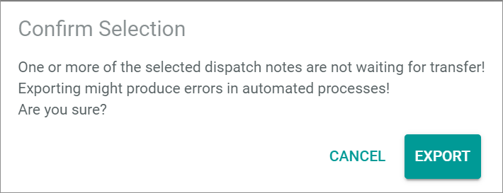

[!!Export a dispatch note](../Operation/01_ManageDispatchNotes.md#export-a-dispatch-note). 

# Handle an error status

The *Fulfillment* module manages the communication between the *Actindo Core1 Platform* and the fulfillment partner(s). Occasionally, a dispatch notes or a shipment may display an error.

## Handle an error status in a dispatch note

#### Error Description

A dispatch note may display an error status when the export has failed.

Follow the instructions below to reexport the dispatch note.

[comment]: <> (Stimmt das so? Export a dispatch note ist aber als standard procedure beschrieben.)

#### Prerequisites

The cause of the failed export has been fixed.

[comment]: <> (Mögliche Ursache in Core1 oder im Zielsystem?)

#### Procedure

*Fulfillment > Dispatch notes > Tab LIST*

1. Select the checkbox of the dispatch note you want to reexport.   
  The editing toolbar is displayed above the list.

2. Click the [EXPORT] button in the editing toolbar.   
    A confirmation window is displayed with the following notice: *One or more of the selected dispatch notes are not waiting for transfer! Exporting might produce errors in automated processes. Are you sure?*.

    
    
[comment]: <> (Check ob Fenster auch bei Error status vorkommt)

3. Click the [EXPORT] button in the confirmation window if you wish to proceed.  
    An additional confirmation notice window is displayed.

    

4. Click the [EXPORT] button if you are sure you want to export the dispatch note again.  
    The dispatch note has been resent to the fulfiller.

## Handle an error status in a shipment

#### Error Description

A shipment may display an error status when the fulfiller reports an error, for instance because the shipment could not be arranged.

Follow the instructions below to reexport the dispatch note.

#### Prerequisites

#### Was this chapter helpful?

If you need further assistance, please contact the Customer Support.
