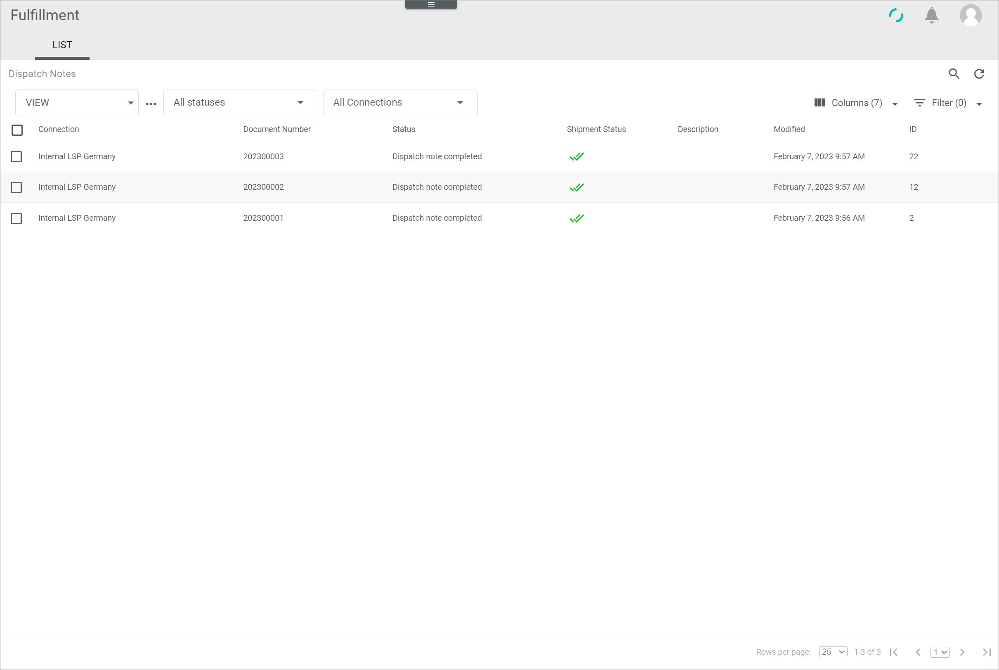

[!!Export a dispatch note](../Operation/01_ManageDispatchNotes.md#export-a-dispatch-note). 

# Handle an error status

The *Fulfillment* module manages the communication between the *Actindo Core1 Platform* and the fulfillment partner(s). Occasionally, a dispatch note or a shipment may display an error.

An error status may be set for many different reasons and strongly depends on the connection and the fulfiller's own internal processes. 

A dispatch note usually displays an error status when the data export from the Core1 to the partner's system has failed. A shipment, on the other hand, may display an error status when the fulfiller has reported an error, for instance because the shipment could not be arranged, but also when no feedback from fulfiller has been received.

In any case, the corresponding workflow stops at the point where the error occurs. The Core1 logs provide detailed information on the error, which allows to identify the cause and find a solution.

#### Error Description

The *Status* or the *Shipment status* columns in the list of dispatch notes display an error.

Follow the instructions below to identify the cause of the error and proceed accordingly.

#### Prerequisites

No prerequisites to fulfill.

#### Procedure

*Fulfillment > Dispatch notes > Tab LIST*

1. Click the dispatch note displaying an error in the *Status* or the *Shipment status* columns.  
    The *Dispatch note "Dispatch note ID"* view is displayed. 

2. Click the *Logs* tab.  
    The list of intents related to the selected dispatch note are displayed.
 
3. If no information is detailed, click the [CLOSE] button to close the current view.  
    The list of dispatch notes is displayed. 

4. Copy the dispatch note number in the *Document number* column to your clipboard.

    > [Note] The document number equals the delivery note number in the *Order management* module.

5. Switch to the *Workflows* module and select the *Processes* menu entry.  
    The list of all processes is displayed. 

6. Paste the document number in the search field and press the **ENTER** key to start the search.  
    The process related to the selected dispatch note number is displayed. 

7. Click the process to display further process details.  
    The *Process ID: "Process ID", Workflow: "Workflow name"* view is displayed. 
    
    > [Info] The action where the error has ocurred is displayed in red, both in the process graph as well as in the list of actions underneath.

8. Click the *Logs* tab to display all process-related logs.  
    The list of logs is displayed.

    > [Info] If necessary, the logs can be filtered by log level.

9. Click the log displaying an error. 
    The *Log ID "Log ID"* view is displayed.

10. Check the text box for further information about the error.

  

#### Was this chapter helpful?

If you need further assistance, please contact the Customer Support.
