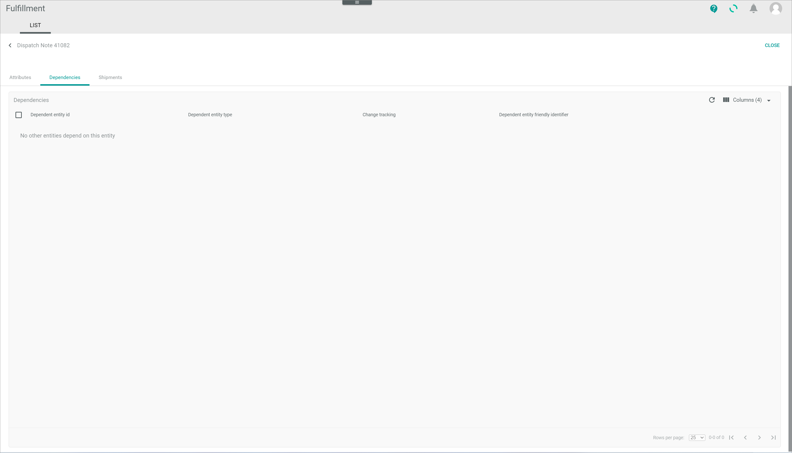

# List

*Fulfillment > Dispatch notes > Tab LIST*

**Dispatch Notes**

- *VIEW*  
  Click the drop-down list to select the view. All created views are displayed in the drop-down list. Click the  (Points) button to the right of the *VIEW* drop-down list to display the context menu and create a view. For detailed information, see [Create view](#create-view).

  -  (Points)      
    Click this button to the right of the *View* drop-down list to display the context menu. The following menu entries are available:

    -  create  
      Click this entry to create a view. The *Create view* window is displayed.

    -  rename  
      Click this entry to rename the selected view. The *Rename view* window is displayed. This menu entry is only displayed if a view has been selected.

    -  reset  
      Click this entry to reset all unsaved changes to the settings of the selected view. This menu entry is only displayed if a view has been selected and any changes have been made to the view settings.

    -  publish  
      Click this entry to publish the view. This menu entry is only displayed if a view has been selected and unpublished.

    -  unpublish  
      Click this entry to unpublish the view. This menu entry is only displayed if a view has been selected and published.

    -  save  
      Click this entry to save the current view settings in the selected view. This menu entry is only displayed if a view has been selected.

      > [Info] When the settings of a view have been changed, an asterisk is displayed next to the view name. The asterisk is hidden as soon as the changes have been saved.

    -  delete  
      Click this entry to delete the selected view. A confirmation window to confirm the deletion is displayed. This menu entry is only displayed if a view has been selected.

[comment]: <> (Reset auch hier verfügbar?)

- Status
  Click the drop-down list and select a dispatch note status. The following options are available:
  - **All statuses**
  Select this option to display all dispatch notes, regardless of their status.
  - **New dispatch note**  
  Select this option to display all new dispatch notes.
  - **Transferred to partner**  
  Select this option to display all dispatch notes that have been transferred to the fulfiller.
  - **Partner confirmed receival**  
  Select this option to display all dispatch notes whose receival has been confirmed by the fulfiller.
  - **Dispatch note completed**  
  Select this option to displays all dispatch notes that have been completed.
  - **Error**  
  Select this option to display all dispatch notes that have given an error.
  - **Void**  
  Select this option to display all void dispatch notes.

- Connections  
  Click the drop-down list and select a connection. The following options are available:
  - *All connections*  
  Select this option to display all configured connections.
  - **Connection name**
  Select this option to display the dispatch notes corresponding to the selected connections.

-  (Search)   
  Click this button to display the search bar and search for dispatch notes.

-  (Refresh)   
  Click this button to update the list of dispatch notes.

-  Columns (x)   
  Click this button to display the columns bar and customize the displayed columns and the order of columns in the list. The *x* indicates the number of columns that are currently displayed in the list.

-  Filter (x)   
  Click this button to display the filter bar and customize the active filters. The *x* indicates the number of filters that are currently active.

- [x]     
  Select the checkbox to display the editing toolbar. If you click the checkbox in the header, all dispatch notes in the list are selected.

- [VIEW]
  Click this button to edit the selected dispatch note. This button is only displayed if the checkbox of a dispatch note is selected. Alternatively, you can click directly a row in the list to view a dispatch note. The *Dispatch note "Number"* view is displayed. The *Attributes* tab is preselected.

[comment]: <> (Alternativ: This button is only displayed if a single checkbox of the list is selected. )  

- [EXPORT]
  Click this button to export manually the dispatch note to the fulfiller. This button is displayed if the checkbox of at least one dispatch note is selected.

  > [Info] The dispatch note is exported automatically by the system. If the export fails for some reason, the dispatch note can be manually reexported. Nevertheless, this is not a standard procedure but a troubleshooting measure. For detailed information, see [Export dispatch note to fulfiller](../Troubleshooting/01_ExportDispatchNoteFulfiller.md).

- [FORCE COMPLETION]  
Click this button to complete the dispatch note.  This button is displayed if the checkbox of at least one dispatch note is selected.

[comment]: <> (Test, mehr Info dazu)

The list displays all dispatch notes. Depending on the settings, the displayed columns may vary. All fields are read-only.

- *Connection*  
  Connection to fulfiller.

- *Document number*  
  Dispatch note number.

- *Status*  
  Dispatch note status. The following statuses are available:
  - *All statuses*
  - *New dispatch note*
  - *Transferred to partner*
  - *Partner confirmed receival*
  - *Dispatch note completed*
  - *Error*
  - *Void*

- *Shipment information*  
  Status of shipment associated with the dispatch note. The following options are available:

[comment]: <> (S. Shipment status -> kundenspezifisch oder Standard. In meinem Sandbox nichts angezeigt in Shipment information.)

- *Carrier*  
  Carrier identification number.

- *Created*  
  Date and time of the creation.

- *Modified*  
  Date and time of the last modification.

- *ID*  
  Dispatch note identification number. The ID number is automatically assigned by the system.

- *Status ID*  
  Dispatch note status identifier. The following options are available:
    - **new**
    - **transferred**
    - **confirmed**
    - **completed**
    - **error**
    - **void**

- *Shipment status*  
  Status of shipment associated with the dispatch note. The following options are available:
  -   
    No shipment yet. The associated dispatch note is new or has just been transferred to the fulfiller.

  - 
    Waiting for shipment/Shipped/New Shipment. The fullfiller has confirmed receival of the dispatch note and the shipment will be arranged shortly.   

  - 
  	Delivered. The shipment has been delivered.

  - 
    Error. The shipment has produced an error.

  - Empty  
    If the shipment status is void, the *Shipment status* is empty.

[comment]: <> (Bedeutung der Shipment status Icons? Gibt es einen direkten Zusammenhang zwischen Dispatch note Status und Shipment Status? RS S. Walke. Shipment status -icons- Standard oder kundenspezifisch/NoE? S. Error in Dispatch note und alle möglichen Shipment Status. Wieso?)

- *Description*  
  Dispatch note description as defined by the user. Numbers, letters or a combination of characters may be used. The information provided in this field can be entered in the search bar to search for a specific dispatch note.

- *Shipping type*  
  Shipping type. The following options are available:  
    - **STND**  
      Standard shipping type.
    - **EXPR**  
      Express shipping type.

  > [Info] The shipping type can be set up in the *PACKAGE TYPES* tab in the *Settings* menu entry, see [Package types](./03b_PackageTypes.md).

- *Shipping method*
  Shipping type identification number. This number is automatically assigned by the system.

- *Receiver name*  
  Shipment receiver name.

- *Receiver zip*  
  Shipment receiver zip code.

- *Package type*  
  Package type identification number. This number is automatically assigned by the system when a the package type is created. An unlimited number of package types can be created, see [Create a package type](../Integration/02_ManagePackageTypes.md#create-a-package-type).

[comment]: <> (Check!)     

[comment]: <> (Abweichungen zwischen meinem Sandbox und NoE Textaccount - Standard vs. kundenspezifisch? RS S. Walke)

## Dispatch note "Number"

### Attributes

*Fulfillment > Dispatch notes > Tab LIST > Select a dispatch note > Tab Attributes*

- *Fulfillment dispatch note base attributes*  
  This folder contains the dispatch note base attributes. No sub-folders can be created.

[comment]: <> (Stimmt das so? Was ist der Zweck von diesem Ordner? Oder einfach ein Icon?)

-   
  Click this button to expand or collapse the left side menu.

**FULFILLMENT DISPATCH NOTE BASE ATTRIBUTES**

- *Receiver name*  
  Shipment receiver name.

- *Receiver zip*  
  Shipment receiver zip code.

- *Package type*  
  Package type identification number.

[comment]: <> (Wo kommen diese Infos her? Fakturierung? Wo eingestellt/edited?)

### Dependencies

*Fulfillment > Dispatch notes > Tab LIST > Select a dispatch note > Tab Attributes*

This tab has no function in the *Fulfillment* module, since dispatch notes have no dependent entities.

- *Dependent entity ID*
- *Dependent entity type*
- *Change tracking*
- *Dependent entity friendly identifier*

[comment]: <> (No function at all? RS SW)

### Shipments

*Fulfillment > Dispatch notes > Tab LIST > Select a dispatch note > Tab Shipments*

**Shipment "Number"**

**Attributes**

ID
Carrier
Connection
External ID
Status
Status info
Modified
Created
Receiver name
Receiver zip
Tracking numbers
Tracking URLs
Proof of delivery
Parcels
Error date
Error message

CLOSE

## Create view

*Fulfillment > Settings > Tab LIST > Button Points > Menu entry create*

- *Name*   
  Enter a name for the view.

- [CANCEL]   
  Click this button to cancel creating a view. The *Create view* window is closed.

- [SAVE]   
  Click this button to save the new view and display it in the *VIEW* drop-down list. The *Create view* window is closed.

## Rename view

*Fulfillment > Settings > Tab LIST > Button Points > Menu entry rename*

- *Name*   
  Click this field to edit the view name.

- [CANCEL]   
  Click this button to cancel renaming the view. The *Rename view* window is closed.

- [SAVE]   
  Click this button to save the changes and display it in the *VIEW* drop-down list. The *Rename view* window is closed.
