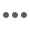
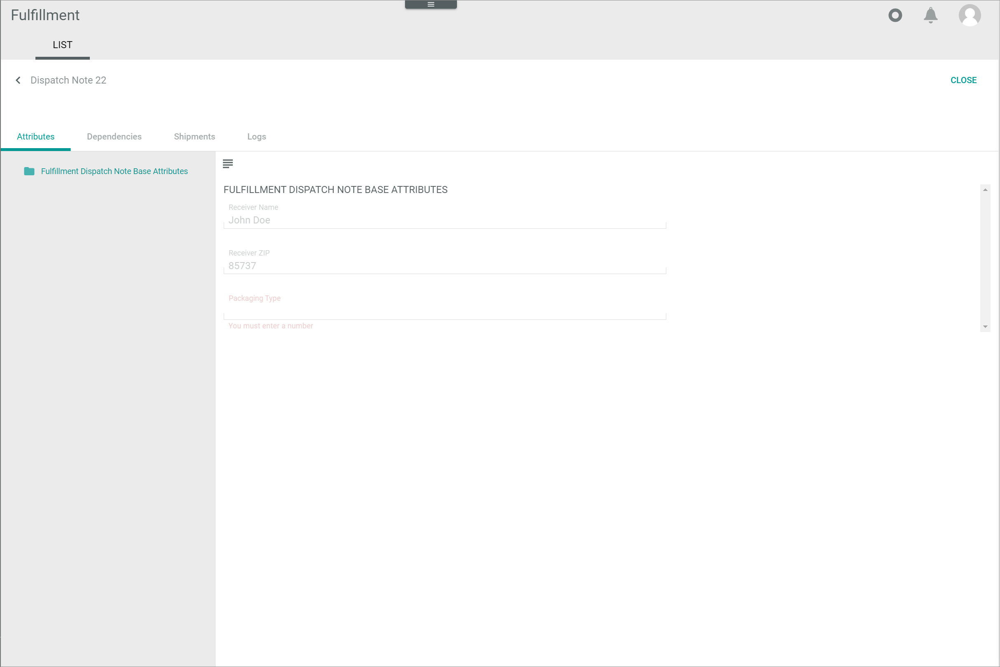

# List

*Fulfillment > Dispatch notes > Tab LIST*

**Dispatch Notes**

- *VIEW*  
  Click the drop-down list to select the view. All created views are displayed in the drop-down list. Click the  (Points) button to the right of the *VIEW* drop-down list to display the context menu and create a view. For detailed information, see [Create view](#create-view).

  -  (Points)      
    Click this button to the right of the *View* drop-down list to display the context menu. The following menu entries are available:

    -  create  
      Click this entry to create a view. The *Create view* window is displayed.

    -  rename  
      Click this entry to rename the selected view. The *Rename view* window is displayed. This menu entry is only displayed if a view has been selected.

    -  reset  
      Click this entry to reset all unsaved changes to the settings of the selected view. This menu entry is only displayed if a view has been selected and any changes have been made to the view settings.

    -  publish  
      Click this entry to publish the view. This menu entry is only displayed if a view has been selected and unpublished.

    -  unpublish  
      Click this entry to unpublish the view. This menu entry is only displayed if a view has been selected and published.

    -  save  
      Click this entry to save the current view settings in the selected view. This menu entry is only displayed if a view has been selected.

      > [Info] When the settings of a view have been changed, an asterisk is displayed next to the view name. The asterisk is hidden as soon as the changes have been saved.

    -  delete  
      Click this entry to delete the selected view. A confirmation window to confirm the deletion is displayed. This menu entry is only displayed if a view has been selected.

[comment]: <> (Reset auch hier verfügbar?)

- Status
  Click the drop-down list and select a dispatch note status. The following options are available:
  - **All statuses**
  Select this option to display all dispatch notes, regardless of their status.
  - **New dispatch note**  
  Select this option to display all new dispatch notes.
  - **Transferred to partner**  
  Select this option to display all dispatch notes that have been transferred to the fulfiller.
  - **Partner confirmed receival**  
  Select this option to display all dispatch notes whose receival has been confirmed by the fulfiller.
  - **Dispatch note completed**  
  Select this option to displays all dispatch notes that have been completed.
  - **Error**  
  Select this option to display all dispatch notes that have given an error.
  - **Void**  
  Select this option to display all void dispatch notes.

- Connections  
  Click the drop-down list and select a connection. The following options are available:
  - *All connections*  
  Select this option to display all configured connections.
  - **Connection name**
  Select this option to display the dispatch notes corresponding to the selected connections.

-  (Search)   
  Click this button to display the search bar and search for dispatch notes.

-  (Refresh)   
  Click this button to update the list of dispatch notes.

-  Columns (x)   
  Click this button to display the columns bar and customize the displayed columns and the order of columns in the list. The *x* indicates the number of columns that are currently displayed in the list.

-  Filter (x)   
  Click this button to display the filter bar and customize the active filters. The *x* indicates the number of filters that are currently active.

- [x]     
  Select the checkbox to display the editing toolbar. If you click the checkbox in the header, all dispatch notes in the list are selected.

- [VIEW]
  Click this button to edit the selected dispatch note. This button is only displayed if the checkbox of a dispatch note is selected. Alternatively, you can click directly a row in the list to view a dispatch note. The *Dispatch note "Number"* view is displayed. The *Attributes* tab is preselected.

[comment]: <> (Alternativ: This button is only displayed if a single checkbox of the list is selected.)  

- [EXPORT]
  Click this button to export manually the dispatch note to the fulfiller. This button is displayed if the checkbox of at least one dispatch note is selected.

  > [Info] The dispatch note is exported automatically by the system. If the export fails for some reason, the dispatch note can be manually reexported. Nevertheless, this is not a standard procedure but a troubleshooting measure. For detailed information, see [Export dispatch note to fulfiller](../Troubleshooting/01_ExportDispatchNoteFulfiller.md).

- [FORCE COMPLETION]  
Click this button to complete the dispatch note. This button is displayed if the checkbox of at least one dispatch note is selected.

[comment]: <> (Test, mehr Info dazu)

The list displays all dispatch notes. Depending on the settings, the displayed columns may vary. All fields are read-only.

- *Connection*  
  Connection to fulfiller.

- *Document number*  
  Dispatch note number.

- *Status*  
  Dispatch note status. The following statuses are available:
  - *All statuses*
  - *New dispatch note*
  - *Transferred to partner*
  - *Partner confirmed receival*
  - *Dispatch note completed*
  - *Error*
  - *Void*

- *Shipment information*  
  Status of shipment associated with the dispatch note. The following options are available:

[comment]: <> (S. Shipment status -> kundenspezifisch oder Standard. In meinem Sandbox nichts angezeigt in Shipment information.)

- *Carrier*  
  Carrier identification number.

- *Created*  
  Date and time of the creation.

- *Modified*  
  Date and time of the last modification.

- *ID*  
  Dispatch note identification number. The ID number is automatically assigned by the system.

- *Status ID*  
  Dispatch note status identifier. The following options are available:
    - **new**
    - **transferred**
    - **confirmed**
    - **completed**
    - **error**
    - **void**

- *Shipment status*  
  Status of shipment associated with the dispatch note. The following options are available:
  -  (Cross)   
    No shipment yet. The associated dispatch note is new or has just been transferred to the fulfiller.

  -  (Circular arrows)   
    Waiting for shipment/Shipped/New Shipment. The fullfiller has confirmed receival of the dispatch note and the shipment will be arranged shortly.   

  -  (Double check)    
  	Delivered. The shipment has been delivered.

  -  (Warning)    
    Error. The shipment has produced an error.

  - Empty  
    If the shipment status is void, the *Shipment status* is empty.

[comment]: <> (Bedeutung der Shipment status Icons? Gibt es einen direkten Zusammenhang zwischen Dispatch note Status und Shipment Status? RS S. Walke. Shipment status -icons- Standard oder kundenspezifisch/NoE? S. Error in Dispatch note und alle möglichen Shipment Status. Wieso?)

- *Description*  
  Dispatch note description as defined by the user. Numbers, letters or a combination of characters may be used. The information provided in this field can be entered in the search bar to search for a specific dispatch note.

- *Shipping type*  
  Shipping type. The following options are available:  
    - **STND**  
      Standard shipping type.
    - **EXPR**  
      Express shipping type.

  > [Info] The shipping type can be set up in the *PACKAGE TYPES* tab in the *Settings* menu entry, see [Package types](./03b_PackageTypes.md).

- *Shipping method*  
  Shipping type identification number. This number is automatically assigned by the system.

- *Receiver name*  
  Shipment receiver name.

- *Receiver zip*  
  Shipment receiver zip code.

- *Package type*  
  Package type identification number. This number is automatically assigned by the system when a package type is created. An unlimited number of package types can be created, see [Create a package type](../Integration/02_ManagePackageTypes.md#create-a-package-type).

[comment]: <> (Check!)     

[comment]: <> (Abweichungen zwischen meinem Sandbox und NoE test account - Standard vs. kundenspezifisch? RS S. Walke)

## Create view

*Fulfillment > Dispatch notes > Tab LIST > Button Points > Menu entry create*

- *Name*   
  Enter a name for the view.

- [CANCEL]   
  Click this button to cancel creating a view. The *Create view* window is closed.

- [SAVE]   
  Click this button to save the new view and display it in the *VIEW* drop-down list. The *Create view* window is closed.

## Rename view

*Fulfillment > Dispatch notes > Tab LIST > Button Points > Menu entry rename*

- *Name*   
  Click this field to edit the view name.

- [CANCEL]   
  Click this button to cancel renaming the view. The *Rename view* window is closed.

- [SAVE]   
  Click this button to save the changes and display it in the *VIEW* drop-down list. The *Rename view* window is closed.

## Dispatch note "Dispatch note ID"

*Fulfillment > Dispatch notes > Tab LIST > Select a dispatch note*

**Dispatch note "Dispatch note ID"**

-  (Back)   
  Click this button to close the *Dispatch note "Dispatch note ID"* view and return to the dispatch note list.

- [CLOSE]  
  Click this button to close the *Dispatch note "Dispatch note ID"* view. The dispatch note list is displayed.

[comment]: <> (Beide Buttons tun das gleiche. All changes are rejected macht hier keinen Sinn, da keine Änderungen möglich)

## Dispatch note "Dispatch note ID" &ndash; Attributes

*Fulfillment > Dispatch notes > Tab LIST > Select a dispatch note > Tab Attributes*

In the left margin column, all available attribute groups are displayed. Click a group to display the attributes that are assigned to this group on the right side of the *Attributes* tab. If the product contains attributes that are unassigned, the *Unassigned Group* group is automatically displayed in the left margin column.

The right side of the *Attributes* tab displays all attributes that are assigned to the selected group in the left margin column. Depending on the attribute group selected, the fields displayed vary. All fields are locked and, therefore, read-only.

The attributes assigned to each group can be managed and customized in the *DataHub* module. For detailed information, see [Attribute groups](../../../DataHub/UserInterface/02c_AttributeGroups.md).

-  (Folder)  
  Attribute group. Click the attribute group to display all attributes that are assigned to the selected attribute group on the right side of the *Attributes* tab.

-  (Fade in/out)    
  Click this button to hide or display the left margin column with the attribute groups. When the left margin is displayed and you click this button, the column is hidden. When the column is hidden and you click this button, the column is displayed again.

## Dispatch note "Dispatch note ID" &ndash; Dependencies

*Fulfillment > Dispatch notes > Tab LIST > Select a dispatch note > Tab Attributes*

This tab has no function in the *Fulfillment* module, since dispatch notes have no dependent entities. The notice *No other entities depend on this entity* is displayed.

[comment]: <> (No function at all? Fliegt evtl. raus? RS SW)

## Dispatch note "Dispatch note ID" &ndash; Shipments

*Fulfillment > Dispatch notes > Tab LIST > Select a dispatch note > Tab Shipments*

-  (Refresh)   
  Click this button to update the list of dispatch notes.

-   Columns (x)   
  Click this button to display the columns bar and customize the displayed columns and the order of columns in the list. The *x* indicates the number of columns that are currently displayed in the list.

-  Filter (x)   
  Click this button to display the filter bar and customize the active filters. The *x* indicates the number of filters that are currently active.

- *ID*  
  Shipment identification number. The ID number is automatically assigned by the system.

- *Carrier*  
  Carrier identification number.

- *Connection*  
  Connection to fulfiller.

- *External ID*  

- *Status*  
  Shipment status. The following options are available:
    - **Shipped**
    -
[comment]: <> (Andere Status?)

- *Status info*  

- *Created*  
  Date and time of the creation.

- *Modified*    
  Date and time of the last modification.

- *Receiver name*  
  Shipment receiver name.

- *Receiver zip*  
  Shipment receiver zip code.

- *Tracking numbers*  
- *Tracking URLs*  
- *Proof of delivery*  
- *Parcels*  
- *Error date*
- *Error message*  

- [BACK]  
  Click this button to go back to the previous step. The ... window is displayed.

### ATTRIBUTES

*Fulfillment > Dispatch notes > Tab LIST > Select a dispatch note > Tab Shipments > Tab ATTRIBUTES*

- Shipment "Shipment ID"

- [BACK]
  Click this button to go back to the previous step. The ... window is displayed.

### ATTRIBUTES &ndash; Attributes

In the left margin column, all available attribute groups are displayed. Click a group to display the attributes that are assigned to this group on the right side of the *Attributes* tab. If the product contains attributes that are unassigned, the *Unassigned Group* group is automatically displayed in the left margin column.

The right side of the *Attributes* tab displays all attributes that are assigned to the selected group in the left margin column. Depending on the attribute group selected, the fields displayed vary. All fields are locked and, therefore, read-only.

The attributes assigned to each group can be managed and customized in the *DataHub* module. For detailed information, see [Attribute groups](../../../DataHub/UserInterface/02c_AttributeGroups.md).

-  (Folder)  
  Attribute group. Click the attribute group to display all attributes that are assigned to the selected attribute group on the right side of the *Attributes* tab.

-  (Fade in/out)    
  Click this button to hide or display the left margin column with the attribute groups. When the left margin is displayed and you click this button, the column is hidden. When the column is hidden and you click this button, the column is displayed again.

### ATTRIBUTES &ndash; Dependencies

This tab has no function in the *Fulfillment* module, since dispatch notes have no dependent entities. The notice *No other entities depend on this entity* is displayed.

### PACKAGES

*Fulfillment > Dispatch notes > Tab LIST > Select a dispatch note > Tab Shipments > Tab PACKAGES*

- *Package type*
- *Created*
- *Modified*
- *Tracking number*
- *Tracking link*
- *Package ID*
- *Proof of delivery*
- *ID*
- *SSCC number*
- *Shipping method*
- *Identified override*
- *Shipping method override*
- *Packaging type override*

#### Items

*Fulfillment > Dispatch notes > Tab LIST > Select a dispatch note > Tab Shipments > Tab PACKAGES > Select a package*

- *Item number*  

- *SKU*  
  Stock Keeping Unit. Identification number of the product.

- *Amount*  
  Amount of units contained in the item.

- *Serial number*  
  Serial number of the product.

- *Unit net value*  

- *Unit gross value*  

- *Total net value*  

- *Currency*  

- *Dangerous goods indicator*  
  Indication whether the item has been classified as a dangerous product.

- *ID*  
  Item identification number. The ID number is automatically assigned by the system.

[comment]: <> (NO close button in this window. Bug?)
