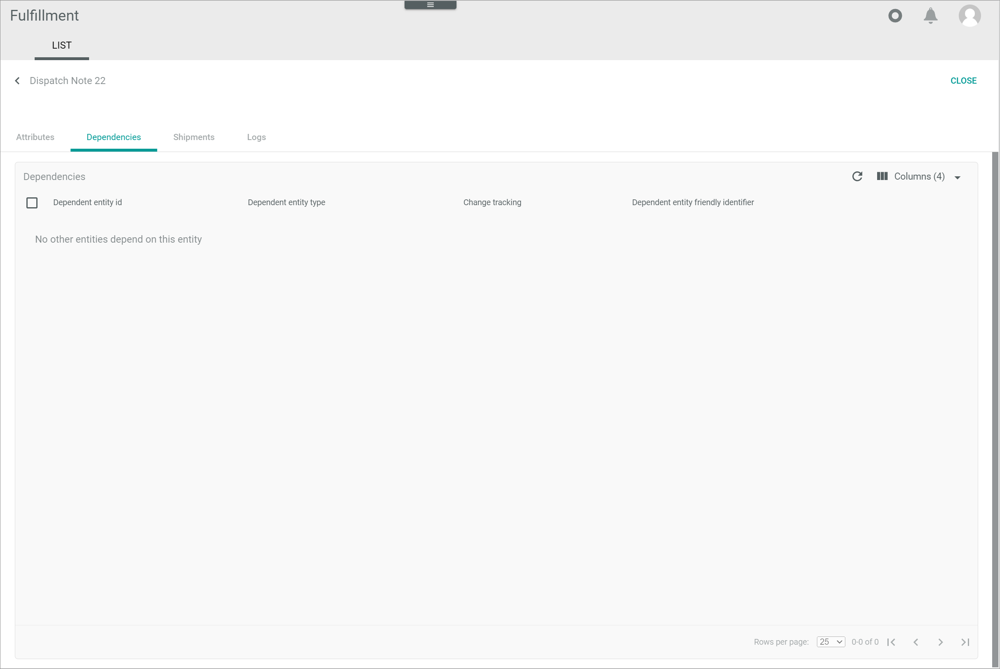

[!!Manage the dispatch notes](../Operation/01_ManageDispatchNotes.md)

# List

*Fulfillment > Dispatch notes > Tab LIST*

**Dispatch notes**

- *VIEW*  
    Click the drop-down list to select the view. All created views are displayed in the drop-down list. Click the  (Points) button to the right of the *VIEW* drop-down list to display the context menu and create a view.   

    -  (Points)      
        Click this button to the right of the *View* drop-down list to display the context menu. The following menu entries are available:

        -  create  
            Click this entry to create a view. The *Create view* window is displayed, see [Create view](#create-view).

        -  rename  
            Click this entry to rename the selected view. The *Rename view* window is displayed, see [Rename view](#rename-view). This menu entry is only displayed if a view has been selected.

        -  reset  
            Click this entry to reset all unsaved changes to the settings of the selected view. This menu entry is only displayed if a view has been selected and any changes have been made to the view settings.

        -  publish  
            Click this entry to publish the view. This menu entry is only displayed if a view has been selected and unpublished.

        -  unpublish  
            Click this entry to unpublish the view. This menu entry is only displayed if a view has been selected and published.

        -  save  
            Click this entry to save the current view settings in the selected view. This menu entry is only displayed if a view has been selected.

            > [Info] When the settings of a view have been changed, an asterisk is displayed next to the view name. The asterisk is hidden as soon as the changes have been saved.

        -  delete  
            Click this entry to delete the selected view. A confirmation window to confirm the deletion is displayed. This menu entry is only displayed if a view has been selected.

- Status  
    Click the drop-down list and select a dispatch note status. The following options are available:
    - **All statuses**  
        Select this option to display all dispatch notes, regardless of their status.
    - **New dispatch note**  
        Select this option to display all new dispatch notes.
    - **Transferred to partner**  
        Select this option to display all dispatch notes that have been transferred to the fulfiller.
    - **Partner confirmed receival**  
        Select this option to display all dispatch notes whose receival has been confirmed by the fulfiller.
    - **Dispatch note completed**  
        Select this option to display all dispatch notes that have been completed.
    - **Error**  
        Select this option to display all dispatch notes that have given an error.
    - **Void**  
        Select this option to display all void dispatch notes.

- Connections  
    Click the drop-down list and select a connection. The following options are available:
    - **All connections**  
        Select this option to display the dispatch notes for all configured connections. 
    - **Connection name**  
        Select this option to display the dispatch notes for the selected connection. When a specific connection has been selected, the **All connection** option is no longer displayed. Click the selected connection again to deselect it.  

-  (Search)   
    Click this button to display the search bar and search for dispatch notes.

-  (Refresh)   
    Click this button to update the list of dispatch notes.

-  Columns (x)   
    Click this button to display the columns bar and customize the displayed columns and the order of columns in the list. The *x* indicates the number of columns that are currently displayed in the list.

-  Filter (x)   
    Click this button to display the filter bar and customize the active filters. The *x* indicates the number of filters that are currently active.

- [x]     
    Select the checkbox to display the editing toolbar. If you click the checkbox in the header, all dispatch notes in the list are selected.

- [VIEW]  
    Click this button to view a dispatch note. This button is only displayed if a single checkbox in the list of dispatch notes is selected. Alternatively, you can click directly a row in the list to view the corresponding dispatch note. 
    The *Dispatch note "Dispatch note ID"* view is displayed, see [Dispatch note "Dispatch note ID"](#dispatch-note-dispatch-note-id). The *Attributes* tab is preselected.

- [EXPORT]  
    Click this button to export manually a dispatch note to the fulfiller. This button is displayed if the checkbox of at least one dispatch note is selected.

    > [Info] The dispatch note is exported automatically by the system. If the export fails, the dispatch note can be manually reexported. For detailed information, see [Export a dispatch note](../Operation/01_ManageDispatchNotes.md#export-a-dispatch-note).

- [FORCE COMPLETION]  
    Click this button to complete a dispatch note. This button is displayed if the checkbox of at least one dispatch note is selected. For detailed information, see [Complete a dispatch note](../Operation/01_ManageDispatchNotes.md#complete-a-dispatch-note). 

The list displays all dispatch notes. Depending on the settings, the displayed columns may vary. All fields are read-only.

- *Connection*  
    Connection to fulfiller.

- *Document number*  
    Dispatch note number. This number equals the delivery note number in the *Order management* module.

- *Status*  
    Dispatch note status. The following statuses are available:  
    - **New dispatch note**  
        The dispatch note has been newly created.
    - **Transferred to partner**  
        The dispatch note has been transferred to the fulfiller.
    - **Partner confirmed receival**  
        The fulfiller has confirmed receival of the dispatch note.
    - **Dispatch note completed**  
        The dispatch note has been completed.
    -  **Error**  
        The dispatch note has given an error while exporting.
    - **Void**  
        The dispatch note is void, for instance, because of an order cancellation.

- *Shipment status*  
    Status of shipment associated with the dispatch note. The following options are available:
    -  (Cross)   
        No shipment has been performed yet.  
    -  (Circular arrows)   
        The shipment is in progress.   
    -  (Double check)    
        The shipment has been delivered.
    -  (Error)    
        The fulfiller has reported a shipment error.
    - Empty  
        No information on the shipment status has been received from fulfiller.

- *Description*  
    Dispatch note description as defined by the user. Numbers, letters or a combination of characters may be used. The information provided in this field can be entered in the search bar to search for a specific dispatch note.

- *Created*  
    Date and time of the creation.

- *Modified*  
    Date and time of the last modification.

- *ID*  
    Dispatch note identification number. The ID number is automatically assigned by the system.

- *Status ID*  
  Dispatch note status identifier. The following options are available:
    - **new**
    - **transferred**
    - **confirmed**
    - **completed**
    - **error**
    - **void**

- *Carrier*  
    Carrier identifier.

- *Shipping type*  
    Type of shipment. The following options are available:  
    - **STND**  
        Standard shipping type.
    - **EXPR**  
        Express shipping type.

    > [Info] The shipping type can be set up in the *PACKAGE TYPES* tab in the *Settings* menu entry, see [Package types](./03b_PackageTypes.md).

- *Shipping method*  
    Shipping method (additional services) identifier.

[comment]: <> (Evtl. wird Bennenung geändert. In Package types als Additional services/shipping method.)

- Attribute    
    You can add a column for each attribute that is assigned to the dispatch note. The column displays the attribute name, the row displays the corresponding attribute value of the dispatch note.

## Dispatch note "Dispatch note ID"

*Fulfillment > Dispatch notes > Tab LIST > Select a dispatch note*

**Dispatch note "Dispatch note ID"**

-  (Back)   
    Click this button to close the *Dispatch note "Dispatch note ID"* view and return to the list of dispatch notes.  

- [CLOSE]  
    Click this button to close the *Dispatch note "Dispatch note ID"* view. The list of dispatch notes is displayed.

## Dispatch note "Dispatch note ID" &ndash; Attributes

*Fulfillment > Dispatch notes > Tab LIST > Select a dispatch note > Tab Attributes*

In the left margin column, all available attribute groups are displayed. Click a group to display the attributes that are assigned to this group on the right side of the *Attributes* tab. If the dispatch note contains attributes that are unassigned, the *Unassigned Group* group is automatically displayed in the left margin column.

The right side of the *Attributes* tab displays all attributes that are assigned to the selected group in the left margin column. Depending on the attribute group selected, the fields displayed vary. The dispatch note attributes are imported via the fulfiller driver. All fields are locked and, therefore, read-only.

-  (Folders)  
    Attribute group that contains attribute sub-groups. Click the attribute group or the arrow *>* left to the attribute group to unfold the group and display the attribute sub-groups.

-  (Folder)  
    Attribute group. Click the attribute group to display all attributes that are assigned to the selected attribute group on the right side of the *Attributes* tab.

[comment]: <> (HG: Diese Info ist nicht im Omni-Channel. Hinzufügen dort oder hier wegglassen?)

-  (Fade in/out)    
    Click this button to hide or display the left margin column with the attribute groups. When the left margin is displayed and you click this button, the column is hidden. When the column is hidden and you click this button, the column is displayed again.

## Dispatch note "Dispatch note ID" &ndash; Dependencies

*Fulfillment > Dispatch notes > Tab LIST > Select a dispatch note > Tab Dependencies*

**Dependencies**

-  (Refresh)   
    Click this button to update the list of dispatch note dependencies.

-  Columns (x)   
    Click this button to display the columns bar and customize the displayed columns and the order of columns in the list. The *x* indicates the number of columns that are currently displayed in the list.

- [x]     
    Select the checkbox to display the editing toolbar. If you click the checkbox in the header, all dependent entities in the list are selected.

The list displays all dependencies of the selected dispatch note. Depending on the settings, the displayed columns may vary. All fields are read-only. 

- *Dependent entity ID*   
    Identification number of the dependent entity. The ID number is automatically assigned by the system. 

- *Dependent entity type*   
    Type of the dependent entity. 

- *Change tracking mode*   
    Change tracking mode (ETL mode) of the dependent entity. The following options are available:
    - **Manual**
    - **Semi-automatic**
    - **Semi-automatic, changes must be confirmed by another user**   
    - **Automatic**

- *Dependent entity friendly identifier*   
    Descriptive name of the dependent entity. The friendly identifier is normally used to search for the entity in the user interface, for example, a reference number or an SKU.

- [RERUN MAPPING]   
    Click this button to rerun the mapping of the selected entity. This button is only displayed if the checkbox of at least one dependency is selected.	

    > [Info] If no dependent entities exist, the *No other entities depend on this entity* notice is displayed. 

## Dispatch note "Dispatch note ID" &ndash; Shipments

*Fulfillment > Dispatch notes > Tab LIST > Select a dispatch note > Tab Shipments*

-  (Refresh)   
    Click this button to update the list of shipments.

-  Columns (x)   
    Click this button to display the columns bar and customize the displayed columns and the order of columns in the list. The *x* indicates the number of columns that are currently displayed in the list.

-  Filter (x)   
    Click this button to display the filter bar and customize the active filters. The *x* indicates the number of filters that are currently active.

The list displays all shipments. Depending on the settings, the displayed columns may vary. All fields are read-only.

- *ID*  
    Shipment identification number. The ID number is automatically assigned by the system.

- *Carrier*  
    Carrier identifier.

- *Connection*  
    Connection to fulfiller.

- *External ID*  
    Shipment identification number in the fulfiller's system. 

- *Status*  
  Shipment status. The following options are available:
    - **New shipment**
    - **Shipped**
    - **Delivered**
    - **Void**
    - **Error**

- *Status info*  
    Additional status information provided by the fulfiller. 

- *Created*  
    Date and time of the creation.

- *Modified*    
    Date and time of the last modification.

- Attribute    
    You can add a column for each attribute that is assigned to the shipment. The column displays the attribute name, the row displays the corresponding attribute value of the shipment.

### Shipment attributes

*Fulfillment > Dispatch notes > Tab LIST > Select a dispatch note > Tab Shipments > Select a shipment > Sub-tab ATTRIBUTES*

**Shipment "Shipment ID"**

- [BACK]  
    Click this button to go back to the previous view. The *Shipments* view is displayed.

### Shipment attributes &ndash; Attributes

*Fulfillment > Dispatch notes > Tab LIST > Select a dispatch note > Tab Shipments > Select a shipment > Sub-tab ATTRIBUTES > Tab Attributes*

In the left margin column, all available attribute groups are displayed. Click a group to display the attributes that are assigned to this group on the right side of the *Attributes* tab. If the shipment contains attributes that are unassigned, the *Unassigned Group* group is automatically displayed in the left margin column.

The right side of the *Attributes* tab displays all attributes that are assigned to the selected group in the left margin column. Depending on the attribute group selected, the fields displayed vary. All fields are locked and, therefore, read-only.

-  (Folders)  
    Attribute group that contains attribute sub-groups. Click the attribute group or the arrow *>* left to the attribute group to unfold the group and display the attribute sub-groups.

-  (Folder)  
    Attribute group. Click the attribute group to display all attributes that are assigned to the selected attribute group on the right side of the *Attributes* tab.

[commnet]: <> (HG: Vereinheitlichen mit oben, Omni-Channel... Also, Folders u. Folder drin oder weglassen?)

-  (Fade in/out)    
    Click this button to hide or display the left margin column with the attribute groups. When the left margin is displayed and you click this button, the column is hidden. When the column is hidden and you click this button, the column is displayed again.

### Shipment attributes &ndash; Dependencies

*Fulfillment > Dispatch notes > Tab LIST > Select a dispatch note > Tab Shipments > Select a shipment > Sub-tab ATTRIBUTES > Tab Dependencies*

-  (Refresh)   
    Click this button to update the list of shipment dependencies.

-  Columns (x)   
    Click this button to display the columns bar and customize the displayed columns and the order of columns in the list. The *x* indicates the number of columns that are currently displayed in the list.

- [x]     
    Select the checkbox to display the editing toolbar. If you click the checkbox in the header, all dependent entities in the list are selected. 

The list displays all dependencies of the selected shipment. Depending on the settings, the displayed columns may vary. All fields are read-only. 

- *Dependent entity ID*   
    Identification number of the dependent entity. The ID number is automatically assigned by the system. 

- *Dependent entity type*   
    Type of the dependent entity. 

- *Change tracking mode*   
    Change tracking mode (ETL mode) of the dependent entity. The following options are available:
    - **Manual**
    - **Semi-automatic**
    - **Semi-automatic, changes must be confirmed by another user**   
    - **Automatic**

- *Dependent entity friendly identifier*   
    Descriptive name of the dependent entity. The friendly identifier is normally used to search for the entity in the user interface, for example, a reference number or an SKU.

- [RERUN MAPPING]   
    Click this button to rerun the mapping of the selected entity. This button is only displayed if the checkbox of at least one dependency is selected.	

    > [Info] If no dependent entities exist, the *No other entities depend on this entity* notice is displayed. 

### Shipment packages

*Fulfillment > Dispatch notes > Tab LIST > Select a dispatch note > Tab Shipments > Select a shipment > Sub-tab PACKAGES*

-  (Search)   
    Click this button to display the search bar and search for packages.

-  (Refresh)   
    Click this button to update the list of packages.

-  Columns (x)   
    Click this button to display the columns bar and customize the displayed columns and the order of columns in the list. The *x* indicates the number of columns that are currently displayed in the list.

-  Filter (x)   
    Click this button to display the filter bar and customize the active filters. The *x* indicates the number of filters that are currently active.

The list displays all packages contained in the selected shipment. Depending on the settings, the displayed columns may vary. All fields are read-only.

- *Package type*  
    Package type name. Packages types can be defined in the *PACKAGE TYPES* tab of the *Settings* menu entry, see [Manage the package types](../Integration/02_ManagePackageTypes.md).

- *Created*  
    Date and time of the creation.

- *Modified*  
    Date and time of the last modification.

- *ID*  
    Package type identification number. This number is automatically assigned by the system.

-  *Tracking number*  
    Package tracking number.

- *Tracking link*  
    Package tracking link.

- *Package ID*  
    Package identification number.

- *Proof of delivery*  
    Proof of delivery, if required.

- Attribute    
    You can add a column for each attribute that is assigned to the shipment package. The column displays the attribute name, the row displays the corresponding attribute value of the shipment package.
    

#### Items

*Fulfillment > Dispatch notes > Tab LIST > Select a dispatch note > Tab Shipments > Select a shipment > Sub-tab PACKAGES > Select a package*

-  (Refresh)   
    Click this button to update the list of items.

-  Columns (x)   
    Click this button to display the columns bar and customize the displayed columns and the order of columns in the list. The *x* indicates the number of columns that are currently displayed in the list.

-  Filter (x)   
    Click this button to display the filter bar and customize the active filters. The *x* indicates the number of filters that are currently active.

The list displays all items contained in the selected package. Depending on the settings, the displayed columns may vary. All fields are read-only.

- *Item number*  
    Item number in the package.

- *SKU*  
    Stock Keeping Unit. Identification number of the product.

- *Amount*  
    Amount of item units contained in the package.

- *Serial number*  
    Item serial number.

- *ID*  
    Item identification number. The ID number is automatically assigned by the system.

- *Unit net value*  
    Item unit net value.

- *Unit gross value*  
    Item unit gross value.

- *Total net value*  
    Item total net value.

- *Currency*  
    Item currency.

- *Dangerous goods indicator*  
    Indication whether the item has been classified as a dangerous product.

- Attribute    
    You can add a column for each attribute that is assigned to the item. The column displays the attribute name, the row displays the corresponding attribute value of the item.

## Dispatch note "Dispatch note ID" &ndash; Logs

*Fulfillment > Dispatch notes > Tab LIST > Select a dispatch note > Tab Logs*

This tab displays an extract from the list of intents contained in the *Logging* menu entry. The intents displayed in this tab only refer to the selected dispatch note. For a detailed description of this window and the corresponding functions, see [Connections (Logging)](./02a_Connections.md).

## Create view

*Fulfillment > Dispatch notes > Tab LIST > Button Points > Menu entry create*

- *Name*   
    Enter a name for the view.

- [CANCEL]   
    Click this button to cancel creating a view. The *Create view* window is closed.

- [SAVE]   
    Click this button to save the new view and display it in the *VIEW* drop-down list. The *Create view* window is closed.

This window can also be accessed from the following tabs in the user interface:

- [CONNECTIONS (Logging)](02a_Connections.md#create-view)
- [CONNECTIONS (Settings)](03a_Connections.md#create-view)
- [PACKAGE TYPES](03b_PackageTypes.md#create-view)

## Rename view

*Fulfillment > Dispatch notes > Tab LIST > Button Points > Menu entry rename*

- *Name*   
    Click this field to edit the view name.

- [CANCEL]   
    Click this button to cancel renaming the view. The  *Rename view* window is closed.

- [SAVE]   
    Click this button to save the changes and display it in the *VIEW* drop-down list. The *Rename view* window is closed.

This window can also be accessed from the following tabs in the user interface:

- [CONNECTIONS (Logging)](02a_Connections.md#rename-view)
- [CONNECTIONS (Settings)](03a_Connections.md#rename-view)
- [PACKAGE TYPES](03b_PackageTypes.md#rename-view)