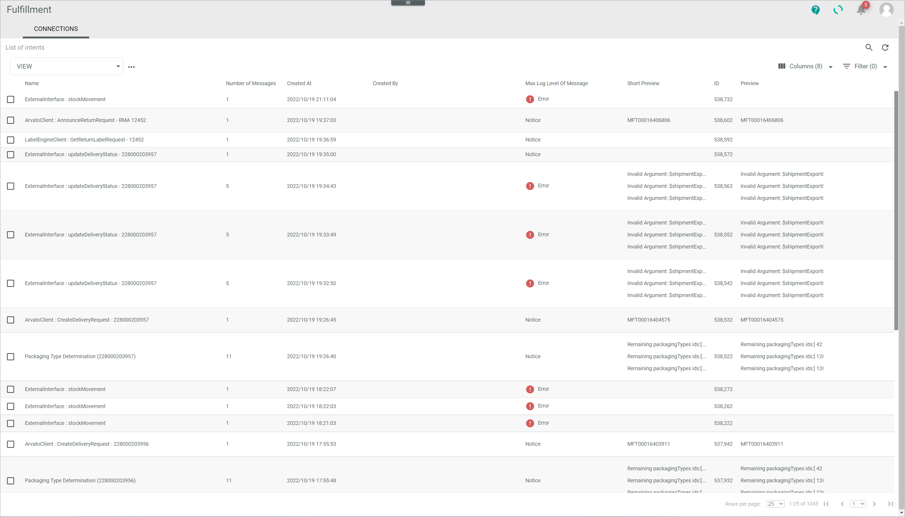
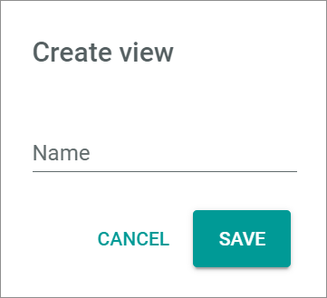
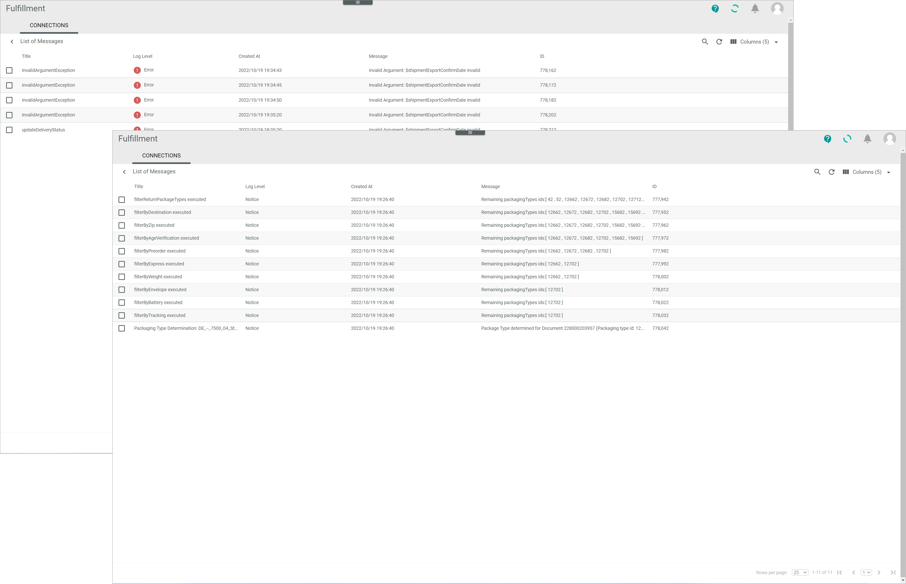
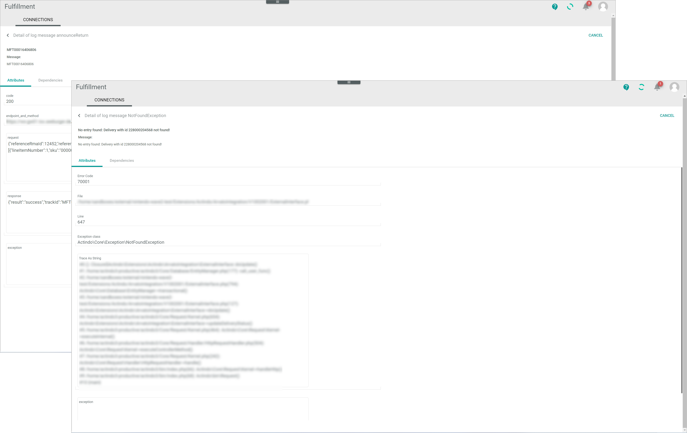
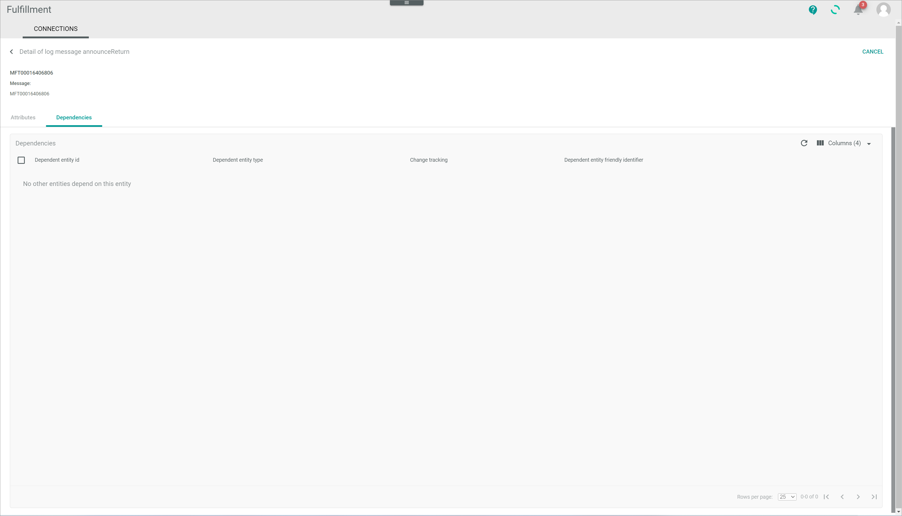

# Connections (Logging)

*Fulfillment > Logging > Tab CONNECTIONS*

[comment]: <> (Nichts angezeigt im Sandbox. Bug bei mir? Alle beschriebenen Felder aus NoE test account. Was ist standard und was kundenspezifisch?)

**List of intents**

- *VIEW*  
    Click the drop-down list to select the view. All created views are displayed in the drop-down list. Click the  (Points) button to the right of the *VIEW* drop-down list to display the context menu and create a view. For detailed information, see [Create view](#create-view).

    -  (Points)      
        Click this button to the right of the *View* drop-down list to display the context menu. The following menu entries are available:

      -  create  
        Click this entry to create a view. The *Create view* window is displayed.

      -  rename  
        Click this entry to rename the selected view. The *Rename view* window is displayed. This menu entry is only displayed if a view has been selected.

      -  reset  
        Click this entry to reset all unsaved changes to the settings of the selected view. This menu entry is only displayed if a view has been selected and any changes have been made to the view settings.

      -  publish  
        Click this entry to publish the view. This menu entry is only displayed if a view has been selected and unpublished.

      -  unpublish  
        Click this entry to unpublish the view. This menu entry is only displayed if a view has been selected and published.

      -  save  
        Click this entry to save the current view settings in the selected view. This menu entry is only displayed if a view has been selected.

        > [Info] When the settings of a view have been changed, an asterisk is displayed next to the view name. The asterisk is hidden as soon as the changes have been saved.

      -  delete  
        Click this entry to delete the selected view. A confirmation window to confirm the deletion is displayed. This menu entry is only displayed if a view has been selected.

-  (Search)   
    Click this button to display the search bar and search for an intent.

-  (Refresh)   
    Click this button to update the list of intents.

-  Columns (x)   
    Click this button to display the columns bar and customize the displayed columns and the order of columns in the list. The *x* indicates the number of columns that are currently displayed in the list.

-  Filter (x)   
    Click this button to display the filter bar and customize the active filters. The *x* indicates the number of filters that are currently active.

- [x]     
    Select the checkbox to display the editing toolbar. Only one log message can be selected at a time.

- [SHOW MESSAGE]  
    Click this button to display the selected log message. This button is only displayed if a single checkbox in the list of intents is selected. Alternatively, you can click directly a row in the list to view an intent. The *List of messages* view is displayed.

The list displays all intents. Depending on the settings, the displayed columns may vary. All fields are read-only.

- *Name*  
    Description of log.

- *Number of messages*  
    Number of messages contained in the log.

- *Created at*  
    Date and time of the creation.

- *Created by*  
    Name and username of the user who created the log.  

[comment]: <> (Bei NoE test account Background-API Arvato -> Always automatically created? User or Connection name? Logs created by a person or automatically by the system/connection?)  

- *Max log level of message*  
    Maximal log level type of the message(s) contained in the intent. The following levels are available:
  - **Debug**
  - **Info**
  - **Notice**
  - **Warning**
  - **Error**
  - **Critical**
  - **Alert**
  - **Emergency**

[comment]: <> (Levels in Workflows + Omni-Channel)  

- *ID*  
    Log identification number. The ID number is automatically assigned by the system.

- *Preview*  
    Preview of log details.

- *Short preview*  
    Short preview of log details.

[comment]: <> (Beide scheinen gleich aus oder sehr ähnlich. Unterschied?)

## Create view

*Fulfillment > Logging > Tab CONNECTIONS > Button Points > Menu entry create*

For a detailed description of this window and the corresponding functions, see [Create view](./01a_List.md#create-view).

## Rename view

*Fulfillment > Logging > Tab CONNECTIONS > Button Points > Menu entry rename*

For a detailed description of this window and the corresponding functions, see [Rename view](./01a_List.md#rename-view).

## List of messages

*Fulfillment > Logging > Tab CONNECTIONS > Select an intent*

**List of messages**

-  (Back)   
    Click this button to close the *List of messages* view and return to the list of intents.

-   
    Click this to unpublish the log message.

[comment]: <> (Unpublish? Bedeutung?)

-   
    Click this button to view the log message details.

The list displays all messages contained in the selected intent. Depending on the settings, the displayed columns may vary. All fields are read-only.

- *Title*  
    Description of the log message.

- *Log level*  
    Log level type. The following levels are available:
  - **Debug**
  - **Info**
  - **Notice**
  - **Warning**
  - **Error**
  - **Critical**
  - **Alert**
  - **Emergency**

[comment]: <> (Levels in Workflows + Omni-Channel)

- *Created at*  
    Date and time of the creation.

- *Created by*  
    Name and username of the user who created the intent.

[comment]: <> (Bei NoE test account Background-API Arvato -> Always automatically created? User or Connection name? Logs created by a person or automatically by the system/connection?)

- *Message*  
    Details of the log message.

- *ID*  
    Log message identification number. The ID number is automatically assigned by the system.

### Detail of log message "Log message name"

*Fulfillment > Logging > Tab CONNECTIONS > Select an intent > Select a log message*

-  (Back)   
    Click this button to close the *Detail of log message "Log message name"* view and return to the list of messages.

- [CANCEL]  
    Click this button to close the *Detail of log message "Log message name"* view. The list of messages is displayed.

- Message  
    Short description of the log message.

- *Message:*  
    Short description of the log message.

[comment]: <> (Hier Info wiederholt sich. Report als Bug?)

### Detail of log message "Log message name" &ndash; Attributes

*Fulfillment > Logging > Tab CONNECTIONS > Select an intent > Select a log message > Tab Attributes*

The *Attributes* tab displays further details of the selected log message. Depending on the message type, the assigned attributes, and therefore the fields displayed, may vary. All fields are read-only.

### Detail of log message "Log message name" &ndash; Dependencies

*Fulfillment > Logging > Tab CONNECTIONS > Select an intent > Select a log message > Tab Dependencies*

This tab has no function in the *Fulfillment* module, since log messages have no dependent entities. The notice *No other entities depend on this entity* is displayed.

[comment]: <> (Gar keine Dependencies oder könnte es geben, also standardmäßig beschreiben, wie im Channels?)
