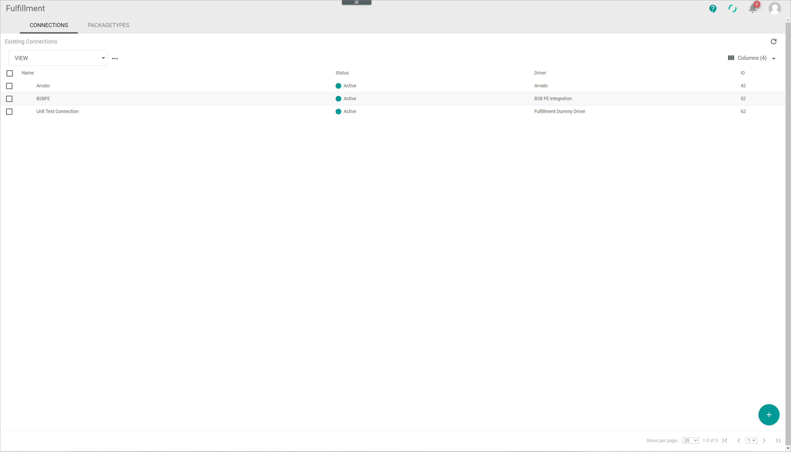
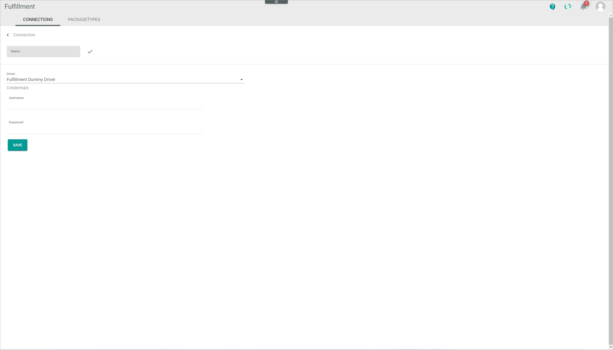
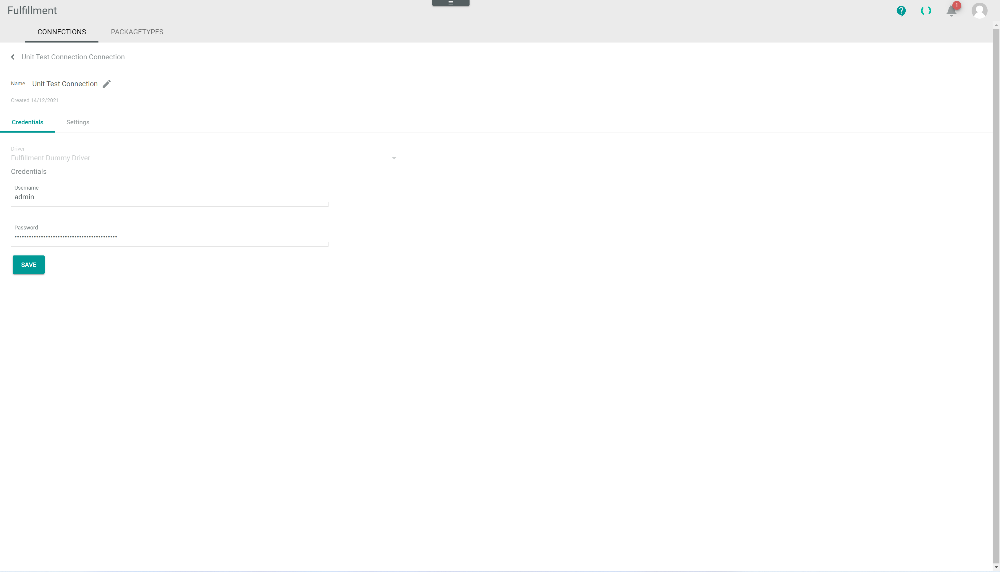
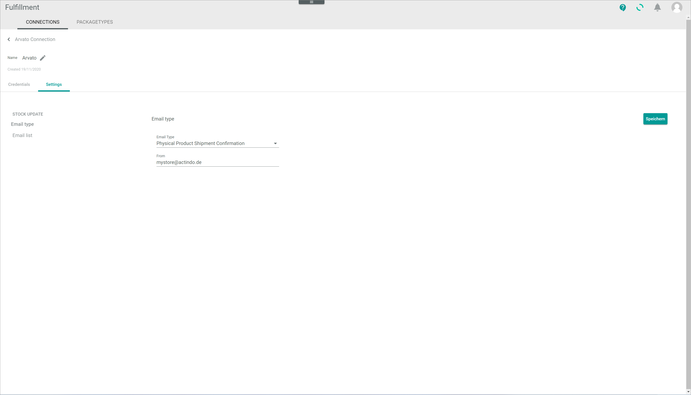

# Connections (Settings)

*Fulfillment > Settings > Tab CONNECTIONS*

**Existing connections**

- *VIEW*  
  Click the drop-down list to select the view. All created views are displayed in the drop-down list. Click the  (Points) button to the right of the *VIEW* drop-down list to display the context menu and create a view. For detailed information, see [Create view](#create-view).

  -  (Points)      
    Click this button to the right of the *View* drop-down list to display the context menu. The following menu entries are available:

    -  create  
      Click this entry to create a view. The *Create view* window is displayed.

    -  rename  
      Click this entry to rename the selected view. The *Rename view* window is displayed. This menu entry is only displayed if a view has been selected.

    -  reset  
      Click this entry to reset all unsaved changes to the settings of the selected view. This menu entry is only displayed if a view has been selected and any changes have been made to the view settings.

    -  publish  
      Click this entry to publish the view. This menu entry is only displayed if a view has been selected and unpublished.

    -  unpublish  
      Click this entry to unpublish the view. This menu entry is only displayed if a view has been selected and published.

    -  save  
      Click this entry to save the current view settings in the selected view. This menu entry is only displayed if a view has been selected.

      > [Info] When the settings of a view have been changed, an asterisk is displayed next to the view name. The asterisk is hidden as soon as the changes have been saved.

    -  delete  
      Click this entry to delete the selected view. A confirmation window to confirm the deletion is displayed. This menu entry is only displayed if a view has been selected.

-  (Refresh)   
  Click this button to update the list of connections.

-  Columns (x)   
  Click this button to display the columns bar and customize the displayed columns and the order of columns in the list. The *x* indicates the number of columns that are currently displayed in the list.

- [x]     
  Select the checkbox to display the editing toolbar. If you click the checkbox in the header, all connections in the list are selected.

- [DISABLE]  
  Click this button to disable one or several selected connections. This button is displayed if the checkbox of at least one active connection is selected. For detailed information see [Enable/disable a connection](../Integration/01_ManageConnections.md#enabledisable-a-connection).

- [ENABLE]  
  Click this button to enable one or several selected connections. This button is displayed if the checkbox of at least one inactive connection is selected. For detailed information see [Enable/disable a connection](../Integration/01_ManageConnections.md#enabledisable-a-connection).

-  (Edit)  
  Click this button to edit the selected connection. This button is only displayed if the checkbox of a connection is selected. Alternatively, you can click directly a row in the list to view a connection. The *\"Connection name\" Connection* view is displayed, see [Edit connection](#edit-connection). The *Credentials* tab is preselected.

[comment]: <> (Oder the *Create connection* view? Vgl. DataHub/UI/Attributes o.ä.)

The list displays all existing connections. Depending on the settings, the displayed columns may vary. All fields are read-only.

- *Name*  
  Connection name.

- *Status*  
  Connection status. The following statuses are available:
  -  **Active**
  -  **Inactive**  

- *Driver*  
  Driver name.

- *ID*  
  Connection identification number. The ID number is automatically assigned by the system.

## Create view

*Fulfillment > Settings > Tab CONNECTIONS > Button Points > Menu entry create*

For a detailed description of this window and the corresponding functions, see [Create view](./01a_List.md#create-view).

## Rename view

*Fulfillment > Settings > Tab CONNECTIONS > Button Points > Menu entry rename*

For a detailed description of this window and the corresponding functions, see [Rename view](./01a_List.md#rename-view).

## Create connection

*Fulfillment > Settings > Tab CONNECTIONS > Button Add*

-  (Back)   
Click this button to close the *\"Connection name\" Connection* view and return to the connection list. All changes are rejected.

- *Name*   
  Enter a connection name.

-  (Check)  
  Click this button to confirm the connection name.

-  (Edit)  
  Click this button to edit the connection name. This button is displayed after the connection name has been confirmed with the previously displayed check button.

- *Driver*  
  Click the drop-down list and select the desired driver. All installed drivers are displayed. Alternatively, select the option **more** to install further drivers. Once a driver has been selected from the drop-down list, the *Credentials* section is displayed, see [Create connection &ndash; Credentials](#create-connection--credentials). Depending on the driver selected, the credentials fields vary.

  > [Info] When selecting the **more** option, the notice *Get more drivers from the app store* is displayed. Drivers are licensed and must be acquired via the app store. The applicable driver credentials to establish the connection are provided by the fulfiller. For detailed information, see [Create a connection](../Integration/01_ManageConnections.md#create-a-connection).

[comment]: <> (Kann man mehrere Connections für ein Driver erstellen? Wo kommen die Credentials her? Felder in Driver programmiert? Details für Credential aus Fulfiller?)

### Create connection &ndash; Credentials

*Fulfillment > Settings > Tab CONNECTIONS > Button Add > Select driver*

The fields displayed in the *Credentials* section vary depending on the driver selected. By default, the following fields are displayed:

- *Username*  
  Enter the applicable username for the connection.

- *Password*  
  Enter the applicable password for the connection.

- [SAVE]  
  Click this button to save the connection.

[comment]: <> (Stimmt das so? Das sind die Felder angezeigt, wenn man Fulfillment Dummy Driver ausgewählt wird. Bei anderen kann das anders heißen, aber trotzdem eine Art Username/Password.)

## Edit connection

*Fulfillment > Settings > Tab CONNECTIONS > Select a connection*

-  (Back)   
Click this button to close the *\"Connection name\" Connection* view and return to the connection list. All changes are rejected.

[comment]: <> (Oder *Edit connection* view?)

- *Name*   
  Connection name. This field is locked.

-  (Edit)  
  Click this button to edit the connection name. The *Name* field is unlocked and can be edited.

-  (Check)  
  Click this button to confirm the edited connection name. The *Name* field is locked again.

### Edit connection &ndash; Credentials

*Fulfillment > Settings > Tab CONNECTIONS > Select a connection > Tab Credentials*

- *Driver*  
  Driver name selected. This drop-down list is locked and cannot be edited.

The fields displayed in the *Credentials* section vary depending on the driver selected. By default, the following fields are displayed:

- *Username*  
  Click this field to edit the username for the connection.

- *Password*  
  Click this field to edit the password for the connection.

- [SAVE]  
  Click this button to save any changes made.

### Edit connection &ndash; Settings

*Fulfillment > Settings > Tab CONNECTIONS > Select a connection > Tab Settings*

The settings can only be configured after the connection has been established. The fields displayed vary depending on the driver installed.

[comment]: <> (Settings werden via Treiber importiert/installiert. Also, einige Connections haben keine Settings, z.B. Arvato ja, B2BFE/Unit Test Connection nein. In meinem Sandbox, There are no settings available. Wenn Treiber installiert, dann erst können ggf. Settings angepasst werden, z.B. wie bei NoE. Stimmt das so?)

- [SAVE]  
  Click this button to save any changes made.

> [Info] If no settings are available for the selected connection, the notice *There are no settings available* is displayed.
