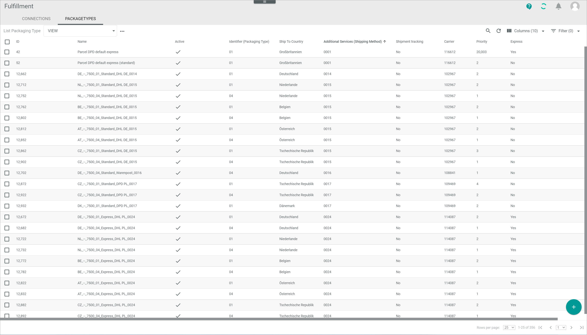
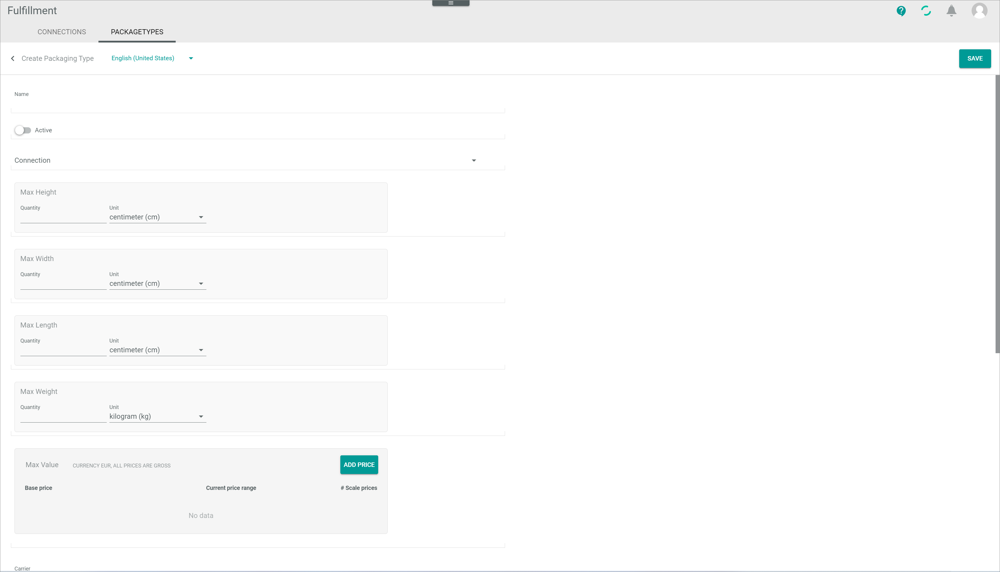
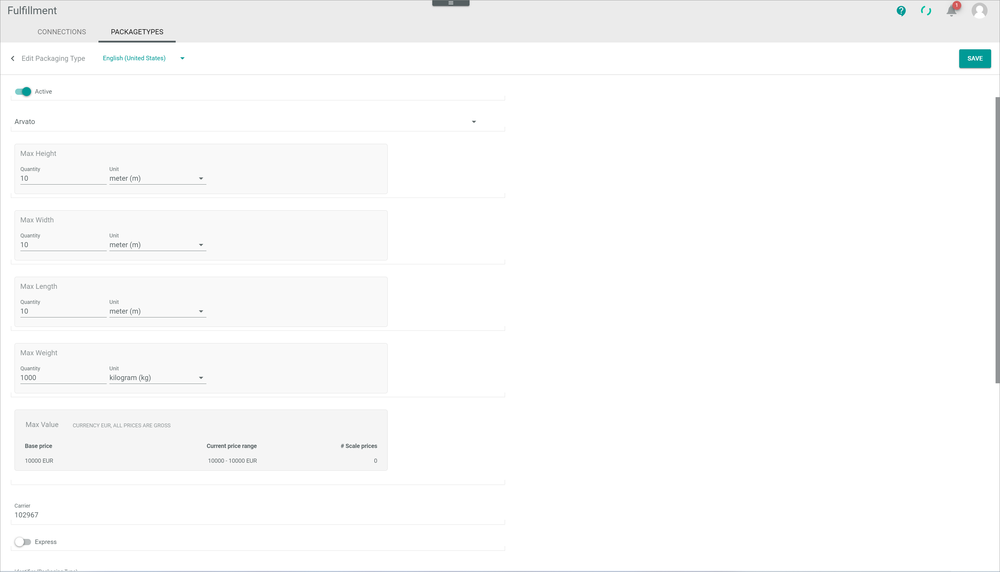
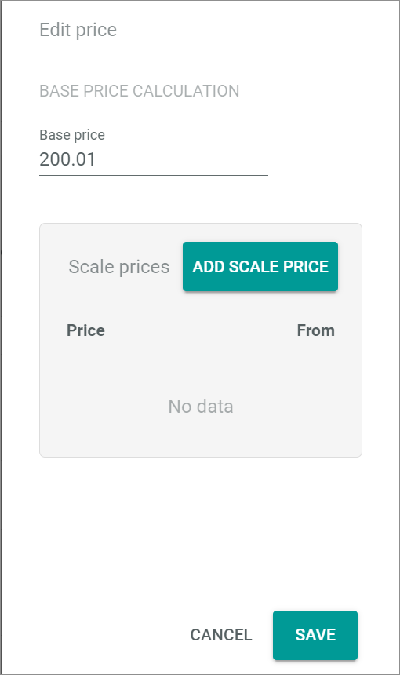

# Package types

*Fulfillment > Settings > Tab PACKAGE TYPES*

**List of package types**

- *VIEW*  
  Click the drop-down list to select the view. All created views are displayed in the drop-down list. Click the  (Points) button to the right of the *VIEW* drop-down list to display the context menu and create a view. For detailed information, see [Create view](#create-view).

  -  (Points)      
    Click this button to the right of the *View* drop-down list to display the context menu. The following menu entries are available:

    -  create  
      Click this entry to create a view. The *Create view* window is displayed.

    -  rename  
      Click this entry to rename the selected view. The *Rename view* window is displayed. This menu entry is only displayed if a view has been selected.

    -  reset  
      Click this entry to reset all unsaved changes to the settings of the selected view. This menu entry is only displayed if a view has been selected and any changes have been made to the view settings.

    -  publish  
      Click this entry to publish the view. This menu entry is only displayed if a view has been selected and unpublished.

    -  unpublish  
      Click this entry to unpublish the view. This menu entry is only displayed if a view has been selected and published.

    -  save  
      Click this entry to save the current view settings in the selected view. This menu entry is only displayed if a view has been selected.

      > [Info] When the settings of a view have been changed, an asterisk is displayed next to the view name. The asterisk is hidden as soon as the changes have been saved.

    -  delete  
      Click this entry to delete the selected view. A confirmation window to confirm the deletion is displayed. This menu entry is only displayed if a view has been selected.

[comment]: <> (Reset auch hier verfügbar?)

-  (Search)   
  Click this button to display the search bar and search for event logs.

-  (Refresh)   
  Click this button to update the list of an event logs.

-  Columns (x)   
  Click this button to display the columns bar and customize the displayed columns and the order of columns in the list. The *x* indicates the number of columns that are currently displayed in the list.

-  Filter (x)   
  Click this button to display the filter bar and customize the active filters. The *x* indicates the number of filters that are currently active.

- [x]     
  Select the checkbox to display the editing toolbar.

- [EDIT]  
  Click this button to edit the selected package type. This button is only displayed if the checkbox of a package type is selected. Alternatively, you can click directly a row in the list to view an event log. The *List of messages* view is displayed.

- [DELETE]  
  Click this button to delete one or several selected package types.

The list displays all package types. Depending on the settings, the displayed columns may vary. All fields are read-only.

- *ID*  
  Package type identification number. The ID number is automatically assigned by the system.

- *Name*  
  Package type name.

- *Active*  
  Package type status. The following statuses are displayed:
  -  (Checkmark): The package type is active.
  -  (Cross): the package type is inactive.

- *Connection*  
  Connection name.

- *Connection ID*  
  Connection identification number. The ID number is automatically assigned by the system.

- *Max height*  
  Maximal height configured for the package type.

- *Max width*  
  Maximal width configured for the package type.

- *Max weight*  
  Maximal weight configured for the package type.

- *Max value*  
  Maximal value configured for the package type.

- *Carrier*   
  Carrier identifier.

- *Express*  
  Indication of the configured shipping type. The following options are displayed:  
    - **Yes**: Express shipping type
    - **No**: Standard shipping type

- *Identifier (package type)*  
  Package type identifier.

[comment]: <> (Weitere Infos benötigt)

- *Ship to country*  
  Country where the package type is shipped to.

- *Priority*  
  Indication of the priority configured for the package type.

[comment]: <> (Weitere Infos benötigt - Express und Standard beide Priority 2? Was drückt die Nummer aus?)

- *Additional services (shipping method)*  
  Additions services identifier.

[comment]: <> (Weitere Infos benötigt)

- *Zip code RegEx pattern*  
  Zip code regular expression pattern.

- *Battery allowed*  
  Indication of whether battery is allowed or not. The following options are displayed:  
    - **Yes**: Battery is allowed.
    - **No**: Battery is not allowed.  

- *Shipment tracking*  
  Indication of whether shipment tracking is available or not. The following options are displayed:  
    - **Yes**: Shipment tracking is available.
    - **No**: Shipment tracking is not available.  

- *Preorder*  
  Indication of whether preorder is available or not. The following options are displayed:  
    - **Yes**: Preorder is available.
    - **No**: Preorder is not available.

- *Return*  
  Indication of whether shipment is available or not. The following options are displayed:  
    - **Yes**: Return is available.
    - **No**: Return is not available.

- *Age verification*  
  Indication of whether age verification is necessary or not. The following options are displayed:  
    - **Yes**: Age verification is necessary.
    - **No**: Age verification is not necessary.

## Create view

*Fulfillment > Settings > Tab PACKAGE TYPES > Button Points > Menu entry create*

For a detailed description of this window and the corresponding functions, see [Create view](./01a_List.md#create-view).

## Rename view

*Fulfillment > Settings > Tab PACKAGE TYPES > Button Points > Menu entry rename*

For a detailed description of this window and the corresponding functions, see [Rename view](./01a_List.md#rename-view).

## Create package type  

*Fulfillment > Settings > Tab PACKAGE TYPES > Button Add*

-  (Back)   
  Click this button to close the *Create package type* view and return to the attributes list. All changes are rejected.

- Language      
  Click the drop-down list and select the language in which the *Name (Language)* and *Description (Language)* fields are displayed. The following languages are available in the drop-down list:
    - *Deutsch (Deutschland)*  
    - *Deutsch*
    - *English*  
    - *Deutsch (Österreich)*  
    - *Deutsch (Schweiz)*
    - *English (United States)*
    - *French*
    - *Spanish*
    - *Italian*
    - *Portuguese*
    - *Dutch*
    - *French (Belgium)*
    - *French (Switzerland)*
    - *Italian (Switzerland)*
    - *Dutch (Belgium)*

[comment]: <> (Is that right? -> language question = PIM/DataHub question, aber mehr Spachen verfügbar. Wieso?)

- [SAVE]   
  Click this button to save the package type, close the *Create package type* view and return to the list of package types.

- *Name*  
  Enter a package type name.

-  *Active*   
  Enable this toggle to set the package type status to active. Disable the toggle to set the status to inactive. By default, this toggle is disabled.

- *Connection*  

- *Connection ID*  

- *Max height*  
  - *Quantity*  
  - *Unit*  

- *Max width*   
  - *Quantity*  
  - *Unit*  

- *Max weight*  
  - *Quantity*  
  - *Unit*  

- *Max value*  
  - *Base price*  
  - *Current price range*  
  - *Scale prices*  
  - [ADD PRICE]
    The *Edit price* window is displayed, see [Edit price](#edit-price).

- *Carrier*  

-  *Express*  
  Enable this toggle to set the package type shipping method to express. Disable the toggle to set the package type shipping method to standard. By default, this toggle is disabled.  

- *Identifier (package type)*  

- *Ship-to country*  

- *Priority*  

- *Additional services (shipping method)*  

- *Zip code RegEx pattern*   

-  *Battery allowed*  
  Enable this toggle to allow batteries for this package type. Disable the toggle to not allow batteries for this package type. By default, this toggle is disabled.  

-  *Shipment tracking*  
  Enable this toggle to make shipment tracking for this package type available. Disable the toggle to not make shipment tracking for this package type available. By default, this toggle is disabled.  

-  *Preorder*  
  Enable this toggle to make preorder for this package type available. Disable the toggle to not make preorder for this package type available. By default, this toggle is disabled.  

-  *Return*  
  Enable this toggle to make return for this package type available. Disable the toggle to not make return for this package type available. By default, this toggle is disabled.  

-  *Age verification*  

- [SAVE]

### Edit price

*Fulfillment > Settings > Tab PACKAGE TYPES > Button Add > Button ADD PRICE*

**BASE PRICE CALCULATION**

- *Base price*

**Scale prices**

- *Price*
- *From*

- [ADD SCALE PRICE]   
  The *Edit scale price* window is displayed, see [Edit scale price](#edit-scale-price).

- [CANCEL]

- [SAVE]

#### Edit scale price

*Fulfillment > Settings > Tab PACKAGE TYPES > Button Add > Button ADD PRICE > Button ADD SCALE PRICE*

- *Price*
- *From*

- [CANCEL]

- [SAVE]

## Edit package type

*Fulfillment > Settings > Tab PACKAGE TYPES > Select package type*

### Edit price

*Fulfillment > Settings > Tab PACKAGE TYPES > Select package type > Button Edit*

[comment]: <> (Verweis auf Abschnitt unter Create packate type?)

#### Edit scale price

*Fulfillment > Settings > Tab PACKAGE TYPES > Select package type > Button Edit > Button ADD SCALE PRICE*

[comment]: <> (Verweis auf Abschnitt unter Create packate type?)
