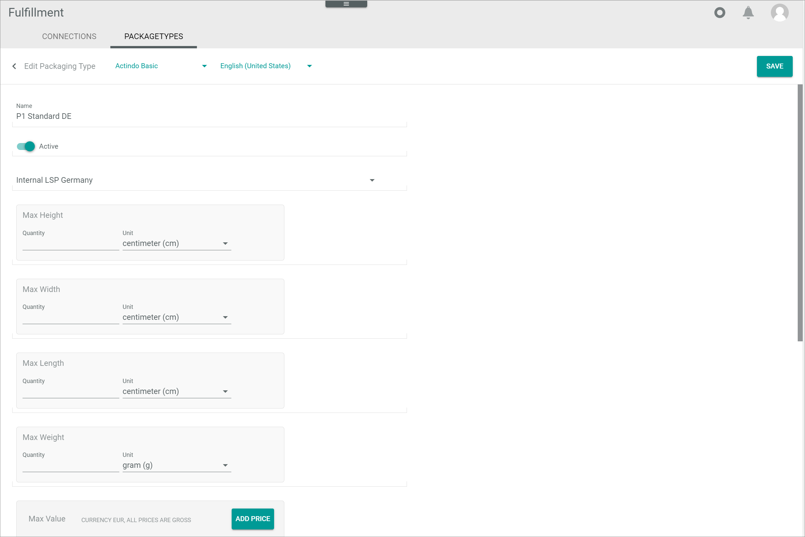

[!!Manage packaging types](../Integration/02_ManagePackagingTypes.md)

# Packaging types

*Fulfillment > Settings > Tab PACKAGING TYPES*

**List of packaging types**

- *VIEW*  
    Click the drop-down list to select the view. All created views are displayed in the drop-down list. Click the  (Points) button to the right of the *VIEW* drop-down list to display the context menu and create a view.   

    -  (Points)      
        Click this button to the right of the *View* drop-down list to display the context menu. The following menu entries are available:

        -  create  
            Click this entry to create a view. The *Create view* window is displayed, see [Create view](#create-view).

        -  rename  
            Click this entry to rename the selected view. The *Rename view* window is displayed, see [Rename view](#rename-view). This menu entry is only displayed if a view has been selected.

        -  reset  
            Click this entry to reset all unsaved changes to the settings of the selected view. This menu entry is only displayed if a view has been selected and any changes have been made to the view settings.

        -  publish  
            Click this entry to publish the view. This menu entry is only displayed if a view has been selected and unpublished.

        -  unpublish  
            Click this entry to unpublish the view. This menu entry is only displayed if a view has been selected and published.

        -  save  
            Click this entry to save the current view settings in the selected view. This menu entry is only displayed if a view has been selected.

            > [Info] When the settings of a view have been changed, an asterisk is displayed next to the view name. The asterisk is hidden as soon as the changes have been saved.

        -  delete  
            Click this entry to delete the selected view. A confirmation window to confirm the deletion is displayed. This menu entry is only displayed if a view has been selected.

-  (Search)   
    Click this button to display the search bar and search for packaging types.

-  (Refresh)   
    Click this button to update the list of packaging types.

-  Columns (x)   
    Click this button to display the columns bar and customize the displayed columns and the order of columns in the list. The *x* indicates the number of columns that are currently displayed in the list.

-  Filter (x)   
    Click this button to display the filter bar and customize the active filters. The *x* indicates the number of filters that are currently active.

- [x]     
    Select the checkbox to display the editing toolbar.

- [EDIT]  
    Click this button to edit the selected packaging type. This button is only displayed if a single checkbox in the list of packaging types is selected. Alternatively, you can click directly a row in the list to edit the corresponding packaging type. The *Edit packaging type* view is displayed.

- [DELETE]  
    Click this button to delete one or several selected packaging types.

The list displays all packaging types. Depending on the settings, the displayed columns may vary. All fields are read-only.

- *ID*  
    Packaging type identification number. The ID number is automatically assigned by the system.

- *Name*  
    Packaging type name.

- *Active*  
    Packaging type status. The following statuses are available:
    -  (Checkmark)   
        The packaging type is active.
    -  (Cross)   
        The packaging type is inactive.

- *Connection*  
    Connection name.

- *Connection ID*  
    Connection identification number. The ID number is automatically assigned by the system.

- *Max height*  
    Maximum height configured for the packaging type.

- *Max width*  
    Maximum width configured for the packaging type.

- *Max weight*  
    Maximum weight configured for the packaging type.

- *Max value*  
    Maximum value configured for the packaging type.

- *Carrier*   
    Carrier configured for the packaging type.  

- *Express*  
    Indication of the configured shipping type. The following options are available:  
    - **Yes**  
        Express shipping type
    - **No**  
        Standard shipping type

- *Packaging type identifier*  
    Packaging type configured for the shipment.  

- *Ship-to country*  
    Country where the packaging type is shipped to.

- *Priority*  
    Indication of the priority configured for the packaging type. The priority value is used by the system to determine the packaging type to be used for a shipment when the criteria of two or more packaging types match. The lower the number, the higher the priority. This field is mandatory.

- *Shipping method*  
    Additions services offered as defined by the user. 

- *"Attribute name"*      
    You can add an additional column for each attribute that is assigned to the packaging type. The column displays the attribute name, the row displays the corresponding attribute value of the packaging type.

-  (Add)  
    Click this button to add a connection. The *Create connection* view is displayed, see [Create packaging type](#create-packaging-type). 
  

## Create packaging type  

*Fulfillment > Settings > Tab PACKAGING TYPES > Button Add*

[comment]: <> (Screenshot evtl. ändern, Actindo Basic kommt nicht bei NoE vor)

-  (Back)   
    Click this button to close the *Create packaging type* view and return to the list of packaging types. All changes are rejected.

[comment]: <> (Actindo Basic Channel in Screenshot sollte ausgeblendet werden, da nicht von Fulfillment Modul benutzt. Schon mit SW besprochen. Evtl. neue Screenshots notwendig.)
- *"Channel name"*   
   Click the drop-down list to select the channel. All available channels are displayed in the drop-down list.
- *"Language name"*      
    Click the drop-down list to select a different language for the packaging type. All active languages in the *DataHub* module are displayed. The default language is preselected.

- [SAVE]   
    Click this button to save the packaging type, close the *Create packaging type* view and return to the list of packaging types.

- *Name*  
    Enter a packaging type name.

-  *Active*   
    Enable this toggle to set the packaging type status to active. Disable the toggle to set the status to inactive. By default, this toggle is disabled.

- *Connection*  
    Click the drop-down list and select the desired connection. All available connections are displayed.

- *Max height*  
    Maximum height allowed for the packaging type.
    - *Quantity*  
    Enter the desired value.
    - *Unit*  
    Click the drop-down list and select the applicable unit.

- *Max width*   
  Maximum width allowed for the packaging type.
    - *Quantity*  
    Enter the desired value.
    - *Unit*  
    Click the drop-down list and select the applicable unit.

- *Max weight*  
  Maximum weight allowed for the packaging type.
    - *Quantity*  
    Enter the desired value.
    - *Unit*  
    Click the drop-down list and select the applicable unit.

- *Max value*  
  If desired, the maximum monetary value allowed for the packaging type can be configured.
    - [ADD PRICE]  
        Click this button to enter the base price and scale prices. The *Edit price* window is displayed, see [Edit price](#edit-price).
    - *Base price*  
        Base price defined for the product. This field is read-only and can only be edited in the *Edit price* window.
    - *Current price range*  
        Price range defined for the product. This field is read-only and can only be edited in the *Edit price* window.
    - *# Scale prices*  
        Number of scale prices defined for the product. This field is read-only and can only be edited in the *Edit price* window.
    -  (Edit)  
        Click this button to edit a configured price. This button is displayed when hovering the mouse over a configured price. The *Edit price* window is displayed, see [Edit price](#edit-price).
    -  (Delete)  
        Click this button to deleted the configured price. This button is displayed when hovering the mouse over a configured price.

[comment]: <> (Button SAVE funktioniert nicht. Bug gemeldet.)

- *Carrier*  
    Enter the carrier identifier for the packaging type.

-  *Express*  
    Enable this toggle to set the shipping type for the packaging type to express. Disable the toggle to set the shipping type for the packaging type to standard. By default, this toggle is disabled.  

- *Packaging type identifier*  
    Enter the packaging type identifier. 

- *Ship-to country*  
    Click the drop-down list and select the country where the packaging type is shipped to.

- *Priority*  
    Enter a number to set the priority for the packaging type. The priority value is used by the system to determine the packaging type to be used for a shipment when the criteria of two or more packaging types match. The lower the number, the higher the priority.

- *Shipping method*  
    Enter the additional services offered. Numbers, letters or a combination of characters can be used.

## Edit packaging type

*Fulfillment > Settings > Tab PACKAGING TYPES > Select packaging type*

-  (Back)   
    Click this button to close the *Edit packaging type* view and return to the list of packaging types. All changes are rejected.

- *"Channel name"*  
    Click the drop-down list to select the channel. All available channels are displayed in the drop-down list.

- *"language name"*      
    Click the drop-down list to select a different language for the packaging type. All active languages in the *DataHub* module are displayed. The default language is preselected.

- [SAVE]   
    Click this button to save any changes made to the packaging type, close the *Edit packaging type* view and return to the list of packaging types.

- *Name*  
    Click this field to edit the packaging type name.

-  *Active*   
    Enable this toggle to set the packaging type status to active. Disable the toggle to set the status to inactive.

- *Connection*  
    Click the drop-down list and select the applicable connection. All available connections are displayed.

- *Max height*  
    Click these fields to edit the maximum height allowed for the packaging type.
    - *Quantity*  
    Click this field to edit the desired value.
    - *Unit*  
    Click the drop-down list and select the applicable unit.

- *Max width*   
    Click these fields to edit the maximum width allowed for the packaging type.
    - *Quantity*  
    Click this field to edit the desired value.
    - *Unit*  
    Click the drop-down list and select the applicable unit.

- *Max weight*  
    Click these fields to edit the maximum weight allowed for the packaging type.
    - *Quantity*  
    Click this field to edit the desired value.
    - *Unit*  
    Click the drop-down list and select the applicable unit.

- *Max value*  
    If desired, the maximum monetary value allowed for the packaging type can be edited.
    - [ADD PRICE]  
        Click this button to edit the base price and scale prices. The *Edit price* window is displayed, see [Edit price](#edit-price).
    - *Base price*  
        Base price defined for the product. This field is read-only and can only be edited in the *Edit price* window.
    - *Current price range*  
        Price range defined for the product. This field changes automatically when the scale prices are edited in the *Edit price* window.
    - *No. scale prices*  
        Number of scale prices defined for the product. This field is read-only and can only be edited in the *Edit price* window.  
    -  (Edit)  
        Click this button to edit a configured price. This button is displayed when hovering the mouse over a configured price.
    -  (Delete)  
        Click this button to deleted the configured price. This button is displayed when hovering the mouse over a configured price.

- *Carrier*  
    Click this field to edit the preferred carrier. Numbers, letters or a combination of characters can be used.

-  *Express*  
    Enable this toggle to set the shipping type for the packaging type to express. Disable the toggle to set the shipping type for the packaging type to standard.   

- *Packaging type identifier*  
    Click this field to edit the packaging type identifier. Numbers, letters or a combination of characters can be used.

- *Ship-to country*  
    Click the drop-down list and select the country where the packaging type is shipped to.

- *Priority*  
    Click this field to edit the priority for the packaging type.

- *Shipping method*  
    Click this field to edit the additional services offered. Numbers, letters or a combination of characters can be used.

### Edit price

*Fulfillment > Settings > Tab PACKAGING TYPES > Button Add > Button ADD PRICE*  

*Fulfillment > Settings > Tab PACKAGING TYPES > Select packaging type > Button Edit*

**BASE PRICE CALCULATION**

- *Base price*    
    Enter a base price for the product.

**Scale prices**

- *Price*  
    Scale price defined for the product. This field is read-only and can only be edited in the *Edit scale price* window. If no scale price has been added yet, the *No data* notice is displayed.
- *From*  
    Quantity value applicable to scale price. This field is read-only and can only be edited in the *Edit scale price* window. If no scale price has been added yet, the *No data* notice is displayed.

- [ADD SCALE PRICE]   
    The *Edit scale price* window is displayed, see [Edit scale price](#edit-scale-price).

- [CANCEL]  
    Click this button to cancel editing a price. The *Edit price* window is closed.

- [SAVE]  
    Click this button to save the price, close the *Edit price* window and return to the *Create packaging type* view.

#### Edit scale price

*Fulfillment > Settings > Tab PACKAGING TYPES > Button Add > Button ADD PRICE > Button ADD SCALE PRICE*  

*Fulfillment > Settings > Tab PACKAGING TYPES > Select packaging type > Button Edit > Button ADD SCALE PRICE*

- *Price*  
    Enter a price value.
- *From*  
    Enter a quantity value applicable to the scale price.

- [CANCEL]  
    Click this button to cancel editing a scale price. The *Edit scale price* window is closed.

- [SAVE]  
    Click this button to save the scale price, close the *Edit scale price* window and return to the *Edit price* window.

## Create view

*Fulfillment > Settings > Tab PACKAGING TYPES > Button Points > Menu entry create*

For a detailed description of this window and the corresponding functions, see [Create view](./01a_List.md#create-view).

## Rename view

*Fulfillment > Settings > Tab PACKAGING TYPES > Button Points > Menu entry rename*

For a detailed description of this window and the corresponding functions, see [Rename view](./01a_List.md#rename-view).

