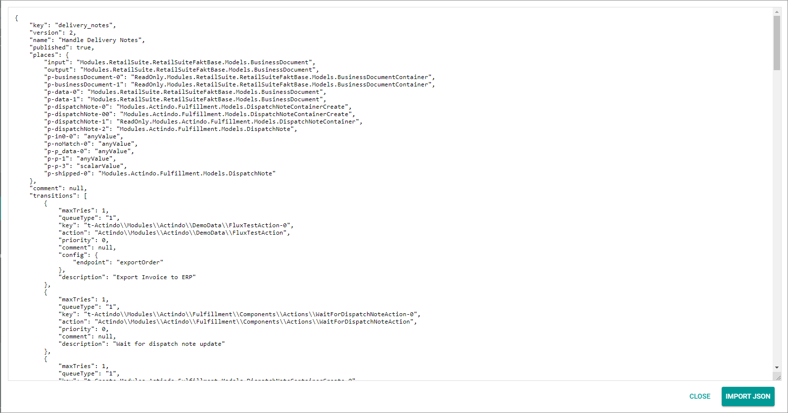

# Handle delivery notes

**Short description**

The *Handle delivery notes* workflow is used to process the delivery of the order handled in the [*Import order and create delivery notes*](../ImportOrderCreateDeliveryNotes/ImportOrderCreateDeliveryNotes.md) workflow. 

**Summary**

|    |    |  
|----|----|
|**Purpose** | Ship the order to the customer. |
|**Affected entities** | Actindo.Modules.Actindo.Channels.Models.Order   Actindo.Extensions.Actindo.UCSProductSync.Models.RetailSuiteOrder   Actindo.Modules.RetailSuite.RetailSuiteFaktB ase.Models.BusinessDocument   Actindo.Modules.Actindo.Fulfillment.Models.DispatchNote   Actindo.Modules.Actindo.Channels.Models.Shipment (indirectly)|
|**Included plugins** | Workflows   Omni-Channel   PIM   Order Management   Warehouse   Accounting   Taxes   Fulfillment   DataHub | 
|**Included thrid party software** | (optional) |   
|**Trigger** |  The process is triggered by the subordinate [*Import order and create delivery notes*](../ImportOrderCreateDeliveryNotes/ImportOrderCreateDeliveryNotes.md) process. | 
|    |     |

**Included steps**

- Synchronization of the shipments in the *Omni-Channel* module
- Delivery creation in the *Omni-Channel* module and upload to the channel (marketplace or webshop) 
- Invoice creation from the delivery note
- Invoice export to an external system, for example an accounting system (optional)
- Dispatch note creation in the *Fulfillment* module
- Dispatch note transfer to an external logistics provider
- Differentiation between multiple LSPs (optional)
- Shipment status update in the channel after report by the LSP
- Synchronitation of the dispatch note

## How to set up a delivery note workflow

After a delivery note has been created for an order, the further delivery process can be handled in Actindo until its final delivery to the customer. 
You can automate this process by using the *Workflows* module and building a workflow that is handling all processes after the import up to the delivery. As each workflow can be customized, it is possible to include or exclude different processes depending on the customers needs.
In the following, it is described how to build a workflow template that is covering the processes below:
- Delivery transfer to the logistics service provider (LSP)
- Dispatch note creation
- Dispatch handling by the LSP and delivery to the customer
- Order status update
- Invoice creation
- Invoice transfer to an external system

#### Prerequisites

- The *Accounting* module is configured.
- The *Taxes* module is configured.
- The products are created in the *PIM* module. 
- A connection to the channel (marketplace or webshop) is configured in the *Omni-Channel* module and the offers to the products are created.
- A connection to the logistics service provider (LSP) is configured in the *Fulfillment* module.

#### Procedure

*Workflows > Workflows > Tab OVERVIEW*

1. Click the  (Add) button in the bottom right corner.   
    The *New workflow* window is displayed.

    

2. Enter **Handle Delivery Notes** in the *Select a name for your new workflow* field.

3. Enter **delivery_notes** in the *Select a unique key for your new workflow* field. The key is required for API access and must be unique within the workflow version.

4. Select the **___WorkflowAutogen___\Actindo\Modules\RetailSuite\RetailSuiteFaktBase\Models\BusinessDocument** option as start place type in the *Choose the data type of your start place* field.

    > [Info] Enter a keyword in the field, for example **business**, to limit the data types displayed in the list. The list of data types is filtered for your keyword as you type.

5. Select the **___WorkflowAutogen___\Actindo\Modules\RetailSuite\RetailSuiteFaktBase\Models\BusinessDocument** option as end place type in the *Choose the data type of your end place* field.

    > [Info] Enter a keyword in the field, for example **business**, to limit the data types displayed in the list. The list of data types is filtered for your keyword as you type.

6. Click the [CREATE] button in the bottom right corner.   
    The new workflow has been created. The *New workflow* window is closed. The workflow editor with the defined start and end places is displayed.  

    

7. In a new window, open the JSON library for workflows and copy the JSON code for the *Handle Delivery Notes* workflow to your clipboard, see [JSON Handle delivery notes](./HandleDeliveryNotes.json).

8. In the workflow editor, click the  (Points) button in the upper left corner next to the workflow name.   
    The workflow context menu is displayed.

    

9. Click the *Import JSON ..* menu entry in the context menu.   
    The *Import JSON* window with the JSON code for the current workflow is displayed.

    

10. Select the complete JSON code in the window, replace it by the JSON code in your clipboard and click the [IMPORT JSON] button in the bottom right corner.
    The *Import JSON* window is closed. The copied workflow is displayed in the workflow editor.

    

    > [Info] You can edit the workflow as desired before deploying it.

11. Click the  (Points) button in the upper left corner next to the workflow name.   
    The workflow context menu is displayed.

    

12. Click the *Deploy* menu entry in the context menu.   
    The copied workflow has been deployed and published.

    > [Info] For detailed information about the single actions, see [Description of the *Handle delivery notes* process](#description-of-the-handle-delivery-notes-process).

## Description of the *Handle delivery notes* process

Within a workflow, several actions are performed. If a certain number of actions are executed in a specific order with a common objective that can only be achieved by executing all of these actions, we speak of a so-called *snippet*. 
In the following, all snippets and single actions within the process are described in detail, specifying their function and functional settings.

### Sync shipments

The *Sync shipments* action is used to create the *shipment* entity in the *Omni-Channel* module and set its status to **open**. Depending on the driver of the connection, the channel is updated asynchronously.

#### Settings

The *Description* field contains the API endpoint that is addressed in this action. The *Key*, *Label*, *Queue type*, *Priority*, *Max tries* and *Long Description* fields have no functional meaning for the action.    

- *Description*   
    .syncShipments | syncShipments (/Actindo.Extensions.Actindo.UCSProductSync.OrderStatusSync.syncShipments)

### Create invoice 

The *Create invoice* action is used to duplicate the document and create a document specified in the static inputs from the input document.
In this template case, the incoming delivery note is duplicated and an invoice is created. Via the *origin* output port, the duplicated original document, that is the delivery note, is output. Via the *data* output port, the invoice is output. The destination type of the document which is output via the *data* output port is specified in the *Destination type* static input.
The delivery note must be duplicated, as it is needed in the *Wait for parallel input* action together with the dispatch note from the *Fulfillment* module for the further process. 

#### Settings

The *Description* field contains the API endpoint that is addressed in this action. The *Key*, *Label*, *Queue type*, *Priority*, *Max tries* and *Long Description* fields have no functional meaning for the action.    

- *Description*   
    .copy | Create a copy of the given business document (/Actindo.Modules.RetailSuite.RetailSuiteFaktBase.BusinessDocuments.copy)

**Static inputs**

- *Destination type*   
    Enter **"RE"** as value for the *destinationType* variable to create an invoice from the delivery note. 

    > [Info] The value must be valid JSON and is type strict. Therefore, **"RE"** must be specified as a string with quotation marks.

### Post invoice to accounting

The *Post invoice to accounting* action is used to post the document, dependent on the document type, in the internal accounting and/or warehousing system. In this template case, the invoice is posted in the *Accounting* module.

#### Settings

The *Description* field contains the API endpoint that is addressed in this action. The *Key*, *Label*, *Queue type*, *Priority*, *Max tries* and *Long Description* fields have no functional meaning for the action.    

- *Description*   
    .post | Post a business document to stock and/or accounting (/Actindo.Modules.RetailSuite.RetailSuiteFaktBase.BusinessDocuments.post)

## Ship the order 

To ship an order, the following actions are required:
- [Duplicate input action](#duplicate-input-action)
- [Split by criterion](#split-by-criterion)
- [Create CreateContainer](#create-createcontainer)
- [Create dispatch](#create-dispatch)
- [Export dispatch to LSP](#export-dispatch-to-lsp)
- [Wait for dispatch note update](#wait-for-dispatch-note-update)
- [Wait for parallel input](#wait-for-parallel-input)
- [Sync shipments](#sync-shipments)

### Duplicate input action

The *Duplicate input action* action is used to duplicate the input and output it via two different output ports. In this template case, the delivery note is duplicated and output via both ports.

#### Settings

The *Description*, *Key*, *Label*, *Queue type*, *Priority*, *Max tries* and *Long Description* fields have no functional meaning for the action.    

### Split by criterion

The *Split by criterion* action is used to compare the warehouse ID of the delivery note in the input value with the warehouse ID defined in the action and output the delivery note in a different output port depending on whether the input value matches or does not match the defined warehouse ID. By doing so, different ways can be specified for the different warehouse IDs and, consequently, the different logistics service provider (LSP) for domestic and foreign deliveries.    
The warehouse ID with which the input value is compared must be configured in the *Configuration* section of the action setting. In this template case, documents with the warehouse ID defined in the *Value* field are output via the *match* output port, all other document types via the *noMatch* output port.    
The warehouse with the ID defined in the *Value* field is assigned to the LSP for domestic deliveries, all warehouses with a different ID are assigned to the LSP for foreign deliveries. By this distinction, the different LSPs can be specified for domestic and foreign deliveries.    
The warehouses and the LSPs are determined in the stock withdrawal matrix: *Warehouse > Settings > Tab WAREHOUSE > Sub-tab Stock withdrawal matrix*.  

#### Settings

The *Description*, *Key*, *Label*, *Queue type*, *Priority*, *Max tries* and *Long Description* fields have no functional meaning for the action.    

**Configuration**

- *Path*    
    Enter **forceLagerGroupId** as path to the property of the input object to be compared with.

    > [Info] The properties of an entity you can refer to are described in the relevant API documentation: *Dev Tools > API > Tab DATA MODELS*. 

[comment]: <> (link to api docu?)

- *Operator*   
    Enter **=** as operator for the comparison, so that it is a match if the input value equals the defined value.

- *Value*   
    Enter the applicable ID of the warehouse group as value to be compared with the input value. 
    
    > [Info] The value must be valid JSON and is type strict. Therefore, the warehouse ID must be specified as a string with quotation marks.

### Create CreateContainer

The *Create CreateContainer* action is used to create a container for a new document from the document in the input port and the specified static inputs.
In this template case, the container is used to create a dispatch note from the delivery note and the applicable connection ID in the *Fulfillment* module which must be specified in the static inputs. The connection ID is used to identify the corresponding LSP. By this action, the request to create the dispatch note has been made, but it must be executed in the following action to create the dispatch note.

#### Settings

The *Description* field contains the API endpoint that is addressed in this action. The *Key*, *Label*, *Queue type*, *Priority*, *Max tries* and *Long Description* fields have no functional meaning for the action.  

- *Description*   
    Create (#/components/schemas/RequestHydration.Modules.Actindo.Fulfillment.Models.DispatchNoteContainerCreate)

**Static inputs**

- *connection*   
    Enter the applicable ID as value for the *connection* variable to create a dispatch note for the corresponding connection in the *Create dispatch note* action. All database objects can be configured by a static JSON input in the *Static inputs* section of the action settings. The connection ID must be specified as an object, for instance **{"id":12}**.

    > [Info]  The value must be valid JSON and is type strict, for example a string must be specified as a string (**\"example\"**), an integer as an integer (**123**), and so on.. 

### Create dispatch

The *Create dispatch* action is used to create and persist a dispatch note in the *Fulfillment* module: *Fulfillment > Dispatch Notes > Tab LIST*.   
The data are mapped via ETL.
In this template case, the request made in the preceding action is executed and the dispatch note is created from the data in the CreateContainer. The generated dispatch note is passed on to the next action.

[comment]: <> (link auf Fulfillment)

#### Settings

The *Description* field contains the API endpoint that is addressed in this action. The *Key*, *Label*, *Queue type*, *Priority*, *Max tries* and *Long Description* fields have no functional meaning for the action.    

- *Description*   
    .create | Creates and persists a new dispatch note from an existing business document. (/Actindo.Modules.Actindo.Fulfillment.DispatchNotes.create)

### Export dispatch to LSP

[comment]: <> (screenshot anpassen)

The *Export dispatch to LSP* action is used to export the dispatch note through its configured driver based on the connection of the dispatch note in the *Fulfillment* module to the logistics service provider (LSP).

#### Settings

The *Description* field contains the API endpoint that is addressed in this action. The *Key*, *Label*, *Queue type*, *Priority*, *Max tries* and *Long Description* fields have no functional meaning for the action.    

- *Description*   
    .export | Exports the dispatch note through its configured fulfillment driver (/Actindo.Modules.Actindo.Fulfillment.DispatchNotes.export)

### Wait for dispatch note update

The *Wait for dispatch note update* action is used to wait for the feedback from the logistics service provider (LSP) that the order has been shipped. The status is retrieved in a predefined time interval. 

#### Settings

The *Description*, *Key*, *Label*, *Queue type*, *Priority*, *Max tries* and *Long Description* fields have no functional meaning for the action.    

### Wait for parallel input

The *Wait for parallel input* action is used to wait for two inputs to be received by the action before executing the action. In this template case, the action awaits the delivery note and the dispatch note and outputs the delivery note as the delivery note is needed for the sync in the following *Sync shipments* action.

#### Settings

The *Description*, *Key*, *Label*, *Queue type*, *Priority*, *Max tries* and *Long Description* fields have no functional meaning for the action.    

### Sync shipments

The *Sync shipments* action is used to change the *shipment* entity status to **closed**. Depending on the driver of the connection, the channel is updated asynchronously.

#### Settings

The *Description* field contains the API endpoint that is addressed in this action. The *Key*, *Label*, *Queue type*, *Priority*, *Max tries* and *Long Description* fields have no functional meaning for the action.    

- *Description*   
    .syncShipments | syncShipments (/Actindo.Extensions.Actindo.UCSProductSync.OrderStatusSync.syncShipments)

