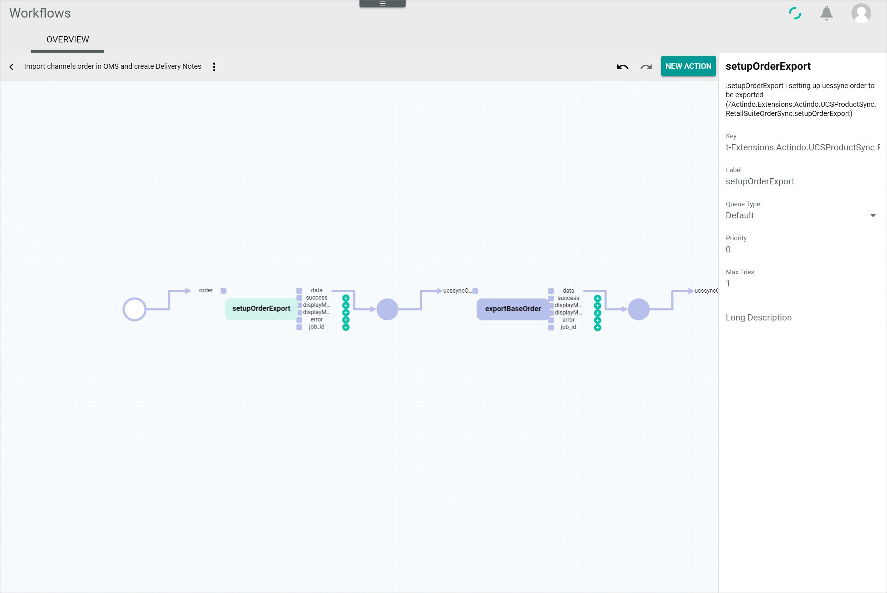
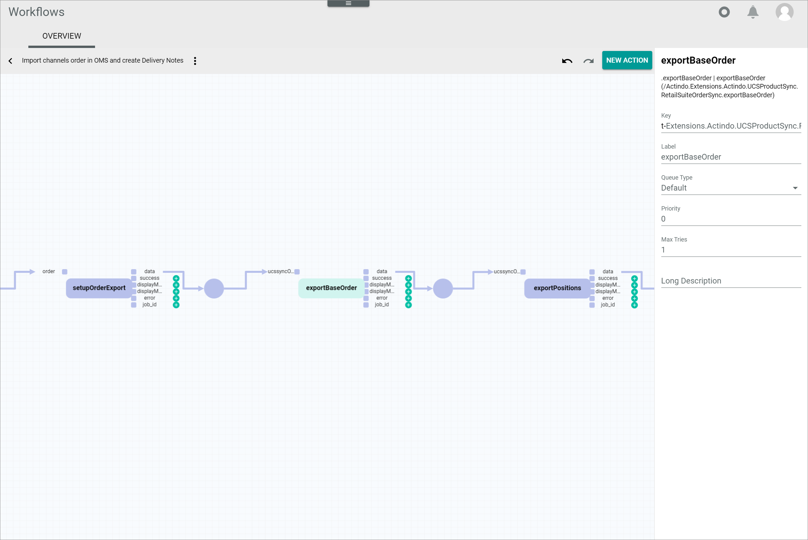
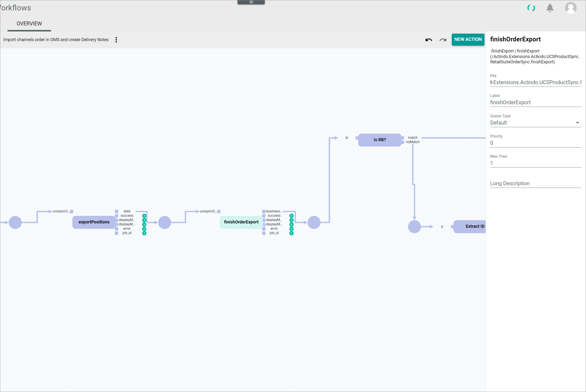
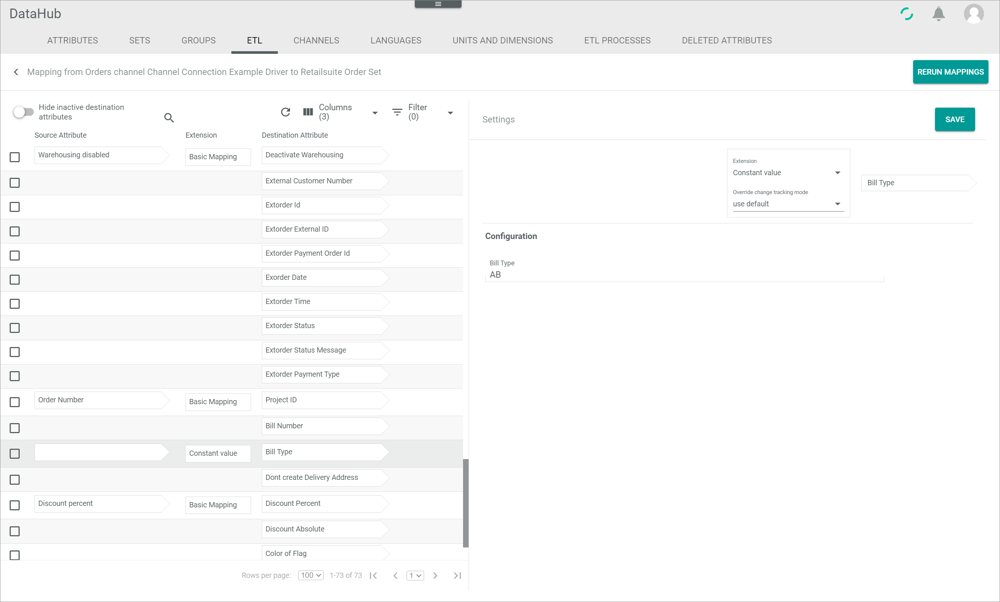
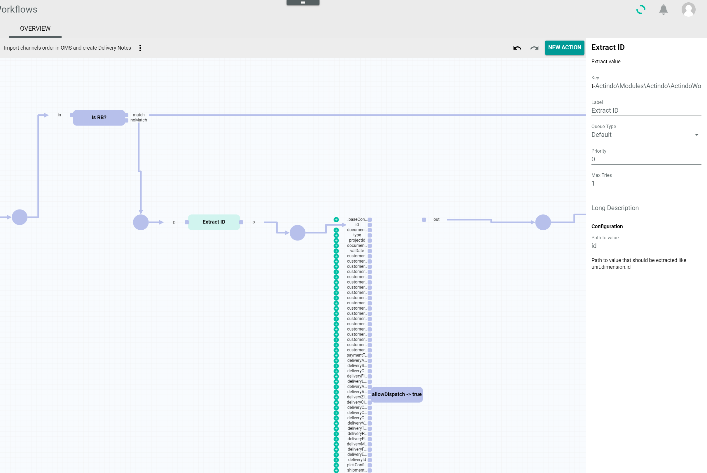
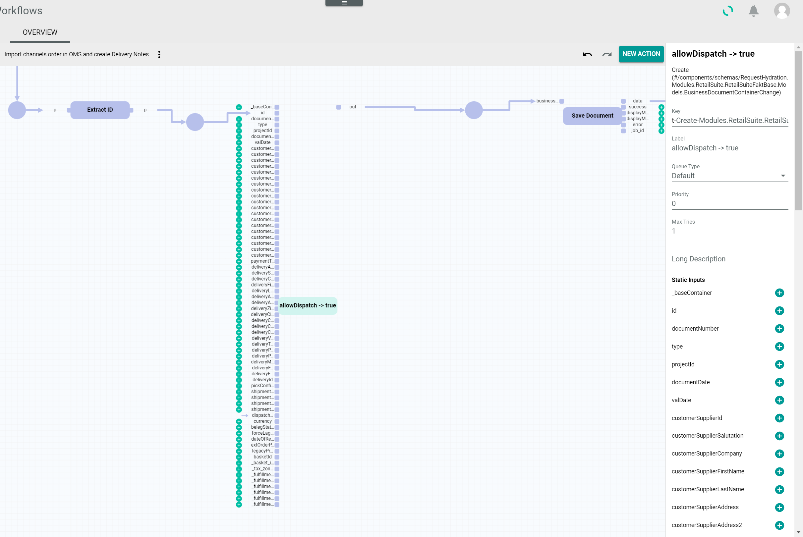
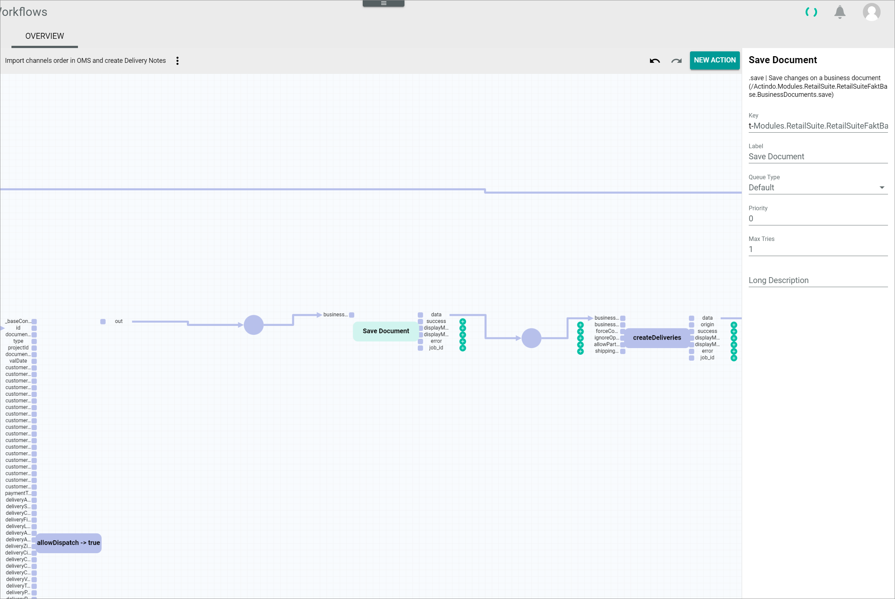
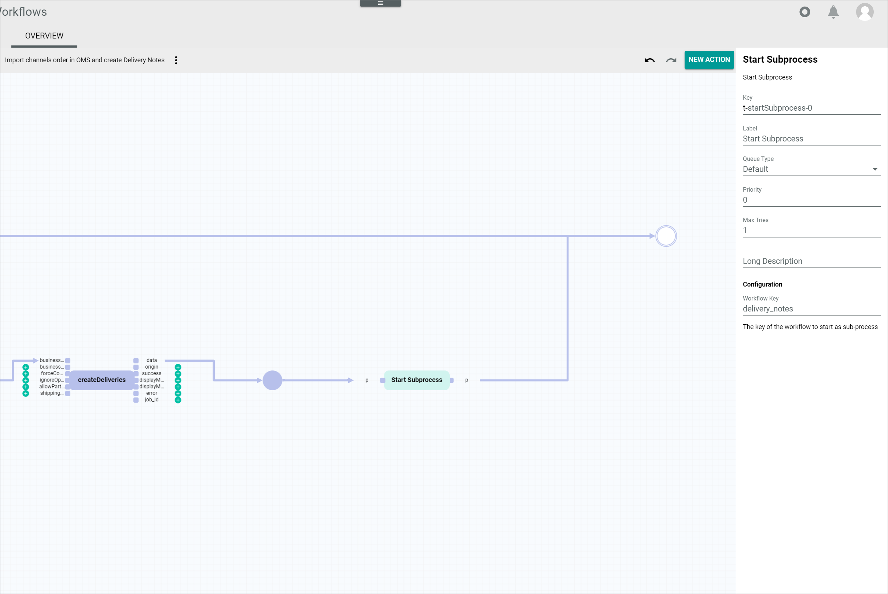

# Import order and create delivery notes

**Short description**

The *Import order and create delivery note* workflow is used to import orders from the *Omni-Channel* module to the *Order management* module, generate a leading document and, if required, a delivery note and trigger the further delivery process. The delivery process itself is handled in the subordinate [*Handle delivery note*](../HandleDeliveryNote/HandleDeliveryNote.md) workflow. 

| Summary ||  
|----|----|
|**Purpose** | Import the order to the *Order management* module. |
|**Affected entities** | Modules.Actindo.Channels.Models.Order   ReadOnly.Extensions.Actindo.UCSProductSync.Models.RetailSuiteOrderContainer   Extensions.Actindo.UCSProductSync.Models.RetailSuiteOrder   Modules.RetailSuite.RetailSuiteFaktBase.Models.BusinessDocumentContainerChange   ReadOnly.Modules.RetailSuite.RetailSuiteFaktBase.Models.BusinessDocumentContainer   Modules.RetailSuite.RetailSuiteFaktBase.Models.BusinessDocument     Actindo.Modules.Actindo.Channels.Models.Order   Actindo.Extensions.Actindo.UCSProductSync.Models.RetailSuiteOrder   Actindo.Modules.RetailSuite.RetailSuiteFaktBase.Models.BusinessDocument |
|**Included plugins** | Workflows   Omni-Channel   PIM   Order Management   Warehouse   Accounting   Taxes   Fulfillment   Venduo POS (optional) | 
|**Included third party software** | None |   
|**Trigger** | The process is triggered as soon as an order is completely imported from the channel (marketplace or webshop) to *Omni-Channel*. | 

[comment]: <> (check affected entities)

**Included steps**

- Order import from the *Omni-Channel* to the *Order management* module
- Leading document creation
- Payment sync from the *Venduo POS* module to the *Accounting* module (optional, if the *Venduo POS* module is installed)
- Delivery note creation
- Triggering of the subordinate [*Handle delivery note*](../HandleDeliveryNote/HandleDeliveryNote.md) workflow

## How to set up an order import workflow

After an order has been placed in a webshop or on a marketplace and imported to the *Omni-Channel* module, this order can be further processed in Actindo. 
You can automate this process by using the *Workflows* module and building a workflow that is handling all processes after the import up to the delivery. As each workflow can be customized, it is possible to include or exclude different processes depending on the customers needs.
In the following, it is described how to build a workflow template that is covering the processes below:
- Order export from *Omni-Channel* to *Order management*
- Delivery note creation

#### Prerequisites

- The *Accounting* module is configured.
- The *Taxes* module is configured.
- The products are created in the *PIM* module. 
- A connection to the channel (marketplace or webshop) is configured in the *Omni-Channel* module and the offers to the products are created.

#### Procedure

*Workflows > Workflows > Tab OVERVIEW*

1. Click the  (Add) button in the bottom right corner.   
    The *New workflow* window is displayed.

    

2. Enter **Import channels order in OMS and create delivery notes** in the *Select a name for your new workflow* field.

3. Enter **create_delivery_notes** in the *Select a unique key for your new workflow* field. The key is required for API access and must be unique within the workflow version.

4. Select the **___WorkflowAutogen___\Actindo\Modules\Actindo\Channels\Models\Order** option as start place type in the *Choose the data type of your start place* field.

    > [Info] Enter a keyword in the field, for example **order**, to limit the data types displayed in the list. The list of data types is filtered for your keyword as you type.

5. Select the **___WorkflowAutogen___\Actindo\Modules\RetailSuite\RetailSuiteFaktBase\Models\BusinessDocument** option as end place type in the *Choose the data type of your end place* field.

    > [Info] Enter a keyword in the field, for example **business**, to limit the data types displayed in the list. The list of data types is filtered for your keyword as you type.

  6. Click the [CREATE] button in the bottom right corner.   
    The new workflow has been created. The *New workflow* window is closed. The workflow editor with the defined start and end places is displayed.  

    

[comment]: <> (add screenshot)

7. In a new window, open the JSON library for workflows and copy the JSON code for the *Import channels order in OMS and create delivery notes* workflow to your clipboard, see [JSON Import channels order in OMS and create delivery notes](./ImportOrderCreateDeliveryNote.json).

8. In the workflow editor, click the  (Points) button in the upper left corner next to the workflow name.   
    The workflow context menu is displayed.

    

9. Click the *Import JSON ..* menu entry in the context menu.   
    The *Import JSON* window with the JSON code for the current workflow is displayed.

    

[comment]: <> (add screenshot)

10. Select the complete JSON code in the window, replace it by the JSON code in your clipboard and click the [IMPORT JSON] button in the bottom right corner.
    The *Import JSON* window is closed. The copied *Import channels order in OMS and create delivery notes* workflow is displayed in the workflow editor.

    

[comment]: <> (add screenshot)

    > [Info] You can edit the workflow as desired before deploying it.

11. Click the  (Points) button in the upper left corner next to the workflow name.   
    The workflow context menu is displayed.

    

12. Click the *Deploy* menu entry in the context menu.   
    The copied workflow has been deployed and published.

    > [Info] For detailed information about the single actions, see [Description of the *Import order and create delivery notes* process](#description-of-the-import-order-and-create-delivery-notes-process).

## Description of the *Import order and create delivery notes* process

Within a workflow, several actions are performed. If a certain number of actions are executed in a specific order with a common objective that can only be achieved by executing all of these actions, we speak of a so-called *snippet*. 
In the following, all snippets and single actions within the process are described in detail, specifying their function and their functional settings.

## Import an order to OMS

To import an order from the *Omni-Channel* module to the *Order management* module, the following four actions are required:
- [Setup order for export](#setup-order-for-export)
- [Export base order](#export-base-order)
- [Export positions](#export-positions)
- [Finish order export](#finish-order-export)

### Setup order for export    

The *Setup order for export* action is used to prepare the order in the *Omni-Channel* module to be exported to the *Order management* module.

#### Settings

The *Description* field contains the API endpoint that is addressed in this action. The *Key*, *Label*, *Queue type*, *Priority*, *Max tries* and *Long Description* fields have no functional meaning for the action.  

- *Description*   
    .setupOrderExport | setting up ucssync order to be exported (/Actindo.Extensions.Actindo.UCSProductSync.RetailSuiteOrderSync.setupOrderExport)

### Export base order

The *Setup order for export* action is used to export the document header, for example customer data to create a new customer if not yet registered, and to assign the document number to the leading document.

#### Settings

The *Description* field contains the API endpoint that is addressed in this action. The *Key*, *Label*, *Queue type*, *Priority*, *Max tries* and *Long Description* fields have no functional meaning for the action.  

- *Description*   
    .exportBaseOrder | exportBaseOrder (/Actindo.Extensions.Actindo.UCSProductSync.RetailSuiteOrderSync.exportBaseOrder)

### Export positions

The *Setup order for export* action is used to export the item data of the order and to determine from which warehouse the items are taken. The warehouse is determined in the stock withdrawal matrix: *Warehouse > Settings > Tab WAREHOUSE > Sub-tab Stock withdrawal matrix*. 

[comment]: <> (Verweis auf Lager-Doku)

#### Settings

The *Description* field contains the API endpoint that is addressed in this action. The *Key*, *Label*, *Queue type*, *Priority*, *Max tries* and *Long Description* fields have no functional meaning for the action.  

- *Description*   
    .exportPositions | exportPositions (/Actindo.Extensions.Actindo.UCSProductSync.RetailSuiteOrderSync.exportPositions)

### Finish order export

The *Finish order export* action is used to finish the order export to OMS and post the leading document. Most of the time, this leading document is a cash invoice or an order confirmation, but in general, the customer can define the type of document individually in the ETL mapping.   
The corresponding mapping is the mapping from the *Orders channel "Connection Name"* attribute set of the respective collection to the *Retailsuite Order Set* attribute set. 

The document type must be defined by entering the key of the desired document type as a constant value for the *Bill Type* destination attribute in the *Bill Type* field of the *Configuration* section. The following document types are available:
- AN: Offer
- AB: Order confirmation
- RE: Invoice
- RB: Cash invoice
- AR: Budget billing invoice
- GU: Correction invoice
- WG: Value credit
- LI: Delivery note
- MA: Dunning notice
- BE: Purchase order
- LB: Loan voucher
- PR: Pro forma invoice
- ST: Reversal document
- LD: Dropship delivery note
- RT: Return
- RS: Return to customer

For detailed information about mapping an attribute, see [Edit the ETL attribute mappings](../DataHub/Operation/01_ManageETLMappings.md#edit-the-etl-attribute-mappings)

#### Settings

The *Description* field contains the API endpoint that is addressed in this action. The *Key*, *Label*, *Queue type*, *Priority*, *Max tries* and *Long Description* fields have no functional meaning for the action.  

- *Description*   
    .finishExport | finishExport (/Actindo.Extensions.Actindo.UCSProductSync.RetailSuiteOrderSync.finishExport)

## Finalize cash invoice or create delivery note

To finalize the document in case of a cash invoice or to create a delivery note for any other document type, the following six actions are required:
- [Split by criterion](#split-by-criterion)
- [Extract value](#extract-value)
- [Create ChangeContainer](#create-changecontainer)
- [Save document](#save-document)
- [Create deliveries](#create-deliveries)
- [Start subprocess](#start-subprocess)

### Split by criterion

The *Split by criterion* action is used to compare the type of document in the input value with a document type defined in the action and output the document in a different output port depending on whether the input value matches or does not match the defined document type. By doing so, different ways can be specified for the different document types.
The document type with which the input value is compared must be configured in the *Configuration* section of the action setting. In this template case, cash invoices are output via the *match* output port, all other document types via the *noMatch* output port. By this distinction, the cash invoice can be directly finalized whereas any other document types trigger the delivery note creation and the related processing. 

#### Settings

The *Description*, *Key*, *Label*, *Queue type*, *Priority*, *Max tries* and *Long Description* fields have no functional meaning for the action.    

**Configuration**

- *Path*    
    Enter **type** as path to the property of the input object to be compared with.

    > [Info] The properties of an entity you can refer to are described in the relevant API documentation: *Dev Tools > API > Tab DATA MODELS*. 

[comment]: <> (link to api docu?)

- *Operator*   
    Enter **=** as operator for the comparison, so that it is a match if the input value equals the defined value.

- *Value*   
    Enter **"RB"** as value to be compared with the input value. 
    
    > [Info] The value must be valid JSON and is type strict. Therefore, **"RB"** must be specified as a string with quotation marks.

### Extract value

The *Extract value* action is used to extract a certain value from the object in the input port and provide it for the further process.
The path to the value which should be extracted must be configured in the *Configuration* section of the action setting. In this template case, the ID of the document is extracted and passed on to the following *Create ChangeContainer* action. 

#### Settings

The *Description*, *Key*, *Label*, *Queue type*, *Priority*, *Max tries* and *Long Description* fields have no functional meaning for the action.    

**Configuration**

- *Path to value*    
    Enter **id** as path to the value that should be extracted from the input object.

### Create ChangeContainer

The *Create ChangeContainer* action is used to create a container that allows to edit a document.
In this template case, the document to be changed is specified by the ID which has been extracted in the preceding action and which is put in the *id* input port. The *dispatchAllowed* variable is defined as true by the corresponding JSON input in the static inputs. By this action, the request to change the document has been made, but it must be executed in the following action to save the changes in the document.

#### Settings

The *Description* field contains the API endpoint that is addressed in this action. The *Key*, *Label*, *Queue type*, *Priority*, *Max tries* and *Long Description* fields have no functional meaning for the action.  

- *Description*   
    Create (#/components/schemas/RequestHydration.Modules.RetailSuite.RetailSuiteFaktBase.Models.BusinessDocumentContainerChange)

**Static inputs**

- *dispatchAllowed*   
    Enter **"1"** as value for the *dispatchAllow* variable to set the variable to true and allow the dispatch without further payment verification. 
    Use this value if no further waiting for an receipt of payment is required, for example, if a secured payment type has been selected or if a capture process applies to the payment type, so the payment can still be processed at a later time.

    > [Info] The value must be valid JSON and is type strict. Therefore, **"1"** must be specified as a string with quotation marks.

### Save document

The *Save document* action is used to save the document and thus execute the changes on the document requested in the preceding actions.
In this template case, the *dispatchAllowed* variable in the document is changed to **true** to allow the further delivery note creation and pass on the changed document.

#### Settings

The *Description* field contains the API endpoint that is addressed in this action. The *Key*, *Label*, *Queue type*, *Priority*, *Max tries* and *Long Description* fields have no functional meaning for the action.  

- *Description*   
    .save | Save changes on a business document (/Actindo.Modules.RetailSuite.RetailSuiteFaktBase.BusinessDocuments.save)

### Create deliveries

The *Create deliveries* action is used to create the delivery note(s). For each (partial) delivery, a single delivery note is created in the *Order management* module. The delivery note is necessary to trigger that the order will leave the warehouse. 
If there is no stock in the warehouse, the action will run on error and the process will be canceled.

#### Settings

The *Description* field contains the API endpoint that is addressed in this action. The *Key*, *Label*, *Queue type*, *Priority*, *Max tries* and *Long Description* fields have no functional meaning for the action.  

- *Description*   
    .createDelivery | Create a delivery (delivery notes or dropship delivery notes) for a business document (/Actindo.Modules.RetailSuite.RetailSuiteFaktBase.BusinessDocuments.createDelivery)

### Start subprocess 

The *Start subprocess* action is used to start the process specified in the configuration as a subprocess. In this template case, the [*Handle delivery note*](../HandleDeliveryNote/HandleDeliveryNote.md) subprocess is started to handle the further delivery processing. Define the key of the workflow you want to start as a subprocess in the configuration. For each delivery note, a single subprocess will be started. The delivery note is transferred to the start place of the subprocess.

#### Settings

The *Description*, *Key*, *Label*, *Queue type*, *Priority*, *Max tries* and *Long Description* fields have no functional meaning for the action.    

**Configuration**

- *Workflow Key*   
    delivery_notes
