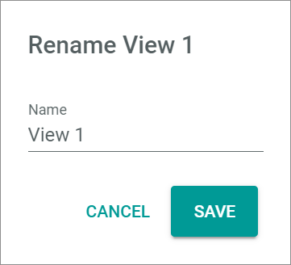
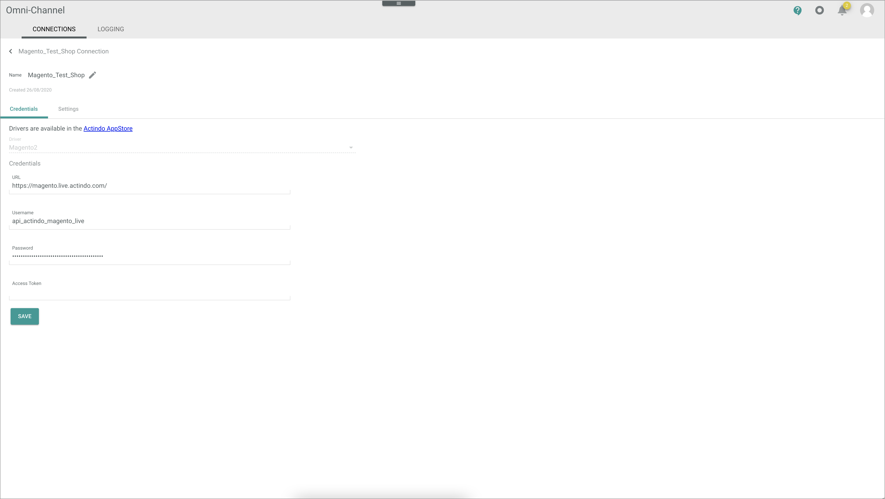
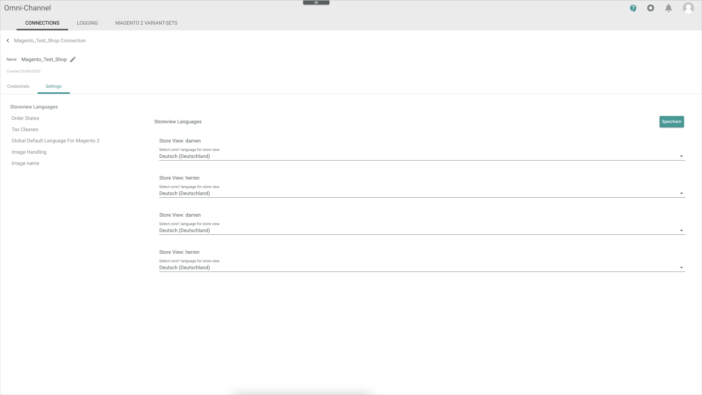
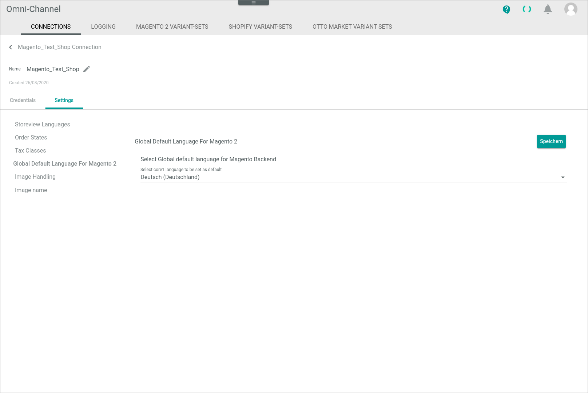

[!!Manage the Magento 2 connection](../Integration/01_ManageMagento2Connection.md)

# Connections

*Omni-Channel > Settings > Tab CONNECTIONS*

**Connections**

-  (Refresh)   
    Click this button to update the list of connections.

- *VIEW*   
    Click the drop-down list to select the view. All created views are displayed in the drop-down list. Click the  (Points) button to the right of the *VIEW* drop-down list to display the context menu and create a view.   

    -  (Points)      
        Click this button to the right of the *VIEW* drop-down list to display the context menu. The following menu entries are available:

        -  create  
            Click this entry to create a view. The *Create view* window is displayed, see [Create view](#create-view).

        -  rename  
            Click this entry to rename the selected view. The *Rename view* window is displayed, see [Rename view](#rename-view). This menu entry is only displayed if a view has been selected.

        -  reset  
            Click this entry to reset all unsaved changes to the settings of the selected view. This menu entry is only displayed if a view has been selected and any changes have been made to the view settings.

        -  publish  
            Click this entry to publish the view. This menu entry is only displayed if a view has been selected and unpublished.

        -  unpublish  
            Click this entry to unpublish the view. This menu entry is only displayed if a view has been selected and published.

        -  save  
            Click this entry to save the current view settings in the selected view. This menu entry is only displayed if a view has been selected.

            > [Info] When the settings of a view have been changed, an asterisk is displayed next to the view name. The asterisk is hidden as soon as the changes have been saved.

        -  delete  
            Click this entry to delete the selected view. A confirmation window to confirm the deletion is displayed. This menu entry is only displayed if a view has been selected.

-  Columns (x)   
    Click this button to display the columns bar and customize the displayed columns and the order of columns in the list. The *x* indicates the number of columns that are currently displayed in the list.

- [x]     
    Select the checkbox to display the editing toolbar. If you click the checkbox in the header, all connections in the list are selected.

- [DELETE]  
    Click this button to delete the selected connection. This button is only displayed if a single checkbox in the list of connections is selected.
    
    > [Info] Deleting a connection is a very complex process and can therefore take a long time. 

- [SYNCHRONIZE]  
    Click this button to synchronize the selected connection. This button is only displayed if a single checkbox in the list of connections is selected. The *Sync triggered* pop-up window is displayed.

    

- [DISABLE]  
    Click this button to disable the selected connection(s). This button is only displayed if the checkbox of at least one active connection is selected.

- [ENABLE]  
    Click this button to enable the selected connection(s). This button is only displayed if the checkbox of at least one inactive connection is selected. 

-  (Edit)  
    Click this button to edit the selected Magento 2 connection. This button is only displayed if a single checkbox in the list of connections is selected. Alternatively, you can click directly a row in the list to edit a connection. The *Edit connection* view is displayed, see [Edit Magento 2 connection](#edit-magento-2-connection).

The list displays all available connections. Depending on the settings, the displayed columns may vary. All fields are read-only.

- *Name*  
    Connection name.

- *Status*  
    Connection status. The following statuses are available:
    -  **Active**   
        The connection is enabled and data is being synchronized via the connection.
    -  **Inactive**   
        The connection is disabled and no data is being synchronized via the connection.   

- *Order/Return have errors*  
    Indication whether errors have occurred in orders or  returns:. The following options are available:  
    - **Yes**   
        Errors have occurred.   
    - **No**   
        No errors have occurred.

- *Driver*  
    Driver name.

- *ID*  
    Connection identification number. The ID number is automatically assigned by the system.

-  (Add)  
    Click this button to add a Magneto 2 connection. The *Create connection* view is displayed, see [Create Magento 2 connection](#create-magento-2-connection).

## Create view

*Omni-Channel > Settings > Tab CONNECTIONS > Button Points > Menu entry create*

- *Name*   
    Enter a name for the view.

- [CANCEL]   
    Click this button to cancel creating a view. The *Create view* window is closed.

- [SAVE]   
    Click this button to save the new view and display it in the *VIEW* drop-down list. The *Create view* window is closed.

## Rename view

*Omni-Channel > Settings > Tab CONNECTIONS > Button Points > Menu entry rename*

- *Name*   
    Click this field to edit the view name.

- [CANCEL]   
    Click this button to cancel renaming the view. The *Rename view* window is closed.

- [SAVE]   
    Click this button to save the changes and display it in the *VIEW* drop-down list. The *Rename view* window is closed.

## Create Magento 2 connection

*Omni-Channel > Settings > Tab CONNECTIONS > Button Add*

-  (Back)   
    Click this button to close the *Create connection* view and return to the connection list. All changes are rejected.

- *Name*   
    Enter a connection name.

-  (Apply)  
    Click this button to apply the entered connection name. This button is only displayed if the connection name has not yet been confirmed. 

-  (Edit)  
    Click this button to edit the connection name. This button is only displayed if the connection name has been confirmed. 

- *Driver*  
    Click the drop-down list and select the *Magento2* driver. All installed drivers are displayed. The *Credentials* section is displayed below the drop-down list.

    > [Info] Drivers are licensed and must be acquired via the app store or the corresponding e-commerce partner platform. The applicable driver credentials to establish the connection are obtained when acquiring the corresponding license.

**Credentials**

- *URL*  
    Enter the Magento 2 shop URL.

- *Username*   
    Enter the username. The connection username equals the login username for the Magento 2 admin backend.    

- *Password*  
    Enter the password. The connection password equals the login password for the Magento 2 admin backend.    

- *Access token*  
    This field must be left blank.

[comment]: <> (Mit jetziger Magento 2 Treiber Version muss man sich über Username und Password authentifizieren; access token Feld leer lassen; mit neuem Release, noch kein festes Datum: Access token eingeben, Username und Password leer lassen.)

- [SAVE]  
    Click this button to save the connection.

## Edit Magento 2 connection

*Omni-Channel > Settings > Tab CONNECTIONS > Select Magento 2 connection*

-  (Back)   
    Click this button to close the *Edit connection* view and return to the connection list. All changes are rejected.

- *Name*   
    Connection name. Click the button  (Edit) to the right of the name to edit it.

-  (Edit)  
    Click this button to edit the connection name.

-  (Apply)  
    Click this button to apply the changes to the connection name.  This button is only displayed if you are editing the connection name.

- *Created DD/MM/YYYY*  
    Creation date of the connection. This field is read-only.  

## Edit Magento 2 connection &ndash; Credentials

*Omni-Channel > Settings > Tab CONNECTIONS > Select Magento 2 connection > Tab Credentials*

- *Driver*  
    Driver name. For Magento 2, the *Magento2* driver is displayed. This drop-down list is read-only.

**Credentials** 

- *URL*  
    Click the field to edit the Magento 2 shop URL.

- *Username*   
    Click the field to edit the username. The connection username equals the login username for the Magento 2 admin backend.    

- *Password*  
    Click the field to edit the password. The connection password equals the login password for the Magento 2 admin backend.    

- *Access token*  
    This field must be left blank.

[comment]: <> (Mit jetziger Magento 2 Treiber Version muss man sich über Username und Password authentifizieren; access token Feld leer lassen; mit neuem Release, noch kein festes Datum: Access token eingeben, Username und Password leer lassen.)

- [SAVE]  
    Click this button to save any changes made.

## Edit Magento 2 connection &ndash; Settings

*Omni-Channel > Settings > Tab CONNECTIONS > Select Magento 2 connection > Tab Settings*

The *Settings* tab is composed of the following setting entries:

- [Store view languages](#store-view-languages)
- [Order states](#order-states)
- [Tax classes](#tax-classes)
- [Global default language for Magento 2](#global-default-language-for-magento-2)
- [Image handling](#image-handling)
- [Image name](#image-name)

### Store view languages

*Omni-Channel > Settings > Tab CONNECTIONS > Select Magento 2 connection > Tab Settings > Menu entry Store view languages*

**Store view languages**

- [Save]   
    Click this button to save any changes made.

- *Select Core1 language for store view*     
    Click the drop-down list and select the language in which the products will be uploaded to the corresponding store view. All available languages are displayed in the list. 

### Order states

*Omni-Channel > Settings > Tab CONNECTIONS > Select Magento 2 connection > Tab Settings > Menu entry Order states*

**Order states**

- [Save]  
    Click this button to save any changes made.

**Filter orders to import**  

-  state    
    Enable the toggles of all states for which the orders are to be imported. All states configured in Magento 2 are available. By default, the toggles are disabled.

- *Import only orders with a higher number than this*   
    Enter any desired order number to import orders with a higher order number than the specified.

- *Status to filter for (leave empty if not required)*   
    Enter a status to filter the orders to be imported if desired.

**Update order state and status on certain events**

- *Order state to be set in shop after successful import*  
    Click the drop-down list and select the state to be set when an order has been successfully imported. All states configured in Magento 2 are available.  

- *Order status to be set in shop after successful import*   
    Enter the order status to be set when an order has been successfully imported.

- *Order status to be set in shop after partially shipped*   
    Enter the order status to be set when an order has been partially shipped.

- *Order state to be set in shop after fully shipped*   
    Click the drop-down list and select the state to be set when an order has been 
    fully shipped. All states configured in Magento 2 are available.

- *Order status to be set in shop after fully shipped*    
    Enter the order status to be set when an order has been fully shipped. 

- *Order status to be set in shop after partially paid*   
    Enter the order status to be set when an order has been partially paid.

- *Order status to be set in shop after fully paid*   
    Enter the order status to be set when an order has been fully paid.

- *Order status to be set in shop after tracking number set*  
    Enter the order status to be set when a tracking number has been set for the order.

**Magento invoice handling**  
    
-  *Create an invoice in Magento for orders that are fully paid*   
    Enable the toggle to create invoices in Magento 2 for fully paid orders and ensure the correct processing of vouchers. By default, the toggle is disabled. When enabled, the *Notify customer about the invoice* toggle is unlocked. 
    
-  *Notify customer about the invoice*   
    Enable the toggle to notify customers when an invoice is generated. By default, this toggle is disabled and locked, and it is only unlocked when the *Create an invoice in Magento for orders that are fully paid* toggle has been enabled. 
 

### Tax classes

*Omni-Channel > Settings > Tab CONNECTIONS > Select Magento 2 connection > Tab Settings > Menu entry Tax classes*

**Tax classes**

- [Save]  
    Click this button to save any changes made.

- *Select Magento 2 tax class for Core1 tax class*  
    Click the drop-down list and select the applicable Magento 2 tax class. All tax classes available in Magento 2 are displayed in the list.

### Global default language for Magento 2

*Omni-Channel > Settings > Tab CONNECTIONS > Select Magento 2 connection > Tab Settings > Menu entry Global default language for Magento 2*

**Global default language for Magento 2**

- [Save]  
    Click this button to save any changes made.
 
- *Select Core1 language to be set as default*   
    Click the drop-down list and select the desired language to be set as default in the Magento backend. All languages available in the *Actindo Core1 Platform* are displayed in the list.

### Image handling

*Omni-Channel > Settings > Tab CONNECTIONS > Select Magento 2 connection > Tab Settings > Menu entry Image handling*

**Image handling**

- [Save]  
    Click this button to save any changes made.

- *Select the image attributes whose images must be hidden from the gallery*  
    Enable all toggles of the image attributes whose images you want to be hidden in the Magento 2 gallery. All image attributes available in Magento 2 are displayed.

### Image name

*Omni-Channel > Settings > Tab CONNECTIONS > Select Magento 2 connection > Tab Settings > Menu entry Image name*

**Image name**

-  *Apply from default*  
    Disable the toggle to configure how the image names should be customized before uploading to the Magento 2 shop and to improve the SEO of your images. When disabled, the *Use ECM image name* and *Regular expression* toggles are unlocked. If the toggle remains enabled, the default setting is applied, that is, a randomly generated image name will be uploaded to the Magento 2 shop. By default, the toggle is enabled. 

- [Save]  
    Click this button to save any changes made.

-  *Use ECM image name*   
    Disable the toggle if you want the image names to be randomly generated by upload. If the toggle remains enabled, the image names configured in the ECM module are uploaded. By default, the toggle is enabled. This toggle is only unlocked when the *Apply from default* toggle is disabled.

- *Regular expression*  
    Define a regular expression to shorten and customize the image names configured in the *ECM* module. Any sequence of characters entered that matches a regular expression will be removed from the image name when the image files are uploaded to the Magento 2 shop. This field is only unlocked when the *Apply from default* toggle is disabled.
