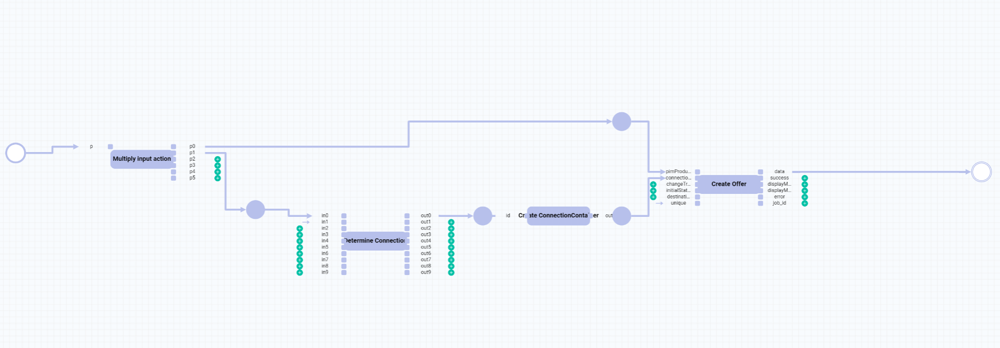

# Basic offer

## Description

| **Summary** |       |
| ----------- |------ |
| **Purpose** | Create an *Omni-Channel* offer from a *PIM* product. |
| **Affected entities** | Modules.Actindo.PIM.Models.PIMProduct   Readonly.Modules.Actindo.Channels.Models.ConnectionContainer   Actindo.Extensions.Actindo.PimChannelsConnection.Offers.createFromPimProduct |
| **Included plugins** | Workflows   PIM   Omni-Channel |
| **Included third party software** | optional | 
| **Trigger** | The process is triggered by the creation or the update of a *PIM* product. |
| **Start** | Modules.Actindo.PIM.Models.PIMProduct |
| **Core actions** | Multiply input action   Execute PHP Code |

For a detailed description of the core actions, see [Core actions](../ActindoWorkFlow/UserInterface/08_CoreActions.md).

## How to create a basic offer 

#### Prerequisites

#### Procedure

1. 

## JSON

        {
            "key": "create_offer_from_complete_pim_product",
            "version": 10,
            "name": "Create Offer from complete PIM product",
            "published": true,
            "places": {
                "input": "Modules.Actindo.PIM.Models.PIMProduct",
                "output": "anyValue",
                "p-connection-0": "ReadOnly.Modules.Actindo.Channels.Models.ConnectionContainer",
                "p-id-0": "scalarValue",
                "p-p1-0": "anyValue",
                "p-pimProduct-0": "ReadOnly.Modules.Actindo.PIM.Models.PIMProductContainer"
            },
            "comment": null,
            "transitions": [
                {
                    "maxTries": 1,
                    "queueType": "1",
                    "key": "t-Create-ReadOnly.Modules.Actindo.Channels.Models.ConnectionContainer-0",
                    "action": "Create-ReadOnly.Modules.Actindo.Channels.Models.ConnectionContainer",
                    "priority": 0,
                    "comment": null,
                    "description": "Create ConnectionContainer"
                },
                {
                    "maxTries": 1,
                    "queueType": "1",
                    "key": "t-deprecated_duplicate_input-0",
                    "action": "deprecated_duplicate_input",
                    "priority": 0,
                    "comment": null,
                    "description": "Multiply input action"
                },
                {
                    "maxTries": 1,
                    "queueType": "1",
                    "key": "t-determine_connection_php_code",
                    "action": "executePHP",
                    "priority": 0,
                    "comment": null,
                    "config": {
                        "code": "return [new Actindo\\Modules\\Actindo\\ActindoWorkFlow\\Components\\Containers\\ScalarValueContainer($in1)];"
                    },
                    "description": "Determine Connection"
                },
                {
                    "maxTries": 1,
                    "queueType": "1",
                    "key": "t-Extensions.Actindo.PimChannelsConnection.Offers.createFromPimProduct-0",
                    "action": "Extensions.Actindo.PimChannelsConnection.Offers.createFromPimProduct",
                    "priority": 0,
                    "comment": null,
                    "description": "Create Offer"
                }
            ],
            "arcs": [
                "p-id-0 -> t-Create-ReadOnly.Modules.Actindo.Channels.Models.ConnectionContainer-0(id)",
                "t-Create-ReadOnly.Modules.Actindo.Channels.Models.ConnectionContainer-0(out) -> p-connection-0",
                "input -> t-deprecated_duplicate_input-0(p)",
                "t-deprecated_duplicate_input-0(p0) -> p-pimProduct-0",
                "t-deprecated_duplicate_input-0(p1) -> p-p1-0",
                "p-p1-0 -> t-determine_connection_php_code(in0)",
                "t-determine_connection_php_code(out0) -> p-id-0",
                "p-pimProduct-0 -> t-Extensions.Actindo.PimChannelsConnection.Offers.createFromPimProduct-0(pimProduct)",
                "t-Extensions.Actindo.PimChannelsConnection.Offers.createFromPimProduct-0(data) -> output",
                "p-connection-0 -> t-Extensions.Actindo.PimChannelsConnection.Offers.createFromPimProduct-0(connection)",
                "\"2\" -> t-determine_connection_php_code(in1)",
                "\"1\" -> t-Extensions.Actindo.PimChannelsConnection.Offers.createFromPimProduct-0(unique)"
            ],
            "triggers": [
                {
                    "name": "PIM Product Saved",
                    "event": "postUpdate",
                    "active": true,
                    "unique": false,
                    "processPriority": 10,
                    "model": "Actindo\\Modules\\Actindo\\PIM\\Models\\PIMProduct",
                    "allConditionsRequired": true,
                    "conditions": []
                }
            ],
            "nodePositions": {
                "input": {
                    "x": -660,
                    "y": -60
                },
                "output": {
                    "x": 870,
                    "y": -30
                },
                "t-Extensions.Actindo.PimChannelsConnection.Offers.createFromPimProduct-0": {
                    "x": 470,
                    "y": -10
                },
                "p-connection-0": {
                    "x": 300,
                    "y": 40
                },
                "t-Create-ReadOnly.Modules.Actindo.Channels.Models.ConnectionContainer-0": {
                    "x": 200,
                    "y": 40
                },
                "p-id-0": {
                    "x": 80,
                    "y": 40
                },
                "t-determine_connection_php_code": {
                    "x": -90,
                    "y": 80
                },
                "p-pimProduct-0": {
                    "x": 302,
                    "y": -110
                },
                "t-deprecated_duplicate_input-0": {
                    "x": -460,
                    "y": -50
                },
                "p-p1-0": {
                    "x": -280,
                    "y": 30
                }
            }
        }

