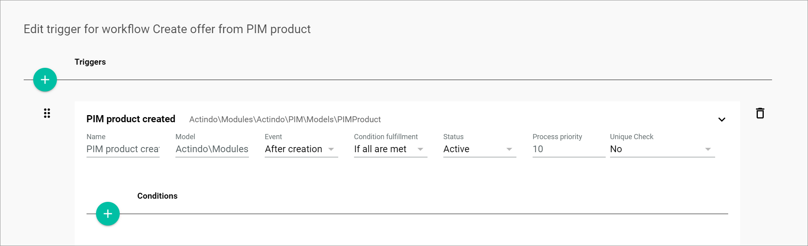
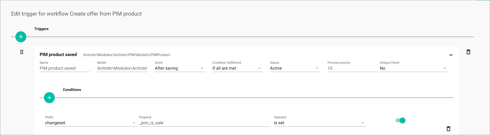

[!!Manage a product](../PIM/Operation/01_ManageProducts.md)
[!!Manage the connections](../Channels/Integration/01_ManageConnections.md)
[!!Manage a workflow](../ActindoWorkFlow/Operation/01_ManageWorkflows.md)
[!!Manage the triggers](../ActindoWorkFlow/Operation/02_ManageTriggers.md)

# Introduction

The *Actindo Core1 Platform* can create an offer automatically in the *Omni-Channel* module for every product managed in the *PIM* module. From *Omni-Channel*, the offer is then transferred to one or multiple connected sales channels. You can automate this process by creating a workflow in the *Process Orchestration* module.

This *Omni-Channel offer cookbook* documentation intends to provide you with detailed instructions to configure your own workflows. It contains the following information:

- An overview of the main components you need to create an offer from product workflow
- A detailed description of the procedures involved
- A few workflow examples, from the most basic to most complex use cases
- JSON templates for every workflow example provided

In this chapter, the basic setup procedures for an offer from product workflow are described: 

- [Set up an offer from product workflow](#set-up-an-offer-from-product-workflow)
- [Create a PIM product trigger](#create-a-pim-product-trigger)
- [Add a condition to a PIM product trigger](#add-a-condition-to-a-pim-product-trigger)

## Set up an offer from product workflow

To set up a workflow, you have to create a new workflow and define the basic settings first.   

[comment]: <> (SW: Are the data types of the places -or to be more precise tokens- explained in the workflow documentation? If not i would briefly mention what they mean)

#### Prerequisites

- You have created a *PIM* product, see [Create a product](../PIM/Operation/01_ManageProducts.md#create-a-product).
- You have created a connection to a sales channel, see [Create a connection](../Channels/Integration/01_ManageConnections.md#create-a-connection).

#### Procedure

*Process Orchestration > Workflows > Tab OVERVIEW*

1. See [Define workflow basic settings](../ActindoWorkFlow/Operation/01_ManageWorkflows.md#define-the-workflow-basic-settings) in the *Process Orchestration* documentation for a general description.

2. Create a workflow and define the following workflow basic settings:

| Field | Value |
| ------- | ----- |
| *Select a name for your new workflow* | Create offer from complete PIM product |
| *Select a unique key for your new workflow* | create_offer_from_complete_pim_product |
| *Choose the data type of your start place* |   \_\_\_WorkflowAutogen___\Actindo\Modules\Actindo\PIM\Models\PIMProduct |
| *Choose the data type of your end place* | Arbitrary Data |

## Create a PIM product trigger

A trigger is the combination of a business object, such as a *PIM* product, and an event that initiates a process, that is, the execution of the workflow. You need to define a trigger for a process to start automatically every time a certain scenario takes place. Otherwise, your workflow will only be executed once.

For the offer from product workflow, two types of triggers apply: 

1. *PIM product created*: to initiate your process every time a product is created
2. *PIM product saved*: to initiate your process every time a product is changed and saved

You can add several triggers to a workflow. 

[comment]: <> (Laut SW stimmt das nicht! -> Check mit Oli und ggf. Info in Workflows korrigieren! Bear in mind that the triggers work as a priority list, that is, a list of items arranged in descending order based on their priority. Therefore, the correct order of the triggers is crucial, as the system goes through the triggers in the order they are listed, starting from the top, and stops checking them as soon as a matching trigger is found. That means that the triggers must be organized from specific to general to cover all possible relevant cases.)
 
#### Prerequisites

You have set up an offer from product workflow, see [Set up an offer from product workflow](#set-up-an-offer-from-product-workflow).

#### Procedure

*Process Orchestration > Workflows > Tab OVERVIEW > Select offer from product workflow > Select workflow version*

1. See [Create a trigger](../ActindoWorkFlow/Operation/02_ManageTriggers.md#create-a-trigger) in the *Process Orchestration* documentation for a general description.

2. Create a trigger and configure the following settings depending on the trigger you want to use:

    1. *PIM product saved* trigger

        

        **Triggers**

        | Field | Value | Comments | 
        |---------|-------|----------| 
        |*Name* | PIM product saved |  |
        |*Model* | Actindo\Modules\Actindo\PIM\Models\PIMProduct | Path to data model, for example Actindo.Modules.PIM.Models.PIMProduct. For a list of data models, go to *Dev Tool > API > Data models*. |
        |*Event* | After saving | The workflow is triggered every time a product is saved in *PIM*. |
        |*Condition fulfillment* | If all are met |    |
        |*Status* | Active |  |
        |*Process priority* | 10 | |
        | *Unique check* | No |  |

    2. *PIM product created* trigger

        
        
        **Triggers**

        | Field | Value | Comments | 
        |---------|-------|----------|
        |*Name* | PIM product created |  |
        |*Model* | Actindo\Modules\Actindo\PIM\Models\PIMProduct | Path to data model, for example Actindo.Modules.PIM.Models.PIMProduct. For a list of data models, go to *Dev Tool > API > Data models*. |
        |*Event* | After creating | The workflow is triggered every time a product is created in *PIM*. |
        |*Condition fulfillment* | If all are met |  |
        |*Status* | Active |  |
        |*Process priority* | 10 |  |
        |*Unique check* | No | |

[comment]: <> (add in comments column: Model: path to data model, process priority + unique check refer to whole process -> or better add it to triggers in Process Orchestration doc)

3. If desired, you can add conditions to a trigger to define more precisely when a process is executed, see [Add a condition to a PIM product trigger](#add-a-condition-to-a-pim-product-trigger).

[comment]: <> (Unique check bezieht sich hier auf Prozess, also Prozess wird nur einmal für ein bestimmtes Produkt durchgeführt, wenn Setting auf Ja gesetzt, egal was man ändert und wie viel man was ändert.)

## Add a condition to a PIM product trigger

[comment]: <> (Maybe link the documentation of the workflow again for the different types of conditions changeset, vs entity, etc. Evtl. Workflows-Doku ergänzen)

[comment]: <> (i would add the info in the beginning that the version before is the more flexible one as i could calculate which connection to take instead of always using the same,and also creates the proper input token, but now we look at a simplified version that works just as well if we do not need that. Here the static input is internally mapped to the correct type and a the connection token we manually created before is created on the fly just from the id.)

You can add conditions to a trigger to define more precisely when a process is executed.  

In the case of the offer from product workflow, for example, you can determine that a new process is started only when a *PIM* product is saved (trigger) and it is put on sale (condition). This means that a new offer will be created in *Omni-Channel* only when the *PIM* product is marked as a sale item (the *Sale item* toggle in the *Product data* is enabled) and saved. 

You can add several conditions to a trigger. Depending of the trigger *Condition fulfillment* setting, only one (**if any is met**) or all (**if all are met**) conditions will apply. 

#### Prerequisites

You have created a *PIM* product trigger, see [Create a PIM product trigger](#create-a-pim-product-trigger).

#### Procedure

*Process Orchestration > Workflows > Tab OVERVIEW > Select offer from product workflow > Select workflow version > Button Points > Menu entry Triggers*

1. See [Add a condition](../ActindoWorkFlow/Operation/02_ManageTriggers.md#add-a-condition) in the *Process Orchestration* documentation for a general description.

2. Select the trigger to which you want to add a condition.

3. Add a condition and configure the following settings:

**Conditions** 

| Field | Value | Comments | 
|---------|-------|----------|
|*Prefix* | changeset. |  |
|*Property* | _pim_is_sale |  |
|*Operator* | Is set  | When selecting **Is set**, the toggle is automatically enabled.  |
|*Value* | - |   |

## Check the places data types (tokens)

[comment]: <> (Evtl. Workflows-Dokumentation ergänzen und von hier darauf verweisen)

The actions you need to use depend on the type of data available to you and the type of data you need to output. Some actions can handle all data types, such as the *Execute PHP* action, while other have certain restrictions. 

When creating a workflow, you need to be know what data type you are starting with and what data type you need to obtain for certain actions to be performed. Therefore, it is convenient to be familiar with the different data types and their meaning.

The following data types are available for the places (tokens) depending on the action you choose:

| Data type          | Meaning            | Transition |
|--------------------|--------------------|------------|
| Arbitrary data     |                    |            |
| Scalar value       |                    |            |
| Array value        |                    |            |
| Process ID         |                    |            |
| Business document ID |                  |            |
| Abstract             |                  |            |

| Core actions | Input data type(s) | Output data type(s) |
| ------------ | ------------------ | ---------------- |
| Change process priority | loop_through: Arbitrary Data   priority: Scalar value | p: Arbitrary Data |
| Multiply input action | p: Arbitrary Data | p0-05: Arbitrary Data |
| Execute PHP code | in0-in9: Arbitrary Data | out0-out9: Arbitrary Data | 
| Extract value | p: Arbitrary Data |  p: Arbitrary Data |
| Manipulate process priority | p: Arbitrary Data |  p: Arbitrary Data |
| Manual action | data_input: Arbitrary Data   event_id: Scalar Value | out0-out8: Arbitrary Data   timeout_output: Arbitrary Data |
| Split by criterion | in: Arbitrary Data | match: Arbitrary Data   noMatch: Arbitrary Data |
| Start subprocess | p: Arbitrary Data |  p: Arbitrary Data |
| Start subprocesses (core?) (Basic Petri net action) | p: Arbitrary Data   ignore: Arbitrary Data |  p: Arbitrary Data |
| Switch case action | in: Arbitrary Data | origin: Arbitrary Data   case1-case6: Arbitrary Data   default: Arbitrary Data |  
| Update process name and search string | p: abstract | p: abstract |  
| Wait for criterion | in: Arbitrary Data | match: Arbitrary Data   timeout: Arbitrary Data | 
| Wait for parallel input | p_data: Arbitrary Data   p_trigger: Arbitrary Data | p: Scalar Value |
| Waiting action | p: Arbitrary Data | p: Arbitrary Data |

| API endpoint action | Input data type(s) | Output data type(s) |
| ------------ | ------------------ | ---------------- |
| createOffer  | connection: ReadOnly.Modules.Actindo.Channels.Models.ConnectionContainer | success: Scalar Value   displayMessage: Scalar Value   displayMessageTitle: Scalar Value   error: Scalar Value   job_id: Scalar Value | 