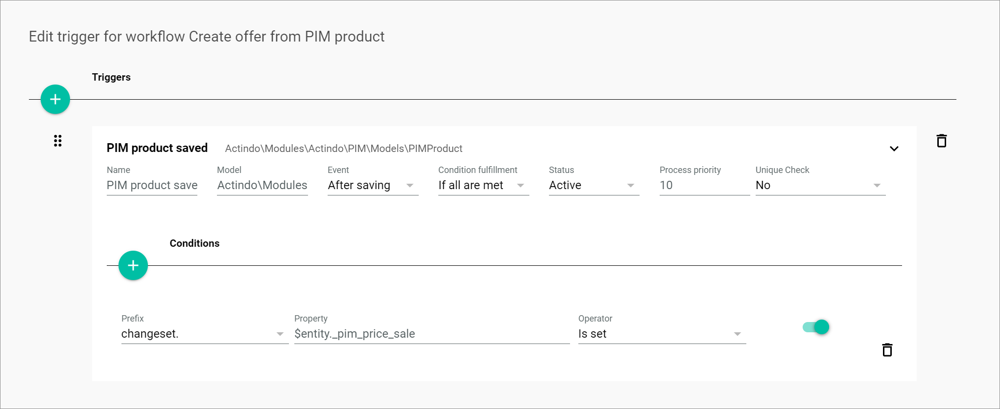

# Introduction

The *Actindo Core1 Platform* offers you the possibility to create an offer automatically in the *Omni-Channel* module for every product managed in the *PIM* module. From *Omni-Channel*, the offer will then be transferred to one or multiple connected sales channels. You can automate this process with a workflow in the *Process Orchestration* module.

This *Omni-Channel offer cookbook* documentation aims to ... and contains the following information:

- an overview of the main components you need to create an offer from product workflow
- a detailed description of the processes involved
- a few workflow examples, from the most basic to most complex use cases 
- JSON templates for every workflow example provided   

In this chapter, you will find the following information and processes:

- [Set up an offer from product workflow](#set-up-an-offer-from-product-workflow)
- [Create a PIM product trigger](#create-a-pim-product-trigger)
- [Add a condition to a PIM product trigger](#add-a-condition-to-a-pim-product-trigger)

## Set up an offer from product workflow

To set up a workflow, you have to create a new workflow and define the basic settings first.   

#### Prerequisites

- You have created a *PIM* product, see [Create a product](../PIM/Operation/01_ManageProducts.md#create-a-product).
- You have created a connection to a sales channel, see [Create a connection](../Channels/Integration/01_ManageConnections.md#create-a-connection).

#### Procedure

*Process Orchestration > Workflows > Tab OVERVIEW*

1. See [Define workflow basic settings](../ActindoWorkFlow/Operation/01_ManageWorkflows.md#define-the-workflow-basic-settings) in the *Process Orchestration* documentation for a general description.

2. Create a workflow and define the following workflow basic settings:

| Field | Value |
| ------- | ----- |
| *Select a name for your new workflow* | Create offer from complete PIM product |
| *Select a unique key for your new workflow* | create_offer_from_complete_pim_product |
| *Choose the data type of your start place* |   \_\_\_WorkflowAutogen___\Actindo\Modules\Actindo\PIM\Models\PIMProduct |
| *Choose the data type of your end place* | Arbitrary Data |

[comment]: <> (Warum nicht end place Channels.Offer?)

## Create a PIM product trigger

A trigger is the combination of a business object, such as a *PIM* product, and an event that initiates a process, that is, the execution of the workflow. You need to define a trigger for a process to start automatically every time a certain scenario takes place. Otherwise, your workflow will only be executed once.

For the offer from product workflow, two main types of triggers apply: 

1. *PIM product created*: to initiate your process every time a product is created
2. *PIM product saved*: to initiate your process every time a product is changed and saved

#### Prerequisites

You have set up an offer from product workflow, see [Set up an offer from product workflow](#set-up-an-offer-from-product-workflow).

#### Procedure

*Process Orchestration > Workflows > Tab OVERVIEW > Select the offer from product workflow > Select a workflow version*

1. See [Create a trigger](../ActindoWorkFlow/Operation/01_ManageWorkflows.md#define-the-workflow-basic-settings) in the *Process Orchestration* documentation for a general description.

2. Create a trigger and configure the following settings depending on the trigger you want to use:

    1. *PIM product saved* trigger

        

        | Triggers ||
        |----|----|
        |**Name** | PIM product saved |
        |**Model** | Actindo\Modules\Actindo\PIM\Models\PIMProduct |
        |**Event** | After saving | 
        |**Condition fulfillment** | If all are met |   
        |**Status** | Active |
        |**Process priority** | 10 | 
        | **Unique check** | No |

    2. *PIM product created* trigger

        

        | Triggers ||
        |----|----|
        |**Name** | PIM product created |
        |**Model** | Actindo\Modules\Actindo\PIM\Models\PIMProduct |
        |**Event** | After creating | 
        |**Condition fulfillment** | If all are met |   
        |**Status** | Active |
        |**Process priority** | 10 | 
        | **Unique check** | No |

3. If desired, you can add conditions to a trigger to define more precisely when a process is executed, see [Add a condition to a PIM product trigger](#add-a-condition-to-a-pim-product-trigger).

[comment]: <> (Unique check bezieht sich hier auf Prozess, also Prozess wird nur einmal für ein bestimmtes Produkt durchgeführt, wenn Setting auf Ja gesetzt, egal was man ändert und wie viel man was ändert.)

## Add a condition to a PIM product trigger

[comment]: <> (Letztes Mal hat es nicht funktioniert. Mit Stefan prüfen)

You can add conditions to a trigger to define more precisely when a process is executed.  

In the case of the offer from product workflow, for example, you can determine that a new process is started only when a *PIM* product is saved (trigger) and, for example, it is put on sale (condition). This means that a new offer will be created in *Omni-Channel* only when the product price in the *PIM* module has been changed. 

[comment]: <> (if the price has been modified, -> Ist das möglich mit _pim_price? Und was wäre Value? Oder mit Is set?)

You can add several conditions to a trigger. 

#### Prerequisites

You have created a *PIM* product trigger, see [Create a PIM product trigger](#create-a-pim-product-trigger).

#### Procedure

*Process Orchestration > Workflows > Tab OVERVIEW > Select offer from product workflow > Select a workflow version > Button Points > Menu entry Triggers*

> [Info] You have to select the trigger to which you want to add a condition.

1. See [Add a condition](../ActindoWorkFlow/Operation/02_ManageTriggers.md#Add-a-condition) in the *Process Orchestration* documentation for a general description.

2. Add a condition and configure the following settings:

| Conditions ||
|----|----|
|**Prefix** | changeset. |
|**Property** | _pim_price_sale |
|**Operator** | Is set | 
|**Value** | - |   
   

