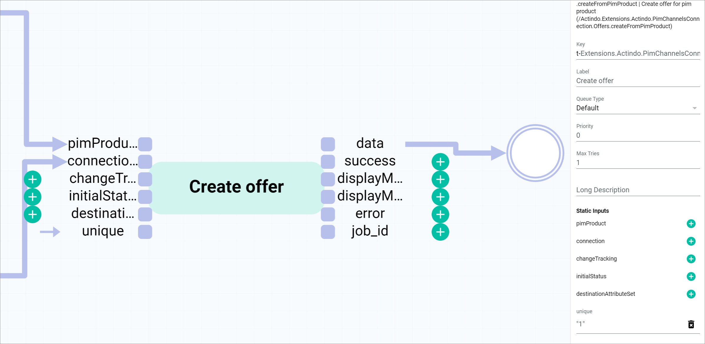

[!!Introduction](./01_Introduction.md)
[!!Manage a workflow](../ActindoWorkFlow/Operation/01_ManageWorkflows.md)
[!!Workflow and process elements](../ActindoWorkFlow/Overview/04_WorkflowProcessElements.md)
[!!Core actions](../ActindoWorkFlow/UserInterface/08_CoreActions.md)
[!!Manage the offers](../Channels/Operation/01_ManageOffers.md)

# Create a basic offer from a product workflow

## Overview

| **Summary** |       |
| ----------- |------ |
| **Purpose** | Create an *Omni-Channel* offer from a *PIM* product |
| **Affected entities** | Modules.Actindo.PIM.Models.PIMProduct   Readonly.Modules.Actindo.Channels.Models.ConnectionContainer   Actindo.Extensions.Actindo.PimChannelsConnection.Offers.createFromPimProduct |
| **Included plugins** | *Process Orchestration*   *PIM*   *Omni-Channel* |
| **Included third party software** | none | 
| **Trigger** | The process is triggered when a *PIM* product is created or saved. |

**Included steps**

- Multiply input to create two different workflow branches with the same start data 
- Determine the connection to the sales channel where you want to create the offer
- Create a connection container to transfer the connection ID to the create offer action
- Create an offer from the *PIM* product input in the start place

## Workflow setup

- To set up an offer from product workflow, see [Set up an offer from product workflow](./01_Introduction.md#set-up-an-offer-from-product-workflow).
- To create a *PIM* product trigger, see [Create a PIM product trigger](./01_Introduction.md#create-a-pim-product-trigger). 

## Workflow description

Within a workflow, several actions are performed. If a certain number of actions are executed in a specific order with a common objective that can only be achieved by executing all of these actions, we speak of a so-called *snippet*. In the following, all snippets and single actions within the process are described in detail, specifying their function and functional settings.

To create an offer, you must provide the *PIM* product and the connection ID of the the sales channel where the offer is going to be sold. The *PIM* product is input via the start place. To provide the connection ID, you have two possibilities: 

1. Insert a static input in the subsequent *Create offer* action with the desired connection ID in JSON format. For detailed information, see [Create an offer from product workflow with static inputs](./03_OfferFromProductStaticInputs.md). 
2. Determine the connection ID through a set of intermediate actions, that is, a snippet, see [Determine the connection ID](#determine-the-connection-id). 

[comment]: <> (Schwer, diesen parallelen Zweig zu erklären/rechtfertigen, wenn sowieso nächste PHP-Aktion ein static input schon hat. Oder gibt es andere Gründe?)

For detailed information on how to manage a workflow, see [Manage a workflow](../ActindoWorkFlow/Operation/01_ManageWorkflows.md).

## Determine the connection ID

To determine a connection ID, the following actions are required:

- [Multiply input action](#multiply-input-action)
- [Execute PHP code](#execute-php-code)
- [Create connection container](#create-connection-container)

### Multiply input action

The *Multiply input action* is used to output the data coming in via one input port to two output ports. For detailed information, see [Multiply input action](../ActindoWorkFlow/UserInterface/08_CoreActions.md#multiply-input-action). 

In this use case, the *PIM* product input via the *p* port is duplicated and output via the *p0* and the *p1* ports. The *PIM* product output via *p0* is used to create the offer later on. The *PIM* product output via *p1* is needed to determine the connection in the subsequent action. From this point on, the workflow splits in two branches which must be configured separately.

To do so, you must configure the *Multiply input action* action as follows:

#### Settings

| Field | Value | Comments | 
|---------|-------|----------|
| *Description* | Multiply input action | Core action   For detailed information, see [Core actions](../ActindoWorkFlow/UserInterface/08_CoreActions.md). |
| *Key* | deprecated_duplicate_input-0 | The key must be unique within a workflow. |
| *Label* | Duplicate product | It is recommended to enter a short descriptive name in the *Label* field. |
| *Queue type* | Default | For detailed information on all action settings, see [Transitions](../ActindoWorkFlow/Overview/04_WorkflowProcessElements.md#transitions). |
| *Priority* | 0 | |
| *Max tries* | 1 | |
| *Long description* | - | |

[comment]: <> (Deprecated in Key??? Das sieht verwirrend aus! Check!)

Once configured, the *Duplicate product* action presents the following structure:

| Input port   | Value | -  | Output port | Value    |
| --------------- | --- | --- | -------------- | ----  |
| *p*  | PIM product | - | *p0* | PIM product |
| -     |          | - | *p1* | PIM product  |

[comment]: <> (in P1 output port ist anyValue, aber warum? Sollte es nicht auch PIMProduct sein, vgl. Core action description: The data runs via the p input port into the workflow action and is output via both the p0 and the p1 output ports.)

[comment]: <> (Determine connection and Create connection container ist ein snippet? S. https://github.com/Actindo-AG/Documentation/blob/ACD-831/HandleDeliveryNotes/HandleDeliveryNotes.md Zusammen beschreiben? Snippet: Multiply input + PHP code determine connection + CreateConnectionContainer?)

### Execute PHP code

The *Execute PHP code* is used to execute a custom PHP code defined in the configuration. For detailed information, see [Execute PHP code](../ActindoWorkFlow/UserInterface/08_CoreActions.md#execute-php-code). 

In this use case, this action is used to determine the connection ID of the sales channel where the offer needs to be created. To do so, you must configure the *Execute PHP code* action as follows:

#### Settings

| Field | Value | Comments | 
|---------|-------|----------|
| *Description* | Execute PHP code | Core action   For detailed information, see [Core actions](../ActindoWorkFlow/UserInterface/08_CoreActions.md). |
| *Key* | determine_connection_php_code | The key must be unique within a workflow. |
| *Label* | Determine connection | It is recommended to enter a short descriptive name in the *Label* field. |
| *Queue type* | Default | For detailed information on all action settings, see [Transitions](../ActindoWorkFlow/Overview/04_WorkflowProcessElements.md#transitions). |
| *Priority* | 0 | |
| *Max tries* | 1 | |
| *Long description* | - | |

**Configuration**

| Field | Value | Comments | 
|---------|-------|----------|
| *PHP code* |  `return [new Actindo\Modules\Actindo\ActindoWorkFlow\Components\Containers\ScalarValueContainer($in1)];` | 

**Static inputs**

| Field | Value | Comments | 
|---------|-------|----------|
| *in0* | PIM product | Output from previous action |
| *in1* | "2" |  | |
| *in2*-*in9* | - | No further configuration needed |

[comment]: <> (WHY in1: 2? Das ist auch ein Static input... Verstehe nicht. Dieses Beispiel passt so nicht mit static value Erklärung.)

The *in0* contains the *PIM* product output via the *p1* of the *Duplicate product* action. The *in1* is a static input with value "2", which means... 
The connection data is output via the *out0* port, which will be connected to a *Create connection container* action. 

### Create connection container

The *Create container container* action is used to create a container for the value input via the *id* port.

In this use case, you need to create a container for the connection determined in the previous action. 

To do so, you must configure the *Create connection container* action as follows:

#### Settings

| Field | Value | Comments | 
|---------|-------|----------|
| *Description* | Create connection container | Create (#/components/schemas/RequestHydrationReadonly.Modules.Actindo.Channels.Models.ConnectionContainer) |
| *Key* | Create-ReadOnly.Modules.Actindo.Channels.Models.ConnectionContainer-0 | The key must be unique within a workflow. |
| *Label* | Create con. container | It is recommended to enter a short descriptive name in the *Label* field. |
| *Queue type* | Default | For detailed information on all action settings, see [Transitions](../ActindoWorkFlow/Overview/04_WorkflowProcessElements.md#transitions). |
| *Priority* | 0 | |
| *Max tries* | 1 | |
| *Long description* | - | |

After setting it up, the *Create con. container* action has the following structure:

| Input port     | Value | -  | Output port | Value    |
| --------------- | --- | ---| -------------- | ----  |
| *id*  | Connection ID ? | - | *out* | ReadOnly.Modules.Actindo.Channels.Models.ConnectionContainer |

[comment]: <> (Verstehe nicht ganz. Weitere Info benötigt!)

### Create offer from PIM product

The *Create offer from PIM product* action creates an offer in the *Omni-Channel* module from a *PIM* product.  

In this use case, you need to create an offer for the *PIM* product input via the *match* port from the *Duplicate product* action. The connection ID output via the *out* port of the *Create connection container* action is input via the *connection* port.  

To do so, you must configure the *Create offer from PIM product* action as follows:

#### Settings

| Field | Value      | Comments |
|---------|------------|----------|
| *Description* | .createFromPimProduct   Create offer for pim product (/Actindo.Extensions.Actindo.PimChannelsConnection.Offers.createFromPimProduct) | This field contains the API endpoint that is addressed in this action. |
| *Key* | Extensions.Actindo.PimChannelsConnection.Offers.createFromPimProduct-0 | The key must be unique within a workflow. |
| *Label* | Create offer | It is recommended to enter a short descriptive name in the *Label* field. |
| *Queue type* | Default | For detailed information on all action settings, see [Transitions](../ActindoWorkFlow/Overview/04_WorkflowProcessElements.md#transitions).  |
| *Priority* | 0 | |
|  *Max tries* | 1 | |
| *Long description* | - |  |

**Static inputs**

| Field | Value | Comments |
|---------------|------|----------|
| *pimProduct* | PIM product | Connected to *match* output port from *Duplicate product* action | 
| *connection* | Connection container (ID: 2 )| Connected to *out* port from *Create con. container* action |
| *changeTracking* | - |  | 
| *initialStatus* | - |  |
| *destinationAttributeSet* | - |
| *unique* | "1" | The static input *unique* prevents the creation of duplicate offers. This is a boolean value, where "1" equals true and "0" or no value equals false. |

> [Info] For detailed information on how to insert a static input, see [Insert a static input](../ActindoWorkFlow/Operation/to-be-completed).

  
[comment]: <> (Warum geht es technisch nicht connection id als static input einzugeben? Warum kann man nicht "id: 2" eingeben? Die ganzen Actions dazwischen, um nur id: 2 anzugeben...?)

[comment]: <> (Was ist besser: Unique check bei dem PIMProduct Trigger oder unique 1 als static input bei Create Offer? Ist es das gleiche, also, um Duplicate vermeiden? Pros/cons von beiden Methoden. Was ist unsere Empfehlung?)

## JSON

    {
        "key": "create_offer_from_complete_pim_product",
        "version": 10,
        "name": "Create Offer from complete PIM product",
        "published": true,
        "places": {
            "input": "Modules.Actindo.PIM.Models.PIMProduct",
            "output": "anyValue",
            "p-connection-0": "ReadOnly.Modules.Actindo.Channels.Models.ConnectionContainer",
            "p-id-0": "scalarValue",
            "p-p1-0": "anyValue",
            "p-pimProduct-0": "ReadOnly.Modules.Actindo.PIM.Models.PIMProductContainer"
        },
        "comment": null,
        "transitions": [
            {
                "maxTries": 1,
                "queueType": "1",
                "key": "t-Create-ReadOnly.Modules.Actindo.Channels.Models.ConnectionContainer-0",
                "action": "Create-ReadOnly.Modules.Actindo.Channels.Models.ConnectionContainer",
                "priority": 0,
                "comment": null,
                "description": "Create con. container"
            },
            {
                "maxTries": 1,
                "queueType": "1",
                "key": "t-deprecated_duplicate_input-0",
                "action": "deprecated_duplicate_input",
                "priority": 0,
                "comment": null,
                "description": "Duplicate product"
            },
            {
                "maxTries": 1,
                "queueType": "1",
                "key": "t-determine_connection_php_code",
                "action": "executePHP",
                "priority": 0,
                "comment": null,
                "config": {
                    "code": "return [new Actindo\\Modules\\Actindo\\ActindoWorkFlow\\Components\\Containers\\ScalarValueContainer($in1)];"
                },
                "description": "Determine connection"
            },
            {
                "maxTries": 1,
                "queueType": "1",
                "key": "t-Extensions.Actindo.PimChannelsConnection.Offers.createFromPimProduct-0",
                "action": "Extensions.Actindo.PimChannelsConnection.Offers.createFromPimProduct",
                "priority": 0,
                "comment": null,
                "description": "Create offer"
            }
        ],
        "arcs": [
            "p-id-0 -> t-Create-ReadOnly.Modules.Actindo.Channels.Models.ConnectionContainer-0(id)",
            "t-Create-ReadOnly.Modules.Actindo.Channels.Models.ConnectionContainer-0(out) -> p-connection-0",
            "input -> t-deprecated_duplicate_input-0(p)",
            "t-deprecated_duplicate_input-0(p0) -> p-pimProduct-0",
            "t-deprecated_duplicate_input-0(p1) -> p-p1-0",
            "p-p1-0 -> t-determine_connection_php_code(in0)",
            "t-determine_connection_php_code(out0) -> p-id-0",
            "p-pimProduct-0 -> t-Extensions.Actindo.PimChannelsConnection.Offers.createFromPimProduct-0(pimProduct)",
            "t-Extensions.Actindo.PimChannelsConnection.Offers.createFromPimProduct-0(data) -> output",
            "p-connection-0 -> t-Extensions.Actindo.PimChannelsConnection.Offers.createFromPimProduct-0(connection)",
            "\"2\" -> t-determine_connection_php_code(in1)",
            "\"1\" -> t-Extensions.Actindo.PimChannelsConnection.Offers.createFromPimProduct-0(unique)"
        ],
        "triggers": [
            {
                "name": "PIM Product Saved",
                "event": "postUpdate",
                "active": true,
                "unique": false,
                "processPriority": 10,
                "model": "Actindo\\Modules\\Actindo\\PIM\\Models\\PIMProduct",
                "allConditionsRequired": true,
                "conditions": []
            }
        ],
        "nodePositions": {
            "input": {
                "x": -620,
                "y": -60
            },
            "output": {
                "x": 870,
                "y": -30
            },
            "t-Extensions.Actindo.PimChannelsConnection.Offers.createFromPimProduct-0": {
                "x": 440,
                "y": -10
            },
            "p-connection-0": {
                "x": 300,
                "y": 40
            },
            "t-Create-ReadOnly.Modules.Actindo.Channels.Models.ConnectionContainer-0": {
                "x": 170,
                "y": 40
            },
            "p-id-0": {
                "x": 80,
                "y": 40
            },
            "t-determine_connection_php_code": {
                "x": -90,
                "y": 80
            },
            "p-pimProduct-0": {
                "x": 302,
                "y": -110
            },
            "t-deprecated_duplicate_input-0": {
                "x": -440,
                "y": -50
            },
            "p-p1-0": {
                "x": -280,
                "y": 30
            }
        }
    }

