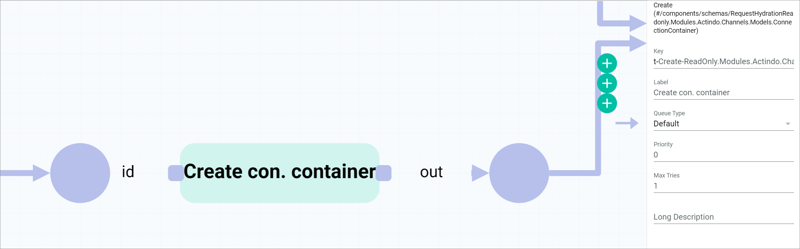

# Create a basic offer from a product

## Overview

You want to create an *Omni-Channel* offer for a *PIM* product. 

| **Summary** |       |
| ----------- |------ |
| **Purpose** | Create an *Omni-Channel* offer from a *PIM* product. |
| **Affected entities** | Modules.Actindo.PIM.Models.PIMProduct   Readonly.Modules.Actindo.Channels.Models.ConnectionContainer   Actindo.Extensions.Actindo.PimChannelsConnection.Offers.createFromPimProduct |
| **Included plugins** | *Process Orchestration*   *PIM*   *Omni-Channel* |
| **Included third party software** | none | 
| **Trigger** | The process is triggered when a *PIM* product is created or saved. |

**Included steps**

- Multiply input to create two different workflow branches with the same start data 
- Determine the connection to the sales channel where you want to create the offer
- Create a connection container to transfer the connection ID to the create offer action
- Create offer from the *PIM* product input in the start place

**Necessary actions**

| Action | Short description | API endpoint |
| ------ | ----------------- | ------------ |
| Multiply input action | Input data coming in via one input port is output two output ports  | Core action |
| Execute PHP Code | Allows to configure custom PHP code to define complex actions | Core action |
| Create connection container | ? | Create-ReadOnly.Modules.Actindo.Channels.Models.ConnectionContainer |
| Create offer | Create an offer from a product | Actindo.Extensions.Actindo.PimChannelsConnection.Offers.createFromPimProduct |

For a detailed description of the core actions, see [Core actions](../ActindoWorkFlow/UserInterface/08_CoreActions.md).

For detailed information on how to create a workflow, see [Create a workflow](../ActindoWorkFlow/Operation/01_ManageWorkflows.md#create-a-workflow).

#### Prerequisites

- You have created a *PIM* product, see [Create a product](../PIM/Operation/01_ManageProducts.md#create-a-product).
- You have created a connection to a sales channel, see [Create a connection](../Channels/Integration/01_ManageConnections.md#create-a-connection).
- You have set up an offer from product workflow, see [Set up an offer from product workflow](./01_Introduction.md#set-up-an-offer-from-product-workflow).
- You have created a *PIM* product trigger, see [Create a PIM product trigger](./01_Introduction.md#create-a-pim-product-trigger). 

#### Procedure

*Process Orchestration > Workflows > Tab OVERVIEW > Select offer from product workflow > Select a workflow version*

1. Click the [NEW ACTION] button in the upper right corner of the workflow editor.  
    A window with a list of actions is displayed.  

    

2. Select *Multiply input action*.  
    The selected action is displayed in the workflow editor.

    

    > [Info] This action is used to ...

3. Configure the *Multiply input action* action with the following settings:  

    | Configuration ||
    |----|----|
    | **** |  |
    | **** |  |
    | **** |  |

4. Connect the input port to the start place. For detailed information, see [Connect the transition](../ActindoWorkFlow/Operation/01_ManageWorkflows.md#connect-the-transition).

    After setting it up, the *Multiply input action* action has the following structure:

    | Input ports     | Value | -  | Output ports | Value    |
    | --------------- | --- | ---| -------------- | ----  |
    | *p*:  | PIMProduct| - | *p0* | PIMProduct |
    | -     |          | - | *p1* | anyValue   |

[comment]: <> (in P1 output port ist anyValue, aber warum? Sollte es nicht auch PIMProduct sein, vgl. Core action description: The data runs via the p input port into the workflow action and is output via both the p0 and the p1 output ports.)

5. Click the [NEW ACTION] button and select the *Execute PHP code* action.
    The selected action is displayed in the workflow editor.

    

    > [Info] This action is used to ...

    It is recommended to change the name in the *Label* field to a descriptive name, for example, **Determine connection** in this case.

6. Configure the *Determine connection* action as follows:

    | **Configuration** | |
    |-------------------|-------------| 
    | **PHP code** | `return [new Actindo\Modules\Actindo\ActindoWorkFlow\Components\Containers\ScalarValueContainer($in1)];` |
    | **Static inputs** | | 
    | *in1* | "2" |

    - Join input port...

    After setting it up, the *Determine connection* action has the following structure:

    | Input ports     | Value | -  | Output ports | Value    |
    | --------------- | --- | ---| -------------- | ----  |
    | *in0*  | anyValue | - | *out0* | anyValue |
    | *in1*  |   2  (static input)     | - | - | -   |

7. Click the [NEW ACTION] button and select the *Create-ReadOnly.Modules.Actindo.Channels.Models.ConnectionContainer* action.
    The selected action is displayed in the workflow editor.

    

    It is recommended to change the name in the *Label* field to a descriptive name, for example, **Create con. container** in this case.

8. Configure the *Create connection container* action as follows:

    - Join input port...  

    After setting it up, the *Determine connection* action has the following structure:

    | Input ports     | Value | -  | Output ports | Value    |
    | --------------- | --- | ---| -------------- | ----  |
    | *id*  | scalarValue | - | *out* | ReadOnly.Modules.Actindo.Channels.Models.ConnectionContainer |

9. Click the [NEW ACTION] button and select the *Create offer from PIM product* action.
    The selected action is displayed in the workflow editor.

    

    It is recommended to change the name in the *Label* field to a descriptive name, for example, **Create offer** in this case.

10. Configure the *Create offer* action as follows:

    | **Configuration** | |
    |-------------------|-------------| 
    | **Static inputs** | | 
    | *unique* | "1" |

    After setting it up, the *Create offer* action has the following structure:

    | Input ports     | Value | -  | Output ports | Value    |
    | --------------- | --- | ---| -------------- | ----  |
    | *pimProduct*  | (linked to *p0* output port from *Multiply input action*) | - | *data* | anyValue |
    | *connection*  | (linked to *out* output port from *CreateConnectionContainer*) |  | - |  |
    | *changeTracking*  | - | - | | |
    | *initialStatus*  | - | - | | | 
    | *destinationAttributeSet*  | - | - | | |
    | *unique*  | 1 | - |  |  |

    
[comment]: <> (Warum geht es technisch nicht connection id als static input einzugeben? Warum kann man nicht "id: 2" eingeben? Die ganzen Actions dazwischen, um nur id: 2 anzugeben...?)

[comment]: <> (Was ist besser: Unique check bei dem PIMProduct Trigger oder unique 1 als static input bei Create Offer? Ist es das gleiche, also, um Duplicate vermeiden? Pros/cons von beiden Methoden. Was ist unsere Empfehlung?)

11. Click the  (Points) button in the upper left corner to display the context menu.

12. Click on [DEPLOY] menu entry in the context menu to publish the workflow.  
    The workflow is published and will be used from now on.

## JSON

        {
            "key": "create_offer_from_pim_product_basic",
            "version": 10,
            "name": "Create offer from complete PIM product basic",
            "published": true,
            "places": {
                "input": "Modules.Actindo.PIM.Models.PIMProduct",
                "output": "anyValue",
                "p-connection-0": "ReadOnly.Modules.Actindo.Channels.Models.ConnectionContainer",
                "p-id-0": "scalarValue",
                "p-p1-0": "anyValue",
                "p-pimProduct-0": "ReadOnly.Modules.Actindo.PIM.Models.PIMProductContainer"
            },
            "comment": null,
            "transitions": [
                {
                    "maxTries": 1,
                    "queueType": "1",
                    "key": "t-Create-ReadOnly.Modules.Actindo.Channels.Models.ConnectionContainer-0",
                    "action": "Create-ReadOnly.Modules.Actindo.Channels.Models.ConnectionContainer",
                    "priority": 0,
                    "comment": null,
                    "description": "Create ConnectionContainer"
                },
                {
                    "maxTries": 1,
                    "queueType": "1",
                    "key": "t-deprecated_duplicate_input-0",
                    "action": "deprecated_duplicate_input",
                    "priority": 0,
                    "comment": null,
                    "description": "Multiply input action"
                },
                {
                    "maxTries": 1,
                    "queueType": "1",
                    "key": "t-determine_connection_php_code",
                    "action": "executePHP",
                    "priority": 0,
                    "comment": null,
                    "config": {
                        "code": "return [new Actindo\\Modules\\Actindo\\ActindoWorkFlow\\Components\\Containers\\ScalarValueContainer($in1)];"
                    },
                    "description": "Determine Connection"
                },
                {
                    "maxTries": 1,
                    "queueType": "1",
                    "key": "t-Extensions.Actindo.PimChannelsConnection.Offers.createFromPimProduct-0",
                    "action": "Extensions.Actindo.PimChannelsConnection.Offers.createFromPimProduct",
                    "priority": 0,
                    "comment": null,
                    "description": "Create Offer"
                }
            ],
            "arcs": [
                "p-id-0 -> t-Create-ReadOnly.Modules.Actindo.Channels.Models.ConnectionContainer-0(id)",
                "t-Create-ReadOnly.Modules.Actindo.Channels.Models.ConnectionContainer-0(out) -> p-connection-0",
                "input -> t-deprecated_duplicate_input-0(p)",
                "t-deprecated_duplicate_input-0(p0) -> p-pimProduct-0",
                "t-deprecated_duplicate_input-0(p1) -> p-p1-0",
                "p-p1-0 -> t-determine_connection_php_code(in0)",
                "t-determine_connection_php_code(out0) -> p-id-0",
                "p-pimProduct-0 -> t-Extensions.Actindo.PimChannelsConnection.Offers.createFromPimProduct-0(pimProduct)",
                "t-Extensions.Actindo.PimChannelsConnection.Offers.createFromPimProduct-0(data) -> output",
                "p-connection-0 -> t-Extensions.Actindo.PimChannelsConnection.Offers.createFromPimProduct-0(connection)",
                "\"2\" -> t-determine_connection_php_code(in1)",
                "\"1\" -> t-Extensions.Actindo.PimChannelsConnection.Offers.createFromPimProduct-0(unique)"
            ],
            "triggers": [
                {
                    "name": "PIM Product Saved",
                    "event": "postUpdate",
                    "active": true,
                    "unique": false,
                    "processPriority": 10,
                    "model": "Actindo\\Modules\\Actindo\\PIM\\Models\\PIMProduct",
                    "allConditionsRequired": true,
                    "conditions": []
                }
            ],
            "nodePositions": {
                "input": {
                    "x": -660,
                    "y": -60
                },
                "output": {
                    "x": 870,
                    "y": -30
                },
                "t-Extensions.Actindo.PimChannelsConnection.Offers.createFromPimProduct-0": {
                    "x": 470,
                    "y": -10
                },
                "p-connection-0": {
                    "x": 300,
                    "y": 40
                },
                "t-Create-ReadOnly.Modules.Actindo.Channels.Models.ConnectionContainer-0": {
                    "x": 200,
                    "y": 40
                },
                "p-id-0": {
                    "x": 80,
                    "y": 40
                },
                "t-determine_connection_php_code": {
                    "x": -90,
                    "y": 80
                },
                "p-pimProduct-0": {
                    "x": 302,
                    "y": -110
                },
                "t-deprecated_duplicate_input-0": {
                    "x": -460,
                    "y": -50
                },
                "p-p1-0": {
                    "x": -280,
                    "y": 30
                }
            }
        }

