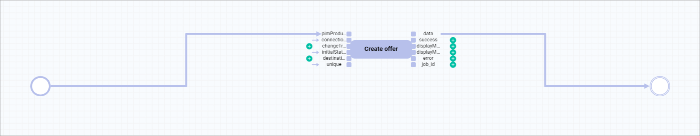

# Create an offer from a product

## Description

| **Summary** |       |
| ----------- |------ |
| **Purpose** | Create an *Omni-Channel* offer from a *PIM* product. |
| **Affected entities** | Modules.Actindo.PIM.Models.PIMProduct   Readonly.Modules.Actindo.Channels.Models.ConnectionContainer   Actindo.Extensions.Actindo.PimChannelsConnection.Offers.createFromPimProduct |
| **Included plugins** | Workflows   PIM   Omni-Channel |
| **Included third party software** | optional | 
| **Trigger** | The process is triggered by the creation or the update of a *PIM* product. |
| **Start** | Modules.Actindo.PIM.Models.PIMProduct |
| **Core actions** | Multiply input action   Execute PHP Code |

For a detailed description of the core actions, see [Core actions](../ActindoWorkFlow/UserInterface/08_CoreActions.md).

#### Prerequisites

#### Procedure

*Process Orchestration > Workflows*

1. Button ADD  
    New workflow view displayed

2. Enter name and unique key, select start (PIM.Product) and end place (any value)

[comment]: <> (sinnvoll zu definieren, z.B. Channels.Offer, wenn ein anderes Workflow daraus anfangen soll?)

3. Click [CREATE]  
    New workflow displayed in the list of workflows (version no. e.g. 1)

4. Click version number you want to edit  
    Edit Workflow "Workflow name" view displayed

5. Click [NEW ACTION]  
    List of actions displayed

[comment]: <> (For initial workflow setup, link to Workflows and/or process documentation)
---

Case 1: Create offer from *PIM* product basic workflow (no condition)

1. New workflow:  
    - Name: Create Offer from complete PIM product  
    - Key: create_offer_from_complete_pim_product 
    - Start place: Actindo\Modules\Actindo\PIM\Models\PIMProduct
    - End place: Arbitrary data

2. Click [CREATE]

3. Select newly created workflow from the list of workflows; select version to edit (V1 in this case)
    Workflow editor opens

4. Points button > Triggers to add a trigger
    (Link to add trigger for detailed info)
    Edit trigger for workflow "Workflow name"

5. Click ADD button
    New trigger input line

6. Trigger input line:
    - Name: PIM Product Saved
    - Model: Actindo\Modules\Actindo\PIM\Models\PIMProduct
    - Event: After saving
    - Condition fulfillment: If all are met
    - Status: Active
    - Process priority: 10
    - Unique check: Yes

    > [Info] Model equals start place but replacing points by backslash. You can also find them in the API documentation under * API > Data models*... (nicht immer, warum?)

7. [NEW ACTION]: Multiply input action (Core action)
    - *p* input port: PIMProduct
    - *p0* output port: PIMProduct
    - *p1* output port: anyValue 
    
    | Input ports     | Value | -  | Output ports | Value    |
    | --------------- | --- | ---| -------------- | ----  |
    | *p*:  | PIMProduct| - | *p0* | PIMProduct |
    | -     |          | - | *p1* | anyValue   |

[comment]: <> (in P1 output port ist anyValue, aber warum? Sollte es nicht auch PIMProduct sein, vgl. Core action description: The data runs via the p input port into the workflow action and is output via both the p0 and the p1 output ports.)

8. [NEW ACTION]: Execute PHP code (Core action)
    - Label: Determine connection
    - Queue type: Default
    - Priority: 0
    - Max Tries: 1
    - Configuration 
        - PHP Code  
        
                <?php
                
                return [new Actindo\Modules\Actindo\ActindoWorkFlow\Components\Containers\ScalarValueContainer($in1)];

    - Static inputs
        - in1: "2"
    
    - *in0* input port: anyValue
    - *in1* input port: 2 (static input)
    - *out0* output port: anyValue

9. [NEW ACTION]: Create ConnectionContainer
    - *id* input port: scalarValue
    - *out* output port: ReadOnly.Modules.Actindo.Channels.Models.ConnectionContainer

10. [NEW ACTION]: createFromPimProduct | Create offer from pim product (/Actindo.Extensions.Actindo.PimChannelsConnection.Offers.createFromPimProduct)

    - Label: Create offer
    - Queue type: Default
    - Priority: 0
    - Max Tries: 1

    -  Status inputs
        - pimProduct (linked to *p0* output port from *Multiply input action*)
        - connection (linked to *out* output port from *CreateConnectionContainer*)
        - changeTracking
        - initialStatus
        - destinationAttributeSet
        - unique: "1"  
        (to avoid creation of duplicate offers)

    - *out* output port: data (anyValue)

[comment]: <> (Warum geht es technisch nicht connection id als static input einzugeben? Warum kann man nicht "id: 2" eingeben? Die ganzen Actions dazwischen, um nur id: 2 anzugeben...?)

[comment]: <> (Was ist besser: Unique check bei dem PIMProduct Trigger oder unique 1 als static input bei Create Offer? Ist es das gleiche, also, um Duplicate vermeiden? Pros/cons von beiden Methoden. Was ist unsere Empfehlung?)

## JSON

        {
            "key": "create_offer_from_complete_pim_product",
            "version": 10,
            "name": "Create Offer from complete PIM product",
            "published": true,
            "places": {
                "input": "Modules.Actindo.PIM.Models.PIMProduct",
                "output": "anyValue",
                "p-connection-0": "ReadOnly.Modules.Actindo.Channels.Models.ConnectionContainer",
                "p-id-0": "scalarValue",
                "p-p1-0": "anyValue",
                "p-pimProduct-0": "ReadOnly.Modules.Actindo.PIM.Models.PIMProductContainer"
            },
            "comment": null,
            "transitions": [
                {
                    "maxTries": 1,
                    "queueType": "1",
                    "key": "t-Create-ReadOnly.Modules.Actindo.Channels.Models.ConnectionContainer-0",
                    "action": "Create-ReadOnly.Modules.Actindo.Channels.Models.ConnectionContainer",
                    "priority": 0,
                    "comment": null,
                    "description": "Create ConnectionContainer"
                },
                {
                    "maxTries": 1,
                    "queueType": "1",
                    "key": "t-deprecated_duplicate_input-0",
                    "action": "deprecated_duplicate_input",
                    "priority": 0,
                    "comment": null,
                    "description": "Multiply input action"
                },
                {
                    "maxTries": 1,
                    "queueType": "1",
                    "key": "t-determine_connection_php_code",
                    "action": "executePHP",
                    "priority": 0,
                    "comment": null,
                    "config": {
                        "code": "return [new Actindo\\Modules\\Actindo\\ActindoWorkFlow\\Components\\Containers\\ScalarValueContainer($in1)];"
                    },
                    "description": "Determine Connection"
                },
                {
                    "maxTries": 1,
                    "queueType": "1",
                    "key": "t-Extensions.Actindo.PimChannelsConnection.Offers.createFromPimProduct-0",
                    "action": "Extensions.Actindo.PimChannelsConnection.Offers.createFromPimProduct",
                    "priority": 0,
                    "comment": null,
                    "description": "Create Offer"
                }
            ],
            "arcs": [
                "p-id-0 -> t-Create-ReadOnly.Modules.Actindo.Channels.Models.ConnectionContainer-0(id)",
                "t-Create-ReadOnly.Modules.Actindo.Channels.Models.ConnectionContainer-0(out) -> p-connection-0",
                "input -> t-deprecated_duplicate_input-0(p)",
                "t-deprecated_duplicate_input-0(p0) -> p-pimProduct-0",
                "t-deprecated_duplicate_input-0(p1) -> p-p1-0",
                "p-p1-0 -> t-determine_connection_php_code(in0)",
                "t-determine_connection_php_code(out0) -> p-id-0",
                "p-pimProduct-0 -> t-Extensions.Actindo.PimChannelsConnection.Offers.createFromPimProduct-0(pimProduct)",
                "t-Extensions.Actindo.PimChannelsConnection.Offers.createFromPimProduct-0(data) -> output",
                "p-connection-0 -> t-Extensions.Actindo.PimChannelsConnection.Offers.createFromPimProduct-0(connection)",
                "\"2\" -> t-determine_connection_php_code(in1)",
                "\"1\" -> t-Extensions.Actindo.PimChannelsConnection.Offers.createFromPimProduct-0(unique)"
            ],
            "triggers": [
                {
                    "name": "PIM Product Saved",
                    "event": "postUpdate",
                    "active": true,
                    "unique": false,
                    "processPriority": 10,
                    "model": "Actindo\\Modules\\Actindo\\PIM\\Models\\PIMProduct",
                    "allConditionsRequired": true,
                    "conditions": []
                }
            ],
            "nodePositions": {
                "input": {
                    "x": -660,
                    "y": -60
                },
                "output": {
                    "x": 870,
                    "y": -30
                },
                "t-Extensions.Actindo.PimChannelsConnection.Offers.createFromPimProduct-0": {
                    "x": 470,
                    "y": -10
                },
                "p-connection-0": {
                    "x": 300,
                    "y": 40
                },
                "t-Create-ReadOnly.Modules.Actindo.Channels.Models.ConnectionContainer-0": {
                    "x": 200,
                    "y": 40
                },
                "p-id-0": {
                    "x": 80,
                    "y": 40
                },
                "t-determine_connection_php_code": {
                    "x": -90,
                    "y": 80
                },
                "p-pimProduct-0": {
                    "x": 302,
                    "y": -110
                },
                "t-deprecated_duplicate_input-0": {
                    "x": -460,
                    "y": -50
                },
                "p-p1-0": {
                    "x": -280,
                    "y": 30
                }
            }
        }

