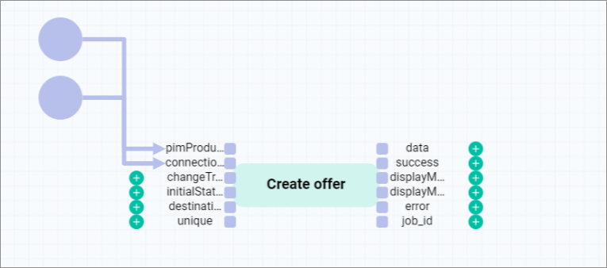

# Create an offer from product workflow with static inputs

## Overview

| **Summary** |       |
| ----------- |------ |
| **Purpose** | Create an *Omni-Channel* offer from a *PIM* product. |
| **Affected entities** | Modules.Actindo.PIM.Models.PIMProduct   Actindo.Extensions.Actindo.PimChannelsConnection.Offers.createFromPimProduct |
| **Included plugins** | *Process Orchestration*   *PIM*   *Omni-Channel* |
| **Included third party software** | optional | 
| **Trigger** | The process is triggered when a *PIM* product is created or saved. |

**Included steps**

- Creation of an offer for a given *PIM* product and connection.

**Necessary actions**

| Action | Short description | API endpoint |
| ------ | ----------------- | ------------ |
| Create offer | Create an offer from a product | Actindo.Extensions.Actindo.PimChannelsConnection.Offers.createFromPimProduct |

#### Prerequisites

- You have created a *PIM* product, see [Create a product](../PIM/Operation/01_ManageProducts.md#create-a-product).
- You have created a connection to a sales channel, see [Create a connection](../Channels/Integration/01_ManageConnections.md#create-a-connection).
- You have set up an offer from product workflow, see [Set up an offer from product workflow](./01_Introduction.md#set-up-an-offer-from-product-workflow).
- You have created a *PIM* product trigger, see [Create a PIM product trigger](./01_Introduction.md#create-a-pim-product-trigger). 

#### Procedure

*Process Orchestration > Workflows > Select offer from product workflow > Select a workflow version*

1. Click the [NEW ACTION] button in the upper right corner of the workflow editor.  
    A window with a list of actions is displayed.  

    

2. Select *Create offer from PIM product*.  
    The selected action is displayed in the workflow editor.

    

    > [Info] This action is used to ...

    It is recommended to change the name in the *Label* field to a descriptive name, for example, **Create offer** in this case.

3. Configure the *Create offer* action as follows:

    | Static inputs | |
    |---------------|-|
    | **connection** | { "id": 2 } |
    | **changeTracking** | - |
    | **initialStatus** | "inactive" |
    | **destinationAttributeSet** | - |
    | **unique** | "1" |

    **Comments**
    - You can find out the connection ID in the *ID* column of the *Connections* view under *Omni-Channel > Settings > Connections*. If the *ID* column is hidden, see [Add or remove columns](../Core1Platform/UsingCore1/05_WorkWithLists.md#add-or-remove-columns) in the *Core1* documentation.
    - To insert a static input, see [Insert a static input](../ActindoWorkFlow/Operation/to-be-completed).
    - Offers can have three different initial status: **active**, **inactive**, and **offline**. For detailed information, see [Create an offer from a PIM product](../Channels/Operation/01_ManageOffers.md#create-an-offer-from-a-pim-product).
    - The static input *unique* prevents the creation of duplicate offers. This setting can be configured at this point or in the workflow trigger (*Unique check* setting). 

[comment]: <> (Was ist besser: Unique check bei dem PIMProduct Trigger oder unique 1 als static input bei Create Offer? Ist es das gleiche, also, um Duplicate vermeiden? Pros/cons von beiden Methoden. Was ist unsere Empfehlung?)

4. Click the  (Points) button in the upper left corner to display the context menu.

5. Click on [DEPLOY] menu entry in the context menu to publish the workflow.   
    The workflow is published and will be used from now on.

## JSON

        {
            "key": "create_offer_from_pim_product_static_inputs",
            "version": 3,
            "name": "Create offer from PIM product static inputs",
            "published": true,
            "places": {
                "input": "Modules.Actindo.PIM.Models.PIMProduct",
                "output": "anyValue"
            },
            "comment": null,
            "transitions": [
                {
                    "maxTries": 1,
                    "queueType": "1",
                    "key": "t-Extensions.Actindo.PimChannelsConnection.Offers.createFromPimProduct-0",
                    "action": "Extensions.Actindo.PimChannelsConnection.Offers.createFromPimProduct",
                    "priority": 0,
                    "comment": null,
                    "description": "Create offer"
                }
            ],
            "arcs": [
                "input -> t-Extensions.Actindo.PimChannelsConnection.Offers.createFromPimProduct-0(pimProduct)",
                "t-Extensions.Actindo.PimChannelsConnection.Offers.createFromPimProduct-0(data) -> output",
                "{\"id\":2} -> t-Extensions.Actindo.PimChannelsConnection.Offers.createFromPimProduct-0(connection)",
                "\"1\" -> t-Extensions.Actindo.PimChannelsConnection.Offers.createFromPimProduct-0(unique)",
                "\"inactive\" -> t-Extensions.Actindo.PimChannelsConnection.Offers.createFromPimProduct-0(initialStatus)"
            ],
            "triggers": [
                {
                    "name": "New triggerPIM product saved",
                    "event": "postUpdate",
                    "active": true,
                    "unique": false,
                    "processPriority": 10,
                    "model": "Actindo\\Modules\\Actindo\\PIM\\Models\\PIMProduct",
                    "allConditionsRequired": true,
                    "conditions": []
                }
            ],
            "nodePositions": {
                "input": {
                    "x": 0,
                    "y": 0
                },
                "output": {
                    "x": 1000,
                    "y": 0
                },
                "t-Extensions.Actindo.PimChannelsConnection.Offers.createFromPimProduct-0": {
                    "x": 550,
                    "y": -60
                }
            }
        }

