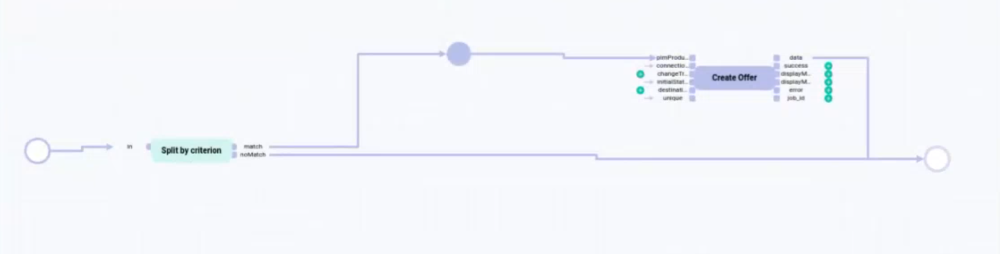

# Create offer from product with completeness

You want to create an *Omni-Channel* offer when all required attributes of a *PIM* product are set (total completeness is 100 %).

[comment]: <> (Purpose, use case...)

## Description

[comment]: <> (Short description, Workflow overview, Overview)

| Action | Short description | API endpoint |
| ------ | ----------------- | ------------ |
| split by criterion | Input value is compared to a criterion and split based on match/no match principle. It is a core action. | None |
| createFromPimProduct  | Create an offer from a product | /Actindo.Extensions.Actindo.PimChannelsConnection.Offers.createFromPimProduct |

For a detailed description of the core actions, see [Core actions](../ActindoWorkFlow/UserInterface/08_CoreActions.md).

| **Summary** |       |
| ----------- |------ |
| **Purpose** | Create an *Omni-Channel* offer from a *PIM* product with 100% completeness |
| **Affected entities** | Modules.Actindo.PIM.Models.PIMProduct   Actindo.Extensions.Actindo.PimChannelsConnection.Offers.createFromPimProduct |
| **Included plugins** | Workflows   PIM   Omni-Channel |
| **Included third party software** | none/optional | 
| **Start place** | Modules.Actindo.PIM.Models.PIMProduct |
| **Trigger** | The process is triggered by the creation or the update of a *PIM* product. |
| **Core actions** | Split by action |

#### Prerequisites

- You have create a *PIM* product, see [Create a product](../PIM/Operation/01_ManageProducts.md#create-a-product).
- You have created a connection to a sales channel, see [Create a connection](../Channels/Integration/01_ManageConnections.md#create-a-connection).

#### Procedure

For detailed information on how to create a workflow, see [Create a workflow](../ActindoWorkFlow/Operation/01_ManageWorkflows.md#create-a-workflow).

*Process Orchestration > Workflows > Tab OVERVIEW*

1. Click the  (Add) button in the bottom right corner.   
    The *New workflow* window is displayed.

    

2. Enter **Create offer from complete PIM product** in the *Select a name for your new workflow* field.

3.  Enter **create_offer_from_complete_pim_product** in the *Select a unique key for your new workflow* field. The key is required for API access and must be unique within the workflow version.

4.  Select the **___WorkflowAutogen___\Actindo\Modules\Actindo\PIM\Models\PIMProduct** option as start place type in the *Choose the data type of your start place* field.

5. Select the **Arbitrary Data** option as end place type in the *Choose the data type of your end place* field.

6. Click the [CREATE] button in the bottom right corner.   
    The new workflow has been created. The *New workflow* window is closed. The workflow editor with the defined start and end places is displayed.

---

1. Create a new workflow and define the following workflow basic settings. For detailed information on how to create a workflow, see [Define the workflow basic settings](../ActindoWorkFlow/Operation/01_ManageWorkflows.md#define-the-workflow-basic-settings).

    | Setting | Value |
    | ------- | ----- |
    | *Select a name for your new workflow* | Create offer from complete PIM product |
    | *Select a unique key for your new workflow* | create_offer_from_complete_pim_product |
    | *Choose the data type of your start place* | ___WorkflowAutogen___\Actindo\Modules\Actindo\PIM\Models\PIMProduct |
    | *Choose the data type of your end place* | Arbitrary Data |

[comment]: <> (Warum nicht end place Channels.Offer?)

---

7. Select the newly created workflow to edit it. 
    The workflow editor is displayed.

8. Create a *PIM Product saved* trigger to create an offer when a product is updated. For detailed information on how to create a trigger, see [Create a trigger](../ActindoWorkFlow/Operation/03_ManageTriggers.md#create-a-trigger).

    Configure the following settings for the *PIM Product saved* trigger:

    | Triggers ||
    |----|----|
    |**Name** | PIM product saved |
    |**Model** | Actindo\Modules\Actindo\PIM\Models\PIMProduct |
    |**Event** | After saving | 
    |**Condition fulfillment** | If all are met |   
    |**Status** | Active |
    |**Process priority** | 10 | 
    | **Unique check** | No |

2. [NEW ACTION]: Split by criterion  
    Configuration:
    - *Path*: _pim_completeness.totalCompleteness
    - *Operator*: >=
    - *Value*: 100

    | Input ports     | Value | -  | Output ports | Value    |
    | --------------- | --- | ---| -------------- | ----  |
    | *in*  | PIMProduct| - | *match* | PIMProduct |
    | -     |          | - | *noMatch* | (to end place)   |
    

3. [NEW ACTION]: Create offer  
    Static inputs:
    - *pimProduct* input port: pimProduct 
    - connection: { "id": 2 } (static input)
    - changeTracking: -
    - initialStatus: "inactive"
    - destinationAttributeSet: -
    - unique: "1"

    Output: data (anyValue)

## Potential variations and extensions

- Use case 1: Add multiple connections, see [Create offer from product for multiple connections](./04_OfferFromProductMultiConnections.md)
- Use case 2: 

## JSON

        {
            "key": "create_offer_from_pim_product",
            "version": 4,
            "name": "Create offer from PIM product",
            "published": true,
            "places": {
                "input": "Modules.Actindo.PIM.Models.PIMProduct",
                "output": "anyValue",
                "p-pimProduct-0": "ReadOnly.Modules.Actindo.PIM.Models.PIMProductContainer"
            },
            "comment": null,
            "transitions": [
                {
                    "maxTries": 1,
                    "queueType": "1",
                    "key": "t-Extensions.Actindo.PimChannelsConnection.Offers.createFromPimProduct-0",
                    "action": "Extensions.Actindo.PimChannelsConnection.Offers.createFromPimProduct",
                    "priority": 0,
                    "comment": null,
                    "description": "Create offer"
                },
                {
                    "maxTries": 1,
                    "queueType": "1",
                    "key": "t-splitByCriterion-0",
                    "action": "splitByCriterion",
                    "priority": 0,
                    "comment": null,
                    "config": {
                        "path": "_pim_completeness.totalCompleteness",
                        "operator": ">=",
                        "value": 100
                    },
                    "description": "Completeness 100?"
                }
            ],
            "arcs": [
                "t-Extensions.Actindo.PimChannelsConnection.Offers.createFromPimProduct-0(data) -> output",
                "p-pimProduct-0 -> t-Extensions.Actindo.PimChannelsConnection.Offers.createFromPimProduct-0(pimProduct)",
                "input -> t-splitByCriterion-0(in)",
                "t-splitByCriterion-0(match) -> p-pimProduct-0",
                "t-splitByCriterion-0(noMatch) -> output",
                "{\"id\":2} -> t-Extensions.Actindo.PimChannelsConnection.Offers.createFromPimProduct-0(connection)",
                "\"inactive\" -> t-Extensions.Actindo.PimChannelsConnection.Offers.createFromPimProduct-0(initialStatus)",
                "\"1\" -> t-Extensions.Actindo.PimChannelsConnection.Offers.createFromPimProduct-0(unique)"
            ],
            "triggers": [
                {
                    "name": "PIM product saved",
                    "event": "postUpdate",
                    "active": true,
                    "unique": false,
                    "processPriority": "10",
                    "model": "Actindo\\Modules\\Actindo\\PIM\\Models\\PIMProduct",
                    "allConditionsRequired": true,
                    "conditions": []
                }
            ],
            "nodePositions": {
                "input": {
                    "x": -60,
                    "y": -80
                },
                "output": {
                    "x": 930,
                    "y": -60
                },
                "t-Extensions.Actindo.PimChannelsConnection.Offers.createFromPimProduct-0": {
                    "x": 680,
                    "y": -270
                },
                "t-splitByCriterion-0": {
                    "x": 150,
                    "y": -80
                },
                "p-pimProduct-0": {
                    "x": 400,
                    "y": -150
                }
            }
        }

