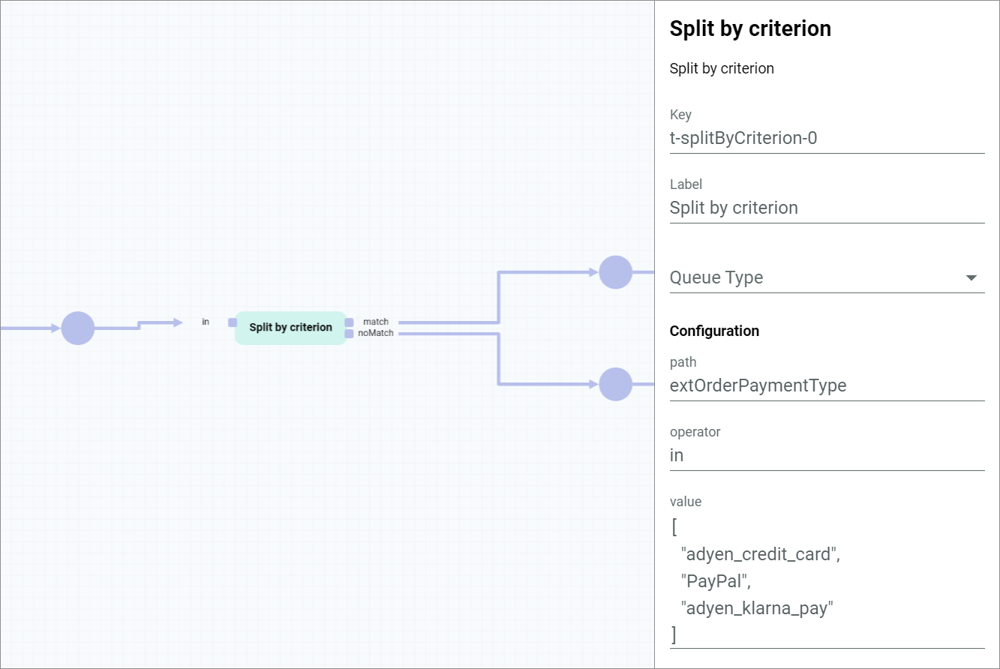
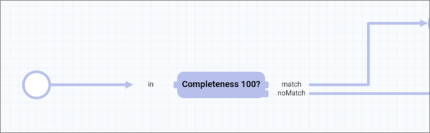
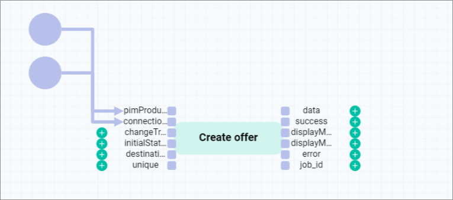
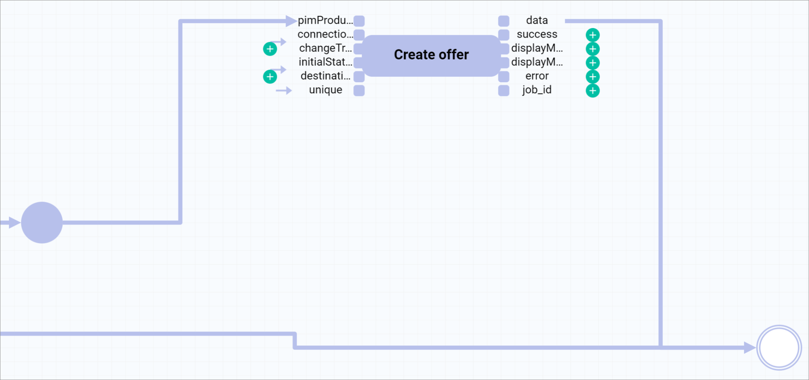

# Create an offer from a product with completeness

## Overview

You can create an *Omni-Channel* offer automatically when all required attributes of a *PIM* product are set (total completeness is 100%).

| **Summary** |       |
| ----------- |------ |
| **Purpose** | Create an *Omni-Channel* offer from a *PIM* product with 100% completeness |
| **Affected entities** | Modules.Actindo.PIM.Models.PIMProduct   Actindo.Extensions.Actindo.PimChannelsConnection.Offers.createFromPimProduct |
| **Included plugins** | *Process Orchestration*   *PIM*   *Omni-Channel* |
| **Included third party software** | none | 
| **Trigger** | The process is triggered when a *PIM* product is created or saved. |

**Included steps**

- Check if a *PIM* product completeness is 100 %
- Creation of an *Omni-Channel* offer from a PIM product 

**Necessary actions**

| Action | Short description | API endpoint |
| ------ | ----------------- | ------------ |
| split by criterion | Input value is compared to a criterion and split based on match/no match principle | Core action   For detailed information, see [Split by criterion](../ActindoWorkFlow/UserInterface/08_CoreActions.md#split-by-criterion). |
| createFromPimProduct  | Creation of an offer from a product | /Actindo.Extensions.Actindo.PimChannelsConnection.Offers.createFromPimProduct |

[comment]: <> (Ist /Actindo.Extensions.Actindo.PimChannelsConnection.Offers.createFromPimProduct eine Entität oder eher eine Action? Was ist richtiger? Beides ist verwirrend!)

#### Prerequisites

- You have created a *PIM* product, see [Create a product](../PIM/Operation/01_ManageProducts.md#create-a-product).
- You have created a connection to a sales channel, see [Create a connection](../Channels/Integration/01_ManageConnections.md#create-a-connection).
- You have set up an offer from product workflow, see [Set up an offer from product workflow](./01_Introduction.md#set-up-an-offer-from-product-workflow).
- You have created a *PIM* product trigger, see [Create a PIM product trigger](./01_Introduction.md#create-a-pim-product-trigger). 

#### Procedure

*Process Orchestration > Workflows > Tab OVERVIEW > Select offer from product workflow > Select a workflow version*

1. Click the [NEW ACTION] button in the upper right corner of the workflow editor.  
    A window with a list of actions is displayed. 

    

    For detailed information on how to add a transition, see [Add a transition](../ActindoWorkFlow/Operation/01_ManageWorkflows.md#add-a-transition).

2. Select the *Split by criterion* action. 
    The selected action is displayed in the workflow editor.

    

    > [Info] This action is used to compare the input value with a defined criterion and output it via a different branch depending on whether the input value matches or not. In this case, we want to check if the total completeness value of the input *PIM* product is greater than or equal to 100 or not.  

3. Configure the *Split by criterion* action with the following settings:  

    | Configuration ||
    |----|----|
    | **Path** | _pim_completeness.totalCompleteness |
    | **Operator** | >= |
    | **Value** | 100 |

    It is recommended to change the name in the *Label* field to a descriptive name, for example, **Completeness 100?** in this case.

    

4. Connect the input port to the start place. For detailed information, see [Connect the transition](../ActindoWorkFlow/Operation/01_ManageWorkflows.md#connect-the-transition).

    After setting it up, the *Completeness 100?* action has the following structure: 
    
    | Input ports     | Value | -  | Output ports | Value    |
    | --------------- | --- | ---| -------------- | ----  |
    | *in*  | PIMProduct | - | *match* | PIMProduct |
    | -     |          | - | *noMatch* | (to end place)   |

    [comment]: <> (Unsicher, ob das hier passt)
    
5. Click the [NEW ACTION] button and select the *Create offer from PIM product* action.
    The selected action is displayed in the workflow editor.

    

    It is recommended to change the name in the *Label* field to a descriptive name, for example, **Create offer** in this case.

6. Connect the *pimProduct* input port to the *match* output port from the *Completeness 100?* action. For detailed information, see [Connect the transition](../ActindoWorkFlow/Operation/01_ManageWorkflows.md#connect-the-transition).

7. Configure the *Create offer* action static inputs as follows:

    | Static inputs | |
    |---------------|-|
    | **connection** | { "id": 2 } |
    | **changeTracking** | - |
    | **initialStatus** | "inactive" |
    | **destinationAttributeSet** | - |
    | **unique** | "1" |

    **Comments**
    - You can find out the connection ID in the *ID* column of the *Connections* view under *Omni-Channel > Settings > Connections*. If the *ID* column is hidden, see [Add or remove columns](../Core1Platform/UsingCore1/05_WorkWithLists.md#add-or-remove-columns) in the *Core1* documentation.
    - To insert a static input, see [Insert a static input](../ActindoWorkFlow/Operation/to-be-completed).
    - Offers can have three different initial status: **active**, **inactive**, and **offline**. For detailed information, see [Create an offer from a PIM product](../Channels/Operation/01_ManageOffers.md#create-an-offer-from-a-pim-product).
    - The static input *unique* prevents the creation of duplicate offers. This setting can be configured at this point or in the workflow trigger (*Unique check* setting). 

8. Connect the *data* output port to the end place.
    
    

9. Click the  (Points) button in the upper left corner to display the context menu.

10. Click on [DEPLOY] menu entry in the context menu to publish the workflow.  
    The workflow is published and will be used from now on.

## JSON

        {
            "key": "create_offer_from_pim_product",
            "version": 4,
            "name": "Create offer from PIM product",
            "published": true,
            "places": {
                "input": "Modules.Actindo.PIM.Models.PIMProduct",
                "output": "anyValue",
                "p-pimProduct-0": "ReadOnly.Modules.Actindo.PIM.Models.PIMProductContainer"
            },
            "comment": null,
            "transitions": [
                {
                    "maxTries": 1,
                    "queueType": "1",
                    "key": "t-Extensions.Actindo.PimChannelsConnection.Offers.createFromPimProduct-0",
                    "action": "Extensions.Actindo.PimChannelsConnection.Offers.createFromPimProduct",
                    "priority": 0,
                    "comment": null,
                    "description": "Create offer"
                },
                {
                    "maxTries": 1,
                    "queueType": "1",
                    "key": "t-splitByCriterion-0",
                    "action": "splitByCriterion",
                    "priority": 0,
                    "comment": null,
                    "config": {
                        "path": "_pim_completeness.totalCompleteness",
                        "operator": ">=",
                        "value": 100
                    },
                    "description": "Completeness 100?"
                }
            ],
            "arcs": [
                "t-Extensions.Actindo.PimChannelsConnection.Offers.createFromPimProduct-0(data) -> output",
                "p-pimProduct-0 -> t-Extensions.Actindo.PimChannelsConnection.Offers.createFromPimProduct-0(pimProduct)",
                "input -> t-splitByCriterion-0(in)",
                "t-splitByCriterion-0(match) -> p-pimProduct-0",
                "t-splitByCriterion-0(noMatch) -> output",
                "{\"id\":2} -> t-Extensions.Actindo.PimChannelsConnection.Offers.createFromPimProduct-0(connection)",
                "\"inactive\" -> t-Extensions.Actindo.PimChannelsConnection.Offers.createFromPimProduct-0(initialStatus)",
                "\"1\" -> t-Extensions.Actindo.PimChannelsConnection.Offers.createFromPimProduct-0(unique)"
            ],
            "triggers": [
                {
                    "name": "PIM product saved",
                    "event": "postUpdate",
                    "active": true,
                    "unique": false,
                    "processPriority": "10",
                    "model": "Actindo\\Modules\\Actindo\\PIM\\Models\\PIMProduct",
                    "allConditionsRequired": true,
                    "conditions": []
                }
            ],
            "nodePositions": {
                "input": {
                    "x": -60,
                    "y": -80
                },
                "output": {
                    "x": 930,
                    "y": -60
                },
                "t-Extensions.Actindo.PimChannelsConnection.Offers.createFromPimProduct-0": {
                    "x": 680,
                    "y": -270
                },
                "t-splitByCriterion-0": {
                    "x": 150,
                    "y": -80
                },
                "p-pimProduct-0": {
                    "x": 400,
                    "y": -150
                }
            }
        }

