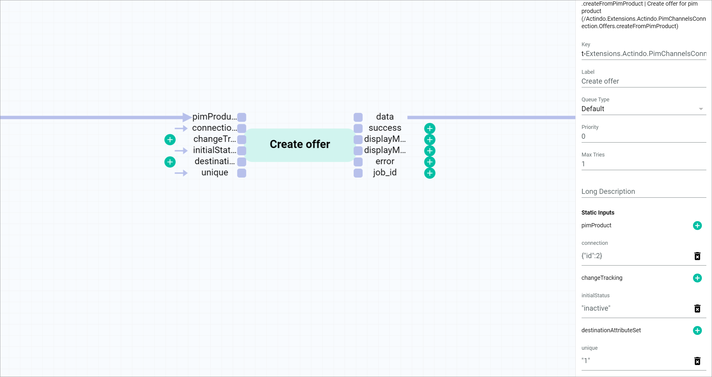

# Create an offer from product workflow with static inputs

## Overview

| **Summary** |       |
| ----------- |------ |
| **Purpose** | Create an *Omni-Channel* offer from a *PIM* product using static inputs|
| **Affected entities** | Modules.Actindo.PIM.Models.PIMProduct   Actindo.Extensions.Actindo.PimChannelsConnection.Offers.createFromPimProduct |
| **Included plugins** | *Process Orchestration*   *PIM*   *Omni-Channel* |
| **Included third party software** | none | 
| **Trigger** | The process is triggered when a *PIM* product is created or saved. |

**Included steps**

- Creation of an offer for a given *PIM* product and connection

## Prerequisites

- You have created a *PIM* product, see [Create a product](../PIM/Operation/01_ManageProducts.md#create-a-product).
- You have created a connection to a sales channel, see [Create a connection](../Channels/Integration/01_ManageConnections.md#create-a-connection).
- You have set up an offer from product workflow, see [Set up an offer from product workflow](./01_Introduction.md#set-up-an-offer-from-product-workflow).
- You have created a *PIM* product trigger, see [Create a PIM product trigger](./01_Introduction.md#create-a-pim-product-trigger). 

## Workflow description

Within a workflow, several actions are performed. In the following, all single actions within the workflow are described in detail, specifying their function and functional settings.

For detailed information on how to manage a workflow, see [Manage a workflow](../ActindoWorkFlow/Operation/01_ManageWorkflows.md).

### Create offer from PIM product

The *Create offer from PIM product* action creates an offer in the *Omni-Channel* module from a *PIM* product.  

In this use case, you need to create an offer for the *PIM* product input via *pimProduct* port from the start place. 

To create an offer, you must provide the connection ID. You can do that inserting the corresponding value in JSON format via a static input in the *Create offer* action.

To do so, you must configure the *Create offer from PIM product* action as follows:

**Settings**

| Field | Value      | Comments |
|---------|------------|----------|
| *Description* | .createFromPimProduct   Create offer for pim product (/Actindo.Extensions.Actindo.PimChannelsConnection.Offers.createFromPimProduct) | This field contains the API endpoint that is addressed in this action. |
| *Key* | Extensions.Actindo.PimChannelsConnection.Offers.createFromPimProduct-0 | The key must be unique within a workflow. |
| *Label* | Create offer | It is recommended to enter a short descriptive name in the *Label* field. |
| *Queue type* | Default | For detailed information on all action settings, see [Transitions](../ActindoWorkFlow/Overview/04_WorkflowProcessElements.md#transitions).  |
| *Priority* | 0 | |
|  *Max tries* | 1 | |
| *Long description* | - |  |

**Static inputs**

| Field | Value | Comments |
|---------------|------|----------|
| *pimProduct* | PIM product | Connected to start place | 
| *connection* | { "id": 2 } | You can find out the connection ID in the *ID* column of the *Connections* view under *Omni-Channel > Settings > Connections*.   If the *ID* column is hidden, see [Add or remove columns](../Core1Platform/UsingCore1/05_WorkWithLists.md#add-or-remove-columns) in the *Core1* documentation. |
| *changeTracking* | - |
| *initialStatus* | "inactive" | Offers can have three different initial status: **active**, **inactive**, and **offline**.   For detailed information, see [Create an offer from a PIM product](../Channels/Operation/01_ManageOffers.md#create-an-offer-from-a-pim-product). |
| *destinationAttributeSet* | - |
| *unique* | "1" | The static input *unique* prevents the creation of duplicate offers. This is a boolean value, where "1" equals true and "0" or no value equals false. |

> [Info] For detailed information on how to insert a static input, see [Insert a static input](../ActindoWorkFlow/Operation/to-be-completed).

[comment]: <> (Stimmt unique as boolean? Stimmt Unique check info?)

[comment]: <> (Was ist besser: Unique check bei dem PIMProduct Trigger oder unique 1 als static input bei Create Offer? Ist es das gleiche, also, um Duplicate vermeiden? Pros/cons von beiden Methoden. Was ist unsere Empfehlung?)

## JSON

    {
        "key": "create_offer_from_pim_product_2",
        "version": 3,
        "name": "Create offer from PIM product 2",
        "published": true,
        "places": {
            "input": "Modules.Actindo.PIM.Models.PIMProduct",
            "output": "anyValue"
        },
        "comment": null,
        "transitions": [
            {
                "maxTries": 1,
                "queueType": "1",
                "key": "t-Extensions.Actindo.PimChannelsConnection.Offers.createFromPimProduct-0",
                "action": "Extensions.Actindo.PimChannelsConnection.Offers.createFromPimProduct",
                "priority": 0,
                "comment": null,
                "description": "Create offer"
            }
        ],
        "arcs": [
            "input -> t-Extensions.Actindo.PimChannelsConnection.Offers.createFromPimProduct-0(pimProduct)",
            "t-Extensions.Actindo.PimChannelsConnection.Offers.createFromPimProduct-0(data) -> output",
            "{\"id\":2} -> t-Extensions.Actindo.PimChannelsConnection.Offers.createFromPimProduct-0(connection)",
            "\"1\" -> t-Extensions.Actindo.PimChannelsConnection.Offers.createFromPimProduct-0(unique)",
            "\"inactive\" -> t-Extensions.Actindo.PimChannelsConnection.Offers.createFromPimProduct-0(initialStatus)"
        ],
        "triggers": [
            {
                "name": "New triggerPIM product saved",
                "event": "postUpdate",
                "active": true,
                "unique": false,
                "processPriority": 10,
                "model": "Actindo\\Modules\\Actindo\\PIM\\Models\\PIMProduct",
                "allConditionsRequired": true,
                "conditions": []
            }
        ],
        "nodePositions": {
            "input": {
                "x": 0,
                "y": 0
            },
            "output": {
                "x": 1000,
                "y": 0
            },
            "t-Extensions.Actindo.PimChannelsConnection.Offers.createFromPimProduct-0": {
                "x": 550,
                "y": -60
            }
        }
    }

