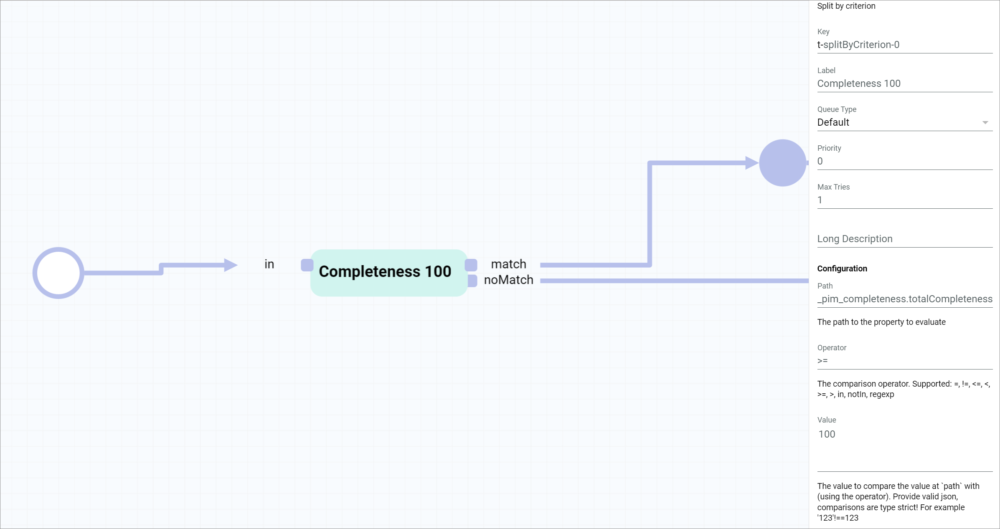
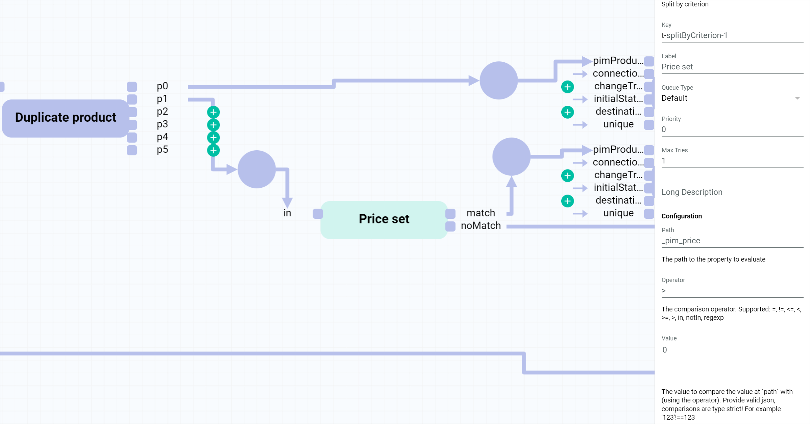
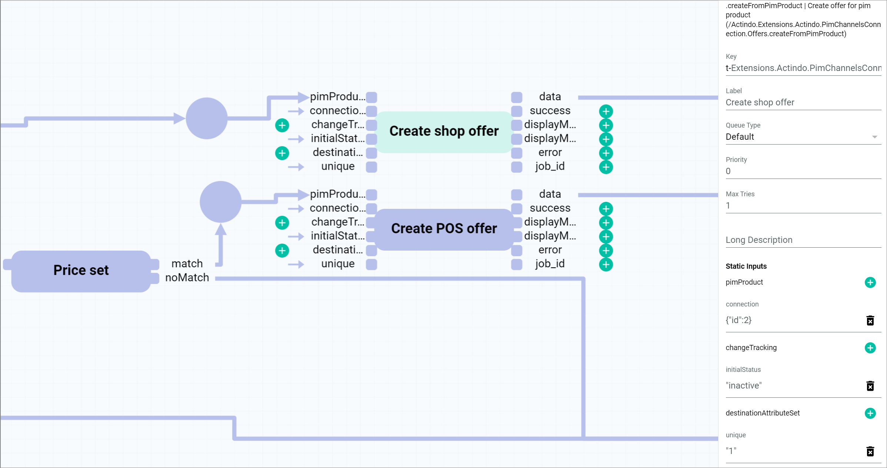

# Create an offer from product workflow in multiple channels

## Overview

| **Summary** |       |
| ----------- |------ |
| **Purpose** | Create an *Omni-Channel* offer from a *PIM* product in multiple channels |
| **Affected entities** | Modules.Actindo.PIM.Models.PIMProduct   Actindo.Extensions.Actindo.PimChannelsConnection.Offers.createFromPimProduct |
| **Included plugins** | *Process Orchestration*   *PIM*   *Omni-Channel* |
| **Included third party software** | none | 
| **Trigger** | The process is triggered when a *PIM* product is created or saved. |

## Prerequisites

- You have created a *PIM* product, see [Create a product](../PIM/Operation/01_ManageProducts.md#create-a-product).
- You have created a connection to a sales channel, see [Create a connection](../Channels/Integration/01_ManageConnections.md#create-a-connection).
- You have set up an offer from product workflow, see [Set up an offer from product workflow](./01_Introduction.md#set-up-an-offer-from-product-workflow).
- You have created a *PIM* product trigger, see [Create a PIM product trigger](./01_Introduction.md#create-a-pim-product-trigger). 

## Workflow description

Within a workflow, several actions are performed. In the following, all single actions within the workflow are described in detail, specifying their function and functional settings.

For detailed information on how to manage a workflow, see [Manage a workflow](../ActindoWorkFlow/Operation/01_ManageWorkflows.md).

### Split by criterion

The *Split by criterion* action is used to compare the input value with a defined criterion and output it via a different branch depending on whether the input value matches or not. For detailed information, see [Split by criterion](../ActindoWorkFlow/UserInterface/08_CoreActions.md#split-by-criterion). 

In this use case, you need to check whether the total completeness value of the *PIM* product coming from the start place via the *in* port is greater than or equal to 100. 

To do so, you must configure *Split by criterion* action as follows:

**Settings**

| Field | Value | Comments | 
|---------|-------|----------|
| *Description* | Split by criterion | Core action   For detailed information, see [Core actions](../ActindoWorkFlow/UserInterface/08_CoreActions.md). |
| *Key* | splitByCriterion-0 | The key must be unique within a workflow. |
| *Label* | Completeness 100 | It is recommended to enter a short descriptive name in the *Label* field. |
| *Queue type* | Default | For detailed information on all action settings, see [Transitions](../ActindoWorkFlow/Overview/04_WorkflowProcessElements.md#transitions). |
| *Priority* | 0 | |
| *Max tries* | 1 | |
| *Long description* | - |  |

[comment]: <> (oder ActindoWorkFlow/UserInterface/02a_Workflows.md#workflow-editor? Check und ggf. anpassen)

**Configuration**

| Field | Value | Comments | 
|---------|-------|----------|
| *Path* | _pim_completeness.totalCompleteness | |
| *Operator* | >= | |
| *Value* | 100 | |

Once configured, the *Completeness 100* action presents the following structure:

| Input port     | Value | -  | Output port | Value |
| --------------- | ----- | ---| ------------ | ----  |
| *in*  | PIMProduct (from start place) | - | *match* | PIMProduct |
| -     |          | - | *noMatch* | (to end place)   |

The *PIM* product in the start place is input via the *in* port. If the *PIM* product completeness input is greater than or equal to 100, the *PIM* product is output via the *match* port. Otherwise, the *PIM* product is output via the *noMatch* port, in this case, to the end place. 

### Multiply input action

[comment]: <> (Deprecated in Key??? Check!)

The *Multiply input action* is used to output the data coming in via one input port to two output ports. For detailed information, see [Multiply input action](../ActindoWorkFlow/UserInterface/08_CoreActions.md#multiply-input-action). 

In this use case, you need to output the value (*PIM* product) coming via the *p* input port from the *match* output port (*Completeness 100*) of the previous action into two output ports, in order to create two different offers, one per sales channel.

To do so, you must configure the *Multiply input action* action as follows:

**Settings**

| Field | Value | Comments | 
|---------|-------|----------|
| *Description* | Multiply input action | Core action   For detailed information, see [Core actions](../ActindoWorkFlow/UserInterface/08_CoreActions.md). |
| *Key* | deprecated_duplicate_input-0 | The key must be unique within a workflow. |
| *Label* | Duplicate product | It is recommended to enter a short descriptive name in the *Label* field. |
| *Queue type* | Default | For detailed information on all action settings, see [Transitions](../ActindoWorkFlow/Overview/04_WorkflowProcessElements.md#transitions). |
| *Priority* | 0 | |
| *Max tries* | 1 | |
| *Long description* | - | |

Once configured, the *Duplicate product* action presents the following structure:

| Input port   | Value | -  | Output port | Value    |
| --------------- | --- | --- | -------------- | ----  |
| *p*  | PIM product with 100 completeness | - | *p0* | PIM product (for channel A)|
| -     |          | - | *p1* | PIM product  (for channel B) |

The *p0* output port will be connected to a sales channel A, for instance, your online shop. The *p1* output port will be connected to a sales channel B, for example, the POS system in your retail store. From this point on, the workflow splits in two branches which must be configured separately.

### Split by criterion

The *Split by criterion* action is used to compare the input value with a defined criterion and output it via a different branch depending on whether the input value matches or not. For detailed information, see [Split by criterion](../ActindoWorkFlow/UserInterface/08_CoreActions.md#split-by-criterion). 

In this use case, you want to check whether the price of the *PIM* product coming from the previous action via the *in* port is set, or in other words, it is greater than 0, before creating an offer for your POS system. 

To do so, your must configure the *Split by criterion* action as follows:

**Settings**

| Field | Value | Comments | 
|---------|-------|----------|
| *Description* | Split by criterion | Core action   For detailed information, see [Core actions](../ActindoWorkFlow/UserInterface/08_CoreActions.md). |
| *Key* | splitByCriterion-1 | The key must be unique within a workflow. |
| *Label* | Price set | It is recommended to enter a short descriptive name in the *Label* field. |
| *Queue type* | Default | For detailed information on all action settings, see [Transitions](../ActindoWorkFlow/Overview/04_WorkflowProcessElements.md#transitions). |
| *Priority* | 0 | |
| *Max tries* | 1 | |
| *Long description* | - | |

**Configuration**

| Field | Value | Comments |
|---------|-------|----------|
| *Path* | _pim_price | |
| *Operator* | > | |
| *Value* | 0 | |

Once configured, the *Price set* action presents the following structure:

| Input port     | Value | -  | Output port | Value    |
| --------------- | --- | ---| -------------- | ----  |
| *in*  | PIM product  | - | *match* | PIM product |
| -     |          | - | *noMatch* | (to end place)   |

The *PIM* product in *p1* of the previous action is input via the *in* port. If the *PIM* price is set, that is, it is greater than 0, the *PIM* product is output via the *match* port. Otherwise, the *PIM* product is output via the *noMatch* port, in this case, to the end place.

### Create offer from PIM product

The *Create offer from PIM product* action creates an offer in the *Omni-Channel* module from a *PIM* product.  

In this use case, you need to create an offer for a *PIM* product in two different sales channels: your [online shop](#create-shop-offer) and the [POS system](#create-pos-offer) in your retail store.

### Create shop offer

To create an offer for your online shop, configure the *Create offer from PIM product* action in the respective branch as follows:

**Settings**

| Field | Value      | Comments |
|---------|------------|----------|
| *Description* | .createFromPimProduct   Create offer for pim product (/Actindo.Extensions.Actindo.PimChannelsConnection.Offers.createFromPimProduct) | This field contains the API endpoint that is addressed in this action. |
| *Key* | Extensions.Actindo.PimChannelsConnection.Offers.createFromPimProduct-0 | The key must be unique within a workflow. |
| *Label* | Create shop offer | It is recommended to enter a short descriptive name in the *Label* field. |
| *Queue type* | Default | For detailed information on all action settings, see [Transitions](../ActindoWorkFlow/Overview/04_WorkflowProcessElements.md#transitions). |
| *Priority* | 0 | |
|  *Max tries* | 1 | |
| *Long description* | - |  |

**Static inputs**

| Field | Value | Comments |
|---------------|------|----------|
| *pimProduct* | PIM product | Connected to *p0* output from previous action | 
| *connection* | { "id": 2 } | You can find out the connection ID in the *ID* column of the *Connections* view under *Omni-Channel > Settings > Connections*.   If the *ID* column is hidden, see [Add or remove columns](../Core1Platform/UsingCore1/05_WorkWithLists.md#add-or-remove-columns) in the *Core1* documentation. |
| *changeTracking* | - |
| *initialStatus* | "inactive" | Offers can have three different initial status: **active**, **inactive**, and **offline**.   For detailed information, see [Create an offer from a PIM product](../Channels/Operation/01_ManageOffers.md#create-an-offer-from-a-pim-product). |
| *destinationAttributeSet* | - |
| *unique* | "1" | The static input *unique* prevents the creation of duplicate offers. This is a boolean value, where "1" equals true and no value equals false. This setting can be configured at this point or in the workflow trigger (*Unique check* setting). |

> [Info] For detailed information on how to insert a static input, see [Insert a static input](../ActindoWorkFlow/Operation/to-be-completed).

[comment]: <> (Stimmt unique as boolean? Stimmt Unique check info?)

### Create POS offer

To create an offer for the POS system in your retail store, configure the *Create offer from PIM product* action in the respective branch as follows:

**Settings**

| Field | Value      | Comments |
|---------|------------|----------|
| *Description* | .createFromPimProduct   Create offer for pim product (/Actindo.Extensions.Actindo.PimChannelsConnection.Offers.createFromPimProduct) | This field contains the API endpoint that is addressed in this action. |
| *Key* | Extensions.Actindo.PimChannelsConnection.Offers.createFromPimProduct-1 | The key must be unique within a workflow. |
| *Label* | Create POS offer | It is recommended to enter a short descriptive name in the *Label* field. |
| *Queue type* | Default | For detailed information on all action settings, see [Transitions](../ActindoWorkFlow/Overview/04_WorkflowProcessElements.md#transitions). |
| *Priority* | 0 | |
|  *Max tries* | 1 | |
| *Long description* | - |  |

**Static inputs**

| Field | Value | Comments |
|---------------|------|----------|
| *pimProduct* | PIM product | Connected to *p0* output from previous action | 
| *connection* | { "id": 12 } | You can find out the connection ID in the *ID* column of the *Connections* view under *Omni-Channel > Settings > Connections*.   If the *ID* column is hidden, see [Add or remove columns](../Core1Platform/UsingCore1/05_WorkWithLists.md#add-or-remove-columns) in the *Core1* documentation. |
| *changeTracking* | - |
| *initialStatus* | "inactive" | Offers can have three different initial status: **active**, **inactive**, and **offline**.   For detailed information, see [Create an offer from a PIM product](../Channels/Operation/01_ManageOffers.md#create-an-offer-from-a-pim-product). |
| *destinationAttributeSet* | - |
| *unique* | "1" | The static input *unique* prevents the creation of duplicate offers. This is a boolean value, where "1" equals true and no value equals false. This setting can be configured at this point or in the workflow trigger (*Unique check* setting). |

> [Info] For detailed information on how to insert a static input, see [Insert a static input](../ActindoWorkFlow/Operation/to-be-completed).

## JSON

    {
        "key": "create_offer_from_complete_pim_product",
        "version": 14,
        "name": "Create Offer from complete PIM product",
        "published": true,
        "places": {
            "input": "Modules.Actindo.PIM.Models.PIMProduct",
            "output": "anyValue",
            "p-p-0": "anyValue",
            "p-p1-0": "anyValue",
            "p-p1-1": "anyValue",
            "p-pimProduct-1": "ReadOnly.Modules.Actindo.PIM.Models.PIMProductContainer"
        },
        "comment": null,
        "transitions": [
            {
                "maxTries": 1,
                "queueType": "1",
                "key": "t-deprecated_duplicate_input-0",
                "action": "deprecated_duplicate_input",
                "priority": 0,
                "comment": null,
                "description": "Duplicate product"
            },
            {
                "maxTries": 1,
                "queueType": "1",
                "key": "t-Extensions.Actindo.PimChannelsConnection.Offers.createFromPimProduct-0",
                "action": "Extensions.Actindo.PimChannelsConnection.Offers.createFromPimProduct",
                "priority": 0,
                "comment": null,
                "description": "Create shop offer"
            },
            {
                "maxTries": 1,
                "queueType": "1",
                "key": "t-Extensions.Actindo.PimChannelsConnection.Offers.createFromPimProduct-1",
                "action": "Extensions.Actindo.PimChannelsConnection.Offers.createFromPimProduct",
                "priority": 0,
                "comment": null,
                "description": "Create POS offer"
            },
            {
                "maxTries": 1,
                "queueType": "1",
                "key": "t-splitByCriterion-0",
                "action": "splitByCriterion",
                "priority": 0,
                "comment": null,
                "config": {
                    "path": "_pim_completeness.totalCompleteness",
                    "operator": ">=",
                    "value": 100
                },
                "description": "Completeness 100"
            },
            {
                "maxTries": 1,
                "queueType": "1",
                "key": "t-splitByCriterion-1",
                "action": "splitByCriterion",
                "priority": 0,
                "comment": null,
                "config": {
                    "path": "_pim_price",
                    "operator": ">",
                    "value": 0
                },
                "description": "Price set"
            }
        ],
        "arcs": [
            "t-Extensions.Actindo.PimChannelsConnection.Offers.createFromPimProduct-0(data) -> output",
            "p-pimProduct-1 -> t-Extensions.Actindo.PimChannelsConnection.Offers.createFromPimProduct-0(pimProduct)",
            "input -> t-splitByCriterion-0(in)",
            "t-splitByCriterion-0(match) -> p-p-0",
            "t-splitByCriterion-0(noMatch) -> output",
            "p-p1-0 -> t-Extensions.Actindo.PimChannelsConnection.Offers.createFromPimProduct-1(pimProduct)",
            "t-Extensions.Actindo.PimChannelsConnection.Offers.createFromPimProduct-1(data) -> output",
            "p-p1-1 -> t-splitByCriterion-1(in)",
            "t-splitByCriterion-1(match) -> p-p1-0",
            "t-splitByCriterion-1(noMatch) -> output",
            "p-p-0 -> t-deprecated_duplicate_input-0(p)",
            "t-deprecated_duplicate_input-0(p0) -> p-pimProduct-1",
            "t-deprecated_duplicate_input-0(p1) -> p-p1-1",
            "\"1\" -> t-Extensions.Actindo.PimChannelsConnection.Offers.createFromPimProduct-0(unique)",
            "{\"id\":2} -> t-Extensions.Actindo.PimChannelsConnection.Offers.createFromPimProduct-0(connection)",
            "\"inactive\" -> t-Extensions.Actindo.PimChannelsConnection.Offers.createFromPimProduct-0(initialStatus)",
            "{\"id\":12} -> t-Extensions.Actindo.PimChannelsConnection.Offers.createFromPimProduct-1(connection)",
            "\"active\" -> t-Extensions.Actindo.PimChannelsConnection.Offers.createFromPimProduct-1(initialStatus)",
            "\"1\" -> t-Extensions.Actindo.PimChannelsConnection.Offers.createFromPimProduct-1(unique)"
        ],
        "triggers": [
            {
                "name": "PIM Product Saved",
                "event": "postUpdate",
                "active": true,
                "unique": false,
                "processPriority": 10,
                "model": "Actindo\\Modules\\Actindo\\PIM\\Models\\PIMProduct",
                "allConditionsRequired": true,
                "conditions": []
            }
        ],
        "nodePositions": {
            "input": {
                "x": -220,
                "y": -70
            },
            "output": {
                "x": 1080,
                "y": -40
            },
            "t-Extensions.Actindo.PimChannelsConnection.Offers.createFromPimProduct-0": {
                "x": 700,
                "y": -260
            },
            "t-splitByCriterion-0": {
                "x": -60,
                "y": -60
            },
            "p-p-0": {
                "x": 50,
                "y": -210
            },
            "p-p1-0": {
                "x": 540,
                "y": -210
            },
            "p-pimProduct-1": {
                "x": 530,
                "y": -270
            },
            "t-Extensions.Actindo.PimChannelsConnection.Offers.createFromPimProduct-1": {
                "x": 700,
                "y": -190
            },
            "t-splitByCriterion-1": {
                "x": 440,
                "y": -160
            },
            "p-p1-1": {
                "x": 340,
                "y": -200
            },
            "t-deprecated_duplicate_input-0": {
                "x": 190,
                "y": -240
            }
        }
    }