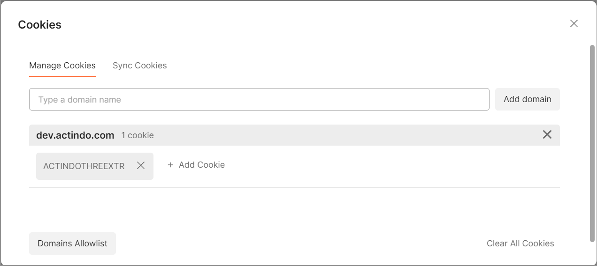

# Introduction

## General information

API vs UI   
Nutzen/Vorteil 

OpenAPI V3 format

## Authentication

**Security Scheme Type**: OAuth2  
**authorizationCode OAuth Flow**  
Authorization URL: /Actindo.CoreModules.Auth.OAuth2.authorize  
Token URL: /Actindo.CoreModules.Auth.OAuth2Token.getAccessToken  

How to pass parameters in JSON format in Postman?
Add the following to the headers: "Content-Type: application/json". This setting specifies that the data being sent in the request body is in JSON format.

## Best practices

To send requests to the *Actindo Core1 Platform* API endpoints, you need to use an external API tool, such as Postman. For detailed information on download, configuration and basic functions, see the [Postman](https://www.postman.com/ "[https://www.postman.com/]") website.

### Set up Postman for the *Actindo Core1 Platform* 

1. Define the headers  
    Headers must be defined, so that the data is transferred to the Core1 in the appropriate format and responses are transmitted back to the user.

    1. Click the *Headers* tab. 
    2. Enter "Content-Type" and "Accept" in two different rows the *Key* column. 
    3. Enter "application/json" in the *Value* column for both rows.

2. Set the session cookie  
    Before you can communicate with the Core 1, you have to set a session cookie. To do so, follow the procedure below:

    1. Send a request via the "Send" button.  
        You receive the following response:

            {
            "success": false,
            "errno": 10000,
            "error": "Not  logged in",
            "trace": ""
            }
        
        This response indicates that the request failed because you are not logged into the Core1 system in Postman. The API request must include the session ID from the Core1 system in which you are currently logged in.

    2. Switch to the browser where you are logged into your Core1 system. 

    3. Open the console in the browser developer tools. Depending on the browser you use, the access shortcut or key may differ. For example, in Chrome you can access the console pressing the **F12** key.
    
    4. Click the *Application* tab and select the *Cookie* option in the left menu under the *Storage* section.

    5. Click the cookie corresponding to the Core1 system you want to access via API.  
        All cookie values are displayed on the right.

        
    
    6. Select the session cookie of the Core1 instance you want to access via API. There may be two types of cookies:
        - ACTINDOTHREE  
            This cookie is displayed if you have a live system.
        - ACTINDOTHREEEXTR  
            This cookie is displayed if you have a sandbox.
        The cookie value is displayed in the *Cookie Value* section.

    7. Copy the appropriate cookie from the *Cookie Value* section.  
    
    8. Switch to *Postman* and click the *Cookies* button located under the *Send* button.  
        The *Cookies* window is displayed.

        

    9. Click the existing cookie to display the current cookie values.

        

    10. Replace the existing cookie value with the copied cookie value from the console.

    11. Click the *Save* button and close the *Cookies* window.  
        The session cookie has been saved. You can start sending API requests.

3. 

[comment]: <> (Ref: https://actindo.atlassian.net/wiki/spaces/CW/pages/33193985/How+to+configure+postman+and+make+an+API+call)

- Collections
- Calls 
    - vordefinieren (Vorlagen) 
    - exportieren 
    - share (Cloud)

## Methods 

The *POST* method is always used for all Actindo API endpoints. All other methods are not relevant for communication with the Core1 platform.

## Response codes

The response codes correspond the standard HTTP status codes. For detailed information, see [HTTP status codes](https://en.wikipedia.org/wiki/List_of_HTTP_status_codes "[https://en.wikipedia.org/wiki/List_of_HTTP_status_codes]").
