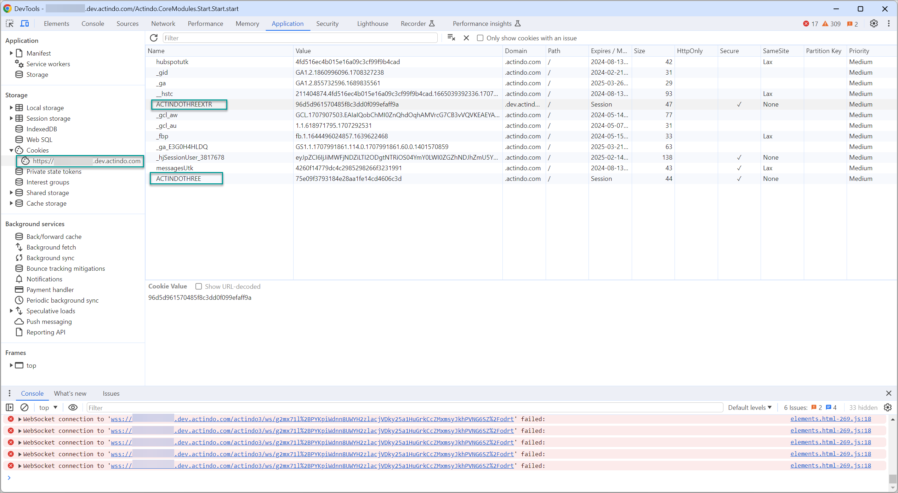

# Overview

[comment]: <> (Diese Info gilt für alle APIs bzw. alle Module. Falls andere Module dokumentiert, darauf verweisen oder auf eine überordnete Ebene verschieben)

In this section, an API reference documentation for the *Actindo Core1 Platform* is provided. It includes the following information:

- A brief description of the *Actindo Core1 OpenAPI* and its basic requirements, see [About the Actindo Core1 OpenAPI](#about-the-actindo-core1-openapi).
- A quick guide to set up the API, see [Get started](./02_GetStarted.md).
- A brief but detailed explanation of the data structure that underlies the system, see [Key concepts](./03_KeyConcepts.md).
- A number of practical use cases with request samples to manage products via API, see for instance [Manage products](./05_Products.md) and [Manage product variants](./06_Variants.md).

[comment]: <> (Wenn andere Module dazukommen, letzter Punkt evtl. dementsprechend anpassen!)

## About the Actindo Core1 OpenAPI

[comment]: <> (Andere Kompatibilität? SOAP und andere unterstützt? Erwähnenswert? Allgemeine API info, die man noch erwähnen sollte?)

The *Actindo Core1 OpenAPI* is a web REST API that uses the OpenAPI 3.0 Specification (OAS). It uses resource-oriented URIs, accepts and returns JSON-encoded requests, and uses standard HTTP status codes. For detailed information, see [Request bodies](#request-bodies) and [Responses bodies](#response-bodies).

The *Actindo Core1 OpenAPI* supports the  standard *Actindo Core1 Platform* operations, such as create, edit, and delete products. In addition to the standard features available via user interface, it offers advanced functionalities to manage resources more quickly and efficiently. For example, you can create or maintain multiple products simultaneously, and move one or several variant products to another master product just with one API call. 

You can use the API both in staging and production instances of your *Actindo Core1 Platform*. Bear in mind that every *Actindo Core1 Platform* account is unique in its API configuration due to the individual construction of the installed and extended modules, and therefore the addressable endpoints and fields may vary.  

In the following, you will find a detailed description of the *Actindo Core1 OpenAPI* basic requirements.

### Request bodies

To make an API call, you need to send an HTTP request. The request body must include the following elements:

#### URIs

URI stands for Uniform Resource Identifier. It represents the location of a web resource. 

In the *Actindo Core1 OpenAPI*, the URI has the following structure:

**https://your-workspace.actindo.com/API.endpoint**

- *your-workspace* represents the name of your instance.
- *API.endpoint* represents the API endpoint as described in this API reference documentation.

#### Headers

Headers contain metadata in key-value pairs that are sent along with HTTP requests and responses. They are essential for the API calls, as they provide additional information for communication between client and server.

The following headers are required for communication with the *Actindo Core1 OpenAPI*:

| Key | Value |
|-----|-------|
| Content-Type  | application/json |
| Accept        | application/json |
| Authorization | access token   See [Generate an access token](./02_GetStarted.md#step-3-generate-an-access-token). |

[comment]: <> (Unsicher, ob das stimmt, und wie authentication/authorization via header/request body funktioniert)

#### Methods

The *POST* method is always used for all *Actindo Core1 OpenAPI* endpoints. All other methods are not relevant for communication with the *Actindo Core1 Platform*.

#### Format

The *Actindo Core1 OpenAPI* only accepts and returns JSON body requests. 

### Response bodies

An API response is a reply to an API call. In other words, for every request body sent, a response body is returned. 

In the *Actindo Core1 OpenAPI*, the response body contains a JSON object, which always includes the boolean field `"success"` indicating if the request has been successful (`true`) or has failed (`false`). 

In a successful call, the response includes the information requested or the details of the resources created, edited, or deleted. In an unsuccessful call, the response includes an error code and at least a brief description of the reason why the call failed. 

The following examples display two response samples. These response samples are not exhaustive, that is, some lines of code have been omitted for the sake of brevity and replaced with an ellipsis (...). Bear also in mind that the response sample varies depending on the endpoint and the resource addressed.  

#### Sample: Success, product created

        {
            "product": {
            "id": 1171,
            "sku": "new-product",
            "attributeSetId": 102,
            ...
            },
            "success": true,
            "displayMessage": "The product was successfully created",
            "displayMessageTitle": "Create product",
            "error": null,
            "job_id": null
        }

> [Info] For a complete list of attributes contained in the product object, see [The product object](./05_Products.md#the-product-object).

#### Sample: Error, required field missing or empty

        {
            "success": false,
            "errno": 10023,
            "error": "Product could not be created: Attribute set id is not set or empty",
            "trace": "<pre> (Actindo\\Modules\\Actindo\\PIM\\Exception\\CreateProductFailedException) in ... \/pre>"
        }

> [Info] For a response schema, refer to the API documentation in your *Actindo Core1 Platform* instance under *Dev Tools > API > Module name > API endpoint*.

[comment]: <> (Add a "general" response schema? Depends on response, ok or error, and resource...)

#### Response codes

Generally, the *Actindo Core1 OpenAPI* uses the standard HTTP status codes to indicate the success of failure of the API requests. The most usual response codes returned are as follows: 

| Code | Description | Notes |
| ---- | ----------- | ------ |
| 200  | OK          |  Everything worked as expected      |
| 400  | Bad request | Unacceptable request, often due to missing required parameter or  header, e.g. Content-Type: application/json, or malformed json |
| 401  | Unauthorized | Authentication has failed, e.g. due to invalid or missing authentication credentials |
| 429  | Too many requests   | You sent too many requests in a given amount of time |
| 530  | Site frozen | The tenant is currently frozen due to maintenance work, module installations or updates |
| default | Generic error | - | 

For detailed information, see [HTTP status codes](https://en.wikipedia.org/wiki/List_of_HTTP_status_codes "[https://en.wikipedia.org/wiki/List_of_HTTP_status_codes]").

### Authentication

The *Actindo Core1 Platform* supports two workflows of the OAuth 2.0 protocol to retrieve an access token and make authenticated requests. For detailed information on the authentication flow, see [Set up the OAuth authorization](02_GetStarted.md#set-up-the-oauth-authorization).

### Tools

You can use different software tools to submit your requests, either your own tool or a third-party tool, such as Postman. For a detailed description on how to set up Postman, see [Set up Postman for the Actindo Core1 OpenAPI](#set-up-postman-for-the-actindo-core1-openapi). 

Regardless of how you submit your requests, you always need to provide the following information:

- URI
- HTTP method 
- Headers
- Request body

## Set up Postman for the Actindo Core1 OpenAPI

[comment]: <> (Imogen: Das ist ein Versuch zu deinem Vorschlag, dass diese Info unter Overview/Setup kommen sollte. Besser so oder in einer separaten Datei? Trotzdem weiß ich nicht, ob das bleibt, da Julian gesagt hat, es wäre nicht unbedingt nötig... Daher habe ich auch separat woanders geparkt.)

To send requests to the *Actindo Core1 Platform* API endpoints, you can use an external API tool, such as Postman. For detailed information on download, configuration, and basic functions, see the [Postman](https://www.postman.com/ "[https://www.postman.com/]") website.

Before you can send requests to the *Actindo Core1 OpenAPI* with Postman, you have to set it up to interact with your system.  

### Define the headers

Headers must be defined, so that the data is transferred to the *Actindo Core1 OpenAPI* in the appropriate format and responses are transmitted back to the user. To do so, follow the procedure below:

1. Click the *Headers* tab. 

2. Enter "Content-Type" and "Accept" in two different rows the *Key* column. 

3. Enter "application/json" in the *Value* column for both rows. This setting specifies that the data being sent in the request body is in JSON format.

### Set the session cookie

Before you can communicate with the Core 1, you have to set a session cookie. To do so, follow the procedure below:

1. Send a request via the [Send] button.  
    You receive the following response:

        {
        "success": false,
        "errno": 10000,
        "error": "Not  logged in",
        "trace": ""
        }
    
    This response indicates that the request failed because you are not logged into your *Actindo Core1 Platform* instance in Postman. The API request must include the session ID from the *Actindo Core1 Platform* instance in which you are currently logged in.

2. Switch to the browser where you are logged into your *Actindo Core1 Platform* instance. 

3. Open the console in the browser developer tools. Depending on the browser you use, the access shortcut or key may differ. For example, in Chrome you can access the console pressing the **F12** key.

4. In the browser developer tools console, click the *Application* tab and expand the *Cookies* option in the left menu under the *Storage* section.  
    The URL of your current *Actindo Core1 Platform* instance is displayed.

5. Click the URL of your current *Actindo Core1 Platform* instance.  
    All cookies are displayed on the right.

    

6. Select the session cookie of the *Actindo Core1 Platform* instance you want to access via API. There are two types of cookies:
    - **ACTINDOTHREE**  
        Select this cookie if your instance is a live system.
    - **ACTINDOTHREEEXTR**  
        Select this cookie if your instance is a sandbox.  
    The cookie value is displayed in the *Cookie Value* section.

7. Copy the cookie value from the *Cookie Value* section to your clipboard.  

8. Switch to *Postman* and click the [Cookies] button located under the [Send] button.  
    The *Cookies* window is displayed.

    

9. Click the existing cookie to display the current cookie values.

    

10. Replace the current cookie value with the cookie value you have previously copied from the console.

11. Click the [Save] button and close the *Cookies* window.  
    The session cookie has been saved. You can start sending API requests.

[comment]: <> (Ref: https://actindo.atlassian.net/wiki/spaces/CW/pages/33193985/How+to+configure+postman+and+make+an+API+call)

### Best practices

We recommend that you create collections and predefine API calls using the templates provided. This way you can reuse your API calls, export them, and even share them with other colleagues in the Cloud. For detailed information, refer to the Postman documentation in the [Postman](https://www.postman.com/ "[https://www.postman.com/]") website.

[comment]: <> (In Postman habe ich session cookie eingestellt, daher brauche authentication nicht mehr. Wie funktioniert es sonst?)

