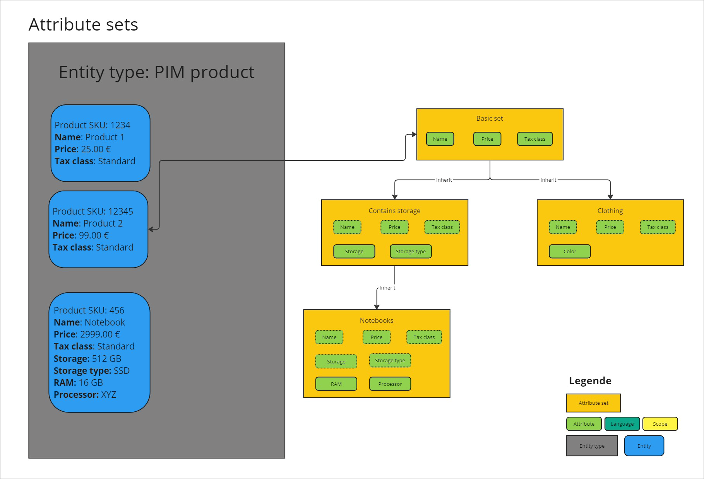

# Basics on Actindo Core1 OpenAPI

To be able to communicate via API with the *Actindo Core1 Platform*, you need to have a clear overview of the data model that lies behind it.

- Attribute
    - Managed in DataHub
    - Attribute structure
    - Data types
    - ID
        - via UI
        - via API

- Attribute set
    - Managed in DataHub
    - Assign/add attribute to a set
    - Mapping
    - ID
        - via UI
        - via API

- Variant  
    - Managed in PIM

- Variant set

## Attributes

An attribute defines a characteristic to describe a product. All attributes are created and maintained in the *DataHub* module. Therefore, all attributes available in the system are displayed in *DataHub*. Besides, product-specific attributes can be created and maintained in the *PIM* module. If you install additional plugins to communicate with third-party systems, such as external sales channels or service providers, other attributes may be created via driver.

[comment]: <> (Beispiele aus PIM Basic Set nehmen? Hat der Kunde auch diese vordefinierten Attributen/Sets?)

All attributes have a key. This key is required for API access and therefore must be system wide unique. 

An attribute key must fulfill the following criteria:  
    - valid characters are **a-z** (upper and lower case), **0-9** and the underscore ( **_** )  
    - the key must not start with a number  
    - a double underscore ( **___** ) and a trailing underscore are forbidden  

[comment]: <> (Das stimmt nicht, mit dem double underscore, oder?)

You can define your own attribute keys, but we strongly recommend that you follow consistent naming conventions for the sake of clarity, such as follows: 

**\_owning module_attribute short name__scope__language**

[comment]: <> (The owning module is...)

The following examples are based on predefined *PIM* attributes. If you have created your own attributes in your system, the names and keys may differ.

| Attribute      | Attribute key |
|----------------|---------------|
| Product name   | _pim_art_name |
| EAN-code       | _pim_ean      |
| Product description | _pim_products_description |
| Price          | _pim_price  |   

Depending on the nature of your products, you will need to create different attributes. For example, if you are selling clothes, you will need to define the material, type of fit or the collar size (example attribute keys: _pim_material, _pim_fit, _pim_collar_size). However, if you sell smartphones, you need to specify the storage, the screen size, or the case color (example attribute keys: _pim_storage, _pim_screen_size, _pim_case_color). 

Some attributes apply to all products, as every product needs to have a name, an EAN or SKU code, or a product description. These common attributes are included in a "basic set", the so-called *PIM basic set* in the *PIM* module. Product-specific attributes, however, are include in a other additional sets. For detailed information on attribute sets, see [Attribute sets](#attribute-sets).

You can create you own attributes in your Core1 system via the user interface. For detailed information on how to create an attribute, see [Create an attribute](../../DataHub/Integration/01_ManageAttributes.md#create-an-attribute).

## Attribute sets

Attributes are collected in so-called *Attribute sets*. An attribute set includes therefore a number of attributes that define an entity type, for example, a specific type of product in the case of the *PIM* module. 

All attribute sets have a key. This key is required for API access and therefore must be system wide unique. 

An attribute set key must fulfill the following criteria:  
    - valid characters are **a-z** (upper and lower case), **0-9** and the underscore ( **_** )  
    - the key must not start with a number  
    - a double underscore ( **___** ) and a trailing underscore are forbidden  

[comment]: <> (Stimmt das mit dem double underscore hier?)

You can define your own attribute key sets, but we strongly recommend that you follow consistent naming conventions for the sake of clarity, such as follows: 

**\_owning module_attribute set short name ... **

[comment]: <> (was noch?)
[comment]: <> (The owning module means...)

The following examples are based on predefined *PIM* attributes. If you have created your own attributes in your system, the names and keys may differ.

| Attribute set      | Attribute set key |
|--------------------|-------------------|
| PIM basic set      | _pim_basic_set    |
| PIM electronics    | _pim_electronics  |
| Omni-Channel orders | _channels_order_basic_set_order   |
| Fulfillment Item Attribute Set | _fulfillment_item_base_set |  

You can create you own attribute sets in your Core1 system via the user interface. For detailed information on how to create an attribute set, see [Create an attribute set](../../DataHub/Integration/01_ManageAttributeSets.md#create-an-attribute-set).

Define concepts 
- entity
- inheritance

S. [DataHub basics](../../DataHub/Overview/04_Basics.md)

## Entities

## Inheritance

## Data types  

For detailed information on the different data types available in the *DataHub* module, see [Data type list](../../DataHub/UserInterface/04_DataTypeList.md).

Further information:

[Assign an attribute to an attribute set](../../DataHub/Integration/02_ManageAttributeSets.md#add-an-attribute-to-the-set). 

## Required attributes  

Attributes can be required or optional. Required attributes must always be provided when sending a request

## Format  

The *Actindo Core1 OpenAPI* endpoints accept requests in JSON format. 

