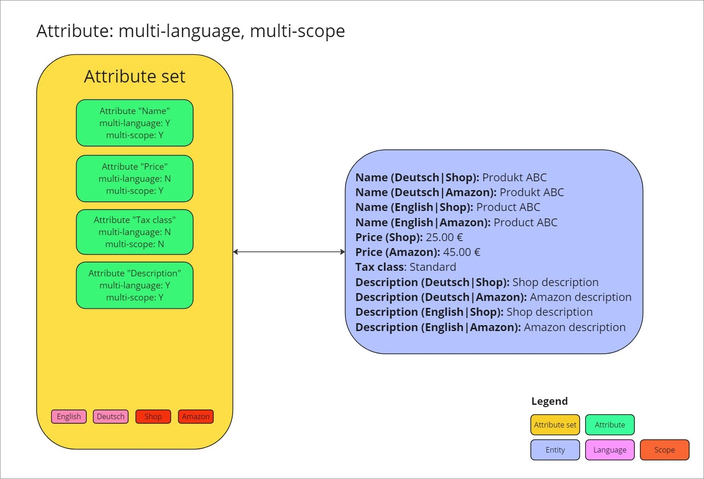
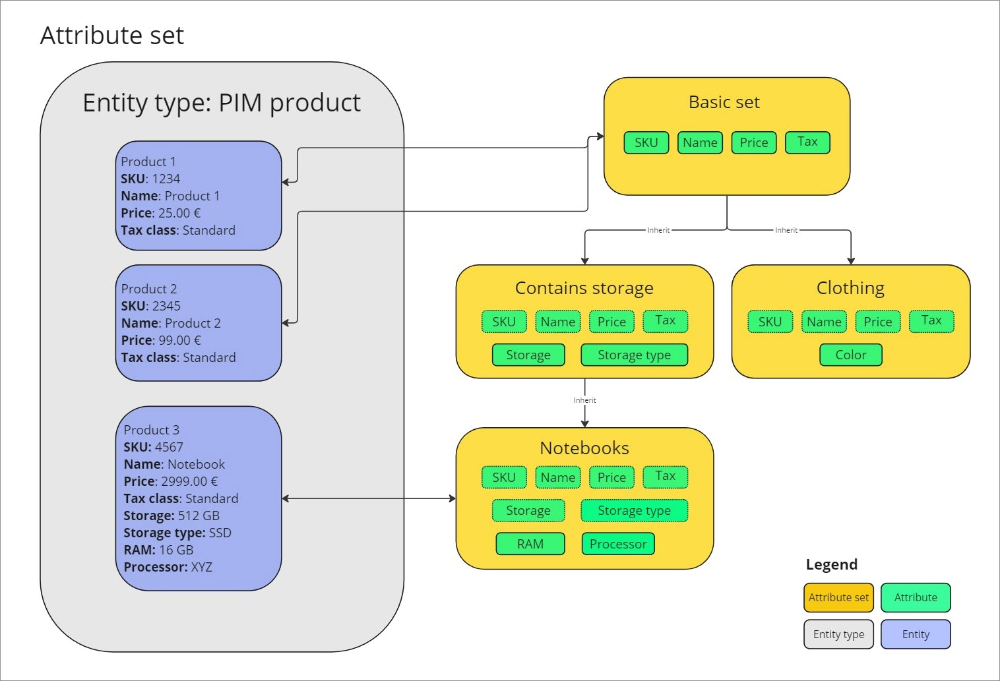
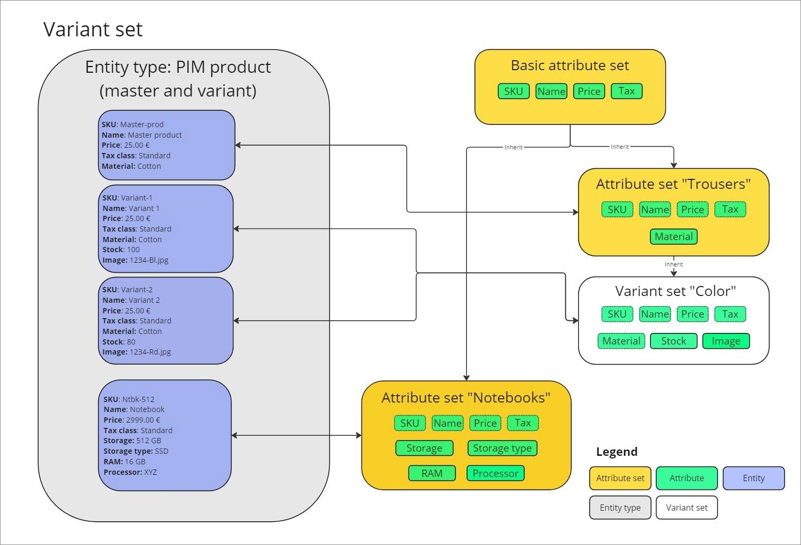

[!!DataHub Basics](../../DataHub/Overview/04_Basics.md)
[!!Data types](../../DataHub/UserInterface/04_DataTypeList.md)

# Basics on Actindo Core1 OpenAPI

To be able to communicate via API with the *Actindo Core1 Platform*, you need to have a clear overview of the data structure that lies behind it.

For an overview of the Actindo data model, see [Data model](../../DataHub/Overview/04_Basics.md).

## Attributes

An attribute defines a characteristic to describe a product. All attributes are created and maintained in the *DataHub* module. Therefore, all attributes available in the system are displayed in *DataHub*. Besides, product-specific attributes can be created and maintained in the *PIM* module. If you install additional plugins to communicate with third-party systems, such as external sales channels or service providers, other attributes may be created via driver.

All attributes have a key. This key is required for API access and therefore must be system wide unique. 

You can define your own attribute keys, but we strongly recommend that you follow consistent naming conventions for the sake of clarity, such as follows: 

**plugin_attribute_short_name__scope__language**

**Plugin:** Plugin or module where the attribute originates from. If an attribute originates in the *PIM* module, its key should start with *pim_*.

**Attribute short name:** Any descriptive name you want to give to an attribute, such as *attributeSetId* or *art_name*. No spaces are allowed here, therefore you have to write the attribute name in one word or join the different parts with a **single** underscore.

**Scope:** For multi-scope attributes, key of the scope in which the attribute is used. You can use the attribute description in different scopes, for instance, in your web shop and in a reseller platform, such as Amazon. This way, your product description can be different in your shop and in the reseller platform. In this case, the attribute is multi-scope and must be accordingly defined in its key. The attribute key would therefore be *pim_description__shop* and *pim_description__reseller_platform*. For detailed information, see [Configure the scopes settings](../Integration/05_ConfigureChannels.md) and [Manage the scopes in DataHub](../../DataHub/Integration/04_ManageChannels.md). 

**Language:** For multi-language attributes, key of the language (ISO language code) in which the attribute is maintained. You can maintain the attribute description in different languages, for instance, in English (United States) and in German (Germany). In this case, the attribute is multi-language and must be accordingly defined in its key. The attribute key would therefore be *pim_description__en-US* and *pim_description__de-DE*. Notice that scope and language are separated with a **double** underscore in the attribute key. For detailed information, see [Configure the language settings](../Integration/05_ConfigureLanguages.md) and [Manage the languages in DataHub](../../DataHub/Integration/04_ManageChannels.md).

Depending on the nature of your products, you will need to create different attributes. For example, if you are selling clothes, you will need to define the material, type of fit or the collar size (example attribute keys: pim_material, pim_fit, pim_collar_size). However, if you sell smartphones, you need to specify the storage, the screen size, or the case color (example attribute keys: pim_storage, pim_screen_size, pim_case_color). 

Some attributes apply to all products, as every product needs to have a name, a price, an applicable tax class, and a description. These common attributes are included by default in the so-called *PIM basic set* in the *PIM* module. Product-specific attributes, however, need to be included additionally in other sets. For detailed information on attribute sets, see [Attribute sets](#attribute-sets).

Every attribute has a defined data type, which determines the type of value the attribute may contain, for example a series of characters (data type: string) or a number (data type: integer). For detailed information about the data types, see [Data type list](../../DataHub/UserInterface/04_DataTypeList.md).

You can create you own attributes in your Core1 system via the user interface, as well as edit or deactivate existing attributes. For detailed information, see [Manage the attributes](../../DataHub/Integration/01_ManageAttributes.md).

The following examples are based on predefined *PIM* attributes. If you have created your own attributes in your system, the names and keys may differ.

| Attribute                                         | Attribute key                                    | Data type |
|---------------------------------------------------|--------------------------------------------------|-----------|
| Name                                      | pim_art_name                                     | string    |
| Price                                             | pim_price                                        | integer   |
| Tax class                                         | pim_tax_class (Frage: pim_ oder taxes_?)                                        | tree node |
| Product description                               | pim_products_description                          | text field    |
| Product description (multi-scope, multi-language) | pim_products_description__actindo_basic__en_US    | text field    |
| Product description (multi-scope, multi-language) | pim_products_description__actindo_basic__de_DE    | text field    |

[comment]: <> (Confusing here: tax class can be data type "tax class" and "tree node", i.e. Standard, ermäßigt. Was ist data type tax class? Wieso ist es nicht zu finden in API products? Owning module ist Taxes?)

The following graphic visualizes a series of attributes, within an attribute set, maintained in different scopes and languages, and how these attributes define a specific product: 

## Attribute sets

An attribute set includes a number of attributes that define an entity type, for example, a specific type of product in the case of the *PIM* module. All attribute sets are created and maintained in the *DataHub* module. Therefore, all attributes available in the system are displayed in *DataHub*. Besides, product-specific attribute sets can be created and maintained in the *PIM* module. If you install additional plugins to communicate with third-party systems, such as external sales channels or service providers, other attribute sets may be created via driver.

[comment]: <> (stimmt das so?)

All attribute sets have a key. This key is required for API access and therefore must be system wide unique. 

You can define your own attribute set keys, but we strongly recommend that you follow consistent naming conventions for the sake of clarity, such as follows: 

**plugin_attribute_set_short_name**

**Plugin:** Plugin or module where the attribute originates from. If an attribute set originates in the *PIM* module, its key should start with *pim_*.

**Attribute set short name:** Any descriptive name you want to give to an attribute set, such as *electronics*, *trousers*, or *notebooks*. No spaces are allowed here, therefore you have to write the attribute name in one word or join the different parts with an underscore.

The following examples are based on predefined *PIM* attributes. If you have created your own attributes in your system, the names and keys may differ.

| Attribute set      | Attribute set key |
|--------------------|-------------------|
| PIM basic set      | pim_base_set      |
| PIM electronics    | pim_electronics   |
| PIM shirts         | pim_shirts        |

Apart from the *PIM basic set*, you can create other sets to define a specific type of product, such as clothes or notebooks. These product-specific attribute sets will usually be based on the *PIM basic set*, that is, will inherit the attributes included in it, and contain additional attributes needed to define the product type, such as a piece of clothing or a computer.  

You can create you own attribute sets in your Core1 system via the user interface, as well as edit or deactivate existing attribute sets. For detailed information, see [Manage the attribute sets](../../DataHub/Integration/02_ManageAttributeSets.md).

The following graphic visualizes the attribute set structure and inheritance principle, and how the set attributes define a specific product:

## Variants 

A *PIM* product may have variants. A variant is therefore a product with a special characteristic that differentiates it from other products of the same type. A T-shirt, for instance, is usually sold in different colors. The blue T-shirt and the red T-shirt are variants of the so-called master product T-shirt, which is just an the abstract definition of the product type T-shirt. 

Variants are created and managed in the *PIM* module. To be able to create variants, you have to create a variant set first to determine the attributes that will define the variant. For detailed information, see [Variant set](#variant-set).

You can create any numbers of variants for a product in your Core1 system via the user interface, as well as edit existing variants. For detailed information, see [Manage the variants](../Operation/02_ManageVariants.md).

[comment]: <> (Welche Auswirkung hat das Attribut pim_variant? Muss dabei was beachten? Es ist in PIM basic set, also vermutlich standardmäßig dabei.)

The following graphic visualizes a series of attributes, within an attribute set and a variant set, maintained in different scopes and languages, and how these attributes define specific variants: 

## Variant sets

A variant set includes the attributes needed to define a variant. A variant set must be therefore assigned to an attribute set, that is, to type of product to which you want to create variants. For example, if you want to create color variants for the product T-shirt, you have to create the variant set *Color* containing the defining attribute *pim_color* and assign it to the attribute set *pim_shirts*. 

Like the variants, variant sets are created and managed in the *PIM* module. You can create variant sets for a product type in your Core1 system via the user interface, as well as edit existing variant sets. For detailed information, see [Manage the variant sets](../Integration/07_ManageVariantSets.md).

The following graphic visualizes the attribute and variant set structure, the inheritance principle, and how the set and variant set attributes define a specific product:

[comment]: <> (Nicht überzeugt von Variant/Variant set Graphiken. Feedback benötigt) 

## Entity ID

[comment]: <> (Attribute/att. set, variant/variant set -> sind sie entities? Für mich entity ist eher PIM product, OC offer, dispatch note... Überbegriff für alle?)

An entity is an object containing data, for instance a *PIM* product, an *Omni-Channel* offer, a *DataHub* attribute, or an attribute set. Every entity has a unique ID, which is automatically assigned by the system for internal purposes. When accessing the system via API, you need the entity ID of any fields that are required in your request for the system to be able to recognize the entity. 

You can find out the ID via [user interface](#entity-id-via-user-interface) or via [API](#entity-id-via-api).

### Entity ID via user interface

You can find out any entity ID via user interface as follows:

1. Go to the module where the entity "lives"/originates, for example *DataHub > Data models > Attribute sets* to find out an attribute set ID.

2. Locate the entity whose ID you need.

3. Check the ID in the *ID* column. 

    > [Info] If the *ID* column is hidden, see [Add or remove columns](../../Core1Platform//UsingCore1/05_WorkWithLists.md#add-or-remove-columns) to display it. 

Alternatively, you can find out the entity ID in the URL as follows:

1. Click the entity whose ID you need.  
    The *Edit "entity"* view is displayed.

2. Check the site URL in your browser.  
    The selected entity ID is located at the of the URL, as in the following example: 

    https://example.actindo.com/Actindo.CoreModules.Start.Start.start#/Actindo.Modules.Actindo.PIM.Views.start/pim-settings/types/**102**

    
### Entity ID via API

You can also get a list of entity IDs via API as follows:

[comment]: <> (Wie? Abhängig von Entität, also Attribute set, Attribute, etc.?)

ID Attribute sets (aus AttributeController):  
/Actindo.Modules.Actindo.PIM.AttributeController.getListOfAttributeSets

Frage: wie für Attribute ID Kein Endpoint in AttributeController? 

## Mapping

To be able to exchange data among the different entity types in your system, you need to map the different entities. This way, you can convert the data contained in an entity to make it available to the other entity.

For instance, you can use a *PIM* product to create an *Omni-Channel* offer and export it subsequently into all your sales channels. The data structure in the different sales channels will most surely differ. This data structure conversion can be managed through the so-called *ETL* function. For detailed information, see [DataHub ETL process](../../DataHub/Overview/04_Basics.md#etl-process) and [Manage the ETL mappings](../../DataHub/Operation/01_ManageETLMappings.md).

