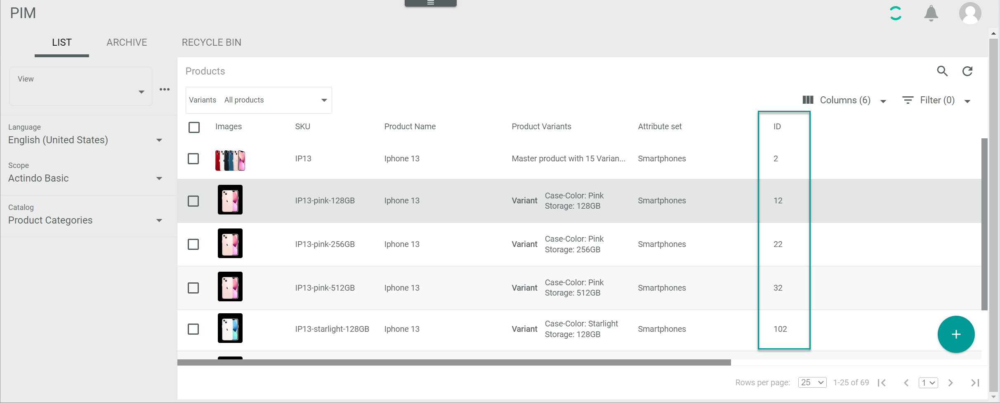

# Retrieve entity data

[comment]: <> (Was bedeutet dieses Kapitel? Vielleicht den Titel spezifischer?
Eine kurze Einführung, was mich in dem Kapitel erwartet …. Anleitung, spezielle Produktinformationen zu erhalten….
Ansonsten, sehr anschaulich beschrieben)

You can retrieve any specific entity data via API. 

To make API calls, for example, you usually need to provide some entity IDs in your request body, such as product ID or attribute set ID, for the system to recognize the entity you are addressing. The ID, that is, the entity identification number, is automatically assigned by the system when creating an entity. 

You can find out an entity ID via user interface or via API.

## Discover entity ID via user interface

You can find out any entity ID via user interface as follows:

1. Select the module where the entity originates, for example, *PIM > Products > LIST* to find out a product ID.

2. Locate the entity whose ID you need.

3. Check the ID in the *ID* column. 

    > [Info] If the *ID* column is hidden, see [Add or remove columns](../../Core1Platform//UsingCore1/05_WorkWithLists.md#add-or-remove-columns) to learn how to display it. 

    

4. Write down the product ID. You will need to provide it when sending your request.

## Discover entity ID via API

Generally, you can get all entity data you need via API. The entity data is provided in the response to your request. Depending on the entity data you need, the endpoint you have to address may vary. 

If desired, you can also set filters to narrow down your request response, see [List products](./05_Products.md#list-products) for the filter definitions and request samples.

In the following, a few useful use cases, with their corresponding request samples, are provided.

### List the attribute sets

Get a list of all attribute sets in your current instance, including the attribute set IDs.

[comment]: <> (Attribute sets ID)

#### Definitions

| Attribute      | Data type | Description | 
| ---------------|-----------|-------------| 
| **dataType**   | string    | Entity data type |   

**Endpoint**: /Actindo.Modules.Actindo.PIM.AttributeController.getListOfAttributeSets

#### Request sample

        {
        "dataType": "Actindo\\Modules\\Actindo\\DataHub\\DataTypes\\IntegerValue"
        }

> [Info] Since the attribute set ID is a whole number, you have to provide the data type *Actindo\\Modules\\Actindo\\DataHub\\DataTypes\\IntegerValue*.  

[comment]: <> (Stimmt das so? Response scheint zu stimmen)

### List the attributes in an attribute set

Get a list of all attributes contained in an attribute set, including all attribute IDs. 

[comment]: <> (Attributes ID)

**Endpoint**: /Actindo.Modules.Actindo.PIM.AttributeController.getList
 
#### Definitions

| Attribute      | Data type | Description |  
| ---------------|-----------|-------------|
| **attributeSetId** | integer | Attribute set identification number | 

#### Request sample

    {
      "attributeSetId": 592
    }

### List the variant sets for an attribute set

Get a list of all variant sets assigned to an attribute set, including all variant set IDs.

[comment]: <> (variantSetId)

**Endpoint**: /Actindo.Modules.Actindo.PIM.VariantSetController.getList

#### Descriptions

| Attribute      | Data type | Description |   
| ---------------|-----------|-------------|
| **attributeSetId** | integer | Attribute set identification number | 

#### Request sample

        {
        "attributeSetId": 102
        }

## Additional entity data

You can obtain any data available in the database via API, such as product data or variant set data. 

### Get variant set data 

Get the data contained in a variant set, including the underlying attribute set and ID, and the variant set defining and changeable attributes. 

**Endpoint**: /Actindo.Modules.Actindo.PIM.VariantSetController.get

[comment]: <> (Unterschied zu /Actindo.Modules.Actindo.PIM.Variants.getColumnConfigurationsAndVariantSet? Required: variantSetId)

#### Definitions

| Attribute      | Data type | Description |  
| ---------------|-----------|-------------|
| **Id** | integer | Variant set identification number |

#### Request sample

        {
        "id": 91
        }

### Get product data

Get data for a specific product. 

**Endpoint**: /Actindo.Modules.Actindo.PIM.Products.get

#### Definitions

| Attribute      | Data type | Description |  
| ---------------|-----------|-------------|
| **Id** | integer | Product identification number |

To find out the desired product ID via API, see [List products](./05_Products.md#list-products). 

#### Request sample

        {
            "product": {
                "id": "862"
            }
        }

[comment]: <> (Evtl. TreeNode IDs, dimensions IDs...)

---
--- Bitte ignorieren ---

Add. ID info?

    "_pim_baseprice": {
                                "amount": 1,
                                "unitId": 382,
                                "dimensionId": 22
                            },
